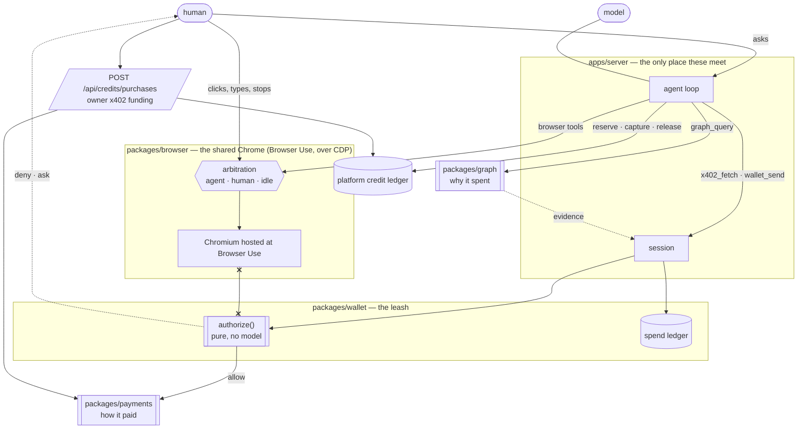

# Froggy

> A wallet for your agents. Fund tasks, watch the work, and keep receipts.

Connect your own agent or use Froggy here. Buy internal platform credits with USDC on Base or native HBAR through x402, then use one credit balance across tools. **100 credits = $1.** Every account starts at zero; cryptocurrency balances remain separate. External agents sign in through OAuth at `/mcp` and use the owner's existing credits within limits they cannot change.

Inside a task, a human and an AI share **one Chrome**. The human watches a live screencast and can take the page mid-action. The agent drives that same Chrome over CDP. Spending rules are evaluated outside the model on every payment. Privy holds the wallet keys; the host enforces the mandate, including limits that Privy's raw Hedera signing cannot express.

Built for ETHOnline 2026 — **Privy** (the wallet and the leash), **The Graph** (why it spent), **Hedera x402** (how it paid).

```
┌──────────────────────────────────────────────────────────────┐
│  $0.12 of $10.00 today ▮▮▯▯▯   ● agent is driving   ■ Stop    │
├──────────────────────────────────────────────────────────────┤
│  you: buy the lending snapshot and tell me what it says       │
│  🐸  asked The Graph · requested a paid resource · checked …  │
│      ┌── the shared page, live, amber ring ─────────────────┐ │
│      │  you can click in, take it, split it out, pop it out │ │
│      └──────────────────────────────────────────────────────┘ │
│      ┌ 5 credits · lending brief ── ✂ ── result · charge ┐   │
│  ┌ YOUR CALL  $1.50 to seller.example ── ✂ ── stop · no · … ┐  │
│  [ ask Froggy to do something…                              ↑ ] │
└──────────────────────────────────────────────────────────────┘
```

During a task, the conversation is the ledger: every receipt is filed under the turn that produced it, the live page sits under the turn that opened it, and a question for you pins above the composer with four answers. The same four answers are built to reach your phone through Telegram, with the daily digest; the bot and its webhook are live, and no delivered message has been recorded in the evidence yet.

Production uses Hedera mainnet and Base mainnet. [Earlier release evidence](docs/evidence/MAINNET_RELEASE.md) records the previous per-resource payments and treasury integration. Those historical transactions do not prove the new credit checkout. The credit model and migration invariants are recorded in [decision 0032](docs/decisions/0032-platform-credits.md).

The [8 September screenshot tour](docs/evidence/ui-review-2026-09-08/README.md) shows the interaction states and the Passbook/Lilypad comparison at four widths. Its five-page navigation was replaced on 10 September by Home, Explore and Wallet, with Connections and Account behind them.

## Run it

```bash
bun install
cp .env.example .env
bun dev
```

Open `http://localhost:3000`. The Bun server listens on `:3001`; the dev server proxies to it, so the client talks to its own origin exactly as it does in production, where one process serves both.

**It runs with no keys at all.** Every external service has a stub, chosen when its variable still holds the placeholder from `.env.example`. A stubbed integration is marked in the wallet pane and on every receipt it touches, so a faked run cannot be mistaken for a real one. `.env.example` says which prize gate each key unblocks.

## Verify it

```bash
bun run check              # format, type-aware lint, TS, boundaries, tests, knip
bun run e2e:install        # one-time local Chromium
bun run e2e
```

## How it hangs together



The dashed cross is the point: `packages/browser` cannot import `packages/wallet` and the reverse is forbidden too. The browser is where hostile content lives; the wallet is where signing happens. `tools/graph.ts` enforces it.

## What is where

|  |  |
| --- | --- |
| `apps/web` | Home, Explore and Wallet, with Connections and Account behind them; the conversation with receipts and the shared browser inside a task. Frames never touch React state. |
| `apps/server` | One Bun process: SPA, API, both sockets, the agent loop; one hosted browser per user. |
| `packages/domain` | Money, credits, mandates, decisions, receipts — as Effect Schema. |
| `packages/protocol` | Both wire protocols and the screencast frame envelope. |
| `packages/browser` | The shared Chrome, hosted at Browser Use and driven over CDP. Knows nothing about money. |
| `packages/wallet` | Privy, the policy engine, wallet spend and platform credit ledgers. **The leash.** |
| `packages/payments` | x402 funding settlement in USDC/HBAR and the payer for external merchants. |
| `packages/graph` | The Graph gateway. The evidence a spend is justified by. |

`packages/browser` cannot import `packages/wallet`, and the reverse is also forbidden — `tools/graph.ts` enforces it. The browser is where hostile content lives; the wallet is where signing happens. They meet in exactly one file, `apps/server/src/services.ts`.

## The rules that are code, not prompts

- **The approval channel is not a tool.** No `raise_limit`, no `approve`. An agent that can approve its own spending has no leash. An outside agent's token cannot reach it either: a token starts and reads tasks and asks the wallet to sign, and gets 403 on everything else.
- **Payees have provenance.** An address that appeared only in page content or in the model's own output cannot be paid, however well-formed it is.
- **Reserve before you pay.** The ledger row is written before the outbound call, with an idempotency key, so a retried tool call cannot pay twice.
- **Page text is fenced.** It reaches the model prefixed as data, from a string constant that cannot be edited away in a prompt.
- **Stop aborts the run first, then withdraws every open ticket.** "Stop the agent" on a ticket does both. There is no freeze: the controls are Stop, the ticket, the caps and Disconnect.
- **Credit accounting is atomic with the task.** Reserve once under the owner account lock; capture successful work, release failed or cancelled work, and hold uncertain outcomes. A funding proof and authorization identity are globally claimed before settlement; a confirmed transaction credits the account once.
- **Privy is the outer leash on the EVM leg.** Every signature the agent asks for goes through Privy's policy engine under a committed default-deny policy; an address the person typed passes the host's checks and is refused by Privy in Privy's words, on the receipt.
- **Credit limits are separate from wallet authority.** Existing numeric allowance caps initialize credit limits once; wallet signer expiry does not expire purchased credits. Real and simulated funding cannot share an account. Cryptocurrency transfers, trading capital and external merchant purchases retain their existing wallet controls.

## The demo, in order

1. Sign in and open Wallet. Credits start at zero; existing USDC and HBAR remain money.
2. Choose Buy credits, select USDC on Base or native HBAR, review the exact quote, and confirm. A pending payment becomes spendable credit only after chain confirmation.
3. Review a tool's price and run it. The reservation appears immediately; its result captures the quoted credits. Failed or cancelled work releases them. An uncertain outcome stays reserved.
4. Change per-task and rolling 24-hour limits in Wallet as the owner. An agent cannot widen them or buy more credits.
5. Connect an external agent at `/mcp` with OAuth. It uses the same owner balance, with connection-bound task visibility and owner-wide idempotency.
6. Open a browser task and take the page mid-action. Credits meter the task; wallet transfers and external merchant payments still require their own authority.

## Funding and agent migration

Only a signed-in owner can create or pay a credit purchase. `POST /api/credits/purchases` freezes the amount, rail and expiry. `GET /api/credits/purchases/<id>/pay` returns its x402 challenge; the owner may confirm through the UI or submit the signed `payment-signature` to the same path with POST. Agent tokens can read `/api/credits`; they cannot reach funding, funding history or credit limits.

Froggy tools reserve the catalog's fixed USD-equivalent price in credits. Internally one `CreditUnits` is one USD micro, or 1/10,000 of a credit. Funding creates an append-only ledger entry. Task reservation and result accounting share the database transaction; retries use the same task key and never charge twice. Successful monitoring charges the first observation, with subsequent observations metered as separate tasks.

Anonymous per-resource selling has retired. `/oracle/snapshot`, `/demo/x402/report`, `/froggy-mcp.mjs` and `/froggy-mcp.js` reject new purchases with HTTP 410 and account migration guidance. Previously recorded sale proofs and `/oracle/sales/<id>` remain readable. The old anonymous buyer source and [its evidence](docs/evidence/AGENT_DOOR_FABLE51.md) are historical; it is no longer served as an installable bundle.

`/.well-known/x402.json` and `/discovery/resources` now advertise authenticated credit funding and `/mcp`. There are no anonymous payable resource offers. The `/demo/x402` landing page explains the credit model and links to Wallet.

## On-chain and live evidence

The transactions below document the previous release, before platform credits.

| What | Where | Id |
| --- | --- | --- |
| Hosted Hedera mainnet payment, HTTP 200, 7 Sep | [Release evidence](docs/evidence/MAINNET_RELEASE.md) | `0.0.10571514@1788735637.380133493` |
| Matching mainnet audit note | HCS topic `0.0.10847557` | sequence 2 |
| Privy treasury payment to The Graph, 0.01 USDC | Base mainnet | `0x9355a0c0378f4a011a9a793d57ed15f045d9dba6c137cf730c72402b5d0993cd` |
| Hedera x402 settlement, pocket `0.0.9700388` to payee `0.0.10377647`, fee paid by the facilitator | HashScan testnet | `1788625330.599677104` |
| Hedera x402 settlement against the **hosted** service, 6 Sep | HashScan testnet | `0.0.7162784@1788674975.439553201` |
| HCS topic, one note per settlement on both sides | HashScan testnet | `0.0.10381647` |
| Privy policy the agent signs under, two allow rules and an expiry | `docs/privy-agent-policy.json` | `rk6qw974uapbesb04u5tq5kb` |
| Historical Sepolia top-up aggregation, 5 Sep | Privy | `mpjhq6o0t9gzdvg3x0x4gmb1` |
| Privy refusals and one allowed signature, verbatim | `docs/evidence/PRIVY.md` | transcript of 5 Sep |
| The Graph, twelve deployments at one block each | `docs/evidence/GRAPH.md` | blocks of 6 Sep 06:09 UTC |
| The service card | `GET /.well-known/x402.json` on the live URL | — |
| Historical anonymous door verification | [Archived evidence](docs/evidence/AGENT_DOOR_FABLE51.md) | Retired |

```bash
curl -i "https://app-production-58dd.up.railway.app/oracle/snapshot?symbol=USDC"
# HTTP 410: sign in and fund platform credits
curl -s "https://app-production-58dd.up.railway.app/.well-known/x402.json"
```

## What is real, what is host-side, what is not

**Real.** A hosted Chrome the agent drives and you watch, grab and stop. Privy embedded wallets with the agent as a revocable additional signer under a committed default-deny policy, and Privy's own refusal on the receipt. Blocky402 settlements on Hedera mainnet with HashScan ids and matching HCS notes, including a paid HTTP 200 response from the hosted service. Live Messari lending data from twelve deployments through The Graph, last read 12/12 on 11 Sep.

**Host-side, not Privy.** The Hedera leg: the pocket balance, the per-transaction and rolling caps, idempotency, the provenance gate on page-derived addresses, the daily model budget. Privy evaluates policies only on transactions it can decode, and a Hedera transaction is a raw signature to it.

**Mainnet since Mon 7 Sep.** Float `0.0.10847552`, receiver `0.0.10847556`, HCS topic `0.0.10847557`. Production uses a separate mainnet ledger; the old testnet database is retained. The top-up is configured to transfer Base mainnet USDC to the treasury and allocate HBAR from the float. A direct Privy-signed treasury query paid The Graph 0.01 USDC on Base and returned live data. This does not prove the person's onramp, top-up or login-time signer grant; those journeys still need a real signed-in person.

**Evidence limits.** Prior funding and supplier evidence describes the previous release; new credit checkout requires its own live confirmation. Uncertain payments require reconciliation before another purchase. Local tests and stubbed receipts cannot establish that real funding, delivery or an external OAuth client worked.

## Not in scope

Guest access without sign-in. Anything that changes spending authority as an agent tool. Card purchases, bridges, browser-based MCP clients on another origin and a completed real onramp are not claims of this release.

## Team

Kristjan Grm, Jonas Heinz, Hemang Vora. Built with Claude Code from 4 to 11 Sep 2026; `docs/evidence/AI-USE.md` says how.

## Surfaces

- **The workspace.** Wallet-first; tasks continue in chat, where the page is a card in the stream, or a pane beside it, or a window of its own. Receipts are tickets: what and why on the body, rule id, transaction and evidence on the stub. A refusal is a stamp.
- **Telegram.** Open Connect an agent → Telegram, then open the bot and tap Start using the expiring link. The daily digest is sent as a card; approval questions carry the same four buttons as the web ticket; a plain message runs the same agent on the same mandate. The bot and webhook are live; a delivered digest or answer on a real phone is not yet in the evidence.
- **The task API and the CLI.** `POST /api/tasks` reserves credits for a lending brief or browser task with durable idempotency, status and results. No per-tool payment header or wallet signature is needed. `GET /froggy-cli.js` serves the Node/Bun client; `froggy login` uses the browser (or `--manual` with a pasted code). `skills/froggy/SKILL.md` explains the account and credit model without a secret. An owner-minted connection token remains available for unattended agents.
- **Services and MCP.** Froggy is a remote MCP server at `/mcp` with OAuth 2.1: dynamic registration, PKCE, a consent page with one switch per scope (`brief`, `browse`, `pay`, `services`), short-lived access tokens, rotating refresh tokens, and Disconnect on the Connections page. The catalog, chat, CLI and MCP share durable service tasks and spending controls. The suppliers behind the catalog are configured, not proven: none has delivered a paid task yet. Provider availability is explicit; setup and live activation requirements are in [the marketplace handoff](docs/evidence/MARKETPLACE.md).
- **The daily digest.** One unattended turn a day at the hour you pick, bounded to a minute, a dozen steps, five cents and one paid request; nobody can be asked, so anything over the threshold is refused.
- **The directory.** Paste a URL and it is probed, never paid; if the 402 is one this wallet can honour, one click makes it payable, and that click is the only way a stranger's host reaches the allowlist.

## Evidence

`docs/evidence/HEDERA.md`, `GRAPH.md`, `PRIVY.md` hold the on-chain and live-data evidence as it lands, with `TODO` marking what is still to be recorded. `docs/evidence/AI-USE.md` says how AI was used, in the product and in building it.

## Where this is

`docs/plan/STATUS.md` — what has landed. `docs/plan/NEXT_ITERATION.md` — the current plan. `docs/plan/DECISIONS.md` — what is still open. `docs/handover.md` — the demo in the order it should be shown, and the defect list with the commit that closed each one.

## Known limits

- Each signed-in user's browser profile is persistent, so the agent browses as _you_. That is the point and also the risk. Profiles are Browser Use profiles, one per person, named by a hash of the Privy identity so the provider never sees the identity itself; deleting one signs that agent out of everything.
- The browser is hosted: Browser Use runs the Chrome, Froggy drives it over CDP and Chrome renders hostile pages somewhere the signing keys are not. Every browser bills by the hour, so browsing is only sold inside a paid task, seats are capped and an idle browser is stopped. With no `BROWSER_USE_API_KEY` the pane says so and everything else keeps working.
- Browser seats live in one server process, so the deployment runs at one replica. The credit accounts, append-only credit ledger, funding purchases, task charges, wallet spend ledger, mandates, receipts, historical sales, tasks and agent tokens are in Postgres when `DATABASE_URL` is set and in memory otherwise, and the wallet pane says which.
