# Froggy screenshot tour

A wallet for your agents: fund tasks, follow the work, and keep receipts.

[Try Froggy](https://app-production-58dd.up.railway.app) · [Review findings](../UI_REVIEW_2026-09-07.md)

These captures show the redesign released in commit `40ed052`. The five main pages are shown below at desktop and phone widths. Click an image for the full-size capture.

The complete set contains **98 screenshots**: 81 updated workspace captures, 15 before shots, and two production sign-in captures. Workspace captures use local test identities and visibly simulated integrations; authorization codes and connection tokens are masked. The production images show the public sign-in page captured on 8 September 2026.

## The workspace

| Screen | Desktop · 1440px | Phone · 390px |
| --- | --- | --- |
| Chat | [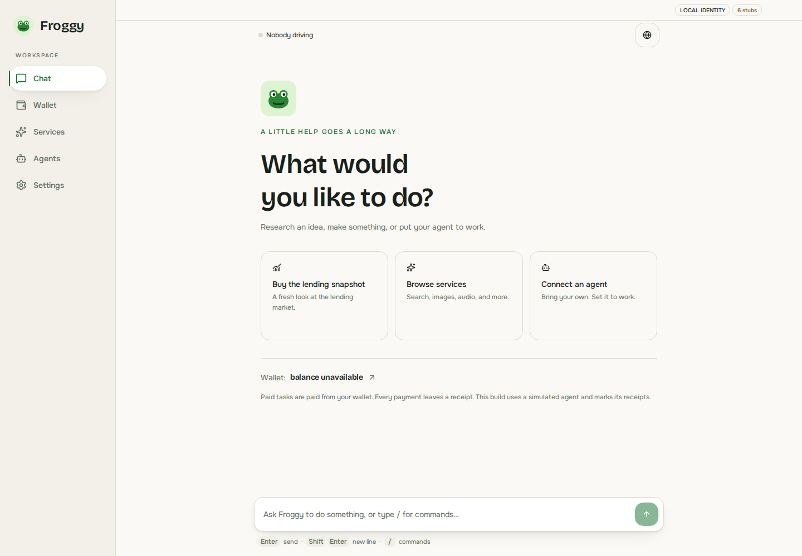](after/chat-1440.png) | [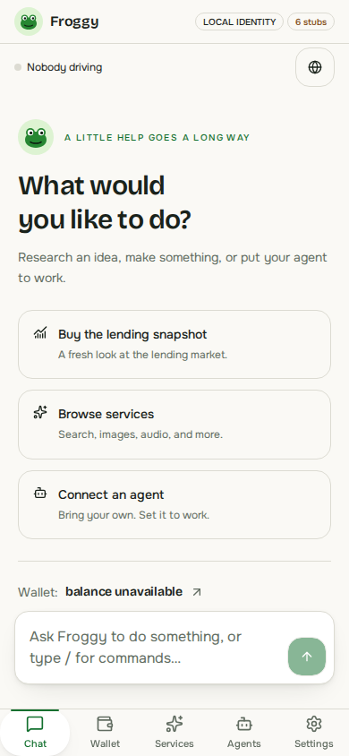](after/chat-390.png) |
| Wallet | [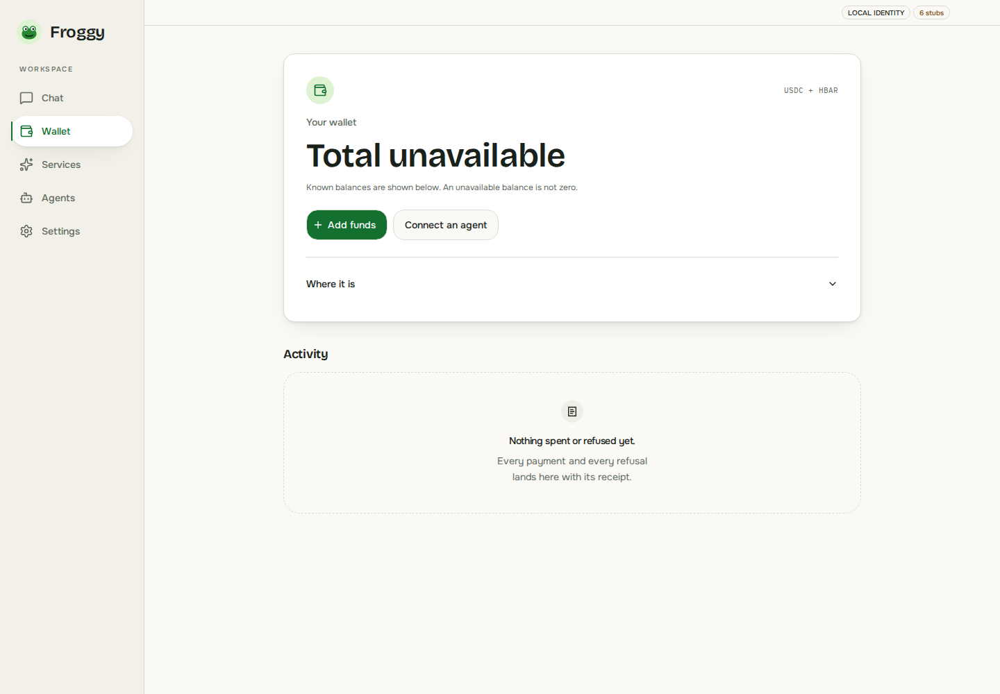](after/wallet-1440.png) | [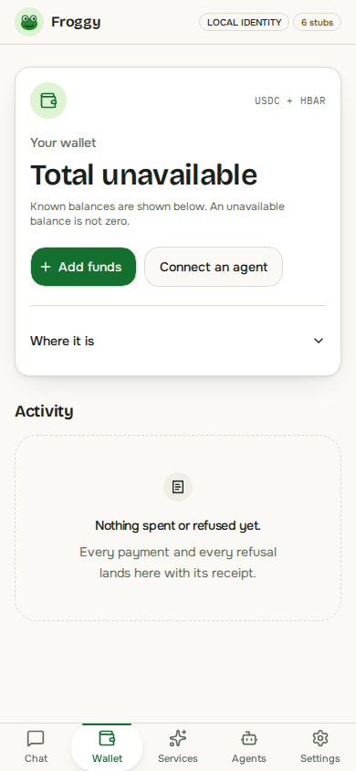](after/wallet-390.png) |
| Services | [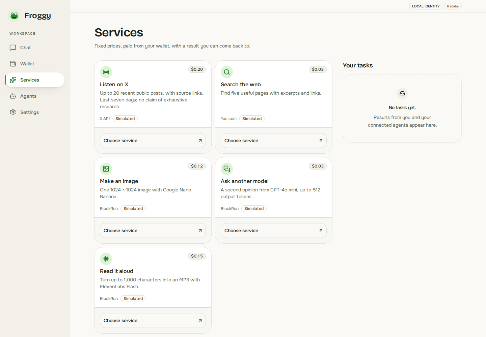](after/services-1440.png) | [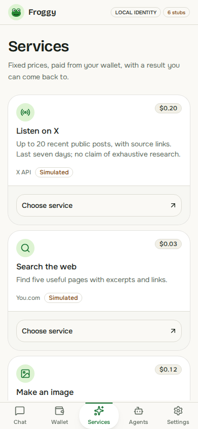](after/services-390.png) |
| Agents | [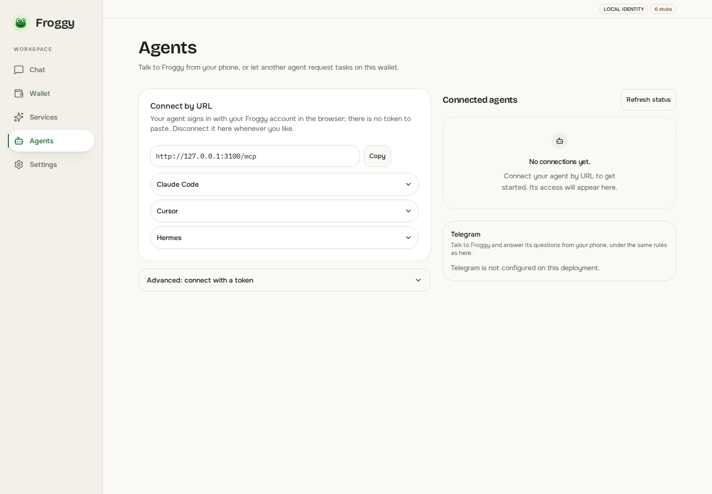](after/agents-1440.png) | [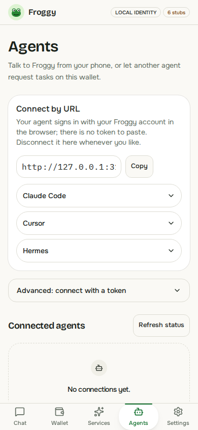](after/agents-390.png) |
| Settings | [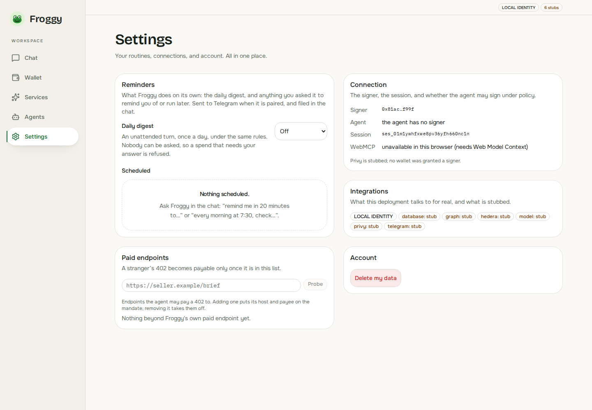](after/settings-1440.png) | [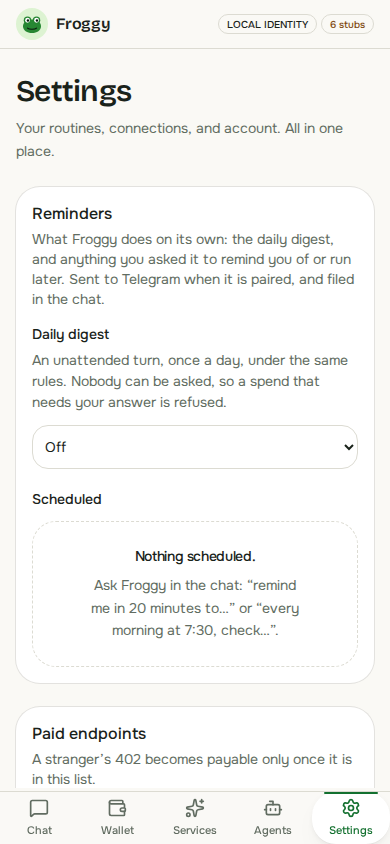](after/settings-390.png) |

## Production sign-in

| Desktop · 1440px | Phone · 390px |
| --- | --- |
| [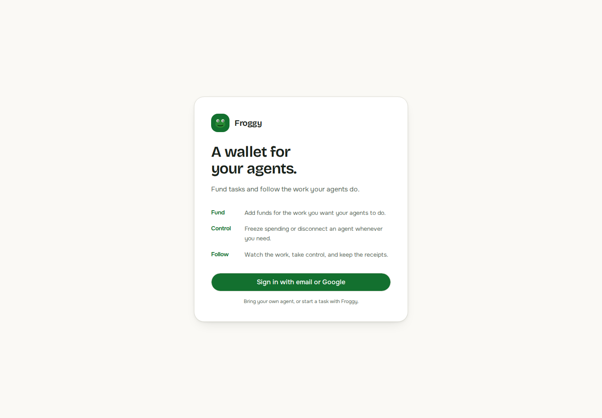](production-signin-1440.png) | [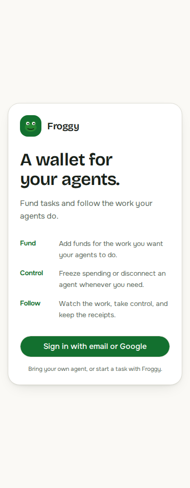](production-signin-390.png) |

## Explore every capture

Download or clone the repository, then open [index.html](index.html) in a browser for filters by viewport, page and interaction, plus before/after comparisons. GitHub displays this README and the PNG files directly; the HTML gallery runs locally.

The updated set covers desktop, tablet, phone and small phone layouts (1440, 768, 390 and 320px; the split-browser capture is 1400px). Files named `part-2` and onward show successive sections of the app's internal scrolling area.

Updated pages and interactions

| State | Captures by width |
| --- | --- |
| Add Funds | [1440px](after/add-funds-1440.png) · [390px](after/add-funds-390.png) |
| Agent Connected | [1440px](after/agent-connected-1440.png) · [390px](after/agent-connected-390.png) |
| Agent Instructions | [1440px](after/agent-instructions-1440.png) · [390px](after/agent-instructions-390.png) |
| Agent Instructions Part 2 | [390px](after/agent-instructions-part-2-390.png) |
| Agent Token Form | [1440px](after/agent-token-form-1440.png) · [390px](after/agent-token-form-390.png) |
| Agents | [1440px](after/agents-1440.png) · [768px](after/agents-768.png) · [390px](after/agents-390.png) · [320px](after/agents-320.png) |
| Agents Part 2 | [768px](after/agents-part-2-768.png) · [390px](after/agents-part-2-390.png) · [320px](after/agents-part-2-320.png) |
| Agents Part 3 | [320px](after/agents-part-3-320.png) |
| Browser Inline | [1440px](after/browser-inline-1440.png) · [390px](after/browser-inline-390.png) |
| Browser Split | [1400px](after/browser-split-1400.png) |
| Browser Window | [1440px](after/browser-window-1440.png) · [390px](after/browser-window-390.png) |
| Chat | [1440px](after/chat-1440.png) · [768px](after/chat-768.png) · [390px](after/chat-390.png) · [320px](after/chat-320.png) |
| Chat Approval | [1440px](after/chat-approval-1440.png) · [390px](after/chat-approval-390.png) |
| Chat Completed | [1440px](after/chat-completed-1440.png) · [390px](after/chat-completed-390.png) |
| Chat Part 2 | [390px](after/chat-part-2-390.png) · [320px](after/chat-part-2-320.png) |
| Chat Part 3 | [320px](after/chat-part-3-320.png) |
| Chat Receipt | [1440px](after/chat-receipt-1440.png) · [390px](after/chat-receipt-390.png) |
| Delete Confirmation | [1440px](after/delete-confirmation-1440.png) · [390px](after/delete-confirmation-390.png) |
| Oauth Consent | [1440px](after/oauth-consent-1440.png) · [390px](after/oauth-consent-390.png) |
| Oauth Manual | [1440px](after/oauth-manual-1440.png) · [390px](after/oauth-manual-390.png) |
| Service Request | [1440px](after/service-request-1440.png) · [390px](after/service-request-390.png) |
| Service Request Part 2 | [390px](after/service-request-part-2-390.png) |
| Service Result | [1440px](after/service-result-1440.png) · [390px](after/service-result-390.png) |
| Services | [1440px](after/services-1440.png) · [768px](after/services-768.png) · [390px](after/services-390.png) · [320px](after/services-320.png) |
| Services Part 2 | [1440px](after/services-part-2-1440.png) · [768px](after/services-part-2-768.png) · [390px](after/services-part-2-390.png) · [320px](after/services-part-2-320.png) |
| Services Part 3 | [390px](after/services-part-3-390.png) · [320px](after/services-part-3-320.png) |
| Services Part 4 | [320px](after/services-part-4-320.png) |
| Services Part 5 | [320px](after/services-part-5-320.png) |
| Settings | [1440px](after/settings-1440.png) · [768px](after/settings-768.png) · [390px](after/settings-390.png) · [320px](after/settings-320.png) |
| Settings Part 2 | [768px](after/settings-part-2-768.png) · [390px](after/settings-part-2-390.png) · [320px](after/settings-part-2-320.png) |
| Settings Part 3 | [390px](after/settings-part-3-390.png) · [320px](after/settings-part-3-320.png) |
| Settings Part 4 | [320px](after/settings-part-4-320.png) |
| Settings Part 5 | [320px](after/settings-part-5-320.png) |
| Settings Scheduled | [1440px](after/settings-scheduled-1440.png) · [390px](after/settings-scheduled-390.png) |
| Settings Scheduled Part 2 | [390px](after/settings-scheduled-part-2-390.png) |
| Settings Scheduled Part 3 | [390px](after/settings-scheduled-part-3-390.png) |
| Wallet | [1440px](after/wallet-1440.png) · [768px](after/wallet-768.png) · [390px](after/wallet-390.png) · [320px](after/wallet-320.png) |
| Wallet Breakdown | [1440px](after/wallet-breakdown-1440.png) · [390px](after/wallet-breakdown-390.png) |
| Wallet Breakdown Part 2 | [390px](after/wallet-breakdown-part-2-390.png) |
| Wallet Part 2 | [320px](after/wallet-part-2-320.png) |

Before the redesign

| State | Captures by width |
| --- | --- |
| Agents | [1440px](before/agents-1440.png) · [768px](before/agents-768.png) · [390px](before/agents-390.png) |
| Chat | [1440px](before/chat-1440.png) · [768px](before/chat-768.png) · [390px](before/chat-390.png) |
| Services | [1440px](before/services-1440.png) · [768px](before/services-768.png) · [390px](before/services-390.png) |
| Settings | [1440px](before/settings-1440.png) · [768px](before/settings-768.png) · [390px](before/settings-390.png) |
| Wallet | [1440px](before/wallet-1440.png) · [768px](before/wallet-768.png) · [390px](before/wallet-390.png) |

## Capture context

The workspace review passed 480 unit tests and 67 Chromium browser tests. These images document responsive layouts and interaction states; they do not establish physical-device behavior or live funding, settlement, provider delivery or Telegram delivery. See the [review findings](../UI_REVIEW_2026-09-07.md) for validation details and remaining work.
