# Froggy screenshot tour

A wallet for your agents: fund tasks, follow the work, and keep receipts.

[Try Froggy](https://app-production-58dd.up.railway.app) · [Review notes](../UI_REVIEW_2026-09-08.md) · [Previous tour](../ui-review-2026-09-07/README.md)

These captures show commit `3108bcf6fc9d7fa2c895ff3974ae68cf2fe5e3e9` (`3108bcf`), including the Passbook and Lilypad component systems, workspace motion, and the bottom navigation pill landed in `55a17b4`. The source tree was clean at the start of the capture run.

The complete set contains **230 screenshots**: **115 Passbook** and **115 Lilypad**. All workspace captures use local test identities and simulated integrations and money. Connection tokens and OAuth authorization codes are masked by the capture helper. Telegram linking uses the fixed synthetic `ABCDEF` code and intercepted responses. No real sign-in, onchain payment or external chat delivery was performed.

## The workspace

### Passbook

| Screen | Desktop · 1440px | Phone · 390px |
| --- | --- | --- |
| Chat | [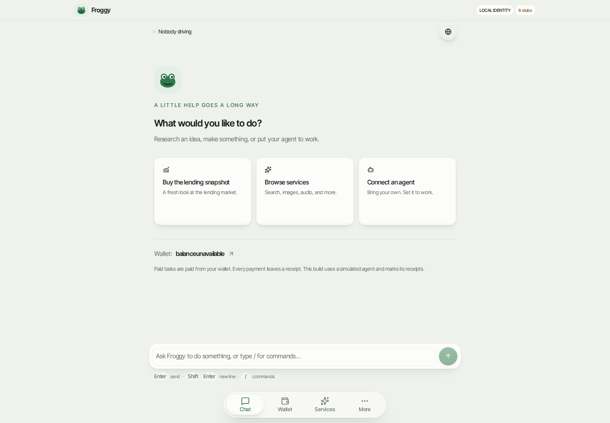](passbook/chat-1440.png) | [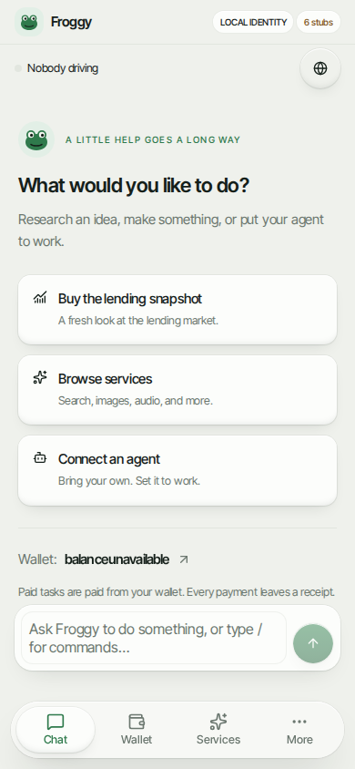](passbook/chat-390.png) |
| Wallet | [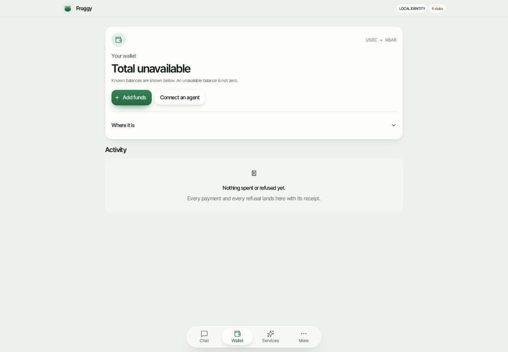](passbook/wallet-1440.png) | [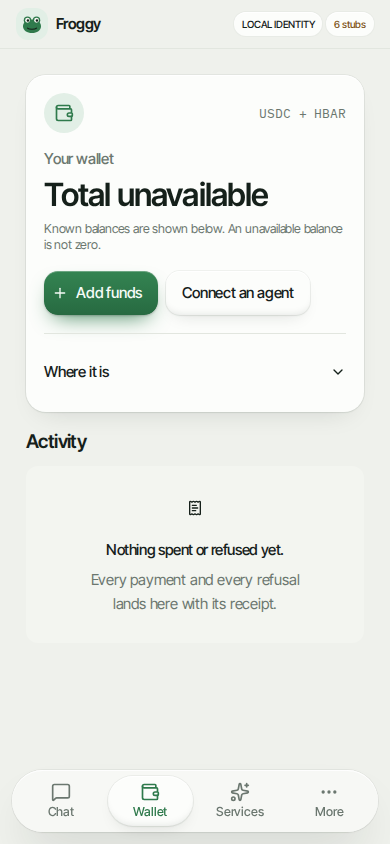](passbook/wallet-390.png) |
| Services | [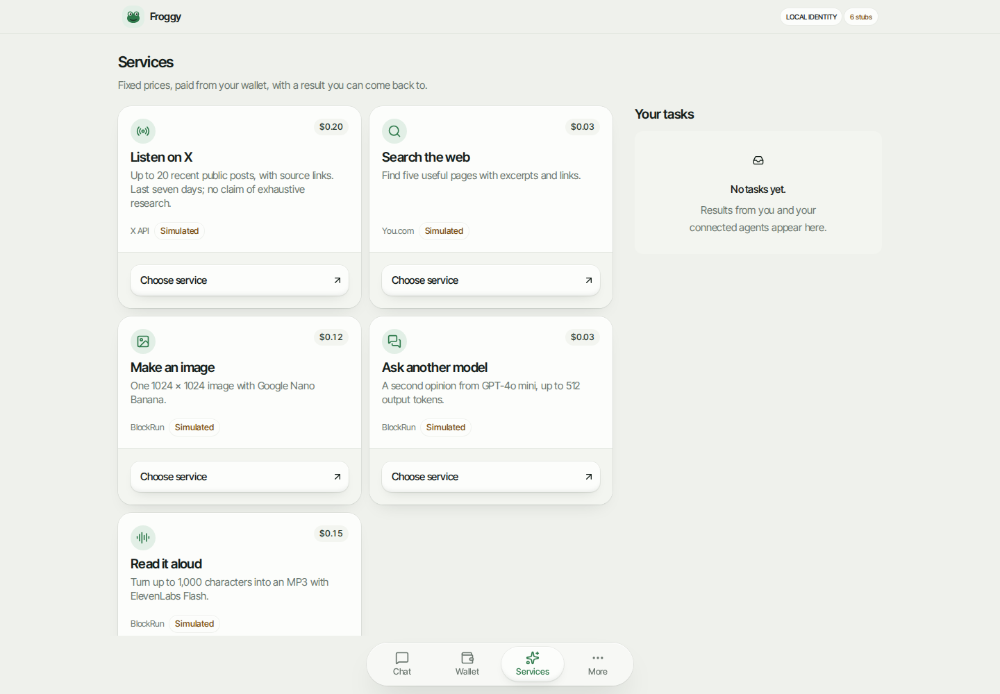](passbook/services-1440.png) | [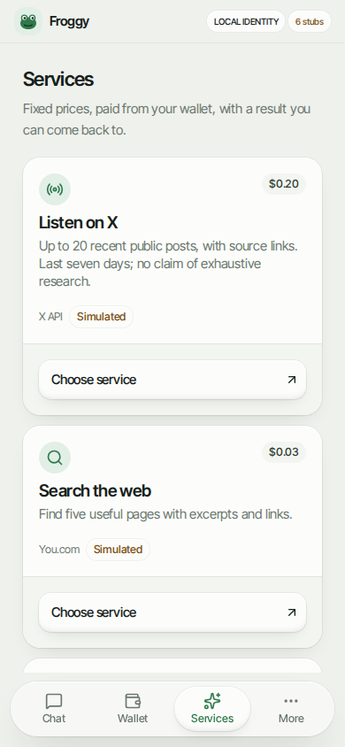](passbook/services-390.png) |
| Agents | [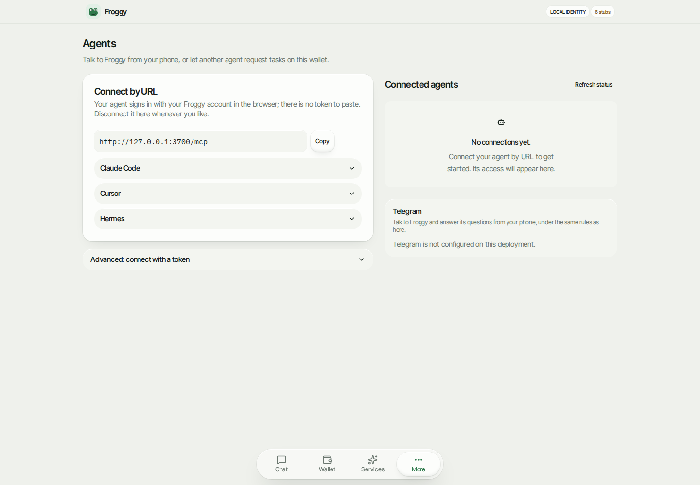](passbook/agents-1440.png) | [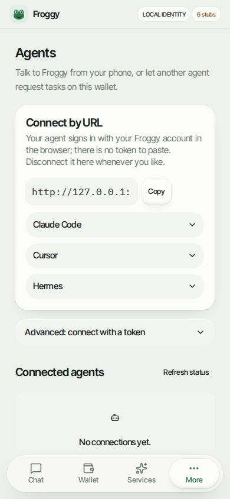](passbook/agents-390.png) |
| Settings | [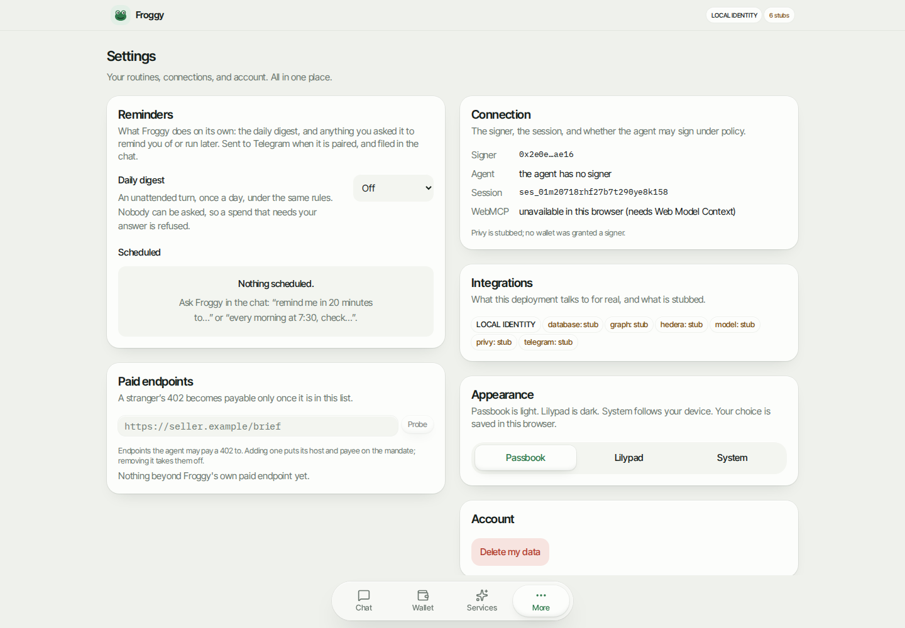](passbook/settings-1440.png) | [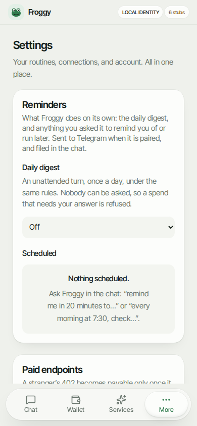](passbook/settings-390.png) |

### Lilypad

| Screen | Desktop · 1440px | Phone · 390px |
| --- | --- | --- |
| Chat | [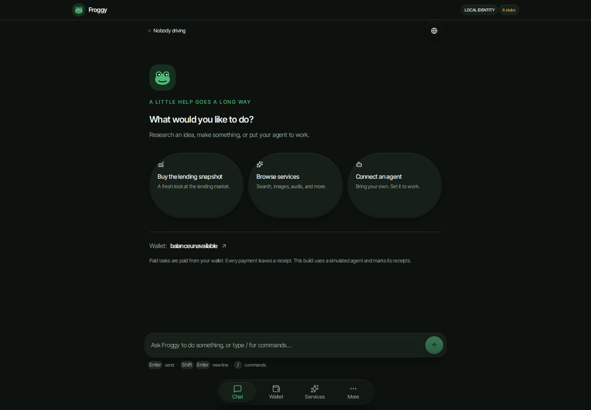](lilypad/chat-1440.png) | [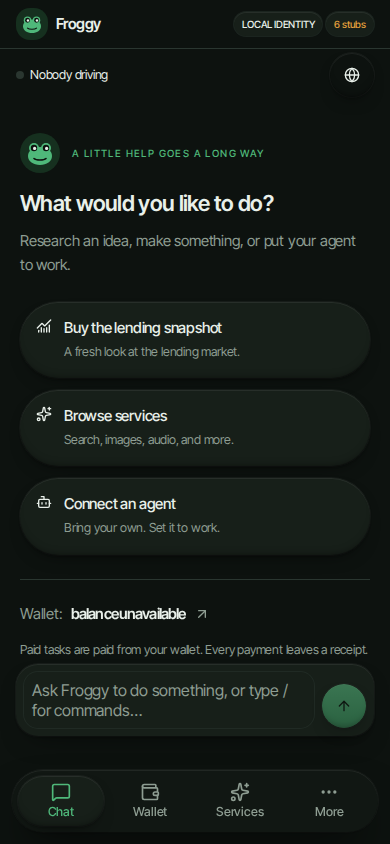](lilypad/chat-390.png) |
| Wallet | [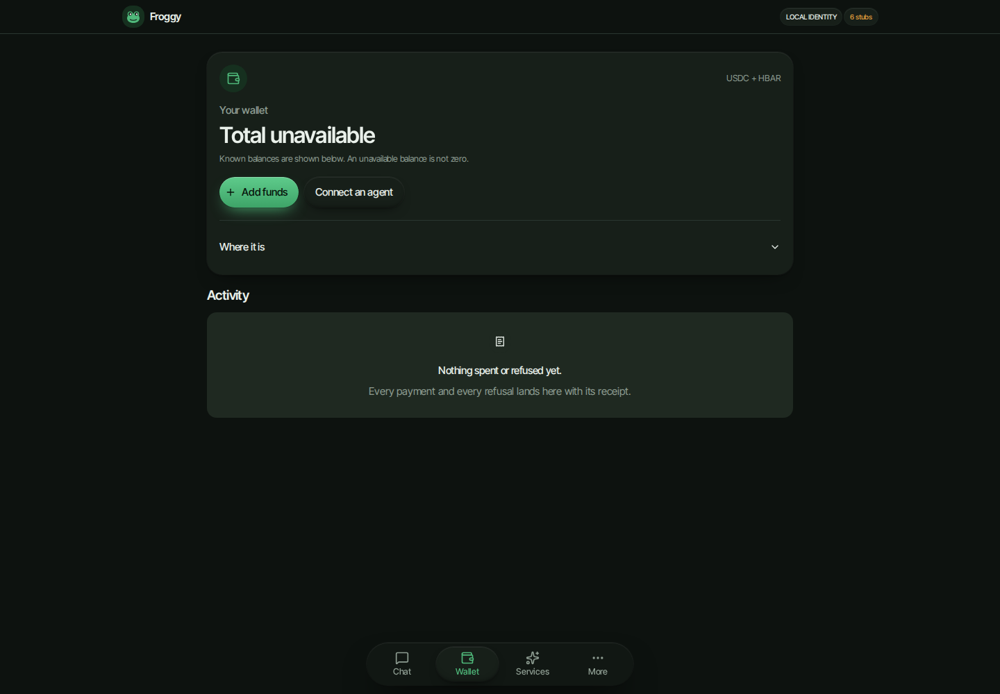](lilypad/wallet-1440.png) | [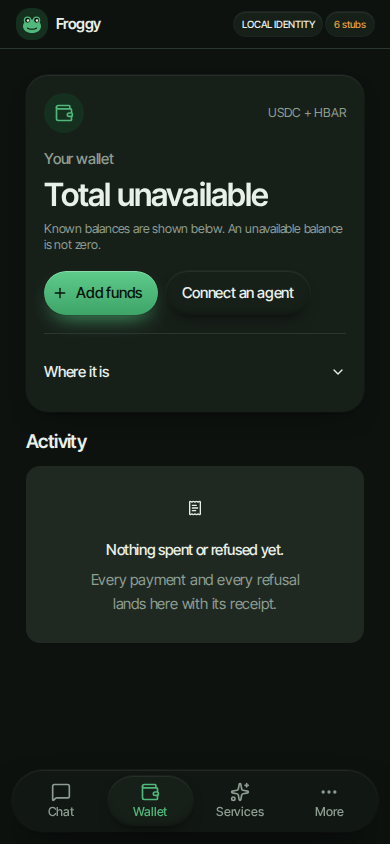](lilypad/wallet-390.png) |
| Services | [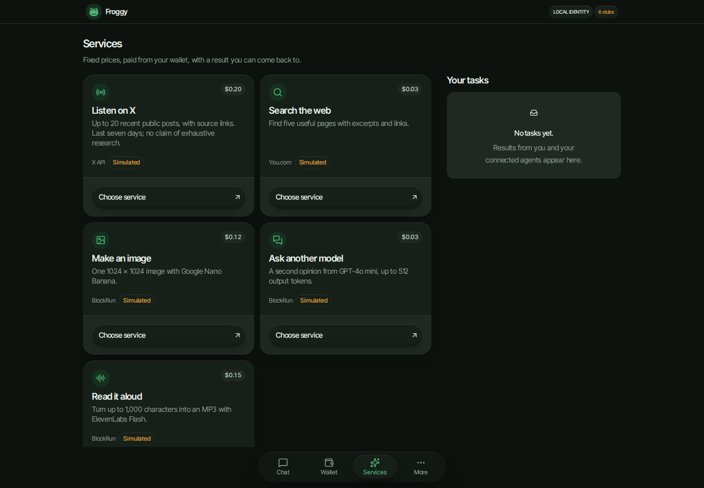](lilypad/services-1440.png) | [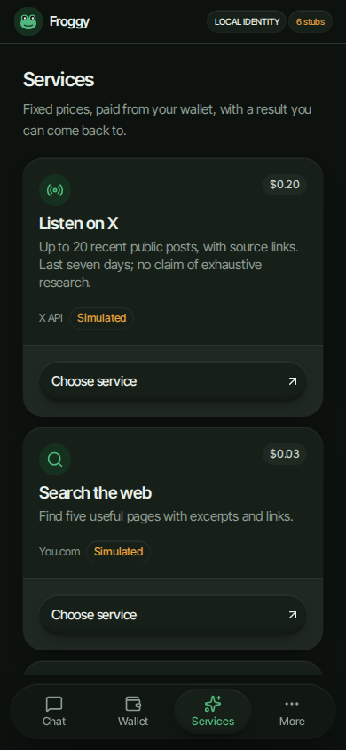](lilypad/services-390.png) |
| Agents | [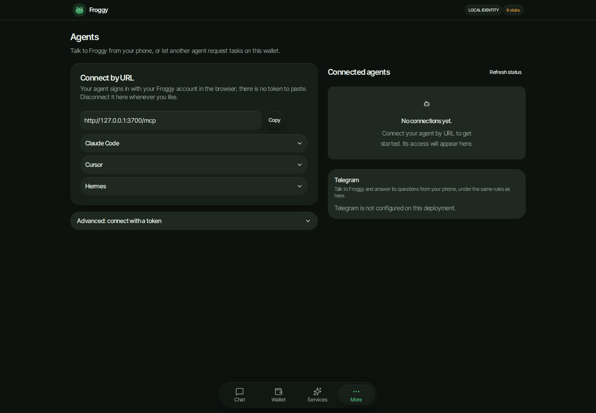](lilypad/agents-1440.png) | [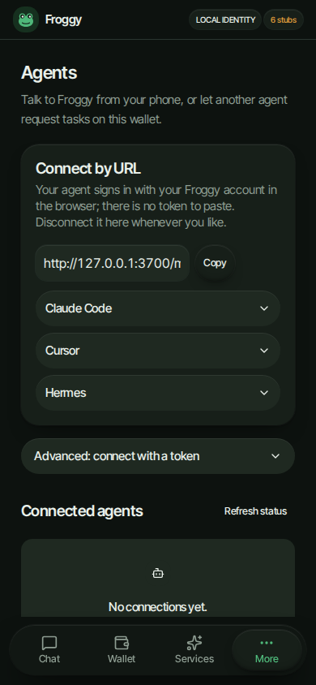](lilypad/agents-390.png) |
| Settings | [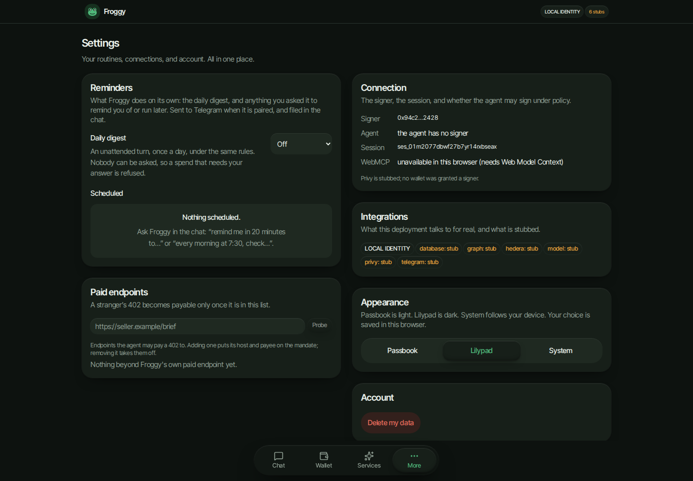](lilypad/settings-1440.png) | [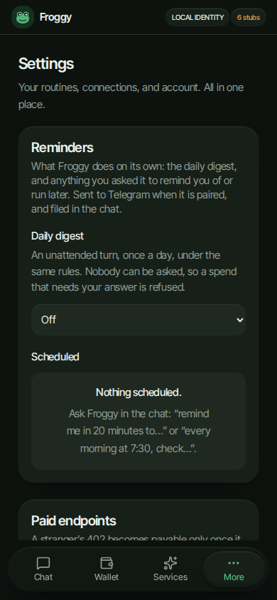](lilypad/settings-390.png) |

## Explore every capture

Download or clone the repository, then open [index.html](index.html) in a browser to filter by theme, viewport, page and interaction, or compare Passbook and Lilypad side by side. GitHub displays this README and the PNG files directly; the HTML gallery runs locally. The [capture manifest](captures.json) records every source filename and image size.

The five main pages appear at **1440×1000, 768×1024, 390×844 and 320×568** in each theme. Files named `part-2` and onward show successive sections of the app’s internal scrolling area. Interaction specs retain their own heights (including 900px); supplementary captures retain the existing 1400px split-browser and 1280px service-recovery viewports. Component checks and the pill/More menu appear at all four requested widths in both themes.

<details>
<summary>All pages and interactions</summary>

| State | Passbook by width | Lilypad by width |
| --- | --- | --- |
| Add Funds | [1440px](passbook/add-funds-1440.png) · [390px](passbook/add-funds-390.png) | [1440px](lilypad/add-funds-1440.png) · [390px](lilypad/add-funds-390.png) |
| Agent Connected | [1440px](passbook/agent-connected-1440.png) · [390px](passbook/agent-connected-390.png) | [1440px](lilypad/agent-connected-1440.png) · [390px](lilypad/agent-connected-390.png) |
| Agent Instructions | [1440px](passbook/agent-instructions-1440.png) · [390px](passbook/agent-instructions-390.png) | [1440px](lilypad/agent-instructions-1440.png) · [390px](lilypad/agent-instructions-390.png) |
| Agent Instructions Part 2 | [390px](passbook/agent-instructions-part-2-390.png) | [390px](lilypad/agent-instructions-part-2-390.png) |
| Agent Token Form | [1440px](passbook/agent-token-form-1440.png) · [390px](passbook/agent-token-form-390.png) | [1440px](lilypad/agent-token-form-1440.png) · [390px](lilypad/agent-token-form-390.png) |
| Agents | [1440px](passbook/agents-1440.png) · [768px](passbook/agents-768.png) · [390px](passbook/agents-390.png) · [320px](passbook/agents-320.png) | [1440px](lilypad/agents-1440.png) · [768px](lilypad/agents-768.png) · [390px](lilypad/agents-390.png) · [320px](lilypad/agents-320.png) |
| Agents Part 2 | [768px](passbook/agents-part-2-768.png) · [390px](passbook/agents-part-2-390.png) · [320px](passbook/agents-part-2-320.png) | [768px](lilypad/agents-part-2-768.png) · [390px](lilypad/agents-part-2-390.png) · [320px](lilypad/agents-part-2-320.png) |
| Agents Part 3 | [320px](passbook/agents-part-3-320.png) | [320px](lilypad/agents-part-3-320.png) |
| Browser Inline | [1440px](passbook/browser-inline-1440.png) · [390px](passbook/browser-inline-390.png) | [1440px](lilypad/browser-inline-1440.png) · [390px](lilypad/browser-inline-390.png) |
| Browser Split | [1400px](passbook/browser-split-1400.png) | [1400px](lilypad/browser-split-1400.png) |
| Browser Window | [1440px](passbook/browser-window-1440.png) · [390px](passbook/browser-window-390.png) | [1440px](lilypad/browser-window-1440.png) · [390px](lilypad/browser-window-390.png) |
| Chat | [1440px](passbook/chat-1440.png) · [768px](passbook/chat-768.png) · [390px](passbook/chat-390.png) · [320px](passbook/chat-320.png) | [1440px](lilypad/chat-1440.png) · [768px](lilypad/chat-768.png) · [390px](lilypad/chat-390.png) · [320px](lilypad/chat-320.png) |
| Chat Approval | [1440px](passbook/chat-approval-1440.png) · [390px](passbook/chat-approval-390.png) | [1440px](lilypad/chat-approval-1440.png) · [390px](lilypad/chat-approval-390.png) |
| Chat Completed | [1440px](passbook/chat-completed-1440.png) · [390px](passbook/chat-completed-390.png) | [1440px](lilypad/chat-completed-1440.png) · [390px](lilypad/chat-completed-390.png) |
| Chat Part 2 | [390px](passbook/chat-part-2-390.png) · [320px](passbook/chat-part-2-320.png) | [390px](lilypad/chat-part-2-390.png) · [320px](lilypad/chat-part-2-320.png) |
| Chat Part 3 | [320px](passbook/chat-part-3-320.png) | [320px](lilypad/chat-part-3-320.png) |
| Chat Receipt | [1440px](passbook/chat-receipt-1440.png) · [390px](passbook/chat-receipt-390.png) | [1440px](lilypad/chat-receipt-1440.png) · [390px](lilypad/chat-receipt-390.png) |
| Component Add Funds | [1440px](passbook/component-add-funds-1440.png) · [768px](passbook/component-add-funds-768.png) · [390px](passbook/component-add-funds-390.png) · [320px](passbook/component-add-funds-320.png) | [1440px](lilypad/component-add-funds-1440.png) · [768px](lilypad/component-add-funds-768.png) · [390px](lilypad/component-add-funds-390.png) · [320px](lilypad/component-add-funds-320.png) |
| Component Confirmation | [1440px](passbook/component-confirmation-1440.png) · [768px](passbook/component-confirmation-768.png) · [390px](passbook/component-confirmation-390.png) · [320px](passbook/component-confirmation-320.png) | [1440px](lilypad/component-confirmation-1440.png) · [768px](lilypad/component-confirmation-768.png) · [390px](lilypad/component-confirmation-390.png) · [320px](lilypad/component-confirmation-320.png) |
| Component Settings | [1440px](passbook/component-settings-1440.png) · [768px](passbook/component-settings-768.png) · [390px](passbook/component-settings-390.png) · [320px](passbook/component-settings-320.png) | [1440px](lilypad/component-settings-1440.png) · [768px](lilypad/component-settings-768.png) · [390px](lilypad/component-settings-390.png) · [320px](lilypad/component-settings-320.png) |
| Component Wallet | [1440px](passbook/component-wallet-1440.png) · [768px](passbook/component-wallet-768.png) · [390px](passbook/component-wallet-390.png) · [320px](passbook/component-wallet-320.png) | [1440px](lilypad/component-wallet-1440.png) · [768px](lilypad/component-wallet-768.png) · [390px](lilypad/component-wallet-390.png) · [320px](lilypad/component-wallet-320.png) |
| Delete Confirmation | [1440px](passbook/delete-confirmation-1440.png) · [390px](passbook/delete-confirmation-390.png) | [1440px](lilypad/delete-confirmation-1440.png) · [390px](lilypad/delete-confirmation-390.png) |
| Navigation More | [1440px](passbook/navigation-more-1440.png) · [768px](passbook/navigation-more-768.png) · [390px](passbook/navigation-more-390.png) · [320px](passbook/navigation-more-320.png) | [1440px](lilypad/navigation-more-1440.png) · [768px](lilypad/navigation-more-768.png) · [390px](lilypad/navigation-more-390.png) · [320px](lilypad/navigation-more-320.png) |
| Navigation Pill | [1440px](passbook/navigation-pill-1440.png) · [768px](passbook/navigation-pill-768.png) · [390px](passbook/navigation-pill-390.png) · [320px](passbook/navigation-pill-320.png) | [1440px](lilypad/navigation-pill-1440.png) · [768px](lilypad/navigation-pill-768.png) · [390px](lilypad/navigation-pill-390.png) · [320px](lilypad/navigation-pill-320.png) |
| OAuth Consent | [1440px](passbook/oauth-consent-1440.png) · [390px](passbook/oauth-consent-390.png) | [1440px](lilypad/oauth-consent-1440.png) · [390px](lilypad/oauth-consent-390.png) |
| OAuth Manual | [1440px](passbook/oauth-manual-1440.png) · [390px](passbook/oauth-manual-390.png) | [1440px](lilypad/oauth-manual-1440.png) · [390px](lilypad/oauth-manual-390.png) |
| Service Recovered | [1280px](passbook/service-recovered-1280.png) · [390px](passbook/service-recovered-390.png) | [1280px](lilypad/service-recovered-1280.png) · [390px](lilypad/service-recovered-390.png) |
| Service Request | [1440px](passbook/service-request-1440.png) · [390px](passbook/service-request-390.png) | [1440px](lilypad/service-request-1440.png) · [390px](lilypad/service-request-390.png) |
| Service Request Part 2 | [390px](passbook/service-request-part-2-390.png) | [390px](lilypad/service-request-part-2-390.png) |
| Service Result | [1440px](passbook/service-result-1440.png) · [390px](passbook/service-result-390.png) | [1440px](lilypad/service-result-1440.png) · [390px](lilypad/service-result-390.png) |
| Services | [1440px](passbook/services-1440.png) · [768px](passbook/services-768.png) · [390px](passbook/services-390.png) · [320px](passbook/services-320.png) | [1440px](lilypad/services-1440.png) · [768px](lilypad/services-768.png) · [390px](lilypad/services-390.png) · [320px](lilypad/services-320.png) |
| Services Part 2 | [1440px](passbook/services-part-2-1440.png) · [768px](passbook/services-part-2-768.png) · [390px](passbook/services-part-2-390.png) · [320px](passbook/services-part-2-320.png) | [1440px](lilypad/services-part-2-1440.png) · [768px](lilypad/services-part-2-768.png) · [390px](lilypad/services-part-2-390.png) · [320px](lilypad/services-part-2-320.png) |
| Services Part 3 | [390px](passbook/services-part-3-390.png) · [320px](passbook/services-part-3-320.png) | [390px](lilypad/services-part-3-390.png) · [320px](lilypad/services-part-3-320.png) |
| Services Part 4 | [320px](passbook/services-part-4-320.png) | [320px](lilypad/services-part-4-320.png) |
| Services Part 5 | [320px](passbook/services-part-5-320.png) | [320px](lilypad/services-part-5-320.png) |
| Settings | [1440px](passbook/settings-1440.png) · [768px](passbook/settings-768.png) · [390px](passbook/settings-390.png) · [320px](passbook/settings-320.png) | [1440px](lilypad/settings-1440.png) · [768px](lilypad/settings-768.png) · [390px](lilypad/settings-390.png) · [320px](lilypad/settings-320.png) |
| Settings Part 2 | [1440px](passbook/settings-part-2-1440.png) · [768px](passbook/settings-part-2-768.png) · [390px](passbook/settings-part-2-390.png) · [320px](passbook/settings-part-2-320.png) | [1440px](lilypad/settings-part-2-1440.png) · [768px](lilypad/settings-part-2-768.png) · [390px](lilypad/settings-part-2-390.png) · [320px](lilypad/settings-part-2-320.png) |
| Settings Part 3 | [390px](passbook/settings-part-3-390.png) · [320px](passbook/settings-part-3-320.png) | [390px](lilypad/settings-part-3-390.png) · [320px](lilypad/settings-part-3-320.png) |
| Settings Part 4 | [320px](passbook/settings-part-4-320.png) | [320px](lilypad/settings-part-4-320.png) |
| Settings Part 5 | [320px](passbook/settings-part-5-320.png) | [320px](lilypad/settings-part-5-320.png) |
| Settings Part 6 | [320px](passbook/settings-part-6-320.png) | [320px](lilypad/settings-part-6-320.png) |
| Settings Scheduled | [1440px](passbook/settings-scheduled-1440.png) · [390px](passbook/settings-scheduled-390.png) | [1440px](lilypad/settings-scheduled-1440.png) · [390px](lilypad/settings-scheduled-390.png) |
| Settings Scheduled Part 2 | [1440px](passbook/settings-scheduled-part-2-1440.png) · [390px](passbook/settings-scheduled-part-2-390.png) | [1440px](lilypad/settings-scheduled-part-2-1440.png) · [390px](lilypad/settings-scheduled-part-2-390.png) |
| Settings Scheduled Part 3 | [390px](passbook/settings-scheduled-part-3-390.png) | [390px](lilypad/settings-scheduled-part-3-390.png) |
| Telegram Linking | [390px](passbook/telegram-linking-390.png) | [390px](lilypad/telegram-linking-390.png) |
| Wallet | [1440px](passbook/wallet-1440.png) · [768px](passbook/wallet-768.png) · [390px](passbook/wallet-390.png) · [320px](passbook/wallet-320.png) | [1440px](lilypad/wallet-1440.png) · [768px](lilypad/wallet-768.png) · [390px](lilypad/wallet-390.png) · [320px](lilypad/wallet-320.png) |
| Wallet Breakdown | [1440px](passbook/wallet-breakdown-1440.png) · [390px](passbook/wallet-breakdown-390.png) | [1440px](lilypad/wallet-breakdown-1440.png) · [390px](lilypad/wallet-breakdown-390.png) |
| Wallet Breakdown Part 2 | [390px](passbook/wallet-breakdown-part-2-390.png) | [390px](lilypad/wallet-breakdown-part-2-390.png) |
| Wallet Onboarding | [1440px](passbook/wallet-onboarding-1440.png) · [768px](passbook/wallet-onboarding-768.png) · [390px](passbook/wallet-onboarding-390.png) · [320px](passbook/wallet-onboarding-320.png) | [1440px](lilypad/wallet-onboarding-1440.png) · [768px](lilypad/wallet-onboarding-768.png) · [390px](lilypad/wallet-onboarding-390.png) · [320px](lilypad/wallet-onboarding-320.png) |
| Wallet Part 2 | [320px](passbook/wallet-part-2-320.png) | [320px](lilypad/wallet-part-2-320.png) |

</details>

## How it was made

`bun run e2e --workers=2` produces these images through the existing browser specs and `e2e/capture.ts`. `captureScreen` waits for fonts, disables screenshot animations and masks connection credentials. `capturePage` walks the internal scroller with an 80px overlap and restores its original position. The onboarding, service-recovery and Telegram specs also emit their own screenshots. Files were copied unchanged from Playwright output, with descriptive names and a directory per theme; no app or spec files were edited.

The capture run used a temporary Playwright config derived from the repository’s config, isolated ports 3700/3701, and a separate output directory. The default project ran the complete suite, including the theme and navigation specs that explicitly visit both themes. A second project ran the capture-producing journey specs with `froggy-theme=lilypad` in local storage. It supplied no identity cookie or token; each browser context created its normal local test identity. The inherited server configuration pins all external integrations to stubs and disables real shared browsers.

To reproduce, save the following as the ignored `test-results/ui-tour.config.ts` from the repository root:

```ts
import base from "../playwright.config";

const root = process.cwd();
const origin = "http://127.0.0.1:3700";

export default {
  ...base,
  testDir: `${root}/e2e`,
  outputDir: `${root}/test-results/ui-tour-captures`,
  webServer: base.webServer.map((server) => ({
    ...server,
    cwd: server.cwd ? `${root}/${server.cwd}` : root,
  })),
  projects: [
    { ...base.projects[0], name: "passbook" },
    {
      ...base.projects[0],
      name: "lilypad",
      testMatch:
        /(?:screens|workspace-walkthrough|onboarding|services|telegram|approval|stream|pop-out|oauth|schedules)\.spec\.ts$/,
      use: {
        ...base.projects[0].use,
        storageState: {
          cookies: [],
          origins: [
            {
              origin,
              localStorage: [{ name: "froggy-theme", value: "lilypad" }],
            },
          ],
        },
      },
    },
  ],
};
```

```sh
FROGGY_E2E_PORT=3700 bun run e2e --workers=2 --config=test-results/ui-tour.config.ts
```

Keep output folders unique when other agents are capturing. Theme-prefixed files from `themes.spec.ts` and `navigation.spec.ts` belong to the theme in their filename; other files belong to their project’s theme. The manifest preserves the original names for comparison.

## Capture context

The capture run passed **131 Chromium tests**: the full 88-test suite plus 43 Lilypad journey tests, using two workers. The screen, walkthrough, theme and navigation specs check browser errors and responsive behavior. The motion specs exercise reduced motion, stable controls and focus; still images alone do not establish animation timing. The gallery’s image loading, filters and responsive layout were checked in Chromium.

This tour documents local Chromium layouts and interaction states. It does not establish physical-device behavior, live funding, settlement, provider or Telegram delivery, or a live shared-Chrome screencast. The [7 September tour](../ui-review-2026-09-07/README.md), including its historical before/after and production sign-in images, remains unchanged.
