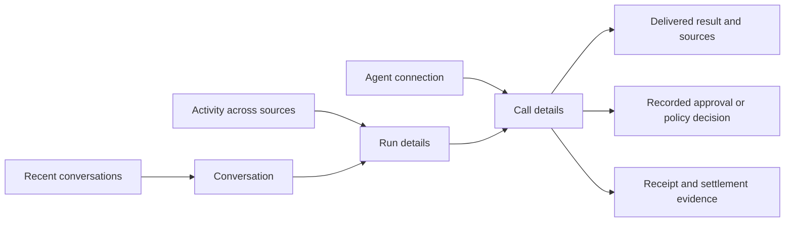
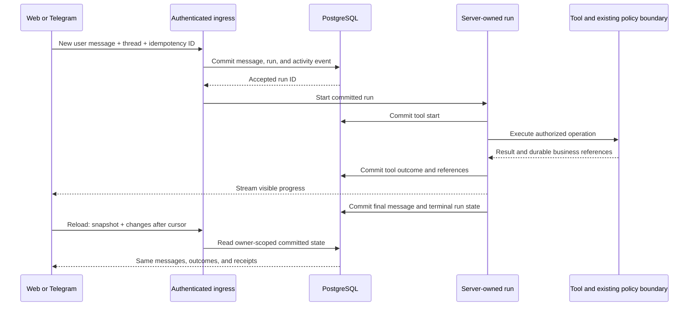

# Persistent conversations and understandable activity

Status: **deployed and merged into the shared repository**, 9 September 2026. Requested by the owner after investigating recent web chats, Telegram conversations and MCP calls. The scope below records the approved plan. See [release evidence](../evidence/HISTORY_RELEASE_2026_09_09.md), [implementation evidence](../evidence/HISTORY_IMPLEMENTATION.md), the [accepted architecture decision](../decisions/0017-persistent-history.md), and [the research](../research/persistence-2026-09-08.md).

## Outcome and chosen approach

A person can reopen a web or Froggy Telegram conversation after a refresh or deploy, see the associated work, and answer: **what was requested, which agent acted, what it called, what required approval, what was delivered, and what was actually paid?** The assistant can retrieve that same evidence through bounded, authorized reads.

Use the existing PostgreSQL database and AI SDK for the first persistent-history release. Use TanStack DB for normalized browser views once those reads exist. Evaluate TanStack AI against the same records in a separate spike; adopt it only if it passes the execution and schema gates below and reduces application-owned lifecycle code. Avoid coupling restoration of user history to an engine rewrite.

The first delivery is persistent web chat plus a recent-conversations picker and read API. The complete update adds native Telegram ingestion, MCP details, a unified activity view, and evidence-based retrieval. Full offline execution, arbitrary replay of paid tools, and importing another agent's private conversation are outside this update.

## What the person will see

| View | Contents and behavior |
| --- | --- |
| Chat | Current conversation with a persistent URL and title; a Recent button opens history without replacing the welcome panel; New chat is explicit |
| Recent conversations | Search, newest activity, source badge (Web/Telegram), preview and unfinished-work status; open the selected conversation without starting a run |
| Activity | One chronological list of runs and external-agent work, filterable by source, connection, status and date; failed/awaiting/uncertain work is easy to find |
| Run details | Request and answer, ordered tool calls, approvals, results and receipts; separate delivery and payment status |
| Agent details | Existing connection page gains linked call details; repeated status polls are collapsed visually, with the individual records still inspectable |
| Evidence panel | Selected call's recorded input, bounded result, source links, timings, outcome, policy decision and receipt references |

Use the existing Chat/Wallet/Services navigation. Put Activity under More and link it from Chat and agent details; do not add another crowded bottom-navigation item. On desktop, open an optional details panel beside the timeline. On mobile, details are a full-height sheet with an obvious Back action. Keep the live Chrome card tied to the active workspace run; opening a historical thread must not navigate or take control of Chrome.



An illustrative run, using product labels rather than internal event names:

```text
Research a token launch                     Telegram · Today 21:03
Requested → Searching X → Answer delivered

Search X                              Completed       1.8 s
  Input: …            Result: 10 source posts         [Inspect]
  Payment: Settled     Receipt: …                     [View receipt]

Why this result?
  Recorded request · source posts · tool outcome · payment evidence
```

The example is a proposed layout, not a claim that this exact run occurred. An unsuccessful version can say “Payment settled · Result unavailable”; do not compress those into a misleading single success badge. “Explain this run” is a deliberate read action with cited evidence, not an automatic model call every time details open.

Loading placeholders reserve the same layout as loaded rows. Distinguish loading, empty, failed-to-load, reconnecting and stale snapshots. Keep the copy-for-agent action stable. Preserve the scroll anchor when older messages load; only follow new output when the reader is already at the end. Provide a jump-to-latest control. Respect reduced motion and keyboard focus, and do not announce every streamed token to screen readers.

## Durable model and boundaries

Add TypeID schema pairs for new entities in `packages/domain/src/id.ts`; do not introduce bare string entity identifiers. PostgreSQL storage follows the existing UUID/TypeID mapping. All public records and event envelopes are versioned with Effect Schema. Keep financial authorization in `session.ts` and the current domain/ledger/policy code.

| Record | Proposed essential fields | Purpose |
| --- | --- | --- |
| `conversations` | id, userId, title, originSurface, externalThreadId?, revision, createdAt, updatedAt, archivedAt? | Stable thread identity; unique owner/surface/external-thread binding where present |
| `messages` | id, userId, conversationId, runId?, role, source, sourceMessageId?, parts, status, revision, createdAt, updatedAt | Canonical structured text/tool references; stable identity during streaming and reload |
| `runs` | existing RunId, userId, conversationId?, source, actorConnectionId?, triggerMessageId?, status, leaseEpoch, leaseExpiresAt, pendingWaits, usage?, startedAt, finishedAt? | Durable execution state and correlation; independent of the HTTP socket |
| `tool_executions` | id, userId, runId?, agentInvocationId?, toolCallId, name, inputPreview, resultPreview, errorCode?, status, taskId?, purchaseId?, receiptIds, artifactIds, startedAt, finishedAt? | Inspectable internal and external calls, including explicit purchase correlation |
| `activity_events` | id, userId, sequence, conversationId?, runId?, kind, entityRef, entityRevision, payload, recordedAt | Ordered, bounded changes for timeline/reconnect; also a transactional publication outbox |
| `artifacts` | id, userId, runId?, kind, title, mediaType, payloadOrExistingRef, sourceUrl?, size, truncated, retentionClass, createdAt | Persisted result evidence without embedding large outputs in every message |

Extend existing `agent_invocations` metadata with links to the detailed execution/run where available; do not create a second competing MCP audit trail. Reuse `tasks`, `purchases`, `receipts`, `sales` and `spends` as the business records. Do not copy a task result into several independent canonical JSON documents. Initially store only bounded text/JSON artifacts or references to existing durable results; a later file-storage slice is required before promising permanent screenshots, attachments or HTML bytes.

Every lookup includes the owner at the storage boundary, not just in the HTTP handler. Index conversation history by `(userId, conversationId, createdAt, id)`, activity by `(userId, sequence)`, and calls by `(userId, runId, startedAt, id)`. Add unique keys for owner/conversation/client-message ID and source/external-message ID. A retried input returns the accepted run; it does not execute a second time.

Preserve typed structure and a schema version for message parts instead of flattening everything to Markdown. The stored transport/SDK format is an adapter detail: retain provenance and stable IDs, validate on read, and use versioned converters for a future engine. Do not let two SDK-specific snapshots become independent authorities.

## Write, replay and restart behavior



1. **Ingress:** accept a new user message and identifiers, not a client-authored replacement history. Load canonical history on the server. Commit the message, run and event before calling a model or paid tool. Reject a stale conflicting revision with the current revision and active-run link.
2. **Concurrency:** retain one executing run per workspace because the workspace shares one Chrome and spending session. Use a database-backed lease with fencing for execution ownership; do not mistake a conversation ID or client lock for authority. A second conversation may be browsed freely, but a second execution receives an explicit busy response in the first release. Do not silently abort the first run. Broader scheduling can come later.
3. **Streaming:** the server keeps draining after disconnect. Persist partial message snapshots at most once per second and at every tool/interrupt/terminal boundary. The first release guarantees the committed transcript and checkpoints; a process crash may lose up to the last checkpoint's uncommitted partial text. Do not promise byte-perfect replay across process death before the durable-chunk adapter is implemented and tested.
4. **Tool execution:** persist a start record before invoking the adapter. Persist the bounded outcome and durable task/purchase/receipt references before proceeding to another consequential step. If bookkeeping fails after an external action, treat its outcome as uncertain and reconcile through the existing business ID. Never infer that the external action failed merely because the history write did.
5. **Finish:** save the final message and run terminal state together. Retire the in-memory replay buffer only afterward. A failure to save cannot be advertised as successfully saved history.
6. **Restart:** an expired execution lease becomes interrupted/needs reconciliation. Show saved partial output and any known receipt. Do not restart model/tool execution automatically. First recover business status; a later explicit retry creates a new run linked to the old one and reuses completed operation results where valid.
7. **Approvals:** durable waits reference the existing approval subject, immutable request, expiry and decision. A stored approval notification is not new authority. Resume must authenticate the person, reject duplicate/stale answers, and recheck the current mandate/quote. An unknown or expired paid operation is never replayed from a transcript.

Keep run states explicit: accepted, running, waiting, completed, failed, stopped, and interrupted. Payment and delivery states remain separate. A waiting run has typed durable waits; it is not completed.

Use the event table as a transactional outbox: record database state and its event in one transaction, then publish only after commit. On reconnect, read changes from PostgreSQL; the socket is a low-latency delivery hint, not the sole record. Allocate the per-owner sequence while holding that owner's counter lock through commit, so a later committed cursor cannot skip an earlier uncommitted event. Do not rely on a bare auto-increment ID for commit order. Hold locks only during short database transactions.

The initial snapshot and its cursor come from one consistent read. Apply only newer entity revisions, tolerate duplicate delivery, and detect gaps. If a cursor has expired, return an explicit resnapshot response. The client must not interpret a failed fetch as an empty collection.

## Capturing each source

**Web:** introduce a stable conversation route such as `/chat/$conversationId`, with `/` retaining the welcome/new-chat entry. Persist the message accepted at ingress, all assistant parts and tool references, and the run outcome. Restore history before attaching to an active stream; reconcile by message ID and revision to prevent duplicate answers.

**Froggy Telegram:** resolve the verified pairing, then bind `(owner, Telegram thread)` to a conversation. Deduplicate inbound platform IDs before execution. Persist incoming text, outgoing final text and delivery status at the application boundary; the SDK cache remains an aid, not the archive. Persist outbound intent separately from confirmed send. Telegram send-time uncertainty must not be blindly retried into duplicate replies. Web can open this thread explicitly, with each message retaining its actual source. The model reads the durable thread rather than the process-local map.

**External MCP:** retain current metadata and add allowlisted/capped input, output and error fields at the common invocation wrapper. Capture an execution ID before running and link task/purchase/receipt IDs explicitly. Record protocol validation failures in a separate bounded diagnostic category, without retaining raw malformed or unauthenticated payloads. Preserve `started`, `refused`, `accepted`, `replayed`, `failed`, `uncertain` and business-completion distinctions. List/status calls do not create another charge.

An external agent may optionally supply an opaque correlation reference. Validate it against that connection and owner; treat it as a grouping hint, never authorization. Calls without a trusted conversation link appear under agent activity. Do not manufacture the agent's surrounding prompts or explanations.

**Existing evidence:** backfill only what exists. Import unexpired paired Telegram cache messages idempotently with source IDs and a “Recovered from Telegram cache” marker. Extend retention only in the new explicitly managed store. Link historical tasks/receipts/calls by actual identifiers; time proximity is a suggested association, not a proven relationship. Lost web chats and old omitted MCP arguments remain marked unavailable.

## TanStack DB integration

Create owner-scoped collections for conversation summaries, message pages, run summaries, execution summaries and artifact metadata. Use the existing Query client and authenticated API. Query keys include owner and filter scope; dispose collections and clear sensitive caches on sign-out/account change.

Use on-demand Query Collections for scoped lists. Translate only an allowlisted filter/order vocabulary to server queries; never execute a client query as SQL. Message history uses keyset pagination. Either model each cursor page as an explicit collection scope or adapt it deliberately through direct writes; do not assume DB's offset-oriented subset parser is a keyset cursor protocol.

Receive committed entity patches through the existing versioned app socket and the recovery endpoint, then apply `writeUpsert`/`writeDelete` in collection batches. Server-projected run summaries carry the final status and financial references needed by a row, preventing independent collection updates from briefly presenting an impossible combination. Render message text from one current projection; do not continuously mirror two mutable chat stores through reciprocal effects.

Keep ephemeral token animation in the active chat renderer until checkpoints arrive. Do not put Chrome frames into collections or React state. Optimistic writes are limited to drafts, titles, archive state and a visibly pending user message. Payment, approval, tool-completion and receipt state always comes from the server. Offline mode may preserve an unsent draft; it must not automatically replay financial work on reconnect.

## Retrieval and explaining work

Proposed read contracts, all authenticated and Effect-decoded:

- `GET /api/conversations?before=…&limit=20` — recent summaries.
- `GET /api/conversations/:id/messages?before=…&limit=50` — one page of canonical messages plus current run/revision.
- `GET /api/activity?before=…&after=…&source=…&status=…&limit=50` — chronological activity or recovery changes with a scoped cursor.
- `GET /api/runs/:id` and `GET /api/executions/:id` — bounded detail and evidence references.
- `GET /api/history/search?q=…&source=…&limit=20` — owner-scoped PostgreSQL text search with message/call links. Start with indexed text search; add embeddings only if measured retrieval failures justify them.

Use a distinct read-only history permission for external agents, scoped to explicitly shared conversations or their own connection's activity. Existing `services`/`pay` access must not silently grant all private web and Telegram messages. Internal assistant retrieval defaults to the current thread; cross-thread retrieval follows the person's request and permitted scope. Reading history must never execute a tool from a historical message.

For “what happened?” retrieve a small set of relevant runs, then their selected messages/calls/receipts. Return a compact evidence bundle with stable IDs, source, timestamps, outcome and truncation markers. Summaries cite those records and distinguish observations from inference. Explain refusals using recorded rule IDs and policy versions. Display user-visible decision summaries and source evidence; do not claim access to an external agent's private reasoning or invent an internal thought transcript.

Maintain the full canonical conversation separately from bounded model context. Compacted context records the covered message IDs, revision, model and creation time. If the covered prefix changes or is deleted, invalidate the summary. Estimated model cost, quoted service price and confirmed user spend are separate labeled amounts; aggregate charges by unique receipt/sale identity, never by number of poll calls.

## Delivery sequence and acceptance gates

| Slice | Concrete changes | Required proof |
| --- | --- | --- |
| 1. Persistent web chat | Domain IDs/schema, conversation/message/run store and minimal event outbox, server ingress/finalization, recent/read routes, simple Recent picker using existing Query | Completed chat survives reload and server restart; failed/stopped runs remain readable; duplicate submit creates one run; cross-owner IDs are denied |
| 2. Source capture and recovery | Application-level Telegram history, cache importer, detailed MCP executions and business links, durable waits/checkpoints/outbox | Telegram webhook duplicates execute once; both message directions persist; MCP output survives process restart; missing historical bodies are honestly labeled; unknown payment is reconciled without another charge |
| 3. Unified views with TanStack DB | Scoped collections, source/status filters, run detail panel, event recovery, stable pagination | Reconnect has no missing/duplicate rows; old pages are not deleted by a narrow query; no status-poll double counting; account switch clears data; mobile layout/focus/scroll hold |
| 4. Retrieval and summaries | Indexed search, bounded evidence reads, explicit history permission, cited Explain action | Correct run retrieved from natural-language fixture; source links resolve; inaccessible threads never enter result or model context; summary cannot authorize a spend |
| 5. TanStack AI decision | Isolated version-pinned comparison of one representative conversation and its stored records | Parity matrix below; adopt only in a dedicated migration, otherwise retain current SDK with documented findings |

Each slice is a reviewable vertical change with its own tests and deployment evidence. If the event deadline constrains scope, ship slice 1 first; library migration and full offline caching do not block it. The complete program is several implementation slices, not a one-line dependency update. Runtime estimates should follow the first storage/compatibility spike rather than implying a deadline from documentation alone.

The TanStack AI spike must prove: Effect validation and JSON Schema conversion without Zod; the actual OpenAI-compatible and Anthropic adapters; text and tool-output round trips; stable IDs on hydration; fresh auth on reconnect; disconnect versus Stop; simultaneous-tab conflicts; provider failure and process death; durable interrupt rejection/retry; source limits; and unchanged policy/receipt outcomes. Test with recorded synthetic fixtures and stubbed side effects. Do not run both engines against the same live paid task for comparison. Run the upstream adapter conformance suite in an isolated Bun-managed Vitest harness if needed; keep application tests on Bun.

## Implementation map and verification

Follow the existing package direction. Add contracts in `packages/domain/src/id.ts` and `packages/protocol/src/`; schema/migrations in `packages/database`; extend the existing Store seam and its PostgreSQL/stub implementations in `packages/wallet` rather than opening new cross-package imports. Implement lifecycle integration in `apps/server/src/turn.ts`, `chat.ts`, `runs.ts`, `router.ts`, `telegram/pager.ts`, `mcp.ts` and `agent-invocations.ts`. Keep history operations together behind a small server-facing module. Reuse the web workspace, chat route, stream and agent-details components. No new placeholder packages or file for every event kind.

Before implementation, recheck the current shared tree and nested `AGENTS.md`; do not apply this plan by overwriting the ongoing trading work. Choose the next migration number from the current tree. Record an accepted architecture decision once the design is implemented and verified; this document is a proposal.

Use meaningful PostgreSQL integration tests for transaction/sequence races, duplicate ingress, lease expiry, finalization failure, owner scoping and deletion. Crash injection must cover before tool execution, after external settlement, before result storage, and after final-message storage. Verify that a stale worker cannot commit after its lease is replaced. Replay delivery must never re-execute the tool.

Browser tests cover recent-list loading/error/empty states; welcome-copy stability; refresh mid-answer; older-page scroll anchoring; source filters; partial/stale histories; keyboard/mobile details; a second tab; and a second account. Measure a fixture with 1,000 conversations and 10,000 events: pagination should keep the rendered window bounded, and opening one run should not load every artifact. Initial targets are at most 20 conversation summaries, 50 message/event rows per request, 4 KB previews and 64 KB per stored text/JSON artifact. These are proposed limits to validate, not measured performance claims.

Run `bun run check:fast` while implementing, `bun run check` before completion, PostgreSQL tests against a disposable migrated database, and `bun run e2e` for each visible slice. Verify the deployed code and production boot; live paid acceptance, if required, uses one explicitly authorized action and its actual receipt. Documentation-only research does not establish those runtime results.

## Retention, deletion and rollout

Proposed product default: keep conversations and useful result artifacts until the person deletes them; keep temporary stream chunks for 24 hours after terminal state. Apply hard per-record/output limits and expose truncation, rather than silently dropping old conversations. General browser screenshots or raw provider payload capture are not enabled by this plan. Retention changes that remove existing content must be made explicit before enabling cleanup.

Redact credentials and secret-bearing URLs before persistence, not just before rendering. Allowlist tool fields and store a redaction/truncation marker. History deletion removes the person's conversation text, artifacts, summaries, search entries and local caches according to the existing account-deletion flow, while separately retained financial evidence follows the application's established ledger policy. Extend deletion to Telegram SDK cache keys; deleting a local record does not delete messages already delivered in Telegram. External telemetry defaults to metadata and stable correlation IDs.

Roll out additive schema first, then capture, then reads and UI. Feature configuration stays in `environment.ts`. A UI rollback keeps captured history. Roll back to a capture-capable server build after history launches; reverting to a pre-history binary would create an explicitly disclosed recording gap. Keep import IDs and checkpoint cursors so backfill/recovery can be retried without duplicates.

Open choices for implementation: the exact retention setting exposed to the person; which private conversations may be shared with an external agent; and whether byte-perfect stream replay or read-only offline history is worth its added work. Recommended defaults above make the first slice concrete without requiring those optional capabilities.
