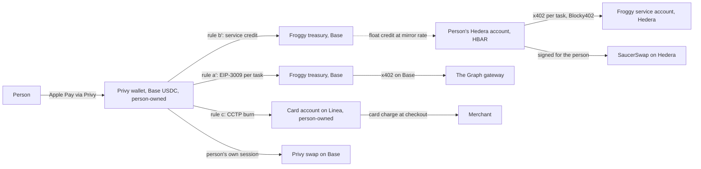

# Froggy iteration 2: the plan

> **Status: CONFIRMED by the owner.** Every decision has consensus from the three votes; S2 (the mainnet fallback) was settled by Kristjan at 20:24 CEST on Sun 6 Sep as no fallback, with Jonas's preference for a labelled fallback noted. Kristjan confirmed execution in the group at 20:32 CEST ("gayfrog is executing now the plan"), Hemang answered "lfg"; Jonas has not replied to the summary. Built and smoke-tested in stub mode by 18:45 CEST on Sun 6 Sep: tasks 1.1, 1.2, 1.3, 1.4, 1.6 (both phases: the browser worker's gate went at 20:55 CEST), 1.7, the Agents tab, the brief's supply view and the five audit fixes (`b819e32` through `e44eece`). Task 1.5 landed at 20:57 CEST with testnet evidence; the 1.8 spike passed at 21:10 CEST. Task 2.4 landed at 21:20 CEST (the real onramp is the owner's). Still to build before the demo: 2.1 to 2.3, 2.5, 3.1 to 3.6, and the owner setup in M0. Kristjan authorised implementation of the uncontested tasks at 17:41 CEST on Sun 6 Sep 2026 (seller durability, task API, agent tokens, freeze removal, CLI and skill), with networks kept as configuration and testnet defaults until the mainnet accounts and keys exist. Live session record: `docs/sync/telegram-grilling-session.md`.

Status: **CONFIRMED by the owner on Sun 6 Sep 2026, 20:32 CEST; the team's votes are in the session record.** Drafted Sun 6 Sep 2026 by the facilitator (Claude, Fable 5.1) from the grilling session recorded in `docs/sync/telegram-grilling-session.md`. Every decision below names who took it. Where a decision is one vote, it says so. Nothing here is implementation-ready until the blockers in the last section are cleared; unsupported provider access is a blocker, not a task assumed to work.

Deadline: submission closes **Sun 13 Sep 12:00 EDT (18:00 CEST)**. Internal cut **Sat 12 Sep 20:00 CEST**. Feature freeze **Thu 10 Sep 12:00 CEST**. Fixed event dates: check-in 1 Mon 7, feedback session Tue 8 14:00 EDT with the live URL, check-in 2 Thu 10, video Fri 11, public repository and submission Sat 12. Today is Sun 6.

## 1. Product

**Sentence.** Froggy gives your personal agent a browser it can drive and money it can spend under rules you set, and Froggy's own service is paid per task over Hedera x402.

**Audience.** People who already run a personal agent (Hermes, OpenClaw, Claude Code, Kimi) and want it to fetch paid data and buy things without handing it a wallet. Kristjan is user zero with Hermes; Jonas and Hemang are the outside testers with Kimi and Claude.

**First task.** Two journeys share one task lifecycle (R1-Q1, Kristjan: C):

1. A paid data task: "cheapest place to borrow USDC right now, and the best supply rate" across twelve Messari lending deployments on four chains, priced $0.05.
2. A delegated browser task: find a cheap item on an EU shop, fill the cart, pay with the person's MetaMask Card, return the order confirmation, priced $0.50 for up to 40 steps.

**First three minutes.** Sign in with Google. See the address, tap Add funds, pay €10 with Apple Pay, watch USDC land on Base. Copy the "connect your agent" block into Hermes. Ask Hermes for the borrow brief. Hermes calls Froggy, Froggy's 402 is paid in HBAR from the person's own Hedera account, the brief arrives with the receipt link. Total service cost shown in dollars, remaining balance shown in dollars.

**Why Froggy over Browser Use.** Browser Use sells browser time over x402 on Base and does human-approved checkout with Link. Froggy's observable difference is that both the service payment and the purchase run under a policy the model cannot reach, that the person can take the page mid-action, and that every decision has a receipt. This is a hypothesis; the user test in section 9 is the first check.

**Explicit cuts.** Freeze and pause are removed (R1-Q9, Kristjan; facilitator objected). No testnet anywhere (R1-Q3, Kristjan; facilitator objected). No refunds on failed paid work (R2-Q2, Kristjan; facilitator objected). No remote MCP this week. No Linea token buying. No per-agent caps. Mona, fitness bets and the AI referee are separate projects.

## 2. Demo sequence, networks, assets, sponsors

Recorded Fri 11 Sep, 4 to 5 minutes, product on screen at 0:00, Froggy web chat first, Hermes second (R2-Q7, Kristjan).

| # | Beat | Network and asset | Sponsor evidence |
| --- | --- | --- | --- |
| 1 | Sign in with Google; address shown; Apple Pay onramp €10 to USDC on Base mainnet | Base mainnet, USDC | Privy: onramp, embedded wallet |
| 2 | Buy $5 of service credit: Privy wallet pays the treasury under rule (b′); HBAR lands in the person's own Hedera account at the mirror-node rate | Base USDC to treasury; Hedera mainnet HBAR from the float | Privy: policy-gated transfer (the qualifying financial flow) |
| 3 | Ask the borrow-and-supply brief in the web chat; Froggy's 402 offers HBAR on Hedera or USDC on Base; the person's Hedera account pays 0.05 USD in HBAR through Blocky402; the receipt shows HashScan, the HCS note and the twelve indexes at their blocks | Hedera mainnet, HBAR; Graph via API key | Hedera: live x402 service settled through Blocky402, real paid request; Graph: one standardized schema across twelve deployments |
| 4 | Paste the skill into Hermes in Telegram; ask Hermes for the same brief; the CLI in Hermes' sandbox gets the 402, has Froggy sign the payment from the person's Hedera account, retries, returns the answer; the task appears in the workspace with its receipt | Hedera mainnet, HBAR | Hedera: an external agent consuming the service without an API key |
| 5 | Ask Hermes to buy the item: Froggy reads the card account on Linea, finds the balance short, proposes a CCTP fast transfer from the Privy wallet, the person approves the ticket, USDC arrives on Linea in seconds, Froggy fills the cart and the card, 3DS comes to the person as a ticket, the order confirmation lands in the task | Base USDC burned, Linea USDC minted, merchant charge pulls from Linea | Privy: policy-gated bridge; the broader purchase capability |
| 6 | Paste a token address; Froggy says what it is and where, proposes a buy with a quote; the person approves; for a Base token the person's own Privy session executes the swap | Base mainnet | Privy: swap |
| 7 | A hostile page tells the agent to pay a different address; refused on provenance before any cap; a task over the threshold asks and the person says no; the receipt says which rule | — | The leash |

Beat 6 is optional if time is short; beats 1 to 5 are the submission.

**Three partner prizes (R1-Q8, Kristjan):** Privy Best Financial Flow ($2,500); Hedera AI and Agentic Payments (up to three at $2,000); The Graph Best Use of Composable or Standardized Graph Products ($5,000 split 2,500/1,500/1,000). Qualification evidence per sponsor is in section 7. The Graph standardized track requires that the standards leverage is made clear: one query pattern across twelve protocols on four chains, with what became easier because of the shared schema. Querying one subgraph does not qualify.

## 3. Money: ownership, flows, balances

**Who owns what.**

- The Privy wallet is the person's. The agent signer signs under the committed policy and cannot exceed its rules.
- The person's Hedera account is opened on the person's own Privy secp256k1 key if the Monday spike passes (R1-Q2b), otherwise on a key Froggy custodies and says so. Either way the HBAR in it is the person's, and Froggy signs Hedera transactions for the person on the server under host-enforced caps, because Privy cannot decode a Hedera transaction and so cannot cap it.
- The treasury on Base and the service account on Hedera are Froggy's. The HBAR float is Froggy's until it is sold to a person at the mirror-node rate, which was measured within 0.04% of SaucerSwap's price on 6 Sep.
- The card account on Linea is Kristjan's MetaMask account. Froggy reads it and can send to it; it never holds its key.
- Hermes holds nothing but a Froggy agent token.

**Balances shown, in dollars.** Available in the Privy wallet on Base; service credit as the HBAR balance of the person's Hedera account at the mirror-node rate; the card account balance and remaining card allowance on Linea, read-only; pending: a bridge in flight or an onramp not yet landed; reserved: a task quoted and paid but not finished. Nothing is double counted: a bridge in flight is subtracted from Base and shown as pending until the Linea mint is confirmed.

**Billing unit.** Fixed price per task type: data brief $0.05, browser task $0.50 for up to 40 steps and 5 minutes (R2-Q14). The quote is the price; nothing is metered back (R2-Q1b). Charged in HBAR at the mirror-node rate when paid on Hedera, or in USDC when paid on Base.

**Budgets and approvals.** The person's mandate applies to every payer and every agent token: per-transaction cap, rolling cap, payee and host allowlists, approval threshold. A connected agent inherits the mandate and has no cap of its own (R2-Q12). Anything over the threshold, and every purchase, pauses the task as awaiting approval; the ticket appears in the web workspace and on the person's Froggy Telegram pairing; the CLI returns the approval link so Hermes can relay it (R2-Q13). The four answers stay as built. There is no tool that raises a limit.

**Controls.** Stop aborts the current run. Disconnect in settings revokes an agent token at once (R2-Q3). Freeze is removed (R1-Q9): no kill switch in the UI, on Telegram or in the API; the Privy signer is not revoked by a person's action this week. The README, the evidence files and the mandate ticket must stop promising it.

**Reconciliation and recovery.**

- The seller records the purchase before doing the work: a task row with the payment proof, the settlement id and the buyer's account; the same proof presented twice returns the same task (unique index on the settlement transaction id). Today nothing is recorded and the Graph fetch runs after settlement with no error handling; that is the first build task.
- A settlement whose facilitator call errors after `/settle` was sent is `uncertain`, not `failed`; the mirror node is consulted by transaction id before any retry or refund, and the pocket is not refunded on `failed`. Today it is.
- Paid work that fails afterwards stays retrievable as a failed task and the receipt says paid, failed, not refunded (R2-Q2).
- A bridge whose Linea mint has not arrived after the attestation shows as pending with the burn hash; Froggy retries the mint; if the attestation never comes the task fails with both hashes on the receipt and the person is told where the funds are.
- A checkout whose confirmation is ambiguous is reconciled from the merchant's order page or email before any retry; the task's idempotency key prevents a second checkout for the same cart.
- Disconnecting a tab never aborts a task; only Stop does. Runs already belong to the server.

## 4. External-agent contract

- **Onboarding.** After sign-in the settings show a "Connect your agent" card: an agent token (a TypeID `agt_…` plus a secret shown once), the person's Hedera account id, and the copy-paste skill text. The same text is the SKILL.md in the repository and the installer on the landing page.
- **Surface (R1-Q5).** A SKILL.md plus a thin CLI (`froggy`) that runs in the agent's sandbox. The CLI is a real x402 client: `froggy ask "…"` posts the task, receives the 402, asks Froggy's wallet service to sign the HBAR payment from the person's Hedera account, retries with the payment header, then follows the task. Hermes on Contabo runs it in its Docker terminal, which has Node 20, curl and open egress; a public Froggy URL is required, since the sandbox cannot reach this box's tailnet.
- **Task API.** `POST /api/tasks` with the agent token and an `Idempotency-Key`; answers 402 with offers on `hedera:mainnet` (HBAR) and `eip155:8453` (USDC); a paid request returns a durable task id. `GET /api/tasks/{id}` returns status, result, receipt and approval link; `GET /api/tasks/{id}/events` streams. States: quoted, paid, running, awaiting_approval, done, failed, uncertain. Results are retrievable for 24 hours. Browser tasks stream; data tasks wait up to 60 seconds then poll (R2-Q11).
- **Binding.** Every token belongs to one person's workspace; a task runs on that person's Chrome profile, mandate and balances. Tokens are listed in settings with created-at and last-used; Disconnect revokes immediately.
- **What an agent cannot do.** Approve, raise a cap, add a payee, change the mandate, or see card data.

## 5. Onboarding, Graph, address, card scope

**Onboarding (R2-Q5).** Login methods Google and email; the wallet login option is removed. The address is shown with copy. Add funds opens Privy's card onramp, destination USDC on Base mainnet, Apple Pay where the person's card allows it; the Stripe sandbox stays as the keyless fallback and is labelled as delivering nothing. Balance in dollars with service credit separate.

**Graph (R2-Q10, R2-Q15).** One paid endpoint, the borrow-and-supply brief for a token across the twelve Messari deployments, with per-index block freshness and the evidence hash. Data through the server API key by default. Froggy's treasury pays The Graph's Base gateway per query by x402 when `GRAPH_PAY_PER_QUERY` is on, platform-funded, never the person's wallet. Rule (a) is retargeted from The Graph's payee to Froggy's treasury so that the person's Privy wallet can pay Froggy on Base.

**Pasted address (R1-Q10, R1-Q10b).** Classify a pasted string as token, wallet, contract or service URL on Base, Linea, Hedera and Ethereum with a confidence label; ask when ambiguity changes the action. Propose actions as tickets: buy, watch, add to directory. Execute only on approval: Base tokens through Privy swap from the person's own session; Hedera tokens through SaucerSwap from the person's Hedera account; Linea tokens propose only. A pasted address is never a payee; provenance stays `page` or `model` until the person types it.

**Card (R1-Q4, R1-Q4b, R2-Q4, R2-Q6).** Second beat, time-boxed. The card is Linea only. Froggy reads the linked account's USDC balance and the card allowance on Linea by RPC; the spender address comes from Kristjan's own approval transaction and is configuration, not inference. If funds are short, Froggy quotes a CCTP v2 fast transfer from the Privy wallet and asks; on approval the wallet signs `depositForBurn` under a policy rule that pins the token, the recipient and a cap, Froggy polls Circle's attestation and submits the Linea mint from its host address paying gas, then re-reads the balance. Checkout: the card is entered once in settings and sealed at rest; the browser worker fills payment fields from the sealed store on a request that names the card, never its values; frames and snapshots are masked while the fields are filled; 3DS arrives as a ticket; the model, logs, replay and receipts never carry card data. Duplicate purchase prevention is the task's idempotency key plus a confirmation capture before the task is done. Refunds are the merchant's; Froggy records the order id so the person can ask.

## 6. Milestones and tasks

Owner "run" is the nightly agent run under Kristjan (R1-Q11). Owner "Kristjan" is a human-only step: keys, money, dashboards, the card. Effort is agent hours; uncertainty is low, medium or high. Every task ends green on `heavy bun run check` and, for anything visible, `bun run e2e`, then one commit by pathspec.

### M0. Owner setup, tonight and Monday morning

| # | Task | Owner | Depends on | Acceptance | Effort, uncertainty |
| --- | --- | --- | --- | --- | --- |
| 0.1 | Mainnet Hedera: create an ECDSA payer account for the treasury float and a separate service payee account; buy about 500 HBAR; fund | Kristjan | — | Two account ids on HashScan mainnet with balances; keys on Railway and the box | 1 h, low |
| 0.2 | Blocky402 mainnet gate: one real settlement of the smallest amount from the treasury account to the service account through `api.blocky402.com` | run, after 0.1 | 0.1 | HashScan mainnet transaction SUCCESS with the facilitator as fee payer; or a documented refusal | 1 h, **high** |
| 0.3 | Privy dashboard: enable card onramps, token swaps and gas sponsorship; create a policy-owner authorization key | Kristjan | — | Each toggle visible; policy update with the owner key succeeds | 30 min, low |
| 0.4 | Real onramp: €10 by Apple Pay into the demo wallet on Base mainnet | Kristjan | 0.3 | USDC balance on Basescan; screenshot of the flow; note whether Apple Pay appeared for the EU card | 20 min, medium |
| 0.5 | Card facts: the spender address and token of the card approval from Lineascan or revoke.cash; the merchant site and item | Kristjan | — | Two values in `.env` and the plan; no secrets | 15 min, low |
| 0.6 | Froggy's own Telegram bot from BotFather; token, secret and username on Railway; webhook set | Kristjan | — | `/health` shows telegram live; pairing works | 20 min, low |
| 0.7 | Railway: mainnet variables, `DEMO_USER_DID`, budget cap variables | Kristjan | 0.1 | `/health` all live | 15 min, low |

### M1. Monday: the paid task lifecycle and the external caller

| # | Task | Owner | Depends on | Files and packages | Acceptance | Effort, uncertainty |
| --- | --- | --- | --- | --- | --- | --- |
| 1.1 | Seller durability: task row before work, payment proof and settlement id unique, replay returns the same task, Graph failure after settlement recorded as failed with the receipt saying so, `uncertain` state with mirror-node lookup by transaction id, no pocket refund on `failed` | run | — | `apps/server/src/oracle-route.ts`, `packages/payments/src/oracle.ts`, `apps/server/src/paid-request.ts`, `apps/server/src/session.ts`, `packages/wallet/src/ledger-postgres.ts`, new migration | Same payment header twice yields one task; a forced Graph error after settlement yields a failed task with a receipt; a facilitator timeout yields `uncertain` and the mirror node decides | 6 h, medium |
| 1.2 | Task API and lifecycle: `POST /api/tasks` behind a 402 with two offers, `GET /api/tasks/{id}`, events stream, `Idempotency-Key`, 24 h retrieval, TypeID `tsk` | run | 1.1 | `apps/server/src/router.ts`, new `tasks.ts`, `packages/domain/src/id.ts`, `packages/protocol` | A curl script pays and retrieves a task; a second POST with the same key returns the same id; restart keeps the task | 6 h, medium |
| 1.3 | Agent tokens: create in settings, list, disconnect; bearer auth for machine callers bound to a workspace | run | 1.2 | `apps/server/src/auth.ts`, `router.ts`, `apps/web` settings drawer, migration | A revoked token gets 401 within one request; a token cannot approve | 4 h, low |
| 1.4 | Multi-network seller on mainnet: `hedera:mainnet` HBAR offer and `eip155:8453` USDC offer in one 402; `HEDERA_TESTNET` literal replaced by configuration; price table | run | 0.2 | `packages/payments/src/types.ts`, `oracle.ts`, `packages/domain/src/money.ts`, `apps/server/src/environment.ts`, `.env.example` | 402 shows both offers; a mainnet HBAR settlement lands from the demo account | 4 h, medium |
| 1.5 | **Landed Sun 6 Sep 20:57 CEST, proven on testnet (`docs/evidence/HEDERA.md`).** Per-person Hedera account and float credit: the person's Hedera account is created by the first HBAR transfer to their EVM alias; service-credit purchase moves USDC to the treasury under rule (b′) and HBAR from the float to the person at the mirror-node rate; balances in dollars | run | 1.4, 0.1 | `apps/server/src/services.ts`, `tools.ts`, `packages/wallet/src/transfer.ts`, `packages/payments/src/rates.ts`, `docs/privy-agent-policy.json` | Basescan transfer plus HashScan transfer for one purchase; the strip shows service credit in dollars | 6 h, medium |
| 1.6 | Remove freeze: button, socket message, Telegram command, pocket zeroing, signer revocation on freeze; keep Stop; rewrite the mandate ticket and README paragraphs | run | — | `apps/server/src/freeze.ts`, `sockets.ts`, `telegram/pager.ts`, `apps/web` top bar and tickets, README, evidence | No freeze path remains; e2e updated | 3 h, low |
| 1.7 | CLI and SKILL.md: `froggy ask`, `froggy status`, `froggy follow`; remote signing endpoint `POST /api/wallet/sign-payment` under the agent token; published as a tarball the sandbox can install before the repo is public | run | 1.2, 1.3, 1.5 | new `apps/cli`, `skills/froggy/SKILL.md` | From a clean container: install, one paid task, result printed; the receipt in the workspace names the task | 6 h, medium |
| 1.8 | **Done Sun 6 Sep 21:10 CEST; verdict in `docs/evidence/PRIVY.md`: Ethereum and Solana wallets are refused by `raw_sign`, a cosmos-type wallet signs and became Hedera account `0.0.10396162`.** Privy raw_sign spike: sign a Hedera transfer with the person's Privy wallet key under the agent's authorization key; check the signature format and the `signRawMessageBytes` policy method | run | 0.3 | `packages/wallet/src/evm-signer.ts`, new `hedera-signer.ts` | A HashScan mainnet transfer signed by Privy; or a written refusal and the custodied fallback switched on | 4 h, **high** |

### M2. Tuesday: Hermes end to end, Graph, onboarding, feedback session

| # | Task | Owner | Depends on | Acceptance | Effort, uncertainty |
| --- | --- | --- | --- | --- | --- |
| 2.1 | Hermes on Contabo installs the skill; one paid task from Telegram to Hermes to Froggy and back | Kristjan with the run | 1.7 | Screen recording; HashScan id; the task in the workspace | 2 h, medium |
| 2.2 | Graph borrow-and-supply brief; evidence hash; fix the model-facing description and the GRAPH.md 503 claim | run | 1.1 | Twelve indexes fresh in one run; supply and borrow views; evidence file updated | 4 h, low |
| 2.3 | Graph upstream by x402 from the treasury wallet on Base; API key fallback | run | 0.4 | One Basescan `TransferWithAuthorization` from the treasury to The Graph; receipt shows `via x402` | 3 h, medium |
| 2.4 | **Landed Sun 6 Sep 21:20 CEST**, in the drawer's Wallet tab: the address with a Copy button, the service credit named in dollars, the person's Hedera account linked, and Add funds through Privy's fiat onramp toward USDC on Base mainnet (sandbox on dev builds, `VITE_ONRAMP_ENVIRONMENT` overrides); without a Privy sign-in a sentence says so; e2e `e2e/onboarding.spec.ts`. The real onramp with the dashboard toggle on is the owner's beat. Onboarding screen: login methods, address, Add funds with Privy onramp on Base mainnet, connect-your-agent card, dollar balances | run | 1.3, 1.5 | e2e for the screen; a real onramp lands in the demo wallet | 5 h, medium |
| 2.5 | Feedback session 14:00 EDT with the live URL; record what judges ask | Kristjan | 2.1, 2.4 | Notes in `docs/evidence/FEEDBACK.md` | 1 h, low |

### M3. Wednesday: the purchase, the pasted address

| # | Task | Owner | Depends on | Acceptance | Effort, uncertainty |
| --- | --- | --- | --- | --- | --- |
| 3.1 | Linea read: balance and allowance for the card account, spender from configuration | run | 0.5 | Values match the MetaMask app | 2 h, low |
| 3.2 | Sealed card store and masked autofill; 3DS ticket; confirmation capture | run | 1.6 | A test checkout on a sandbox merchant page shows masked frames and no card data in logs, replay or receipts | 6 h, medium |
| 3.3 | CCTP fast transfer: policy rule (c), burn, attestation poll, permissionless mint from the host, pending balance | run | 0.3, 0.4 | Burn on Basescan, mint on Lineascan, balance re-read; or the fallback flag set | 6 h, **high** |
| 3.4 | Merchant dry run with the real card and item | Kristjan with the run | 3.1, 3.2 | Order confirmation captured; amount and receipt reconciled | 1 h, medium |
| 3.5 | Pasted address: classify on four chains; propose tickets; Base buy through Privy swap from the person's session; Hedera buy through SaucerSwap | run | 1.5, 0.3 | A pasted Base token yields a quote and an approved swap; a pasted Hedera token yields a SaucerSwap swap; a Linea token yields a proposal only | 8 h, medium |
| 3.6 | Outside testers: Jonas and Hemang install the skill and run one task each | Jonas, Hemang | 1.7 | Section 9 observations recorded | 1 h each, low |

### M4. Thursday to Saturday

| # | Task | Owner | Depends on | Acceptance |
| --- | --- | --- | --- | --- |
| 4.1 | Freeze at 12:00 CEST; evidence files complete; README, DECISIONS, PLAN, STATUS, AGENTS.md reconciled | run | all | `docs/evidence/*` without TODO for beats 1 to 5 |
| 4.2 | Script from the demo sequence; rehearsal | video owner (to name) | 4.1 | Script in `docs/evidence/VIDEO.md` |
| 4.3 | Friday: video, release tag, hourly `/health` and 402 curl | video owner, run | 4.2 | Video link |
| 4.4 | Saturday: history secret scan, repository public, submission with the three prizes selected by 20:00 CEST | Kristjan | 4.3 | Submission confirmation |

## 7. Feasibility gates, fallbacks, missing access

| Gate | Check | When | Fallback |
| --- | --- | --- | --- |
| G1 Blocky402 mainnet | Task 0.2: a real settlement without an API key | Mon 12:00 CEST | **None accepted (R1-Q3, Kristjan).** If refused: request a key from Blocky402 the same hour; if none arrives, the Hedera beat cannot be recorded on mainnet and the team decides then. The facilitator's advice remains a labelled testnet beat. |
| G2 Privy raw_sign on the person's wallet | Task 1.8 | **Passed 6 Sep 21:10 CEST**, by a cosmos-type Privy wallet per person, not the embedded Ethereum wallet; the policy cannot cap that leg | Froggy-custodied per-person keys (task 1.5, live) stay unless the team takes the Privy-custody change on Monday |
| G3 CCTP from the Privy wallet | Task 3.3 | Wed 12:00 CEST | Pre-funded card; the demo shows the check and the quote |
| G4 Apple Pay in Privy's onramp for an EU card | Task 0.4 | Mon | Card payment in the same onramp; sandbox labelled if neither |
| G5 Privy swap toggle and gas sponsorship | Task 0.3 | Mon | Pasted address is classify and propose only |
| G6 Card spender address | Task 0.5 | Mon | Balance-only check; allowance not shown |
| G7 Public URL reachable from the Hermes sandbox | Task 1.7 | Mon | Railway URL is public today; no fallback needed |

Missing provider access today: Blocky402 mainnet key (documented as required, not issued); Privy policy-owner key; Froggy's own Telegram bot token; MoonPay or Banxa partner keys are **not** needed under R1-Q2c option A.

## 8. Verification and evidence

- Repository gates on every commit: `heavy bun run check`, `bun run e2e` for visible changes, CI green before deploy.
- Browser checks: every changed screen exercised on the live URL by the run, screenshot saved under `docs/evidence/screens/`.
- Provider and settlement evidence, recorded by the run as each lands and verified by Kristjan before the video: HashScan mainnet ids for the float credit, the person's account paying the service, and the external caller's task; HCS sequence numbers; Basescan ids for the onramp, the service-credit transfer, the Graph payment and the CCTP burn; Lineascan id for the mint; the merchant order id with the amount; Privy refusal transcripts for the control beat. Files: `docs/evidence/HEDERA.md`, `PRIVY.md`, `GRAPH.md`, new `PURCHASE.md`.
- External-agent demonstration: a screen recording of Hermes in Telegram completing a paid task, plus the CLI transcript, in `docs/evidence/HERMES.md`.
- Failure paths demonstrated and recorded: duplicate task submission, replayed payment proof, facilitator timeout resolved by the mirror node, Graph error after payment, over-threshold task denied, hostile-page payee refused, a revoked token refused, a bridge with a delayed mint.

## 9. User test

Wednesday evening, Jonas with Kimi and Hemang with Claude, thirty minutes each, observed by Kristjan, notes in `docs/evidence/FEEDBACK.md`. Observe, without coaching: connecting the agent from the skill text; delegating the brief; whether the price and the remaining balance are understood; handling an approval ticket and a refused task; finding the result and the receipt afterwards. Record where each person hesitated and what they said the money was.

## 10. Accepted decisions, blockers, documents to reconcile

**Decisions** are tabled with vote counts in `docs/sync/telegram-grilling-session.md`. Those with one vote are Kristjan's and stand unless Jonas or Hemang object in the group.

**Unresolved blockers before implementation starts.**

1. Team confirmation of this plan in the group.
2. Jonas's and Hemang's votes, and Corot's identity.
3. Blocky402 mainnet settlement without a key (G1).
4. The card spender address and the merchant (0.5).
5. The video owner.
6. The €100 allocation: onramp €10 to 20, float about €35, item at most €15, Graph and gas under €10.

**Documents to reconcile** once confirmed: `AGENTS.md` testnet-only rule becomes mainnet by owner direction with the review it demands; `README.md` control beat, evidence table and "not in scope"; `docs/plan/DECISIONS.md` rows 11, 12, 20, 34 and the added rows; `docs/plan/PLAN.md` and `STATUS.md` superseded by this file for iteration 2; `docs/evidence/GRAPH.md` 503 claim; `docs/privy-agent-policy.json` literal `aggregation.REPLACE_ME` and the rule (a) cap drift; `docs/sync/iteration-2-context.md` marked as input.
