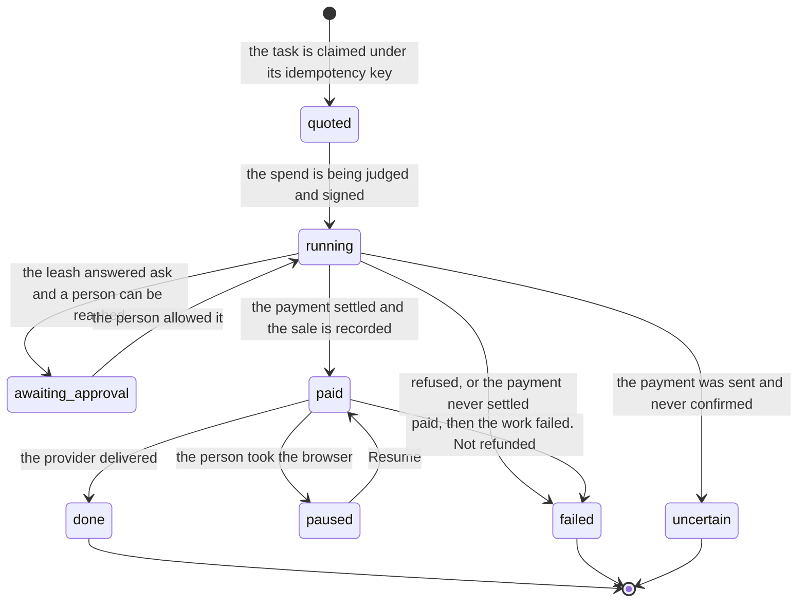

# Asking for a paid task

## Summary

This is the moment a piece of software spends someone else's money. An outside agent, holding no key of its own, asks Froggy for work that costs the person something: a fixed-price service from the catalog, a URL behind a 402, or a task on the person's own browser. What comes back is never the work. It is a **task id and a status**, and the agent's job from that point is to poll, not to ask again.

Three properties shape the whole experience, and an agent that does not hold them will misbehave. Prices are **quoted, not metered** — the quote is the price and nothing is billed back afterwards. The **same idempotency key returns the same task, not a second bill**. And **a task's id outlives every socket**, so a dropped connection is not a lost task; it is a task the agent has to go and look up.

The person is not on the other end of this. Nobody is watching. That is exactly why [the leash](../foundations/the-leash.md) is a value computed from data rather than a sentence in a prompt.

## The simple case

The agent calls `froggy_services`, which costs nothing and buys nothing. Back comes the catalog: each service with a title, a provider, a price in micro-dollars, a maximum input length, and a status of `configured`, `demo` or `unavailable`, with a note saying which and why.

It picks one and calls `froggy_service_run` with `v: 1`, the service name, a prompt, and an idempotency key it can reproduce:

```json
{
  "v": 1,
  "service": "web_search",
  "prompt": "affordable train travel",
  "idempotencyKey": "trip-research-1"
}
```

The answer arrives in under a second and is not a search result. It is the task: an id, `status: "quoted"`, `priceUsdMicros: 10000`, an empty `text`, no sources, and `stubbed` saying whether any of this is real. The buying happens after the tool call has already returned.

The agent then calls `froggy_service_status` with that id every three seconds. It sees `running`, then `paid`, then `done` with the text, the source links, the sale id and, for an image or a spoken answer, an artifact URL. If it calls `froggy_service_run` again with the same key — because it lost its place, or its own runtime retried it — it gets that same task back rather than paying twice.

## The request, event by event



### Asking

The agent posts one JSON-RPC call to `/mcp` with its bearer token. Before anything is decoded, three things are checked: the origin if one is present, that the method is POST, and that the body is under 16 KB. Then the grant's scopes. **Each tool requires exactly one scope, chosen by the tool's name**: `pay` for the two x402 tools and all six trading tools, `history` for `froggy_history`, and `services` for everything else. A call the grant does not cover ends here, before anything is decoded further and before any money is judged.

The tool's arguments are decoded against a published schema, so a malformed request is refused before any lookup. Then the **idempotency key is looked up first, before the catalog, before the rate, before anything that could charge**. An earlier task under that key is returned as it stands, with one exception: if the key belongs to a _different_ request, that is an error rather than a silent substitution.

> Technical note: the database's unique claim on `(person, key)` is what actually decides, and it is taken **before signing or charging**. Two calls racing on the same key produce one task and one bill, not a race the second one loses after paying.

### Answered at once

The request ends with no task and nothing spent. This happens when the grant lacks the scope; when the prompt is empty or longer than the service's `maxInput`; when the catalog card says `unavailable`, in which case the card's own note is the message; when there is no usable HBAR rate, which is said as "No usable HBAR rate. Nothing was charged."; and, for browsing, when browsing or its model rates are not configured.

Nothing is recorded against the person's money in any of these. The refusals are covered in full in [being refused](being-refused.md).

### The work begins

A task row exists, with `status: "quoted"`, its price fixed, and the connection that asked recorded against it. The tool call returns here — the agent has its id and its first status, and the rest happens without it.

Behind that, the status moves to `running` and the payment is judged by [the leash](../foundations/the-leash.md): priced, checked in the fixed order, reserved on the ledger, signed by the person's Hedera payer, settled with the facilitator. When it settles, a sale is recorded, the task becomes `paid`, and only then does the provider get called. The order matters: **the spending receipt is durable before any secondary bookkeeping**, so there is no window where money moved and nothing says so.

For a URL purchase (`froggy_x402_request`) the shape is different, because the seller is not Froggy. A GET **probes the seller without paying** to learn the real 402 terms; a POST asks the person's permission to send its exact JSON body before it is sent at all, and then asks again to pay the exact quote that came back. The agent's ceiling, `maxUsdMicros`, is capped at one dollar whatever it asks for, and the run it belongs to is capped at two.

For a brief or a browse, the agent pays a real 402 itself. `POST /api/tasks` answers 402 with the challenge; the agent hands that challenge to `POST /api/wallet/pay`, which judges it under the same leash and returns a signed payment header plus the receipt; the agent posts the task again carrying the header. A browse quote is chosen from three budgets — one, three or five dollars, buying ten, twenty or thirty active minutes — and **the quote expires in five minutes** and must be paid by naming its exact task id and budget.

### While it runs

The agent holds an id and nothing else. There is no stream to attach to over MCP: the status tools are the whole interface, and three seconds is the polling interval the product asks for.

What it can see changes as it goes. A brief finishes in one step. A browse runs a turn on the person's own hosted browser, capped by steps, by active minutes, and by a model allowance that is **half the price paid**; time spent waiting on a person does not count against the active minutes. A service task shows `running` until the provider answers.

If the leash answers _ask_, a task the person can be reached about reports `awaiting_approval` and lists the open ticket — its title, its amount and when it expires. That is **enough to find the card and never enough to answer it**. An agent cannot answer its own approval at any scope, and a model that turns "ask a human" into "try a different route to the same spend" has removed the human by persistence.

### Finishing

`done` carries the result: the text, the sources, the sale id, and an artifact path when there is one. `failed` carries a sentence saying why, and when money had already moved it says so in those words — "Paid task; not refunded." `uncertain` means the payment was sent and never confirmed either way, and it is the one status that must never be answered by buying again.

There is one more way a task ends without anyone deciding to end it: a service task that has recorded no progress for **fifteen minutes** is reported as `uncertain` with its own sentence — "No progress was recorded for 15 minutes. Check the payment before retrying; this request will not be purchased again automatically."

## Variants

| Variant | Set before asking | Changed while it runs |
| --- | --- | --- |
| Who is asking | This document is the agent's side. The same catalog, the same prices and the same leash serve a person in the workspace, but a person gets a stream and a browser pane; an agent gets an id. A schedule has no screen at all, so an approval it raises resolves as `unavailable`. | Cannot change. A task belongs to the connection that bought it. |
| The policy in force | Read at the moment the spend is judged, never latched when the tool is called. An agent gets no more room than the person would. | A change applies from the next judgement. A spend already allowed is not revisited. |
| Funds available | A task can be quoted with an empty balance; it fails at the payment, not at the quote. A pocket too thin to cover the spend is refused as a fact, not offered to the person as a question. | Running out mid-task refuses that spend; a paid task whose provider then fails is not refunded. |
| What is being asked for | Decides the price, the scope, and whether a browser is provisioned. A catalog service is fixed-price; a URL purchase is priced by the seller's 402; a browse is priced by the budget the agent picks. | The kind cannot change. A browse's own step and time ceilings are fixed by the quote that was paid. |
| The asking agent's grant | Bounds what may be asked for, one scope per tool: `pay` for the x402 and trading tools, `history` for the trail, `services` for everything else, and on the task API the scope **is** the kind — `brief` or `browse`. A grant holding only `services` is refused every payment and trading tool. The leash independently bounds what may be spent, and the narrower wins. | Revoking a grant mid-task does not stop a task already accepted; it stops the next call. |
| The shared browser | A browse task drives [the shared browser](../foundations/the-shared-browser.md), and ownership starts with the agent. A brief, a service and a URL purchase never touch it. | The person can take the page at any moment. The browse task pauses rather than failing, and its purchased allowance is kept. |
| Appearance and motion | No effect. There is no screen on this side. | No effect. |

## Cancel and interrupt

| Event | Before the work begins | While it runs |
| --- | --- | --- |
| Stop — the person halts this run | Nothing to stop; no run exists yet. | The task's run ends. A browse says "Browsing stopped. Its paid allowance was not refunded." A spend reserved but not yet sent is abandoned and does not consume allowance. |
| Freeze — the wallet is frozen, mid-run | The payment is refused before it is signed and the task fails without buying anything. | Money already sent has gone. Further spends inside the task are refused. |
| Denying a waiting approval, or leaving it unanswered | Not applicable. | The task fails with the person's answer as its reason: `approval_denied`, `approval_timeout` after two minutes, or `approval_unavailable` when there was nobody to ask. The agent cannot answer it and must not re-ask by another route. |
| Asking something else while this request is still in flight | The second call is a separate task unless it carries the same key. | **One browse at a time per person**: a second purchase is refused with "Finish or stop the current run before purchasing another browser task." A service task has no such limit. |
| Leaving the page, or switching to another conversation, mid-run | No effect. Nobody was watching. | No effect. The task does not need a screen. |
| Reload; the tab or the app closed | No effect. | No effect. |
| Network lost; the socket drops | The task was never created; the same key recreates it safely. | The id outlives the socket. The agent reconnects and asks for the task by id; it does not resubmit. |
| The model, a service, or the facilitator errors or rate-limits mid-run | The task fails before payment and nothing is charged. | Paid and then failed stays `failed`, unrefunded, with the reason. A payment sent and unconfirmed becomes `uncertain`. |
| The session expires, or the person signs out | The agent's grant is not the person's browser session and is unaffected. | Unaffected. |
| The policy or a cap changes mid-run | Applies to the first judgement. | Applies from the next judgement. A browse mid-turn meets the new numbers on its next spend. |
| Funds run out mid-run | The payment is refused with a code naming what was short, and the task fails. | The task keeps its paid allowance; further purchases inside it are refused. |
| The person takes control of the shared browser mid-run | No browser yet. | The browse task is marked `paused` rather than failed, deliberately, so the allowance already bought survives the takeover. **Resume** picks it up. |
| The same account open in a second tab or on a second device | No effect. | Both see the same task. Neither can answer the other's approval on the agent's behalf. |

After any of these the task still exists and still has its id. Nothing is rolled back, because money cannot be.

## Interactions with other systems

**The leash.** Every paid task passes through it, in the same order and with the same codes as a person's own spend. A grant is not a second leash and does not substitute for one; see [being refused](being-refused.md).

**Money and receipts.** The quote is the price, and the person meets the same rows as [receipts](../workspace/wallet/receipts.md). What the agent gets back afterwards is covered in [reading results and receipts](reading-results-and-receipts.md); units and rounding are in [money](../foundations/money.md).

**Approvals.** Raised by the leash, answered only by the person, in the workspace or on Telegram. A task reports that one is open and never how to close it. See [approvals](../workspace/conversation/approvals.md).

**Provenance.** A payee that reaches Froggy through a 402 from an allowlisted host counts as `server`. An address the agent supplies in prose is `model`, and `model` is never payable at any amount.

**History and persistence.** Every tool call is recorded as an invocation against the grant that made it — metadata only, never arguments, payment headers or credentials — with its outcome, its task id and whether it was stubbed. Tasks and their sales are durable.

**The shared browser.** Only a browse task drives it, and the person's own input takes the page without stopping the work.

**Connected agents and grants.** The scope check happens per tool call, not once at connection, and the scope it demands is decided by the tool's name. A grant revoked between two calls refuses the second. A caller with no scopes at all — a person, or a legacy `fgy_` token — skips the check entirely. See [identity and agents](../foundations/identity-and-agents.md).

**Notifications.** An approval raised by an agent's task raises the same badge, and the same Telegram card, as one raised by the person's own turn. The agent itself is never notified of anything; it only ever finds out by asking.

**Navigation and URL state.** None. There is no URL on this side; a task id is the only handle.

**Appearance, motion and accessibility.** No interaction. Nothing here is rendered.

**Offline and reconnection.** The whole surface is stateless request-response. Reconnection is not a special path: the agent re-presents its token and asks for the task by id.

**Stubs.** A stubbed build still quotes, still charges through the same code path, still records a sale and still returns a task — and every ticket it produces carries `stubbed: true`. A demo card is stubbed by definition. **A stubbed run never counts as verification**; see [stubs](../cross-cutting/stubs.md).

## Edge cases

- The tool call returns before the money moves. An agent that treats a returned ticket as proof of payment is wrong, and the product says so in the tool description: "Returns a task ticket, not completed work."
- Reusing an idempotency key for _different_ input is an error, not a new task: "Idempotency key already belongs to a different request." The key identifies the request, not the attempt.
- A browse quote must be paid by naming its own task id and the same budget. A payment that names neither is refused rather than applied to whatever quote is handy.
- A second signature against a quote that already has one is refused: "This quote already has a different signed payment. Do not sign again."
- Two browse payments settling at once are serialised per person; the loser is told another is being confirmed and to wait for its result rather than retrying.
- The catalog's `demo` status is not a smaller version of the real thing. A simulated payment can still call a configured live provider, which is why the note says so on the card.
- `froggy_x402_request` with a GET learns the price without paying; with a POST it cannot, because sending the body is itself the thing that needs permission. That asymmetry is deliberate and is visible in `approvalPhase`.
- Prices are per kind and fixed: a brief is $0.05, an unquoted browse $0.50, and the catalog services run from $0.01 to $0.10.
- A notification-shaped JSON-RPC message — one with no id — is accepted and does nothing, even if its method is `tools/call`. Nothing can be bought without asking for an answer.

## Open questions and verification

- A service task's spend is judged with no abort signal, which means an `ask` from the leash resolves immediately as `unavailable` rather than putting a card in front of the person. Every catalog price is below the default ask line of one dollar, so this should be unreachable in the default configuration — but a person who lowers their ask line below a service's price would get a refusal where the product's own documentation promises a question. Worth treating as a defect; not confirmed by hand.
- `froggy_service_status` reports the task's stored status directly, and no code path writes `awaiting_approval` to a service task. The derived `awaiting_approval` seen by the HTTP task API does not appear over MCP. Whether an agent buying a service can ever observe that status is unresolved.
- The fifteen-minute staleness rule is computed at read time, so a task the agent never polls is never marked `uncertain`. Two agents polling at different rates see different statuses for the same task at the same instant.
- The polling interval of three seconds and the fifteen-minute wait limit are the CLI's and the skill's; nothing on the server enforces or rate-limits them. Whether aggressive polling is throttled has not been established.
- The browse budget's mapping from dollars to minutes, and the model allowance being exactly half the price, were read from code and not watched happen.
- No specification exercises a live paid task end to end, because none can without real credentials. `e2e/browse-budget.spec.ts` covers the quote-then-confirm shape and the uncertain lock with the network stubbed at the route.

Verified against the Froggy tree at commit `5caed50`.
