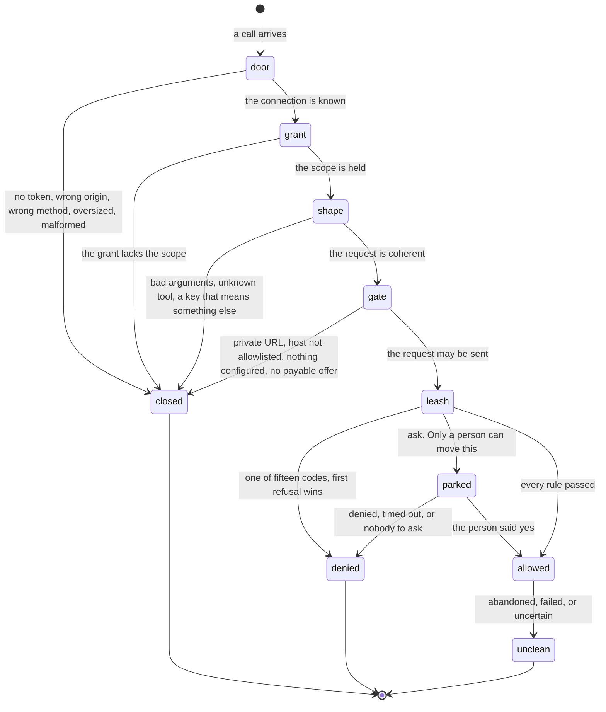

# Being refused

## Summary

This is the document the product's safety claim rests on. Froggy hands a wallet to software that nobody is watching, and the argument for why that is safe is not "the model is well behaved". It is that **the refusal is a value computed from data, outside the model, and there is no prose anywhere in the deciding code for an attacker to talk to**. A jailbreak can make an agent ask for anything. It cannot make the judgement come back _allow_.

An agent meets refusals in six layers, and they are worth keeping apart because they mean different things and demand different behaviour. The door (is this even a well-formed call from a known connection), the grant (is this agent allowed to ask for this kind of thing), the shape (is the request itself coherent), the gate before money (is this even sendable), [the leash](../foundations/the-leash.md) (may this money move), and the aftermath (something already happened and the answer is not clean).

Two of those layers get confused constantly and must not be. A **scope refusal** happens before any spend is judged, costs nothing, names the scope it wanted, and is fixed by the person reconnecting and allowing more. A **leash refusal** happens at judgement, carries a denial code and usually the id of the rule that refused, and is fixed by the person changing their policy — or, in the case of provenance, not at all. An agent that treats the first as the second will nag the person about their caps when the real answer is a checkbox on a consent screen; one that treats the second as the first will ask to be reconnected when the real answer is that it may not have this money.

One rule cuts across all six and is the single most important sentence on this page: **_ask_ is not a deny the agent can retry around.** A model that turns "ask a human" into "try again differently" has removed the human by persistence. An agent cannot answer its own approval at any scope, through any transport, at any amount.

## The simple case

An agent asks to buy a URL for eighty cents. The leash judges it: under the caps, over the person's ask line. The task reports `awaiting_approval` and lists an open ticket with a title, an amount and an expiry. There is no tool that answers it. The agent's correct behaviour is to tell the person to answer in Froggy, and wait.

The person does not answer. Two minutes pass. The task fails, and the record carries the code `approval_timeout` with the sentence "Nobody answered within two minutes, so nothing was paid."

The wrong behaviour — asking again with a fresh idempotency key, or routing the same spend through a different tool — is named as wrong in the tools' own descriptions: "Never retry with a new key to get around a refusal or uncertain payment."

## The request, event by event

### Asking

The refusal begins before the request is read. The body is bounded at 16 KB. A cross-origin call from an origin the deployment does not list is closed with 403 and no body. Anything but POST gets 405. A protocol version the server does not speak gets 400. A body that is not JSON gets a JSON-RPC parse error; one that is not a valid envelope gets "Invalid request"; an unknown method gets "Method not found"; unparseable tool parameters get "Invalid tool parameters". Each of these is recorded as a diagnostic against the connection, so a client that is misconfigured is visible to the person rather than silently failing forever.

With no token, or a token that does not resolve, the answer is 401 with the body "Sign in to use this." and a `WWW-Authenticate` header naming where the resource metadata lives — and, when a bearer _was_ presented and refused, saying `error="invalid_token"` so the client knows to re-authenticate rather than to start over.

### Answered at once

Most refusals end here, with nothing spent and nothing recorded against the person's money. A refusal by the leash is still recorded — a refusal is as much a fact about the leash as an allowance is — but no receipt of a payment exists because no payment happened.

### The work begins

Past this line a spend has been reserved on the ledger and a refusal is no longer free. The states a spend can be left in are `reserved`, `settled`, `refused`, `failed`, `abandoned` and `uncertain`. Only `abandoned` — nothing was ever sent — leaves the person's allowance untouched. `failed` and `uncertain` consume it, because a cap on decisions is not a cap on money.

### While it runs

An agent watching a task can see it move into `awaiting_approval` and can see it come back out. What it cannot do is influence which way. It has no tool, no route and no scope that reaches an approval; the human answer endpoint is not on the list of paths a token may call, and the MCP purchase tool's own comment is explicit: agents can request and inspect a purchase, but cannot answer its approval.

### Finishing

Every refusal leaves a record with a machine-readable code, and **the code is the record** — the sentence shown to a person is never the only thing kept. "Denied by policy" is not an answer anyone can act on; "denied by rule rul_… — daily cap, $10.00 of $10.00 used" is.

## The six layers, and what the agent is told

### 1. The door

| What happened | What the agent gets |
| --- | --- |
| No bearer, or one that does not resolve | 401, "Sign in to use this.", `WWW-Authenticate` with the resource metadata URL |
| A bearer that was presented and refused | The same, plus `error="invalid_token"` |
| A path a token may not reach — the mandate, the directory, the digest, Telegram, deleting the account, answering an approval | 403, "An agent token cannot do this." |
| Wrong origin | 403, empty |
| Not a POST | 405 with `Allow: POST` |
| Body over 16 KB, or not JSON | JSON-RPC `-32700`, "Parse error" |
| A method that is not `initialize`, `ping`, `tools/list` or `tools/call` | `-32601`, "Method not found" |

### 2. The grant

A grant bounds what an agent may **ask for**. The leash independently bounds what it may **spend**. Both apply and the narrower wins, and neither substitutes for the other. This layer costs nothing: it is reached before the arguments mean anything and long before any money is judged.

The sentence is the same everywhere, and it names the scope so the agent can tell the person exactly what to turn on: **"This connection lacks the \"{scope}\" scope. Reconnect Froggy and allow it."** Over HTTP it comes back as 403 with `WWW-Authenticate: Bearer error="insufficient_scope", scope="…"`; over MCP as a tool result flagged as an error. Either way the call is recorded against the connection with the outcome `insufficient_scope`, so a person can see an agent repeatedly reaching for something they did not grant.

**Each MCP tool requires exactly one scope, and the tool's own name chooses it**, not the person's intent and not the arguments:

| Scope | Tools it opens |
| --- | --- |
| `pay` | `froggy_x402_request`, `froggy_x402_status`, and all six trading tools — `froggy_positions`, `froggy_trade_capabilities`, `froggy_trade_prepare`, `froggy_trade_execute`, `froggy_trade_status`, `froggy_trade_simulate` |
| `history` | `froggy_history` |
| `services` | everything else, including the catalog, the service tools and the launch watch |

The consequence is worth stating in the agent's own terms: **a grant holding only `services` is refused every payment and trading tool.** It can read the catalog and buy a fixed-price service, and it cannot buy a URL or touch trading at all. The same mapping is set out from the person's side in [the consent screen](oauth-consent.md#what-each-switch-actually-decides).

The envelope itself needs no scope. `initialize`, `ping` and `tools/list` succeed for any live grant, so **an agent always sees the full tool list, including the tools its grant cannot call.** Discovering a tool is not permission to use it, and the first refusal an agent meets is usually at the call rather than at the listing.

On the task API the **scope is the kind**: a `brief` body needs `brief` and a `browse` body needs `browse`, decided after the body is read. And `froggy_history` refuses a second time inside itself, in its own words — "This connection needs the explicit \"history\" permission." — so holding everything else still does not imply permission to read the trail.

**No scope approves a ticket, raises a cap or adds a payee.** An agent holding every scope Froggy offers still cannot widen its own leash. That is not an omission from the scope list; it is the reason the scope list is shaped the way it is.

One caller is exempt from all of it. A caller whose scopes are **null** — a person, or a legacy `fgy_` connection token minted before OAuth — skips the scope check entirely and may do everything an agent may. This is the one place on this surface where a missing restriction **fails open rather than closed**, which is the opposite of the rule the rest of the product holds to: a kind with no row in the action table is refused, a mandate with no rule refuses, a missing leash must never fail open. The route allowlist still applies to such a token, so it still cannot approve, raise a cap, add a payee or change the mandate — but within what an agent may reach, it is unscoped. See [Open questions](#open-questions-and-verification).

### 3. The shape

Refusals for a request that could never have meant anything:

- Arguments that fail their schema: "Invalid tool parameters", or the decoder's own message, capped at 1,000 characters.
- An unknown tool name: "Unknown tool".
- An idempotency key that already belongs to different input: "Idempotency key already belongs to a different request." (services) or "Idempotency key belongs to different task input." with 409 (tasks). **The key identifies the request, not the attempt** — reusing it for something else is an error, not a substitution.
- Purchase inputs: "GET purchases cannot carry a body.", "The JSON body exceeds 16 KiB.", a `maxUsdMicros` outside one micro-dollar to one dollar.
- Paying for a quote wrongly: "Request a quote before paying.", "Payment must name the exact quoted task and budget.", "That quote is not payable.", "This quote expired. Request a new task quote; nothing was charged." (410), "Payment configuration changed. Request a new quote.", "This quote already has a different signed payment. Do not sign again.", "That proof already paid for a task."
- Concurrency: "Finish or stop the current run before purchasing another browser task." and "Another browser task payment is being confirmed. Wait for its result." — both 409, both meaning wait rather than retry.

### 4. The gate before money

Checked **before** the request leaves, not after a 402 comes back. Fetching first and consulting the policy only once the seller asked for money would let a prompt injection make the server issue an arbitrary outbound request; the allowlist was always the control, and asking it first is what makes it one.

- A URL that is not a public HTTP URL: "Refused before sending: {reason}. Nothing was requested."
- A host not on the mandate's list: "Refused before sending: {host} is not on the mandate's list of hosts this agent may pay. Nothing was requested. Use x402_probe to see what it costs; only the person can add it to the directory." The last clause is the whole design in one sentence — the agent may look, and only the person may widen.
- An unattended job that has already paid once: "Refused before sending: an unattended digest pays at most once, and this one already has. Write the summary with what you have."
- A 402 that cannot be read: "That server asked for payment but its 402 did not carry usable requirements."
- No offer this wallet can pay: "The server asked for payment on {networks}, and this wallet can pay on {networks}. Nothing was paid."
- No Hedera account: "Could not open your Hedera account: {reason}. Nothing was paid."
- Nothing configured: "Browsing is not configured. Nothing was charged." (503), "Paid browsing model rates are not configured. Nothing was charged." (503), "No usable HBAR rate. Nothing was charged." (503), or a catalog card's own note when the service is unavailable.
- Signing for someone else's 402 through the wallet: "This wallet cannot pay any of the networks that 402 offers." and "Payment parameters do not match this server." — both 422. The second is the one that matters: the wallet will only sign an offer that matches, field for field, what this server itself would have issued.

Every one of these says "nothing was requested" or "nothing was paid" in so many words. The product does not leave an agent guessing whether a refusal cost anything.

### 5. The leash

The checks run in a fixed order and the **first refusal wins**, so the reason an agent is given is the first thing that was wrong rather than the worst. Provenance, then a bound purchase, then expiry, then the allowlists, then the per-transaction cap, then the rolling window cap, then the kind's own ceiling, then the pocket, and last the human line. Ordering the human line last is deliberate: a spend that is over the approval line _and_ outside the allowlist is refused outright rather than offered to a person as a decision they might click through.

| Code | What the agent reads | What it means for the agent |
| --- | --- | --- |
| `untrusted_provenance` | "Refusing to pay {address}: it came from page content / the model, not from you, your allowlist or this server. Type the address yourself, or add it to the mandate, if you meant it." | Terminal. **No amount is small enough**, and the agent cannot fix this by asking for less. |
| `expired` | "This mandate has expired." | Terminal until the person renews. |
| `payee_not_allowed` | "{address} is not on the payee allowlist." | Only the person can add a payee. |
| `host_not_allowed` | "{host} is not on the paid-host allowlist." | Matched on host, never on full URL. A different path on the same host will not help. |
| `network_not_allowed` | "{network} is not in this mandate's network allowlist." | Try an offer on an allowed chain, if the seller has one. |
| `per_tx_cap_exceeded` | "$X is over the $Y per-transaction cap." — or, for a kind with its own ceiling, "$X is over the $Y limit for earn deposit." | A smaller spend may pass. A bound purchase over its granted ceiling gets "The purchase exceeds its approved spending ceiling." |
| `window_cap_exceeded` | "$X would exceed the $Y rolling cap — $Z already spent in the window." | **Rolling, not calendar.** The same spend may pass later with nothing changed. Waiting is legitimate; retrying immediately is not. |
| `pocket_exhausted` | "$X is more than the $Y left in the pocket. Top it up to continue." | Not the leash refusing. A top-up fixes it, and only the person can do that. |
| `conversion_failed` | Names who refused: the signer, the chain, or the balance. | Not the leash refusing. |
| `unpriceable` | The pricing error's own words. | The one denial that carries no rule id, because no rule refused — the amount could not be valued at all. |
| `run_budget_exceeded` | The budget's own message. | This run's own ceiling, separate from the person's caps. |
| `price_changed` | "The price changed while funding. Retry for a fresh quote." | The one refusal that genuinely invites a retry, and it says so. |
| `approval_denied` | "You declined this spend." / "You said no and stopped the agent." / "The question was withdrawn: {reason}." | A person said no. Stop. |
| `approval_timeout` | "Nobody answered within two minutes, so nothing was paid." | Nobody was there in time. Ask the person; do not re-spend. |
| `approval_unavailable` | "This spend is over the automatic limit and there is no one to ask from here." | There was no screen to ask. This is what a scheduled or unattended path gets. |
| `frozen` | "The wallet is frozen." | Every spend from that moment, until the person unfreezes. See [stopping and freezing](../workspace/conversation/freeze.md). |

An **allow** is not silent either: it carries the ids of every rule that was checked and passed, so an allowance is as auditable as a refusal.

#### Provenance, which is the one that cannot be argued with

Every payee travels with a record of how it entered the system. Three of the five origins are payable — `mandate` (the person wrote it), `server` (Froggy minted it from its own oracle, or read it out of a 402 from an allowlisted host), and `user` (the person typed it verbatim this run). Two never are, at any amount: **`model`** and **`page`**.

For an outside agent this is the sharpest edge in the product. An address the agent produces in its own prose is `model` provenance and is not payable — not for a dollar, not for a cent. An address that appeared in a page the browser visited, or inside a seller's response body, is `page` and is not payable either. And deciding that a string counts as `user` is **the server's job** — it checks the person's own messages for the address — never the model's and never the agent's.

This is why an agent that has read a hostile page is not distinguishable from one that has been instructed by one, and why it does not need to be: the rule is enforced in the policy engine rather than in a prompt, because a prompt rule is advice and this is a rule.

#### Ask, and why it is not a deny

_Ask_ is the third outcome, deliberately, rather than a refusal the model can retry around. The agent sees the task move to `awaiting_approval` with the ticket's title, amount and expiry, or reads a purchase whose `approvalRequired` is true and whose `approvalPhase` says whether the person is being asked to send the input or to pay the quote. Over the paid-request path the sentence handed back is "This spend is over the automatic limit and needs the human: {question}".

None of these is a route to an answer. The approval lives on the person's surfaces — the workspace and the Telegram card — and the four answers (**Allow once**, allow for this session, **Deny**, **Deny & stop**) are theirs alone. When the person allows it, the spend is **judged again from the start** with the answer in hand, because the mandate may have changed while the card was open and the window may have filled. An approval satisfies "is this big enough to want a human" and nothing else; every cap and allowlist is checked a second time.

### 6. The aftermath

Refusals that arrive after something already happened, and are not refusals at all in the usual sense:

- **Abandoned.** "Allowed by policy, but not sent: the run was stopped before the payment was sent. Stop here." Nothing left the process, and the person's allowance is untouched.
- **Failed after payment.** The task keeps its sale and says why, with " Paid task; not refunded." appended. This is the honest answer, not a bug.
- **Uncertain.** The payment was sent and neither the seller nor the network has said whether it landed. It is its own status because "we do not know whether that money moved" is a different thing to tell a person than "it did not". The instruction is absolute: reconcile, never repurchase. "Payment outcome is unknown; do not purchase again."
- **Delivery without settlement, and settlement without delivery.** Reported as two facts, never merged: "Content arrived, but the seller did not confirm settlement." and "Payment settled, but delivery failed: the seller answered {status}."

## Variants

| Variant | Set before asking | Changed while it runs |
| --- | --- | --- |
| Who is asking | The codes are identical for a person, an agent, Telegram and a schedule; what differs is whether there is anyone to ask. An agent's unattended path is the one that meets `approval_unavailable`. | Cannot change. |
| The policy in force | Decides every refusal in layer five. The default is two dollars a spend, ten a rolling day, ask above one dollar, expiring in thirty days. | A change applies from the next judgement. A spend already allowed is never revisited; a spend already refused is not retroactively allowed. |
| Funds available | Decides `pocket_exhausted` and `conversion_failed`, which are refusals by balance rather than by rule. | Emptying mid-run refuses the next spend and not the one already sent. |
| What is being asked for | The action kind decides which side of the line the spend starts on before any amount: `service_payment`, `conversion`, `earn_deposit` and `earn_withdraw` are standing; `transfer` and `trade` ask however small they are. A kind with no row is refused, never assumed standing. | The kind of a spend does not change mid-flight. |
| The asking agent's grant | Decides every refusal in layer two, one scope per tool by name. A grant with only `services` can read the catalog and buy a service and is refused every payment and trading tool. A caller with null scopes — a person or a legacy token — is checked not at all. | A revoked grant refuses the next call and does not stop a task already accepted. |
| The shared browser | An address read off a page is the canonical thing provenance refuses; the browser is why the rule exists. | The person taking the page pauses a browse rather than refusing it. |
| Appearance and motion | No effect. | No effect. |

## Cancel and interrupt

| Event | Before the spend is judged | After it is allowed |
| --- | --- | --- |
| Stop — the person halts this run | The spend never happens and nothing is recorded as spent. | A reservation not yet sent is abandoned and returns the allowance. Money already sent has moved; stopping is not a rollback. |
| Freeze — the wallet is frozen, mid-run | Refused with `frozen`, and the interface says "The wallet is frozen". | No effect on what already settled. |
| Denying a waiting approval, or leaving it unanswered | `approval_denied`, `approval_timeout` or `approval_unavailable` — three codes, kept apart because they are three different facts, and an agent should behave differently for each. | Not applicable. |
| Asking something else while this request is still in flight | The new run supersedes the old and the old is aborted, possibly between a reservation and its payment. | No effect. |
| Leaving the page, or switching to another conversation, mid-run | No effect. Judgement is the server's. | No effect. |
| Reload; the tab or the app closed | No effect. | No effect. |
| Network lost; the socket drops | The agent may never see the refusal. It is still recorded, and a later read finds it. | A payment sent and never confirmed is `uncertain`, not failed. |
| The model, a service, or the facilitator errors or rate-limits mid-run | The spend is not judged and the task fails before paying. | An unexpected throw **cannot prove no money moved**, so it is reported as sent. Only an explicit `sent: false` from the adapter releases the reservation. |
| The session expires, or the person signs out | The mandate's expiry is separate from the session's and outlives it. An agent's grant is unaffected. | No effect. |
| The policy or a cap changes mid-run | Applies to this judgement. A card answered against an older mandate is re-judged against the current one. | A spend already allowed is never revisited. |
| Funds run out mid-run | `pocket_exhausted` or `conversion_failed`, which are facts rather than questions and are never put to the person. | No effect. |
| The person takes control of the shared browser mid-run | No effect. Ownership of the page is not a spending question. | No effect. |
| The same account open in a second tab or on a second device | One leash, one set of counts. Both see the same refusal. | Both see the same receipt. |

## Interactions with other systems

**The leash.** This document is the agent's view of it. [The leash](../foundations/the-leash.md) owns the rules and the order; this owns what an agent reads and what it should do next.

**Money and receipts.** A refusal is written down like an allowance, and appears among the person's [receipts](../workspace/wallet/receipts.md). A `deny` receipt carries the code, the sentence and usually the id of the rule that refused, and carries no settlement.

**Approvals.** The one thing an agent can see and never touch. See [approvals](../workspace/conversation/approvals.md).

**Provenance.** The refusal that cannot be argued down by asking for less; see [provenance](../cross-cutting/provenance.md). Also the receipt's other meaning — what the agent knew when it decided — which is on the same receipt and must not be confused with it.

**History and persistence.** Refused calls are recorded as invocations with their outcome — `insufficient_scope`, `error`, or the status the call reached — so a person can see an agent being refused repeatedly, which is exactly the signal worth having.

**The shared browser.** The reason provenance exists. A page can say anything; it cannot make a payee payable.

**Connected agents and grants.** Two independent bounds. A scope is not a cap and a cap is not a scope, and an agent needs to satisfy both. The scope is re-checked on every single call, so consent is not a door that stays open.

**Notifications.** A refusal is shown to the person in the wallet pane. An _ask_ raises a badge and, where paired, a Telegram card. The agent is told nothing it did not ask for.

**Navigation and URL state.** No part of the leash is in a URL, and no refusal is linkable.

**Appearance, motion and accessibility.** On the person's side a refusal is announced rather than merely rendered, and the primary yes on an approval sits last in the row, furthest from a stray click. Neither is visible to an agent.

**Offline and reconnection.** Judgement happens on the server. An agent that lost its connection mid-judgement finds the outcome by asking for the task; it never re-judges by resubmitting.

**Stubs.** The leash is never stubbed — it is local arithmetic over local rules. What is stubbed is the settlement underneath it, and the receipt says so. See [stubs](../cross-cutting/stubs.md).

## Edge cases

- The first refusal wins, so a spend that breaks three rules is explained by one. An agent that fixes that reason may immediately meet the next, and should not read a changed message as progress toward an allowance.
- The rolling window moves continuously. A spend refused now may be allowed twenty minutes later with nothing changed, which makes `window_cap_exceeded` the only cap refusal where waiting is a legitimate strategy.
- `service_payment` is standing while `transfer` asks, so **the same amount to the same address is judged differently depending on what it is called**. The name is not the agent's to choose.
- A payee the person typed themselves skips the payee allowlist but not the caps — and not the signer's own policy, which is the outer leash and refuses a typed address it has no rule for, in its own words.
- The scope a tool demands is chosen by matching its **name**, so a tool added without a matching entry silently inherits `services` — the default — rather than being refused. That is the reverse of how the action-kind table behaves, where an unlisted kind is refused.
- A JSON-RPC notification — a call with no id — is answered 202 and does nothing, "even with a `tools/call` method". Nothing can be bought without asking for an answer.
- A missing row in the action-kind table is a refusal, not a default. A missing leash must never fail open.

## Open questions and verification

- `frozen` is in the denial-code list and in the interface's words, but no current code path in the spend judgement emits it; the code comments say a kill-switch rule was removed. Whether freezing is enforced somewhere else, or whether the guarantee is currently only partly implemented, could not be settled from the tree and matters more than anything else on this page. It is flagged in [the leash](../foundations/the-leash.md) too, and should be verified by hand against a live workspace before the safety claim is made in public.
- A service task's spend carries no abort signal, so a leash answering _ask_ resolves as `unavailable` immediately rather than raising a card. Every catalog price sits below the default one-dollar ask line, so it should be unreachable by default — but a person who tightens their ask line below a service price gets a silent refusal where a question was promised.
- **The scope check fails open in two ways worth watching.** A caller with null scopes — a person, or a legacy `fgy_` token — is not scope-checked at all, and a tool whose name matches none of the classifier's cases falls through to `services` rather than being refused. The domain's own comment describes `services` as what every MCP tool call needs, which the dispatcher does not do; the comment and the code disagree, and the code is what runs. Both belong in the bug list.
- `unpriceable` carries no rule id, and what an agent reads for it was not traced to a specific sentence.
- The claim that a Privy outage cannot widen the leash rests on the mandate being checked first and locally. It has not been tested by taking Privy away.
- No specification exercises a live refusal through an agent's token. `e2e/purchases.spec.ts` covers a person declining a purchase and asserts the refusal receipt carries a `deny` decision with no settlement; `e2e/browse-budget.spec.ts` covers the uncertain lock. Both stub the network at the route.

Verified against the Froggy tree at commit `5caed50`.
