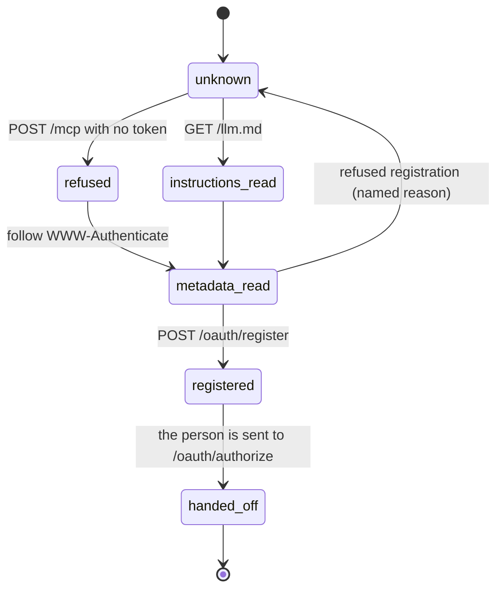

# Discovery

## Summary

Discovery is everything an outside agent can learn about a Froggy workspace before anyone has let it in. It is a short list and it is all readable with `curl`: a refusal that says where to look next, two metadata documents, a registration endpoint, three copies of the same prose instructions, the CLI itself, a service card, and a health report. Nothing here costs anything, nothing here is judged by [the leash](../foundations/the-leash.md), and — this is the part that surprises — **nothing here is recorded**. The person whose workspace it is cannot see that an agent looked.

The one thing an agent may _write_ before it has permission is its own name. Registration creates a client row; that row's name is what the person will read on the consent screen. Everything else in this document is a read.

## The simple case

An agent is handed one sentence by the person: _"Read `https://froggy.example/llm.md` and follow it to connect yourself to my Froggy wallet as an MCP server; then tell me what you can do."_ That sentence is what **Copy for your agent** puts on the clipboard — see [connecting an agent](../workspace/connections/connecting-an-agent.md).

The agent fetches `/llm.md`, gets a page of Markdown with this deployment's own origin substituted into every command, and follows the first of the three ways in it names.

An agent that was given only the MCP URL discovers the rest by being refused. It posts to `/mcp` with no credential and gets a 401 whose `WWW-Authenticate` header names the resource metadata; the metadata names the authorization server; the authorization server's metadata names where to register and where to send the person. Three round trips, no human involved, and at the end of it the agent has a `client_id` and a link to hand over.

## The request, event by event

### Asking

There is nothing to ask. Every document in this phase is a `GET` with no credential, and the server answers the same way to an agent, a person's browser, and a stranger.

The exception is `POST /oauth/register`, which reads a body: `redirect_uris` (between one and ten) and optionally `client_name`. The body is capped at 8 KB.

### Answered at once

Most of discovery ends here, because most of it is one request and one answer.

The refusal at `/mcp` is the load-bearing one. With no bearer, or with one that does not resolve, it is `401` with the body `{"error":"Sign in to use this."}` and the header `WWW-Authenticate: Bearer resource_metadata="<origin>/.well-known/oauth-protected-resource/mcp"`. When a bearer _was_ presented and refused, `error="invalid_token"` is appended. **The two cases are otherwise identical**: an agent holding a wrong token learns nothing about whether the workspace exists, who owns it, or what is in it.

Registration is refused in the RFC's own shape, with a sentence that says what to do instead:

| What was wrong | What comes back |
| --- | --- |
| Unreadable body, or none | `invalid_client_metadata` — "Send {redirect_uris: [...]} and optionally client_name." |
| No redirect URIs, or more than ten | `invalid_redirect_uri` — "Register between 1 and 10 redirect URIs." |
| A redirect URI that is not allowed | `invalid_redirect_uri` — "{uri} is not allowed: use https, http on a loopback host, or {origin}/oauth/manual." |
| A client claiming a secret | `invalid_client_metadata` — "Only public clients: token_endpoint_auth_method must be none." |

### The work begins

A successful registration is `201` with a `client_id`, the name as it was stored, and the fixed capabilities every client here has: `authorization_code` and `refresh_token`, `response_types: ["code"]`, `token_endpoint_auth_method: "none"`.

The name is the agent's introduction to the person. It is trimmed, capped at eighty characters, and becomes "MCP client" when empty. It is stored verbatim and shown verbatim on [the consent screen](oauth-consent.md).

Nothing else happens. No person is told, no notification is raised, nothing appears in **Connections**. A client is not a [grant](../foundations/identity-and-agents.md); until a person clicks Allow, the row is inert.

### While it runs

There is no "while". Every step is a single request.

### Finishing

Discovery ends when the agent has a `client_id`, a PKCE challenge of its own, and an `/oauth/authorize` URL to give the person. What happens next belongs to [the consent screen](oauth-consent.md).

## What is readable without permission

| Path | What it says |
| --- | --- |
| `/.well-known/oauth-protected-resource` and `/.well-known/oauth-protected-resource/mcp` | That the protected resource is `<origin>/mcp`, that its authorization server is this same origin, that bearers go in the header, and the five scopes: `brief`, `browse`, `pay`, `services`, `history`. Cached publicly for five minutes. |
| `/.well-known/oauth-authorization-server` | Where to authorize, register, get a token, and revoke one; that **PKCE S256 is the only challenge method**; that there are no client secrets; that the issuer is named on every redirect. Cached five minutes. |
| `/llm.md` | The instructions, as prose, with this deployment's origin in every command. |
| `/skill.md` | The same text with a two-line front matter naming the skill. |
| `/froggy/SKILL.md` | Byte-identical to `/skill.md`, kept so an older instruction still resolves. |
| `/froggy-cli.js` | The CLI, bundled from the server's own source on first request and cached five minutes. |
| `/.well-known/x402.json` | What this workspace _sells_: the lending oracle, its price, its network, who to pay, the facilitator, and the Hedera Consensus Service topic its settlements are noted on — or `null` when there is none. |
| `/health` | `status: "ok"`, the runtime, and **which integrations are stubbed**: browser, database, graph, hedera, model, privy, telegram, plus the five trading routes and whether people get their own Hedera accounts or pay from the host pocket. |
| `/demo/x402` | A free landing page for the seller an agent can rehearse a purchase against. |

The prose is worth reading as experience rather than as documentation, because it is the only thing in Froggy that speaks to an agent in sentences. It tells the agent it holds no key. It names three ways in, in order of preference — MCP by URL, the signed-in CLI, and last a token the person minted. It says "Setup is not permission to buy a task." And it closes with the rule the rest of the product enforces: "The person can take the page, stop the run, or disconnect you at any moment. That is the product, not an error."

> Technical note: CORS is `*` on the metadata, registration, token and revocation endpoints and nowhere else. `/mcp` itself refuses a cross-origin browser call, so a browser-based MCP client can discover Froggy completely and never reach it.

## Variants

| Variant | Set before asking | Changed while it runs |
| --- | --- | --- |
| Who is asking | No effect. A connected agent, a person's browser and a stranger get identical bytes from every path in this document. Only `/mcp` distinguishes them, and only by refusing. | No effect. |
| The policy in force | No effect. Nothing here spends, so no rule is consulted and a frozen wallet is indistinguishable from a funded one. | No effect. |
| Funds available | No effect. Nothing here reads a balance. | No effect. |
| What is being asked for | Decides which document answers, and nothing more. The metadata is the same whether the agent means to buy a brief or read history. | No effect. |
| The asking agent's grant | No effect — this is the phase before there is one. **`scopes_supported` always lists all five**, never the ones a holder was granted, so an agent cannot learn its own scopes from the metadata. | No effect. |
| The shared browser | No effect. | No effect. |
| Appearance and motion | No effect. Nothing here has a screen: Markdown, JSON and JavaScript. | No effect. |

## Cancel and interrupt

| Event | Before registration | After registration |
| --- | --- | --- |
| Stop — the person halts this run | No effect. Discovery is not a run and there is nothing to stop. | No effect. |
| Freeze — the wallet is frozen, mid-run | No effect. Every document answers normally while the wallet is frozen. | No effect. The refusal comes later, at the spend. |
| Denying a waiting approval, or leaving it unanswered | No effect. Nothing here raises an approval. | No effect. |
| Asking something else while this request is still in flight | No effect. Each request is independent and none holds state. | No effect. |
| Leaving the page, or switching to another conversation, mid-run | No effect. The person is not involved. | No effect. |
| Reload; the tab or the app closed | No effect. | No effect. The client row outlives every process on both sides. |
| Network lost; the socket drops | The fetch fails; the agent retries. Nothing was created. | The client row stands. A repeat registration creates a second one. |
| The model, a service, or the facilitator errors or rate-limits mid-run | No effect. None of them is involved. | No effect. |
| The session expires, or the person signs out | No effect. None of these paths needs a person signed in. | No effect. |
| The policy or a cap changes mid-run | No effect. Scopes and caps are separate mechanisms. | No effect. |
| Funds run out mid-run | No effect. | No effect. |
| The person takes control of the shared browser mid-run | No effect. | No effect. |
| The same account open in a second tab or on a second device | No effect. | No effect. |

Every row above is "no effect" for the same reason: until a person clicks Allow there is no run, no grant and no money, and so nothing an interrupt could reach.

## Interactions with other systems

**The leash.** None. No rule is evaluated, no decision is recorded, and the metadata says nothing about caps, allowlists or thresholds — an agent cannot learn the person's spending rules before it is admitted, and cannot learn them afterwards either.

**Money and receipts.** Nothing costs anything. The only money in this phase is the price of what this workspace _sells_, published in the service card at `/.well-known/x402.json` for a buyer who has not paid yet.

**Approvals.** None raised, ever.

**Provenance.** The service card names the Hedera Consensus Service topic settlements are noted on, which is the only provenance visible without a credential — and it is a claim about where to look, not evidence itself. See [provenance](../cross-cutting/provenance.md).

**History and persistence.** Nothing is recorded. The invocation trail needs a resolved caller, and there is none here, so an agent that probes every path in this document leaves no trace in **Connections**. A registered client persists, but is not shown to the person until it holds a grant.

**The shared browser.** No interaction.

**Connected agents and grants.** Registration creates a client, not a grant. The two are different rows and only the second one is a connection.

**Notifications.** None. No badge, no Telegram message, no digest line. A person is told when an agent asks for consent, never when one looks.

**Navigation and URL state.** `/oauth/authorize` and `/oauth/manual` are pages in the app, not API endpoints; the server does not route them and they fall through to the app shell like any other route. See [navigation](../foundations/navigation.md).

**Appearance, motion and accessibility.** Not applicable to a Markdown or JSON response. The single rendered thing in this phase is the app shell served as a fallback.

**Offline and reconnection.** No socket. Every request stands alone.

**Stubs.** `/health` is the one place an outside agent can find out that a build is stubbed **before** it spends anything: each integration reports `live` or `stub`. An agent that skips it can still tell afterwards, because every stubbed result carries `stubbed: true` in the data. See [stubs](../cross-cutting/stubs.md).

## Edge cases

- **There are almost no 404s.** Any unmatched path below the API falls through to the app shell with status `200` and an HTML body. An agent probing for endpoints gets HTML and a success code, not a refusal. Only `/api/*` returns a real `{"error":"Not found."}`, and only to a caller that authenticated first.
- `GET` on `/oauth/register`, `/oauth/token` or `/oauth/revoke` is `405` with `allow: POST, OPTIONS`; `POST` on either metadata path is `405` with `allow: GET, OPTIONS`; `OPTIONS` on any of the six public paths is `204` with the CORS headers.
- A redirect URI containing a fragment is refused whatever else is right about it.
- The only non-`https`, non-loopback redirect a client may register is exactly this server's own `/oauth/manual`. A different Froggy's manual page will not do.
- A client name longer than eighty characters is silently truncated rather than refused, so a name can be cut mid-word on the consent screen.
- Two clients may register the same name. Nothing dedupes them and nothing marks the second one.
- `/froggy-cli.js` is built on demand and memoised in the process. The first request after a deploy pays the build; if the build fails the response is `500 {"error":"The CLI could not be built."}` and the next request tries again from scratch.
- The metadata lists the five scopes but nothing about which of them any given tool needs. That mapping exists only in the dispatcher, so an agent that reads every public document still cannot work out in advance which scope to ask for; the [consent screen](oauth-consent.md) sets out what the mapping actually is.
- Froggy's own CLI does not use the discovery chain Froggy publishes: it fetches `/.well-known/oauth-authorization-server` directly and never sees the 401 or the resource metadata. See [`froggy login`](froggy-login.md).
- `/llm.md`, `/skill.md` and `/froggy/SKILL.md` carry no cache-control header, unlike the metadata and the CLI beside them.

## Open questions and verification

- **Registration appears to be unauthenticated and unrated.** Nothing in the OAuth file limits how many clients one caller may create, and nothing prunes clients that never earn a grant. A workspace's client table can be grown by anyone who can reach the origin. Worth treating as a defect, or at least as a decision that should be written down.
- Whether an unclaimed client row is ever visible to the person, or garbage-collected, was not established.
- The name a client registers is attacker-chosen text rendered verbatim to a person on the consent screen. Whether that is considered acceptable is a decision this document could not find recorded; it is raised again in [the consent screen](oauth-consent.md).
- The 401 body says "Sign in to use this." to a caller that is a piece of software with nowhere to sign in. The `WWW-Authenticate` header does the real work; the sentence is written for a person. Not obviously wrong, but not written for its reader.
- `/health` reports modes but not the origin, the version, or the commit, so an agent cannot tell two deployments apart from it.
- Only `e2e/agent-docs.spec.ts` exercises this surface, and it checks one thing: that all three prose documents carry the deployment's own origin, share content, and never leak the placeholder. Nothing exercises the 401 chain end to end from an unauthenticated client; the metadata and registration refusals are unit-tested in `apps/server/src/oauth.test.ts` rather than observed.
- The claim that nothing in this phase is recorded is read from the fact that the invocation trail requires a resolved caller. It has not been confirmed by watching **Connections** while probing.

Verified against the Froggy tree at commit `5caed50`.
