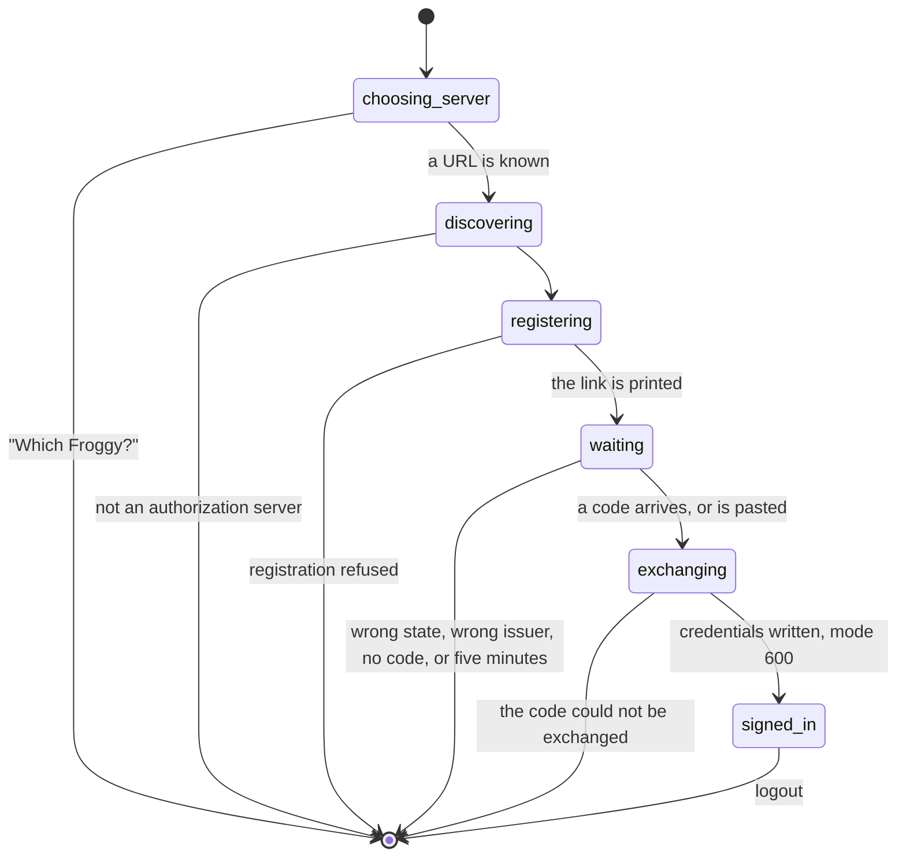

# `froggy login` and `froggy logout`

## Summary

`froggy` is a single-file command an agent downloads from the server it is about to talk to. `login` signs it in the way any MCP client signs in — the same registration, the same [consent screen](oauth-consent.md), the same code and PKCE exchange — and leaves short-lived tokens in a file it refreshes on its own. `logout` revokes them and forgets them.

The point of it is what the CLI never holds: a key. The agent gets a bearer bound to one person's workspace and the scopes they left on, expiring in an hour and rotating every time it is renewed. Its refusals come back in the wallet's own words and the command exits non-zero. Nothing here decides money.

There are two shapes of `login`. With a browser, the CLI opens one and listens on a loopback port. Without one — a container, a shell over SSH — `--manual` prints a link and asks the agent to paste back the code the person copies off [the manual page](oauth-consent.md#the-manual-code-path).

## The simple case

```sh
curl -fsSL https://froggy.example/froggy-cli.js -o ~/froggy.mjs
node ~/froggy.mjs login --url=https://froggy.example
```

The CLI prints, to standard error:

> Open this link and click Allow:
>
> `https://froggy.example/oauth/authorize?response_type=code&client_id=…`

then tries to open the person's desktop browser and waits. The person clicks **Allow**. Their browser lands on the loopback listener, which answers with one line — "Signed in to Froggy. You can close this window." — and the CLI finishes:

> Signed in to https://froggy.example. Credentials: /home/…/.config/froggy/credentials.json

With `--manual` there is no listener and no browser. The link is printed, the person opens it themselves, and the CLI prompts on standard output: "Paste the code the page shows: ".

## The request, event by event



### Asking

Which Froggy: `--url`, else `FROGGY_URL`, else the URL inside a stored credential. With none of them: "Which Froggy? froggy login --url=https://your-froggy.example".

Then discovery, which goes straight to `/.well-known/oauth-authorization-server` — the CLI does not use the 401 chain Froggy publishes for other clients (see [discovery](discovery.md)). A server that does not answer it: "{url} does not describe an authorization server ({status}). Is that the Froggy URL?" One that answers something unreadable: "{url} answered metadata this CLI cannot read."

Then a client. If a credential is already stored for this same URL, its `client_id` is reused; otherwise the CLI registers a fresh one named **`froggy CLI on {hostname}`** — which is the name the person will read on the consent screen — with both return addresses at once: `http://127.0.0.1/callback` and `{url}/oauth/manual`. One registration therefore covers both modes, because a loopback redirect may use any port.

Then the request itself: a fresh verifier and its S256 challenge, a random `state`, the resource pinned to `{url}/mcp`, and the scopes **`brief browse pay services`**.

That is four scopes, not five. **`history` is never asked for by the CLI**, so a person consenting to a CLI login sees four switches and cannot grant it there at all.

The four it does ask for cover everything else the tool surface offers: `pay` is what the purchase and trading tools need, and `services` is the default every remaining tool falls back to. See [the consent screen](oauth-consent.md#what-each-switch-actually-decides) for which switch turns on what.

### Answered at once

Everything above fails before anything is written to disk, before a browser is opened, and before a person is involved. Each failure is one sentence on standard error and exit 1: a missing URL, a server that is not one, unreadable metadata, "Froggy refused to register this CLI: {reason}", or "Froggy registered the CLI without a client id."

### The work begins

The link is printed and, in loopback mode, the browser is opened. Nothing is spent — `login` never touches money and [the leash](../foundations/the-leash.md) never sees it — but this is the line after which a client row exists on the person's side, and after **Allow** a grant does too, whether or not the CLI ever returns for it.

A browser that refuses to open is deliberately not an error. The link has already been printed, and somebody on another machine can open it.

### While it runs

In loopback mode the CLI holds one listener on a free port on `127.0.0.1`, answering exactly `/callback` and 404 to anything else. It judges what arrives in three steps, and each has a sentence for the browser tab and a different one for the terminal:

| What arrived | The tab shows | The terminal says |
| --- | --- | --- |
| Another `state` | "This sign-in did not start here. Close this window." | "The callback carried another state." |
| An `iss` that is not the server signed in to | "This answer came from somewhere else. Close this window." | "The callback was not from the server you signed in to." |
| No code | "Froggy did not sign you in. Close this window." | "Froggy answered access_denied." (or whatever error came back) |
| A code | "Signed in to Froggy. You can close this window." | — |

The wait is capped at five minutes: "Nobody signed in within five minutes."

In manual mode there is no listener, no timer, and no cap. The prompt waits for a paste for as long as the process lives.

### Finishing

The code is exchanged at the token endpoint with the client id, the verifier, the exact return address and the resource. A failure — a code pasted twice, or one older than ten minutes — is "Froggy did not exchange the code: {error}: {description}".

On success the CLI writes `~/.config/froggy/credentials.json`: the access token, the refresh token, when the access token expires, the client id, the token and revocation endpoints, and the URL. The directory is created at `700`, the file is written to a random temporary name at `600` and renamed into place, so a half-written file never replaces a good one.

Every message `login` prints goes to standard error. Standard output stays clean, which is what makes `--json` on later commands usable in a pipeline.

## Living with a sign-in

Later commands refresh on their own: once when the access token is within a minute of expiring, and once more if a request comes back 401 anyway.

Rotation is serialised between processes with a lock directory beside the credential file, because **presenting a spent refresh token revokes the whole grant**. Under the lock the file is re-read; if a neighbouring process already rotated, that pair is used rather than burning the token again. A process that cannot take the lock within fifteen seconds says so and names the lock: "Another CLI process holds {lock}. If it stopped unexpectedly, remove that lock directory after confirming no Froggy command is running."

When a refresh fails the CLI says it twice, in two voices: "Could not refresh the sign-in ({reason}); run: froggy login", then "Sign-in refresh failed. Run: froggy login". When the file changed underneath: "The saved sign-in changed; run the command again."

`FROGGY_TOKEN` overrides all of it. A non-empty value is used as the bearer, no login is consulted, nothing is refreshed, and `logout` does not touch it. It is the token a person minted on the Agents page: every scope, no expiry until they disconnect it, and the path the instructions name **last**.

## Signing out

```sh
node ~/froggy.mjs logout
```

With nothing stored: "Not signed in." and a clean exit. Otherwise the refresh token is posted to the revocation endpoint, the file is deleted, and the CLI prints "Signed out of {url}."

Revoking any token of a grant revokes **the grant and every token under it**, so `logout` disconnects the whole connection rather than one session, and the access token stops working immediately. In **Connections** the row does not disappear: it gains a `revokedAt` timestamp, and everything the CLI did stays attributable.

If the server cannot be reached the file is deleted anyway. The tokens are then still live — up to an hour for the access token — and the person's only way to end them is to disconnect the agent themselves.

## Variants

| Variant | Set before asking | Changed while it runs |
| --- | --- | --- |
| Who is asking | The agent runs the command; only the person can finish it. The consent screen is the same one a Claude Code or Cursor connection produces, and shows the CLI's own registered name. | Cannot change. |
| The policy in force | No effect. Signing in is not a spend, so no rule is consulted and a frozen wallet signs in normally. | No effect. |
| Funds available | No effect. `login` never reads a balance. | No effect. |
| What is being asked for | No effect on `login`, which always asks for the same four scopes. There is no flag to widen or narrow them. | No effect. |
| The asking agent's grant | A second `login` against the same URL reuses the registered client but earns a **new grant**; the previous one is not revoked. | Revoking a grant elsewhere leaves the stored credential in place until the next request fails. |
| The shared browser | No effect on `login`. `browse` is the scope `froggy ask` needs later; see [the shared browser](../foundations/the-shared-browser.md). | No effect. |
| Appearance and motion | No effect. This is terminal output. The only rendered thing the CLI itself produces is a single paragraph in the loopback tab. | No effect. |

## Cancel and interrupt

| Event | Before the code arrives | After it is exchanged |
| --- | --- | --- |
| Stop — the person halts this run | No effect. A login is not a run. Interrupting the process leaves no credential; a grant already issued stands. | No effect. |
| Freeze — the wallet is frozen, mid-run | No effect. Signing in works normally while frozen; the refusal comes at the first spend, with the code `frozen`. | No effect on the sign-in. |
| Denying a waiting approval, or leaving it unanswered | No effect. `login` raises no approval, and no scope it asks for lets the CLI answer one. | No effect. |
| Asking something else while this request is still in flight | No effect. A second command can run beside a login; the lock guards token rotation, not sign-in. | Two commands may race to refresh; the lock makes one of them wait and re-read. |
| Leaving the page, or switching to another conversation, mid-run | Closing the consent tab before **Allow** leaves the CLI waiting: five minutes in loopback mode, indefinitely with `--manual`. | No effect. |
| Reload; the tab or the app closed | Reloading the consent page rebuilds the same screen and the listener is still there. Closing the terminal ends the wait and abandons the client registration. | No effect. The credential file outlives every process. |
| Network lost; the socket drops | The token exchange gives up after ten seconds with a named reason. The metadata and registration fetches have no timeout and can hang with nothing printed. | Later commands fail on their own request; the credential is untouched and works when the network returns. |
| The model, a service, or the facilitator errors or rate-limits mid-run | No effect. None of them is involved in signing in. | No effect. |
| The session expires, or the person signs out | Froggy asks the person to sign in; the CLI sees only a redirect that does not come, and hits its five-minute limit. | No effect. A grant is not the person's browser session and outlives it. |
| The policy or a cap changes mid-run | No effect. Scopes and caps are separate. | No effect. |
| Funds run out mid-run | No effect. | No effect. |
| The person takes control of the shared browser mid-run | No effect. | No effect. |
| The same account open in a second tab or on a second device | Two consent screens for one link each issue their own grant. The CLI spends the first code it receives; the other grant is left live and unused. | Two machines running the same credential file are the case the rotation lock exists for; two machines with separate files hold separate grants. |

## Interactions with other systems

**The leash.** Untouched by `login`. What the CLI may later spend is bounded twice — by the scopes on the grant and by [the leash](../foundations/the-leash.md) — and the narrower wins.

**Money and receipts.** `login` and `logout` cost nothing and write no receipt. What the sign-in enables is paid work; a refusal from the wallet arrives at that point, in the wallet's words, and the command exits non-zero without charging anything.

**Approvals.** None raised. When a later task parks on one, the CLI prints "waiting for the person to answer: {title}" and "Approve in Froggy: the web workspace or the Telegram card." — it cannot answer, and there is no flag that makes it try.

**Provenance.** No interaction at sign-in.

**History and persistence.** The grant is durable; so is the invocation trail underneath it. The credential file is the only durable thing on the agent's side, and it holds no secret the server would accept after a `logout`.

**The shared browser.** Only through the `browse` scope the login asks for.

**Connected agents and grants.** A CLI login produces an ordinary grant, indistinguishable in **Connections** from one made by any other MCP client except by the name it registered. See [the agent list](../workspace/connections/the-agent-list.md).

**Notifications.** None. Neither a login nor a logout raises a badge, a Telegram message, or a digest line.

**Navigation and URL state.** The whole authorization request lives in the link the CLI prints, and it is the only URL state involved. The loopback address is a local one and cannot be shared.

**Appearance, motion and accessibility.** Terminal text, with the human-facing half on the consent and manual pages. The CLI's own rendered output is one sentence in a browser tab, unstyled.

**Offline and reconnection.** No socket. Everything is a request with an answer, and the only state kept between them is the file on disk.

**Stubs.** A stubbed build signs in identically; what is stubbed is what later spending settles against, and `/health` says which. See [stubs](../cross-cutting/stubs.md).

## Edge cases

- The CLI is served by the server it will talk to, so the URL in the instructions is that deployment's own origin and there is nothing to configure by hand.
- The authorize link is printed in loopback mode too, before the browser is opened, so a person working on a different machine is never stuck.
- A later command run with a `--url` that does not match the stored credential silently falls back to "Not signed in." rather than saying the URLs differ.
- The loopback listener answers 404 to any path but `/callback`, and closes as soon as the login ends either way.
- `logout` ignores `FROGGY_TOKEN` entirely: it reports on the stored credential, and a token-based agent cannot sign itself out.
- After a `logout` the credential file is gone, so the next `login` registers a **new** client rather than reusing the old one, leaving the previous client row orphaned on the server.
- The five-minute timer is unreferenced, so it never holds the process open past a successful sign-in.
- The credential file's mode is `600` and its directory `700`; the end-to-end spec asserts the file mode explicitly.
- The CLI bridges MCP over stdio for a client that cannot do OAuth itself — `froggy mcp` — which reuses the same credentials and the same refresh path, so a bridged client is held to the four scopes the login asked for.

## Open questions and verification

- **The CLI never asks for `history`.** It requests `brief browse pay services`, and `history` is the one scope the history tool needs, so `froggy_history` — documented in the CLI's own instructions — is unreachable from a CLI sign-in and the person is never offered the switch. Worth treating as a defect: either the scope list is wrong or the documentation is.
- A CLI login that is bridged over stdio for another MCP client hands that client the CLI's four scopes, not its own. A client that would have asked for `history` gets a connection that cannot have it, and the refusal it eventually reads names a scope nobody declined.
- **`--manual` has no timeout.** The loopback path gives up after five minutes; the manual prompt waits forever. An unattended agent that runs `login --manual` with nobody to paste a code hangs indefinitely.
- **Two fetches have no timeout.** The token exchange aborts after ten seconds, but the metadata and registration requests do not, so an unresponsive server hangs `login` with nothing printed after the first line.
- `logout` cannot tell whether it revoked anything: the revocation endpoint answers 200 whether or not it recognised the token, by design. A person who runs `logout` against an unreachable server is told "Signed out" while the tokens live on.
- Repeated `login` against the same URL accumulates grants. Nothing warns, nothing supersedes, and whether **Connections** shows several rows with the same name was not confirmed.
- Whether the stale lock sentence is ever seen in practice, and whether a crashed process reliably leaves the lock behind, was not tested.
- Whether `openBrowser` succeeds inside the containers this CLI was written for is unverified; the specs run it with an empty `PATH` precisely so it cannot.
- `e2e/oauth-cli.spec.ts` runs both shapes end to end: fetch the bundle, log in over loopback and manually, assert the file mode, force an expiry and watch both tokens rotate on the next command, then log out and confirm the file is gone and the access token is refused. It does not exercise a **Deny**, a wrong `state` or `iss`, the five-minute timeout, or a revoked-server logout.

Verified against the Froggy tree at commit `5caed50`.
