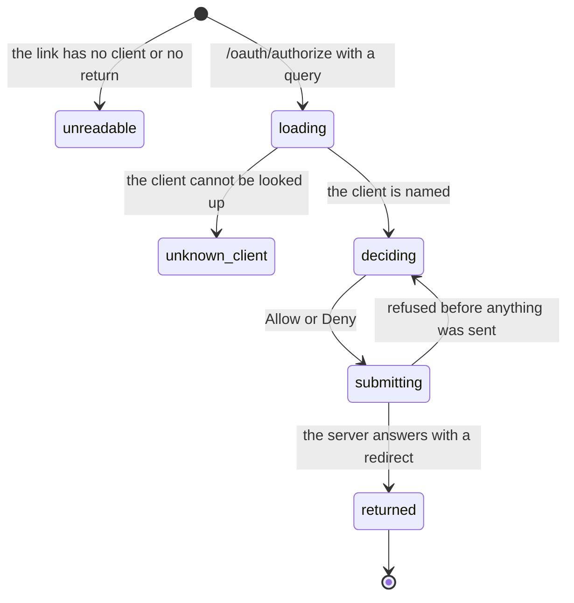

# The consent screen

## Summary

Consent is the one moment in the agent surface where a person is required. An agent has registered itself and built an authorization request; it now has to hand that request to a human and wait. The person lands on a single centred screen naming the agent, showing one switch per scope it asked for, and offering **Allow** and **Deny**.

Two things about the screen matter more than its layout. The first is what it cannot do: **no scope on it approves a ticket, raises a cap or adds a payee.** The person is deciding what an agent may _buy_, never what it may _change_ — see [identity and agents](../foundations/identity-and-agents.md). The second is where the decision is made: the page validates nothing. It relays the request to the server, the server checks the client, the redirect, the challenge and the scopes, and answers with the URL to go to. The page follows it. Nothing is redirected to that the server did not vet first.

There is a second screen for a client with no browser of its own: `/oauth/manual` shows the code for the person to carry back by hand.

## The simple case

The agent prints a link, or opens it. The person lands on **"{name} wants to use your Froggy wallet"** — the name the client gave when it registered — under a line saying "It returns to `{host}` once you decide."

Below that is a list, labelled _What it may do_, with one row per scope the client asked for. Each row is a title, a one-line detail, and a switch that starts **on**:

| Scope | Title | Detail |
| --- | --- | --- |
| `brief` | Buy lending briefs | $0.05 each, from The Graph. |
| `browse` | Browse on your shared Chrome | $0.50 per task, up to forty steps. |
| `pay` | Sign x402 payments | Pay a 402 from your wallet for a task the agent brings. |
| `services` | Buy services | Search, images, inference and speech at fixed prices. |
| `history` | Read this connection's activity | Inspect its recorded calls and results. Your private web and Telegram chats stay private. |

Then one sentence: "Your spending rules still apply. Disconnect any time on the Agents page." Then **Allow** and, beside it, **Deny**.

The person turns off anything they do not want and presses **Allow**. The button reads "Allowing…", the browser follows the redirect the server hands back, and the agent has its code.

The rows always appear in the order above — `brief`, `browse`, `pay`, `services`, `history` — whatever order the client asked in. Only what was asked for is offered; a client that named no scopes at all is offered all five.

### What each switch actually decides

The detail lines describe what an agent may buy. What they do not say is which of the agent's tools each switch turns on, and the answer is narrower than the screen implies: **every MCP tool call needs exactly one scope, chosen by the tool's name.**

| Scope left on | What it turns on over MCP |
| --- | --- |
| `pay` | Both purchase tools, and all six trading tools — including the two read-only ones, capabilities and positions. |
| `history` | Reading back this connection's own recorded calls. |
| `services` | **Everything else**, as the default when neither of the above matches: the catalog, buying a service, reading a service task, the named research tools, and the launch watch. |
| `brief`, `browse` | Nothing at the MCP surface. They are checked elsewhere, on the task the agent submits. |

A person who leaves only **Buy services** on is granting the whole default half of the tool surface. A person who turns it off but leaves **Sign x402 payments** on has granted the purchase and trading tools and nothing else. Neither reading is available from the screen, which describes purchases rather than tools.

A tool called without its scope is refused in one sentence — "This connection lacks the "{scope}" scope. Reconnect Froggy and allow it." — and the refusal is recorded as an invocation, so the person can see in **Connections** that an agent tried and was short a permission.

> Technical note: the envelope itself needs no scope. `initialize`, `ping` and `tools/list` succeed for any live grant, so an agent always sees the full tool list including the tools its grant cannot call.

## The request, event by event

### Asking

The screen is built from the query alone: `client_id`, `redirect_uri`, and optionally `scope`, `state`, `response_type`, `code_challenge`, `code_challenge_method` and `resource`. The page reads the client's name from the server under the **person's own** credential, not the agent's.

Only the _host_ of the return address is shown, in the machine typeface. Two clients returning to different paths on one host are indistinguishable on this screen.

### Answered at once

Three ways it ends before any decision is possible.

A link missing `client_id` or `redirect_uri` never renders a screen at all: "This link is missing the client or where to return to. Start again from your agent." — announced, not merely shown, and with no buttons anywhere.

A client the server cannot name disables both buttons and says: "Froggy doesn't know this client. Nothing was shared; close this tab and start again from your agent."

And **Allow with every switch off is a denial**, not an empty grant. The server treats a grant of nothing as `access_denied`.

### The work begins

Pressing either button posts the decision, the scopes left on, and the query as it arrived. Both buttons disable and the primary reads "Allowing…". This is the line: after it, either a grant exists or a refusal has been sent to the agent.

The server checks in a fixed order, and the first two refusals never leave the building:

1. An unknown client — "Unknown client."
2. A return address the client did not register — "The client asked to return somewhere it did not register."

> Technical note: those two are answered to the _person_, in the page, with no redirect at all. The code's own reason: "an unknown client or a redirect it did not register never receives a code or an error, only the person sees the refusal." An attacker who forges an authorization request learns nothing from the attempt.

Everything after that is answered as a redirect back to the client, always carrying the original `state` and this server's `iss`:

| What was wrong | What the agent receives |
| --- | --- |
| `response_type` was not `code` | `error=unsupported_response_type` |
| No PKCE S256 challenge of 43–128 characters | `error=invalid_request` |
| A `resource` naming something other than this server's `/mcp` | `error=invalid_target` |
| An unrecognised scope name, or one granted that was never asked for | `error=invalid_scope` |
| **Deny**, or nothing left on | `error=access_denied` |
| Nothing | `code=…` |

### While it runs

Nothing streams and nothing waits. The decision is one request and the page is gone.

### Finishing

A grant is created at the moment the code is issued: the client's name as it stood, the scopes left on, when it happened, no last-use yet, and no revocation. The code itself is a hashed row carrying the challenge, the exact return address, the resource, and a **ten-minute** expiry. It works once.

The person lands wherever the client said to return. For [the CLI](froggy-login.md) that is a loopback page reading "Signed in to Froggy. You can close this window." For a headless client it is Froggy's own manual page.

**The grant exists whether or not the agent ever comes back for it.** A person who allows, and whose agent then crashes, has a connection listed in **Connections** that has never been used.

## The manual code path

A client that cannot receive a redirect — a sandbox with no browser, a shell over SSH — registers `<origin>/oauth/manual` as its return address. It is the only non-`https`, non-loopback redirect this server will register, and it must be this server's own.

The person lands on **"Paste this code into your agent"**, with "It works once and expires in ten minutes." beneath it, a read-only field labelled _Authorization code_ in the machine typeface, a **Copy code** button, and "You can close this tab."

When the request failed instead, the page shows the failure in an announced line: the `error_description` if one arrived, otherwise "The request ended with {error}." — and when neither arrived, "No code arrived. Start again from your agent."

> Technical note: this is deliberately not the device authorization flow. The file's own reason: "Not RFC 8628: same guarantees, two fewer endpoints." The code and the PKCE exchange are the ordinary ones; only the last hop is a person's hands.

## Variants

| Variant | Set before asking | Changed while it runs |
| --- | --- | --- |
| Who is asking | Only a person can consent. An agent presenting its own token to the consent endpoint is refused with "An agent token cannot do this." — the route is not on the list an agent may reach, at any scope. | Cannot change. |
| The policy in force | No effect on the screen, which says so in one line: "Your spending rules still apply." Scopes and caps are separate mechanisms and neither substitutes for the other. | No effect. |
| Funds available | No effect. A zero balance consents identically to a funded one; consent is not a spend. | No effect. |
| What is being asked for | Decides which switches appear: only the scopes the client named, in the page's own fixed order, and all five when it named none. | No effect. The list is built once from the query. |
| The asking agent's grant | A client that already holds a live grant gets a **second** one. Consent never edits or replaces an existing grant. | No effect. |
| The shared browser | No effect on the screen. `browse` is the switch that admits the agent to [the shared browser](../foundations/the-shared-browser.md) afterwards. | No effect. |
| Appearance and motion | Styled by the saved theme; a single centred column with no motion of its own. | A theme change restyles it in place. |

## Cancel and interrupt

| Event | Before the decision is sent | After it is sent |
| --- | --- | --- |
| Stop — the person halts this run | No effect. Consent is not a run and there is nothing to stop. | No effect. |
| Freeze — the wallet is frozen, mid-run | No effect. A frozen wallet consents normally; the refusal comes later, at the spend, with the code `frozen`. | No effect. |
| Denying a waiting approval, or leaving it unanswered | No effect. Consent raises no approval, and no scope on this screen lets an agent answer one. | No effect. |
| Asking something else while this request is still in flight | No effect. The consent screen is its own route with no composer on it. | No effect. |
| Leaving the page, or switching to another conversation, mid-run | Nothing is granted and no code is issued. The agent waits. | The grant stands; leaving does not undo it. |
| Reload; the tab or the app closed | The query is in the URL, so a reload rebuilds the same screen — **with every switch back on**. A switch the person had turned off is forgotten. | No effect; the decision is already recorded. |
| Network lost; the socket drops | The decision request fails, its message appears under the buttons in an announced line, and the buttons become pressable again. | The redirect may not be followed; the grant exists regardless and the agent's code is unclaimed until it expires. |
| The model, a service, or the facilitator errors or rate-limits mid-run | No effect. None of them is involved in consent. | No effect. |
| The session expires, or the person signs out | The client lookup fails and the screen shows "Froggy doesn't know this client" — the wrong sentence for the situation. See [Open questions](#open-questions-and-verification). | The decision request fails with an error written for a developer rather than a person. |
| The policy or a cap changes mid-run | No effect. Consent decides scopes; the leash decides money. | No effect. |
| Funds run out mid-run | No effect. | No effect. |
| The person takes control of the shared browser mid-run | No effect. | No effect. |
| The same account open in a second tab or on a second device | Both screens work. | Each **Allow** issues its own grant and its own code. The client can spend only one code, and the other grant is left live and unused. |

## Interactions with other systems

**The leash.** Untouched. Consent decides what an agent may ask for; [the leash](../foundations/the-leash.md) independently decides what may be spent, and the narrower always wins. Granting all five scopes widens nothing about money.

**Money and receipts.** Nothing is spent and no receipt is written. The screen quotes prices — $0.05 a brief, $0.50 a browse — as a description of what the agent will be able to buy, not as a charge. See [money](../foundations/money.md).

**Approvals.** None raised here, and none reachable from here. An agent cannot answer its own ticket at any scope, which is the whole point of the scope list being about buying rather than changing.

**Provenance.** No interaction. Consent decides who may ask; provenance decides whether what they ask about is payable.

**History and persistence.** A grant is durable and survives everything. **A denial is not recorded anywhere** — a person who refuses an agent leaves no trace of having refused it, on either side.

**The shared browser.** Only through the `browse` switch, which is the sole way an agent is admitted to the person's shared Chrome.

**Connected agents and grants.** This screen is where a grant is born. Everything afterwards — the list, the invocation trail, disconnecting — lives in [Connections](../workspace/connections/the-agent-list.md).

**Notifications.** None. No badge, no Telegram card, no digest line. The consent screen is itself the notification, and a person who never opens the link is never reminded.

**Navigation and URL state.** `/oauth/authorize` and `/oauth/manual` are pages in the app but not [destinations](../foundations/navigation.md): no navigation, no way back into the workspace, and the whole request lives in the query string. Both are shareable links, and the manual page's link contains a live authorization code.

**Appearance, motion and accessibility.** Each row is a labelled switch with its detail line as the description, so a screen reader hears the price with the permission. Refusals carry an alert role. Every control clears the 44px target size, and the screen has no horizontal scroll at 390px.

**Offline and reconnection.** No socket. The screen needs the network twice: once to name the client, once to send the decision.

**Stubs.** No interaction. Consent works identically on a stubbed build; what is stubbed is what the agent's later spending settles against. See [stubs](../cross-cutting/stubs.md).

## Edge cases

- The switches default to **on**, so the fastest path through the screen grants everything the agent asked for.
- Allow with everything off is `access_denied`, indistinguishable to the agent from a **Deny**.
- The primary **Allow** sits _first_ in the row, nearest a stray click. This is the opposite arrangement to an [approval](../workspace/conversation/approvals.md), where the primary yes deliberately sits last. Both are one-click yeses to spending; only one of them is guarded.
- The client's name is text the client chose, rendered verbatim with nothing marking it as untrusted. A client may register itself as "Froggy" or "Your wallet".
- A scope name the server does not recognise is silently dropped from the list by the page but refuses the whole request at the server. The person sees a normal-looking screen for a request that cannot succeed, and only finds out on **Allow**.
- A code presented twice is treated as an attack on the first use: the code fails **and the whole grant and every token under it are revoked**.
- The same is true of a refresh token replayed after rotation. A person can find an agent disconnected without having disconnected it, and the only visible sign is a `revokedAt` timestamp.
- The server never sends `error_description` on a redirect, so the manual page's fallback sentence is what a person actually reads: "The request ended with access_denied."
- `iss` is added to every redirect, so a client can check the answer came from the server it asked. Froggy's own CLI does check it.
- Revocation is a timestamp, not a deletion: a disconnected agent's past invocations stay in **Connections** and stay attributable.

## Open questions and verification

- **The codebase contradicts itself about what `services` is, and the person choosing switches is the one who pays for it.** `packages/domain/src/oauth.ts` states, in the comment that defines the scopes, that `services` "is what every MCP tool call needs". The dispatcher does not do that: it picks exactly one scope per tool by name, and a grant holding only `services` is refused every payment and trading tool. The consent screen is where a person acts on the claim, so the claim being wrong lands here. One of the two has to move; until then, treat the dispatcher as the truth and the comment as stale.
- **A person cannot tell from the screen that `pay` is what the read-only trading tools need.** Reading capabilities or positions costs nothing and buys nothing, but both sit behind the switch labelled "Sign x402 payments". A person who declines to let an agent spend has also declined to let it look.
- **A caller with no scopes at all skips the check entirely.** A person's own credential, and a legacy minted token, carry no scope set, and the dispatcher treats an absent set as "do not check" rather than "allow nothing". That is intended for the person; it means a minted token is strictly more powerful than any grant a consent screen can produce, and no screen says so. See [identity and agents](../foundations/identity-and-agents.md).
- **A signed-out person is told the wrong thing.** The client's name is fetched under the person's own credential, so an expired or absent session produces the same failure as an unknown client, and the screen says "Froggy doesn't know this client. Nothing was shared" when the truth is "you are not signed in". Worth treating as a defect: the sentence blames the agent for the person's session.
- If the session expires between loading the screen and pressing **Allow**, the decision response is not one the page can read, and the message shown under the buttons is a decoding failure rather than a sentence written for anyone. Also a defect.
- Nothing on the screen says a grant already exists for this client. Re-consenting silently produces a second live connection; whether the list then shows two rows with the same name was not confirmed.
- A denied consent is recorded nowhere. There is no way for a person to see that they refused an agent last Tuesday, and no way to see that an agent asked repeatedly.
- Whether a person can narrow an existing grant's scopes without disconnecting and reconnecting is not established, and nothing on this screen offers it.
- Whether the consent screen is reachable at all before a wallet exists — a brand-new account whose Privy sign-in has not settled — was not checked by hand.
- `e2e/oauth.spec.ts` covers the happy path end to end: registration, the screen at 1440 and 390, exactly the requested switches shown and checked, **Allow**, the manual page, the exchange, `/mcp` reached with the granted scopes, a scope-less endpoint refused with `insufficient_scope`, the grant listed and disconnected, and the 401 afterwards. Nothing exercises **Deny**, the unknown-client screen, the missing-query screen, or any of the redirect-borne errors from the browser.

Verified against the Froggy tree at commit `5caed50`.
