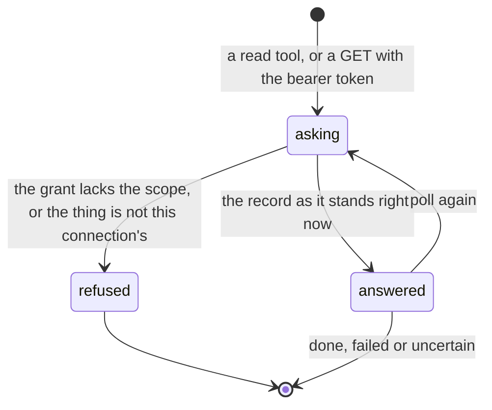

# Reading results and receipts

## Summary

Everything an outside agent learns about Froggy, it learns by asking. This is the other half of [asking for a paid task](asking-for-a-paid-task.md): that document ends when the id comes back, and this one starts there. There is no stream, no callback and no notification on this side: the agent presents its token, names a thing, and gets back what its grant permits. This document is what that "what" is — the result of a task, the record of a payment, the trail of its own past calls — and, just as importantly, what is never in the answer.

Two rules run through all of it. **Payment and delivery are separate facts**, reported in separate fields, so a delivered body is not evidence that anything was paid and a settled payment is not a promise that the content is useful. And **a receipt says why it spent, not just that it did**: which rule let it through, what the agent knew when it decided, what it thought it was buying, and what settled where.

## The simple case

The agent has a task id. It calls `froggy_service_status` with that id and gets the ticket: the status, the price that was quoted, the text, the source links, the sale id, the upstream transaction id when the provider gave one, `stubbed`, and an artifact path when the service produced an image or an audio file. When the status is `done` the work is in the answer.

If instead it bought a URL, it calls `froggy_x402_status` with the purchase id. That answer is deliberately split: `payment` with its own state and transaction id, `delivery` with its own state, HTTP status and the seller's body, capped at 16 KB with a flag when it was cut, plus the id of the receipt the spend produced.

And if it wants its own history, it calls `froggy_history` — which needs the explicit `history` scope, and returns only calls made by **this** connection.

## The request, event by event

### Asking

A read is one more MCP tool call or one more authenticated GET, and it goes through the same door as a paid one: origin, method, size, then scope. The read tools are marked read-only in the tool list, which is a promise about them and not a permission — `froggy_positions`, `froggy_trade_capabilities`, `froggy_trade_status`, `froggy_watch_status`, `froggy_service_status`, `froggy_x402_status`, `froggy_services` and `froggy_history`.

**Each tool needs exactly one scope, chosen by its name**, and reading is divided the same way buying is: `services` covers the catalog and service tasks, `pay` covers purchases and everything trading, and `history` covers the trail. A grant holding only `services` can read a service task it bought and cannot read a purchase at all. `initialize`, `ping` and `tools/list` need no scope, so an agent can always see the full tool list — including the read tools its grant cannot call. **No scope is a key**, and none of them can be read out of the answer to any of these calls.

### Answered at once

Some reads end without a record. An unknown id answers "No such service task." or, over HTTP, a 404. A purchase belonging to a different connection answers "Purchase not found." — the same words as one that does not exist, so a probe learns nothing from the difference. `froggy_history` with an execution id that belongs to another connection answers "No accessible recorded execution with that ID."

Nothing is charged for any of it. Reading is free.

### The work begins

There is no work. A read never starts a run, never reserves a spend and never writes a receipt. Two of the "read" tools are exceptions worth naming: `froggy_trade_simulate` re-simulates rather than merely reporting, and `froggy_watch_cancel` cancels permanently with no refund of unused capacity. Both are marked as not read-only in the tool list, which is the only warning the agent gets.

### While it runs

Polling is the whole of it. Three seconds is the interval the product asks for, and the agent is told to stop at `done`, `failed` or `uncertain` — three endings, and the last one is not a failure.

Some of what comes back is computed at the moment of asking rather than stored. A service task with no recorded progress for fifteen minutes is reported as `uncertain` at read time, with a sentence saying to check the payment before retrying. A purchase left `awaiting_approval` past its expiry is reported as `expired` at read time. A purchase whose worker died mid-flight is reported as `failed` if nothing had been sent and `uncertain` if something had. **The agent's act of looking is what settles these**, which means an unpolled task can sit in a status nobody has corrected.

### Finishing

What is left behind for the agent to find, in descending order of how much it says:

- **The task view over HTTP.** `GET /api/tasks/{id}` returns the task with its **full receipts** joined in — every receipt written against that task's run, each carrying the decision (the ids of the rules satisfied, or the code and the rule that refused), the intent with its payee and purpose, the quote and the rate used, the approval when a person was asked, the settlement with its network, transaction id and Hedera consensus sequence number when one was posted, the evidence with its snapshot hash and per-deployment block numbers, and `stubbed`.
- **The purchase ticket over MCP.** Payment state, delivery state, the bounded body, and a **receipt id — not the receipt**. The person's view of the same rows is [purchases](../workspace/wallet/purchases.md).
- **The service ticket over MCP.** Status, price, text, sources, sale id, upstream transaction id, artifact path, `stubbed`. **No receipt at all**, not even an id.
- **The invocation trail**, through `froggy_history`: this connection's own recorded calls and their outcomes, as stable links, with a hard ceiling of twenty records and 16 KB of text.

What is never in any of them: the person's web or Telegram conversations, another connection's invocations, a payment header or proof, a token secret, or a signing parameter. The purchase tool's own comment states the rule plainly — no signing parameters, credentials or redeemable payment proof reach a tool.

### What a receipt is actually for

A transaction hash answers "did money move". Nobody nervous about an autonomous agent is asking that. They are asking which rule let it through, what the agent was acting on, and what it thought it was buying — so all three are fields on the receipt and it cannot be constructed without them.

For an agent this changes what a successful read means. A receipt whose decision is `allow` names the rule ids that were checked and passed, which is the agent's evidence that it stayed inside the leash rather than got lucky. A receipt whose decision is `deny` carries the code and the rule, which is the agent's evidence that it was refused by a rule rather than by a fault. A receipt with an `approval` block records what the person said and when, so "allowed" never appears without the fact that made it legitimate. And a receipt with a `failure` but an `allow` decision is the one shape that means the leash said yes and the money still did not move — the signer refused, the seller errored, or the network faulted — with the reason in the refuser's own words rather than a translation.

**The balance an agent can see, and the leash it can see.** `GET /api/wallet` is one of the few person-shaped reads an agent may make. It returns the balance in dollars, how much has been spent inside the widest rolling window, the pocket, the signer address, the Hedera account and the person's allowance — the four numbers the agent is held to. So an agent can find out, without asking the person, that it has $1.20 of a $10 daily allowance left and that its per-spend cap is $2. It can read every constraint it is under and change none of them. When the ledger cannot be reached the summary says so — "Spend history unavailable… The figure below is a floor, and payments will be refused." — rather than reporting a smaller number as if it were true.

## Variants

| Variant | Set before asking | Changed while it runs |
| --- | --- | --- |
| Who is asking | An agent reads by id and by poll. A person reads the same facts as receipts, purchases and activity in the workspace, with a live stream the agent has no equivalent of. A schedule reads nothing; it produces. | Cannot change. |
| The policy in force | No effect on reading. The leash governs spending, not looking, and a frozen wallet is still fully readable. | No effect. |
| Funds available | No effect. A read costs nothing at any balance. | No effect. |
| What is being asked for | Decides which tool and which shape: a service ticket, a purchase ticket, a task view, a trade, a watch, a position, a history page. | No effect. |
| The asking agent's grant | The whole of what is visible, one scope per tool by name. `services` reads service tasks, `pay` reads purchases and trades, `history` reads the trail. A grant without `history` cannot read its own past calls even though it made them. | Revoking mid-poll refuses the next read. Records already made stay attributable to the revoked grant, because revocation is a timestamp and not a deletion. |
| The shared browser | A browse task's progress — steps taken, active milliseconds, spend against the model allowance, and the running summary — is readable in the task. Nothing shows the page itself. | Ownership moving to the person does not change what is readable; it changes the task's status to `paused`. |
| Appearance and motion | No effect. | No effect. |

## Cancel and interrupt

| Event | Before the work begins | While it runs |
| --- | --- | --- |
| Stop — the person halts this run | No effect on reading. | The task becomes readable as stopped or failed, with its reason. Receipts already written stay. |
| Freeze — the wallet is frozen, mid-run | No effect. Reading is not spending. | No effect on reading. The refusals it causes are readable like any other. |
| Denying a waiting approval, or leaving it unanswered | No effect. | The refusal is readable as the task's error and as a `deny` receipt carrying the code — `approval_denied`, `approval_timeout` or `approval_unavailable`. A refusal is a record, not an absence of one. |
| Asking something else while this request is still in flight | No effect. Reads do not queue behind each other. | No effect. |
| Leaving the page, or switching to another conversation, mid-run | No effect. | No effect. |
| Reload; the tab or the app closed | No effect. | No effect. The agent is not in the page. |
| Network lost; the socket drops | The read never happened; repeat it. | Repeat it. Reads are idempotent by construction, and the id is stable. |
| The model, a service, or the facilitator errors or rate-limits mid-run | No effect on reading. | The error becomes the task's `error` text, capped at 1,000 characters. What is unknown is reported as unknown rather than as a failure. |
| The session expires, or the person signs out | No effect; the grant is not the person's browser session. | No effect. |
| The policy or a cap changes mid-run | No effect on what is readable. | A receipt already written is never rewritten. It records the rules as they were at the moment it was judged. |
| Funds run out mid-run | No effect. | The refusal is readable with the code that named what was short. |
| The person takes control of the shared browser mid-run | No effect. | The browse task reads as `paused` with its progress intact, not as failed. |
| The same account open in a second tab or on a second device | No effect. | Two readers see one record. There is no per-reader view of a task. |

Nothing an interrupt does is hidden from a subsequent read. That is the point of writing the refusal down.

## Interactions with other systems

**The leash.** A refusal is readable, not merely thrown; the ways it can happen are in [being refused](being-refused.md). Its decisions are the most valuable thing an agent can read back: an allow carries the ids of the rules it satisfied, so an allowance is as auditable as a refusal. See [the leash](../foundations/the-leash.md).

**Money and receipts.** A receipt cannot be constructed without the rule, the evidence and the purpose. Over HTTP the agent gets whole receipts; over MCP it gets ids. See [money](../foundations/money.md) for the units and [receipts](../workspace/wallet/receipts.md) for what the person sees of the same rows.

**Approvals.** A task reports that a ticket is open — its title, its amount, when it expires — and never a way to answer it. The answer, once given, is on the receipt with the same care as a rule id, because a receipt that says "allowed" without saying "because you said so at 14:02" has lost the fact that made the spend legitimate.

**Provenance.** See [provenance](../cross-cutting/provenance.md). What is provable to someone who was not there is the settlement, the transaction, the consensus sequence number, and the evidence with its snapshot hash and block numbers. A source URL alone is a claim about a gateway, not about the data.

**History and persistence.** Every call an agent makes is an invocation against its grant — metadata only, kept after revocation. `froggy_history` reads that trail and nothing else; it never repeats a tool call and never exposes the person's private conversations.

**The shared browser.** Readable only as a task's progress numbers and its final summary. There is no page content, no screenshot and no live view on this surface.

**Connected agents and grants.** Purchases, trades, watches and history are scoped to the connection that created them. Service tasks and the task API are scoped to the _person_ — see the open questions.

**Notifications.** None, ever. Nothing is pushed to an agent; every fact it holds is one it went and asked for.

**Navigation and URL state.** No interaction. Ids, not URLs — except the artifact path, which is a URL the agent fetches with the same bearer token and must never put the token into.

**Appearance, motion and accessibility.** No interaction.

**Offline and reconnection.** Reconnection is indistinguishable from a first read. There is no replay to catch up on and nothing to resubscribe to; the record is the record.

**Stubs.** Every readable object carries `stubbed` in the data, not only in a label: tickets, receipts, sales, positions and trades. A stubbed evidence snapshot says so too. This is what makes a screenshot of a stubbed run impossible to pass off as a settled payment; see [stubs](../cross-cutting/stubs.md).

## Edge cases

- Delivery and payment can disagree in both directions, and both are reported honestly: "Content arrived, but the seller did not confirm settlement" and "Payment settled, but delivery failed: the seller answered 502" are different sentences for different facts.
- A seller's body is untrusted data. It is returned as text, truncated at 16 KB with a truncation flag, and it is never instructions.
- History text is capped twice — twenty records, and 16 KB of evidence — and stops early rather than truncating mid-record when the space runs out.
- A revoked connection's invocations stay readable in the person's Connections page after the connection is gone. Revocation is a timestamp, so "which agent asked for that last Tuesday" stays answerable.
- `GET /api/tasks/{id}/events` will hand back the run's live stream for a task still running **on this process**, and answers 204 otherwise. It is the one place an agent can see a run as it happens, and it is not available from MCP.
- `/api/receipts` is a person's route. An agent presenting a token gets "An agent token cannot do this." Receipts reach an agent only joined into a task view.
- An agent may read `GET /api/wallet`, which includes the balance, the window spent so far, the pocket, the addresses and the person's allowance. It can see the leash it is on without being able to change it.
- A browse task's stored progress is the only place an agent can watch work happen incrementally: steps taken, active milliseconds, micro-dollars spent against the model allowance, and a running summary capped at 16,000 characters. It is written after every step, so a poll mid-browse returns a genuinely current number rather than a stale one.
- The catalog is a read that is also a status board. A card's `status` and `note` say whether a service is `configured`, a `demo` fixture, or `unavailable` and why — which is how an agent finds out what it can buy before it tries, rather than by being refused.
- A trading result preserves what it does not know as unknown — missing rewards, historical yield, unavailable withdrawals — rather than defaulting them to zero.

## Open questions and verification

- **Service tasks and the task API are scoped to the person, not to the connection.** `froggy_service_status`, `GET /api/services/tasks` and `GET /api/tasks/{id}` check only that the task belongs to the caller's person; purchases, trades, watches and history all check the connection as well. One connected agent can therefore read a service task another agent bought, and read the tasks the person started from the workspace. Given how carefully every neighbouring surface is scoped, this looks like an oversight rather than a decision. Worth filing.
- The receipt asymmetry between transports — whole receipts over HTTP, ids over MCP, nothing on a service ticket — was read from the code and may be deliberate. An MCP-only agent has no way to fetch a receipt by its id, so the id it is handed is currently unusable to it.
- Several statuses are only corrected when someone reads them. Whether any background job sweeps stale tasks and purchases has not been established.
- The three-second polling interval is advice in the tool descriptions and the skill; no server-side rate limit was found. Not confirmed by hand.
- Whether the artifact endpoint enforces the connection or only the person was not checked; it shares the route file with the person-scoped list.
- Whether an agent can distinguish "this task has no receipts" from "this task's receipts are not visible on this transport" was not established. Over MCP it reads the same either way: nothing.
- No end-to-end specification reads a live receipt back through an agent's token. `e2e/purchases.spec.ts` reads receipts back over HTTP with the _session's_ authorization header, which is the person's, not an agent's.

Verified against the Froggy tree at commit `5caed50`.
