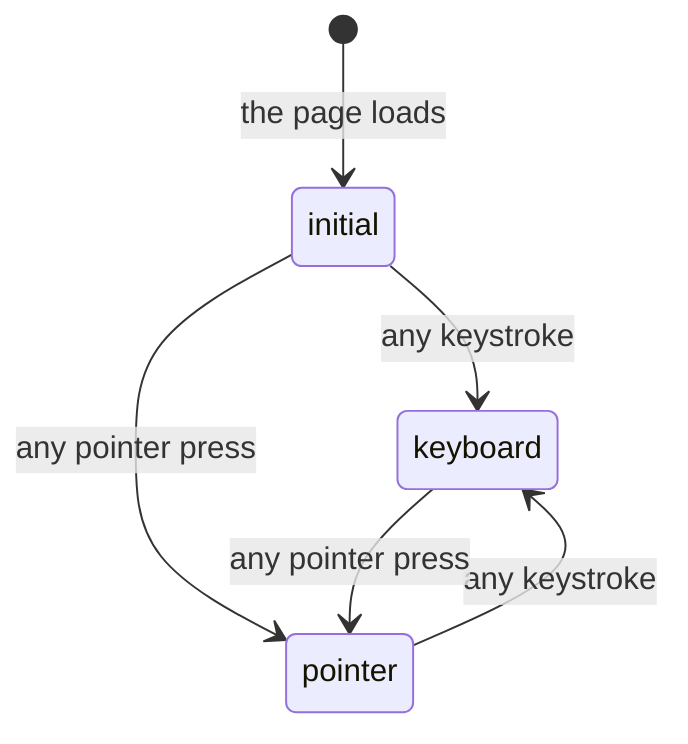

# Appearance and motion

## Summary

Froggy has two looks and one motion vocabulary, and neither of them ever changes what happens. [Appearance](../workspace/account/appearance.md) owns the three-segment control, where it lives, what `?theme=` does and how the choice is stored. This document is about the other half: how the two looks and the motion behave on **every** surface, what a person who has asked for less motion gets instead, and which motion in this product is carrying information rather than decorating.

The last row of every Variants table in this repo says "Rendering only. It never changes what happens." That row is true, and this document is where it is paid for.

## The two looks, everywhere

**Passbook** is the light look and the default; **Lilypad** is the dark one. The choice is written on the document itself, so it is in force on every page, in every dialog, on the signed-out surface and in the popped-out browser window at once. There is no per-page appearance and nothing to set twice.

The two are not one palette inverted. They differ in corner radius, in shadow, and in typeface — the machine face is a monospace in Passbook and a proportional face in Lilypad — so a wallet address changes shape as well as colour. `color-scheme` is set in both, so scrollbars, the caret and browser-drawn controls match rather than staying stubbornly light.

Four colour roles carry meaning and appear in both looks with the same job:

| Role | Where it appears | What it means |
| --- | --- | --- |
| Agent amber | The browsing card, the arbitration badge, every stub marker | The agent is driving, or this is not real |
| Human blue | The arbitration badge when the person has **Control** | The person has the page |
| Refused red | The refused stamp on a receipt, error text | Something was refused or failed |
| Lime | An approval ticket, the mascot's one moment | The interface is asking something of a person |

Lime has a written rule attached to it: it is an accent only — never text, never a surface, and **never the sole signal for a state**. That rule generalises. Every state carried by colour is carried by a word as well: a refused receipt says "Refused", a stub says "fixture" or "Simulated", a live browse card sets a `data-live` attribute the interface reads out. Colour is a second channel here, never the only one.

## The three motion modes

Motion has three states, and a person moves between them without ever choosing one.

**Pointer** is the full vocabulary. **Keyboard** removes it: from the first keystroke onward, overlays open with no transition, the navigation indicator moves in zero time, the appearance pill does not slide, and an entrance animation still playing above whatever just received focus is finished immediately rather than left to run. The reason is written into the code — keyboard navigation never waits for motion — and it applies to a person tabbing quickly whether or not they have asked for reduced motion.

Holding a pointer down is its own thing: the entrance animations above the pressed element **pause where the finger landed** and resume when it lifts, so a card does not slide out from under a thumb. Releasing away from the control cancels the press and still resumes the animation.

## Reduced motion

When the person's system asks for reduced motion, the following are removed rather than shortened:

- The browsing card's travelling sheen and the pulsing driving dot. The card still says it is live; only the animation goes.
- The press-in, the hover lift and the shadow bloom on primary buttons.
- The word-by-word fade of streaming markdown. The words still arrive one by one; they simply appear.
- Digits in the balance and in a status word stop morphing and change in place.
- The rise-and-spring of an arriving card, replaced by a 125 ms fade.
- The sideways slide of the pill navigation's entrance and of its travelling indicator.

Two are shortened rather than removed. A page change becomes a 125 ms crossfade instead of a 300 ms directional slide, so the change is still visible but carries no direction. A dialog opens and closes on opacity alone over 125 ms, with no scale.

One is not touched at all: the quarter-second whole-surface crossfade when the look changes still plays in full. That looks like an oversight and is recorded as one in [appearance](../workspace/account/appearance.md#open-questions-and-verification).

## Which motion is load-bearing

Most of it is decoration and can go without loss: the press-in, the hover lift, the sliding pill behind the three appearance segments (which is hidden from assistive technology outright), the pill navigation's entrance.

Six are carrying information, and each has a non-motion twin so that reduced motion costs nothing:

1. **The direction of a page change.** Forward for a destination further down the navigation order, back for one above it. The twin is [navigation](../foundations/navigation.md) itself — the current destination is marked.
2. **The travelling sheen on a browsing card.** It means the browser is working right now. The twin is the `data-live` attribute the card carries, and the words on the card.
3. **The refused stamp landing on a receipt.** A stamp that lands, rather than one already there, means the refusal happened while the person was watching. The twin is the announcement in the page's one live region.
4. **Digits morphing rather than replacing.** A balance going from $0.00 to $12.48 should read as the same number moving. The twin is the plain value, which is what assistive technology is given in both cases.
5. **Rise versus spring on arrival.** An ordinary card rises; an [approval](../workspace/conversation/approvals.md) springs. The twin is that an approval is a differently shaped card that also takes focus.
6. **The navigation indicator travelling** between destinations rather than jumping. The twin is the current-page marking on the link.

## Variants

| Variant | Set before asking | Changed while it runs |
| --- | --- | --- |
| Who is asking | Only a person in a browser has an appearance at all. An agent over MCP, Telegram and a schedule have no rendering and cannot read or set one. | No effect. |
| The policy in force | No effect. Nothing here is judged by [the leash](../foundations/the-leash.md), and a frozen wallet renders normally. | No effect. |
| Funds available | No effect. | No effect. |
| What is being asked for | Decides which motion is in play — a browsing turn gets the live sheen, an ordinary one does not. | The sheen starts and stops with the browsing, mid-turn. |
| The asking agent's grant | No effect. No scope reads or writes appearance. | No effect. |
| The shared browser | The workspace frame is themed; the remote page inside it keeps its own colours. See [the shared browser](../foundations/the-shared-browser.md). | Taking the page flips the arbitration badge between the human and agent roles. |
| Appearance and motion | This document is the variant. | A look changed mid-run repaints in place without remounting anything; a stream keeps streaming through the crossfade. |

## Cancel and interrupt

| Event | While a look or motion is in play | After it settles |
| --- | --- | --- |
| Stop — the person halts this run | The live sheen stops when the browsing does. | No effect. Stopping never repaints. |
| Freeze — the wallet is frozen, mid-run | No effect on rendering. | No effect. |
| Denying a waiting approval, or leaving it unanswered | The ticket leaves on a 125 ms fade in either case. | No effect. |
| Asking something else while this request is still in flight | The new turn's cards arrive with the same entrance; the superseded turn's do not animate out. | No effect. |
| Leaving the page, or switching to another conversation, mid-run | The page change animates in the navigation order's direction. The run is untouched. | No effect. |
| Reload; the tab or the app closed | The look is applied before React mounts, so there is no flash of the wrong palette. | The saved look survives; a `?theme=` preview does not. |
| Network lost; the socket drops | No effect. Nothing about appearance or motion touches the network. | No effect. |
| The model, a service, or the facilitator errors or rate-limits mid-run | The live sheen stops; the card takes the refused or failed rendering. | No effect. |
| The session expires, or the person signs out | The look is the browser's, not the account's, and stays. | The signed-out surface uses the same value. |
| The policy or a cap changes mid-run | No effect. | No effect. |
| Funds run out mid-run | No effect on rendering; the refusal renders like any other. | No effect. |
| The person takes control of the shared browser mid-run | The arbitration badge changes colour and word together. | No effect. |
| The same account open in a second tab or on a second device | A second tab of the same browser repaints when the look changes; a second device does not. | Each tab animates its own arrivals independently. |

Nothing in this list can leave the interface in a wrong state, because none of it is state. The worst outcome is an animation that was interrupted, and every one of them is written so the presentation it was interrupted at is the one it continues from.

## Interactions with other systems

**The leash.** None. No rule is consulted and no decision is recorded; see [the leash everywhere](the-leash-everywhere.md) for where decisions are rendered.

**Money and receipts.** The balance morphs rather than flashes, and the funding button beside it is pinned so a changing balance never moves it. See [money](../foundations/money.md).

**Approvals.** An approval ticket springs rather than rises, and its arrival is the one entrance with a different shape, because it is the one arrival that asks something.

**Provenance.** No interaction. Nothing about appearance is signed or recorded.

**History and persistence.** The look is kept in that browser only, not on the account. It is not exported and not removed by **Delete my data**.

**The shared browser.** The frame is themed and the remote page is not, which is deliberate: a page in the browser must look like itself.

**Connected agents and grants.** No interaction at all. There is no appearance on the agent surface.

**Notifications.** The waiting count on Home is a number in an accessible name and a coloured dot, not an animation.

**Navigation and URL state.** `?theme=` previews a look for one page load and is dropped the moment a choice is pressed. See [url state](url-state.md).

**Appearance, motion and accessibility.** This document and [accessibility](accessibility.md) are two halves of one concern. The rule joining them: no state is ever signalled by colour or motion alone.

**Offline and reconnection.** Entirely local. Every look and every animation works on a page loaded before the connection dropped; see [offline and reconnection](offline-and-reconnection.md).

**Stubs.** Stub markers wear the agent amber role in both looks, so "not real" reads the same way everywhere it appears. See [stubs](stubs.md).

## Edge cases

- The reduced-motion rules live in two places — a stylesheet for CSS animations, and components for the ones driven from script — which is why the appearance crossfade slipped through both.
- Keyboard mode is sticky per page load. A person who types once and then reaches for the mouse gets no motion until they press.
- Pausing an entrance on press applies to ancestors too, so pressing a button inside a card that is still arriving freezes the whole card.
- The motion vocabulary is shared with the CSS by publishing the spring as a CSS variable at start-up, so a scripted animation and a stylesheet transition of the same thing agree.
- Text that morphs is measured once per value and pinned so it cannot reflow the controls beside it.
- A long turn replayed after a detach appears all at once rather than gradually — a large sudden change that no reduced-motion setting affects, because it is not an animation.

## Open questions and verification

- The whole-surface crossfade on a look change is 250 ms under reduced motion as well as without it. `e2e/motion.spec.ts` asserts that duration in **both** cases, so the behaviour is pinned by a spec rather than merely unnoticed. Treat it as a defect with a test protecting it.
- Whether the pop-out browser window repaints when the workspace look changes, or only on reload, has not been watched.
- The breakpoint at which the desktop rail replaces the phone pill is 768 px in the specs; whether the motion vocabulary differs either side of it was not established beyond the pill's own entrance.
- No spec covers a browser that reports reduced motion **and** is being driven from the keyboard, which is where the two suppression paths overlap.
- Everything above was read from the tree and from `e2e/motion.spec.ts` and `e2e/themes.spec.ts`. None of it was watched in the running product.

Verified against the Froggy tree at commit `5caed50`.
