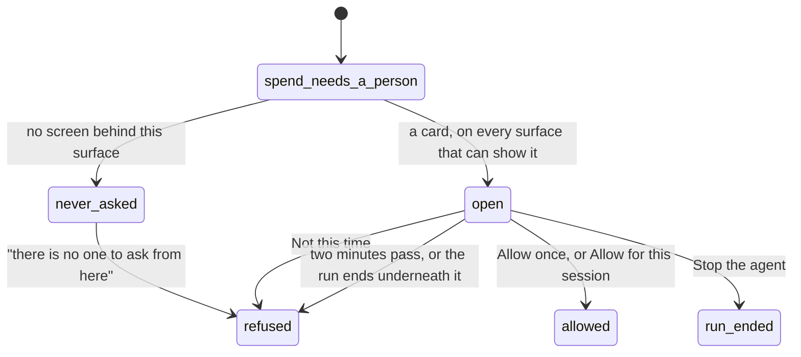

# Approvals, everywhere

## Summary

An approval is the run stopping to ask a person. [Approvals](../workspace/conversation/approvals.md) owns the ticket in the conversation — how it looks, what each answer does, and how it ends without one. This document owns the map: every place a question can be raised, every place it can be answered, and the places that cannot ask at all, where "ask" quietly becomes a refusal.

That last part is the one worth knowing. Froggy never queues a question for later and never asks a screen that is not there. If the surface a spend came from has nobody in front of it, the spend is refused with the reason "there is no one to ask from here", and the person finds out afterwards.

## Two kinds of question

They look alike and are not the same thing.

**A mandate approval** is [the leash](../foundations/the-leash.md) answering _ask_ mid-run. It lives in memory for as long as the run does, it lasts **two minutes**, and it goes to every surface that can show it.

**A purchase approval** belongs to a URL purchase and is a durable record rather than a parked call. It lasts **five minutes**, it comes in two stages — one to send the input, a second to pay the quoted price — and it appears only in the web workspace, above every page rather than only in a conversation.

> Technical note: the difference matters for who can start one. A mandate approval needs the run's own abort signal to park against, so only a surface that holds one can raise it. A purchase approval is a row in a store, which is why it is the only approval an outside agent can cause and then wait for.

## Where a question can be raised

| The request came from | Can it ask? | What happens |
| --- | --- | --- |
| A person's turn in the conversation | Yes | The run parks. A ticket appears above the composer, and on Telegram where it is paired. |
| A paid browse the person is watching | Yes | The same, and the wait does not consume the browsing time they bought. |
| A Telegram message | Yes | The same card, on the phone and in the web app at once. |
| A connected agent's service or trading tool | **No** | The spend is refused immediately as `approval_unavailable`: "This spend is over the automatic limit and there is no one to ask from here." The task ends failed. |
| A connected agent's URL purchase | Yes | A purchase approval is created and the person answers it in the web app. The agent does not wait on a call; it polls. |
| A schedule, or the daily digest | **No** | The turn is marked not-interactive before anything runs, so the question is never composed. The refusal is the correct outcome, and the digest's own setting says so. |

The scheduled case is deliberate rather than a gap: a card nobody will see is worse than a refusal somebody can read.

## Where a question can be answered

**Above the composer**, in the conversation the run belongs to. The ticket carries the amount large, the payee, one line of detail, and a countdown in seconds. It never takes focus from someone mid-sentence; when it does take focus it lands on the refusing answer.

**Above every page**, for a purchase approval, so a person who wandered off to the Wallet is not asked to go looking.

**On Telegram**, as a card with the same four buttons in the same order. The primary yes and the dangerous stop are styled; the two middle answers are not.

**Not on Home.** Home shows the count and a **Review** button that opens the conversation holding the card. This is a decision, not an omission: two places to approve the same thing is how a person pays twice.

**Never by an agent.** The route that answers is refused to an agent outright — "An agent cannot answer or cancel a human approval" — and answering needs the person's own credentials, not the agent's.

## The four answers, and what they are called

The vocabulary is fixed everywhere; the labels are not the same on both tickets.

| The answer | On a mandate ticket | On a purchase ticket |
| --- | --- | --- |
| Deny & stop | "Stop the agent" | "Deny & stop" |
| Deny | "Not this time" | "Deny" |
| Allow for this session | "Allow for this session" | — |
| Allow once | "Allow once" | "Send input & get price", then "Pay once" |

In every case the primary yes sits last, furthest from a stray click.

"Allow for this session" writes an ask exemption for that payee at that ceiling, and the session it means is **twenty-four hours** — a session, not forever. It is the only rule a person writes without opening the policy editor.

## What happens when it is answered

Whichever surface answers first wins; the others find the card gone and do nothing. The web ticket disappears on every tab at once, and the answer lands on the receipt in the person's own words — "you allowed it once", "you allowed it for this session", "you said no", "you stopped the agent", or, when nobody did, "nobody answered", "nobody to ask", "question withdrawn".

**"Stop the agent" does more than refuse.** From either surface it ends the run and withdraws every other card the person has open, because a person reaching for the stop is not answering one question.

An answer given on Telegram carries no browser credentials, and Telegram replies with "Noted." — or "That question has already been answered." when the card has gone.

## Variants

| Variant | Set before asking | Changed while it runs |
| --- | --- | --- |
| Who is asking | Decides whether a question is possible at all, and that is the whole table above. | Cannot change; the question belongs to the run that raised it. |
| The policy in force | The ask line and the action kind decide whether this happens. Paying a person asks at any amount. | A change does not withdraw a question already asked, and does not spare the spend from being judged again. |
| Funds available | No effect on whether a person is asked. Being short of money is a refusal, not a question. | An approved spend can still fail afterwards. |
| What is being asked for | A URL purchase asks twice and on its own record; everything else asks once, on the run. | No effect. |
| The asking agent's grant | No scope raises or answers a question. An agent can only cause one, through a purchase. | Revoking mid-run does not withdraw a card already raised. |
| The shared browser | A page demanding payment parks the run identically, and the wait is not charged to the browse. | Taking the page does not touch the card. |
| Appearance and motion | The ticket is a perforated card with a stub; it springs in and out, and the countdown uses tabular numerals. | Rendering only. |

## Cancel and interrupt

| Event | Before the question is raised | While it is open |
| --- | --- | --- |
| Stop — the person halts this run | Nothing to answer. | Every open card resolves `aborted` and the receipt says "question withdrawn". |
| Freeze — the wallet is frozen, mid-run | The spend would be refused before anyone was asked. | Not established; see [the leash everywhere](the-leash-everywhere.md) on whether freeze exists at all. |
| Denying a waiting approval, or leaving it unanswered | This is the event. | "Not this time" lets the model try something else; "Stop the agent" ends the run; silence ends it as `timeout` after two minutes. |
| Asking something else while this request is still in flight | Sent normally. | The composer holds it. The card is unaffected — but a new run started elsewhere aborts this one, and the card with it. |
| Leaving the page, or switching to another conversation, mid-run | No effect. | The countdown keeps running on the server. A purchase approval is still there on return; a mandate approval probably is not. |
| Reload; the tab or the app closed | No effect. | Every card still open is handed to the tab when it reconnects. |
| Network lost; the socket drops | No effect. | The answer cannot be delivered from that tab. Telegram can still answer it, and the two-minute clock does not pause. |
| The model, a service, or the facilitator errors or rate-limits mid-run | No question. | The run may end underneath the card, resolving it `aborted`. |
| The session expires, or the person signs out | No question is shown. | The card cannot be answered from the web; the phone still can, if it is paired. |
| The policy or a cap changes mid-run | Changes whether a question is asked at all. | Does not withdraw a question already asked — and the answer does not exempt the spend from the new numbers, which are judged again afterwards. |
| Funds run out mid-run | Refused rather than asked. Money that is not there is a fact, not a decision. | An approved spend can still fail for want of funds. |
| The person takes control of the shared browser mid-run | No effect. | No effect. The card stays and the countdown runs. |
| The same account open in a second tab or on a second device | No effect. | The card is on both, and disappears from both the moment either answers. |

## Interactions with other systems

**The leash.** _Ask_ is the leash's third answer; an approval satisfies the human line and nothing else, so every cap and allowlist is judged again after the person says yes.

**Money and receipts.** The answer is part of the receipt, beside the rule and the transaction. See [money and receipts](money-and-receipts.md).

**Approvals.** This document is the map; [approvals](../workspace/conversation/approvals.md) is the experience.

**Provenance.** No answer makes an untrusted address payable: a page-sourced payee is refused before anyone is asked, so no ticket can be used to talk a person into one.

**History and persistence.** A parked turn is `waiting`, and the run record keeps its waits — the question, when it expires, and how it ended — up to the last twenty of them. They are readable afterwards in the record's own detail.

**The shared browser.** A page demanding payment parks the run like anything else, and time spent waiting for the person is subtracted from the browse's clock rather than charged to it.

**Connected agents and grants.** No scope answers a ticket, at any grant. This is the hard line between what an agent may buy and what only a person may decide, and the instructions an agent is handed name it: tell the person to answer in Froggy, and "Do not try another route to the same spend."

**Notifications.** The count on Home follows the person across pages and is in the accessible name as well as the badge — "Home, 1 approval waiting". Telegram is the only way the question leaves the app; there is no push and no email.

**Navigation and URL state.** No approval is a route and none can be linked to. Home's **Review** navigates to the conversation rather than answering in place.

**Appearance, motion and accessibility.** The card announces itself through the page's one live region — "Your call: …" — and outranks a refusal that just landed. It never steals focus from a text box, and when it does take focus it lands on the safe answer, so a stray Enter refuses rather than pays.

**Offline and reconnection.** An answer needs the network; the countdown does not. Reconnecting hands the tab every card still open.

**Stubs.** A stubbed run raises real questions about spends that will settle against a stub. The ticket does not say so; only the receipt does. See [stubs](stubs.md).

## Edge cases

- **Two minutes is short.** A person who steps away from the desk comes back to a timed-out question and a run that ended for want of an answer nobody was there to give.
- The web ticket's buttons disable themselves when the countdown reaches zero. The Telegram card's do not — it is never edited or withdrawn — so the buttons stay tappable and the server is what refuses.
- A purchase asks twice: once to send the input and once to pay the price that came back. The first card shows "$0" and the second shows the quote.
- An agent's own paid task cannot raise a question, but the same agent's URL purchase can. The difference is invisible from the agent's side except in what comes back.
- Unpairing Telegram mid-run does not stop a card being raised; it just stops going to the phone, silently.
- The purchase ceiling is its own number and is not the person's cap: "Up to $1 per purchase. You approve the quoted amount."
- A person watching one conversation while a card is raised in another sees the count on Home but no ticket until they open that conversation.

## Open questions and verification

- **The interface's own words for the two refusing answers are "Stop the agent" and "Not this time", not "Deny & stop" and "Deny".** The glossary and the neighbouring documents use the second pair, which appear on the purchase ticket only. One of the two should win; this is worth settling before either is quoted in a demo.
- Whether a purchase approval is ever shown on Telegram is not established; nothing found raises one there, so a person on a phone can be asked for a mandate spend and not for a purchase.
- Whether the mandate card's two-minute countdown can be changed per deployment was not established; it is a constant in the tree.
- What a person sees on the web when a card they are looking at was answered from Telegram has not been watched.
- No spec exercises an agent-initiated spend being approved by a person, because on the service path it cannot happen and on the purchase path the two halves are pinned separately.
- Nothing here was checked in the running product.

Verified against the Froggy tree at commit `5caed50`.
