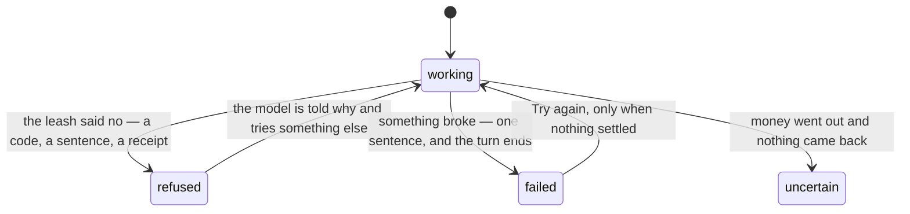

# Errors

## Summary

Froggy separates three things that most products call one thing. A **refusal** is the leash working: it carries a code, a rule, and a receipt, and it is not an error. A **failure** is something that broke: it ends the turn, says so in one sentence, and leaves behind whatever was already committed. **Uncertainty** is the third, and the product refuses to collapse it into the second: a payment that was sent and never confirmed either way is `uncertain`, because "we do not know whether that money moved" is a different thing to tell a person than "it did not".

Underneath every failure sentence in the product is one rule: **never claim more than is known.** "Stop requested" rather than "stopped". "Payments already submitted may still settle." "Your data may still be here." That is the house style, and where the product breaks it the break is worth reporting.

[The leash](../foundations/the-leash.md) owns the denial codes; [money](../foundations/money.md) owns the states of a spend. This document owns where failure shows up on each surface and what it says.

## The simple case

A turn is running and the model's stream dies. The turn ends, keeping everything that had already arrived, and is recorded as `failed` with "The model stream failed." Beneath the answer, a **Try again** control appears.

If that turn had settled a payment, **Try again** is not offered. A turn with a settled receipt is a fact, and asking the model to redo it would be asking it to pay twice.

## Where failure appears

**In the conversation.** A tool call that threw shows on its own card as **failed**; the exception's message is saved as the call's result. A stream that died says "The model stream failed." A turn whose record could not be written is aborted deliberately with "History could not be saved. Inspect this run before retrying." — an answer that cannot be recorded is worth less than the record when the answer may have spent money.

**Above the composer.** At most three notices, each dismissible. A turn refused before it began arrives here as an error notice carrying the server's own sentence, read out of the response body rather than shown as a raw transport error. A message the socket could not understand arrives as "Message did not match the app protocol." An informational notice — a turn started somewhere else — carries a **Reload** button instead.

**In the composer itself.** The reason it cannot be used replaces the prompt: "Connecting…", "Loading saved conversation…", "Reload history before sending.", "Waiting for the stop request. Check its status below." A message sent while it is unavailable does nothing, and a held message is returned to the draft rather than sent into a gap.

**On the stop control.** Five states with their own words, two of which are unusual and both honest: "Stop requested. Payments already submitted may still settle." does not claim the work stopped, and "Stopping is unconfirmed. The agent may still be working." admits the request may never have arrived. The second takes an alert role and offers **Retry stopping**. See [stopping and freezing](../workspace/conversation/freeze.md).

**In the wallet.** A refusal names which layer said no before it names why: "The mandate refused, before any key was touched." or "The mandate allowed; the signer refused, under its own policy." or "The mandate allowed; the payment did not go through." Then the reason, in plain words per code — "Over the cap for one payment.", "The wallet is frozen.", "The address came from a page or from the model, not from you.", "Nobody answered in time." A person should be able to tell which layer refused without knowing what a policy engine is.

**In the page's one live region.** A refusal that landed while the person was watching is announced as "Refused: {sentence}", so a person not looking at the wallet pane still hears it. Only refusals since this page loaded, and only when no approval is waiting.

**On Activity.** When the socket is down or the change feed has fallen behind: "Updates are delayed. Showing the last saved snapshot." A stale list is shown and labelled rather than emptied.

**In the top bar.** A "reconnecting…" badge while the socket is down, beside the stub chips.

**Before sign-in.** The identity provider throws at render on an insecure origin and on a bad app id, and that throw is contained rather than allowed to white-page the app. The message deliberately does not guess which cause it was; it points at the console, where the actual error is. That is a lesson learned the hard way — a confident wrong diagnosis once sent somebody checking DNS and dashboard settings that were both already correct. A failure to load the provider at all costs sign-in, not the workspace.

**In forms.** One paragraph, in the refusal colour, with an alert role, beside the field or the control that failed.

## On the other surfaces

**Telegram.** A failure is a message in the thread. An unpaired chat gets the instruction for pairing rather than silence. A turn refused before it began — the day's turns spent, or another run holding the workspace — is posted as the sentence, before any model call. A duplicate message is ignored entirely rather than answered twice. A notice that could not be posted is a warning in the log and is filed as not having reached the phone.

**A connected agent.** Every failure comes back as an ordinary tool result marked as an error, with the sentence in it, truncated to a thousand characters — never as a transport fault, so a client that cannot read errors still sees the words. A missing scope is answered with the scope's own name: "This connection lacks the \"{scope}\" scope. Reconnect Froggy and allow it." Malformed calls get the standard JSON-RPC codes. See [being refused](../agent-surface/being-refused.md).

**Over HTTP.** Every route answers a failure as `{ error: "…" }` with a status, and the web app reads the sentence out of that body rather than showing a status code.

## Variants

| Variant | Set before asking | Changed while it runs |
| --- | --- | --- |
| Who is asking | Decides where the sentence goes: a notice above the composer, a message in the Telegram thread, an errored tool result, a report's "stopped early" line. The sentence itself is usually the same. | Cannot change. |
| The policy in force | Decides what is a refusal rather than a failure. A refusal is expected behavior and is never shown as a fault. | A change applies from the next judgement; it does not un-fail anything. |
| Funds available | An empty balance produces a refusal with a code, not an error. The pocket running dry produces `pocket_exhausted`, which no policy change fixes and a top-up does. | Running out mid-run refuses that spend; the run continues and usually explains. |
| What is being asked for | Decides which failures are reachable at all: no browser means no browser failure, and a free answer cannot fail at a payment. | The model chooses step by step. |
| The asking agent's grant | A scope the grant lacks is refused before anything runs, and the agent is told which scope it needed. | Revoking mid-run does not retroactively fail a run already accepted. |
| The shared browser | A browsing turn can fail in ways a text turn cannot: no seat, a page that will not load, a payment a page demanded. | Taking the page does not fail the run. |
| Appearance and motion | Refusals carry an alert role; progress and success do not. | Rendering only. |

## Cancel and interrupt

| Event | Before the failure | After it |
| --- | --- | --- |
| Stop — the person halts this run | Stopping is itself a request that can fail, and says so rather than pretending. | Stopping a turn that already ended reports "No active run.", which reads like a failure and is not one. |
| Freeze — the wallet is frozen, mid-run | Every later spend is refused with `frozen` and "The wallet is frozen". | No effect on a failure already shown. |
| Denying a waiting approval, or leaving it unanswered | Not a failure. The three no-answer endings each get their own sentence rather than one shrug. | No effect. |
| Asking something else while this request is still in flight | Held by the composer, not sent, so it cannot fail into a gap. | A held message is returned to the draft if the composer became unavailable meanwhile. |
| Leaving the page, or switching to another conversation, mid-run | A failure that happens while away is recorded and is there on return. | The sentence is in the record; the notice above the composer is not. |
| Reload; the tab or the app closed | Notices and the stop control's state are lost. | The recorded failure survives; the dismissible notice does not. |
| Network lost; the socket drops | The tab shows "reconnecting…" and the last saved snapshot rather than an empty page. | The server keeps working. A stop cannot be delivered, which is exactly when a person most wants it to. |
| The model, a service, or the facilitator errors or rate-limits mid-run | This is the event. | The turn ends `failed`, or `uncertain` if a payment was already in flight. |
| The session expires, or the person signs out | Reads are refused with "Sign in again to read your history." | The run continues; the person stops being able to see it fail. |
| The policy or a cap changes mid-run | Changes what will be refused next. | Never applied retroactively to something already judged. |
| Funds run out mid-run | A refusal with a code naming what was short, not an error. | The run continues and usually explains. |
| The person takes control of the shared browser mid-run | No effect. | No effect. Taking the page never fails the work. |
| The same account open in a second tab or on a second device | A second tab trying to start a turn is refused with "Another run is using this workspace. Wait for it or stop it before sending." | Both tabs see the same recorded failure; only the tab that caused a client-side one sees its notice. |

## Interactions with other systems

**The leash.** A refusal is not an error and is never rendered as one. It gets a card in the turn, a row in the wallet, a code in the record, and a sentence naming the rule and the number — "denied by policy" is not an answer a person can act on.

**Money and receipts.** A receipt with no settlement and no failure is a decision that was never carried out; the two absences mean different things and both are legal. A `failed` row consumes allowance and an `abandoned` one does not, because consuming a person's allowance for a spend that never left would be a cap on decisions rather than a cap on money.

**Approvals.** The three ways a question ends without an answer — `timeout`, `aborted`, `unavailable` — are kept apart from each other and from a denial, because a receipt that records "refused" when what happened was "nobody was there" has lost the fact that mattered.

**Provenance.** An untrusted address is refused before anybody is asked, so no failure path can be used to talk a person into paying one.

**History and persistence.** A failure that cannot be recorded aborts the run rather than being swallowed. What is saved is redacted first, so a leaked secret in an error message does not become a durable record of that secret.

**The shared browser.** A workspace that cannot get a browser seat is told its position in the queue — "Every browser seat is taken (8). You are 3 in line." — rather than being given a generic failure.

**Connected agents and grants.** An agent is always told the reason. A refusal that says nothing about why is a refusal an agent will retry blindly.

**Notifications.** A failure notifies nobody. It is shown where the person is and recorded where they will find it; only an approval interrupts. See [notifications](notifications.md).

**Navigation and URL state.** No failure moves a person, and no failure is addressable. A refused turn cannot be linked to except through its record.

**Appearance, motion and accessibility.** Refusals take an alert role and successes do not, so a screen reader hears the thing that needs acting on and not the thing that went fine. There is one live region for the page, and what it says is derived from what is true now rather than queued.

**Offline and reconnection.** Reconnection is a first-class path rather than error handling. What is shown while offline is the last saved snapshot, labelled; see [offline and reconnection](offline-and-reconnection.md).

**Stubs.** A stub fails like the thing it stands in for, and its receipts still carry `stubbed: true`. The dangerous case is the opposite: a stubbed run that succeeds. Nothing about the shape of a failure tells you whether it was real; only the receipt does.

## Edge cases

- **A turn that ends on its own while a stop is in flight reports "No active run."** — which reads like something went wrong and is the ordinary outcome.
- "Stopping is unconfirmed" is the only state in the product where the interface admits it does not know whether a control worked. There is no automatic retry; the person has to press **Retry stopping**.
- The warning that "Payments already submitted may still settle" is shown for a stubbed run too, where it is not true.
- A checkpoint failure aborts a turn that was otherwise going fine, which to the person looks like an unexplained stop with a sentence about history.
- Only three notices are kept above the composer at once; a fourth pushes the oldest out, and the pushed-out one is not recorded anywhere a person can read.
- A tool that returned successfully but whose evidence could not be saved aborts the run with an instruction not to retry it: "Tool returned, but its evidence could not be saved. Outcome needs reconciliation; do not execute it again."
- An unrecognised refusal reason from an outside provider keeps that provider's own words rather than being replaced with a shrug.
- Deleting an account can fail after part of it has happened; the dialog says "Your data may still be here. Try again." rather than claiming either outcome.

## Open questions and verification

- **Whether a failed stream's sentence is shown to the person or only recorded was not established.** It is set on the server and checkpointed with the turn; whether it reaches the conversation as visible text is unresolved and is the difference between an explained stop and an unexplained one.
- The composer's four unavailable sentences were read from the page. Whether all four are reachable in the running product, in particular "Waiting for the stop request", has not been checked.
- Whether a `failed` spend row is ever reconciled afterwards, and by what, is not established. It matters because a failed row consumes allowance until somebody says otherwise.
- Whether a tool card's failed state shows the exception's message to the person, or only records it, was not read out of the card component.
- No error path here has been watched happen. `e2e/stop.spec.ts` exercises the unconfirmed and requested stop states; nothing read for this document exercises a stream failure, a checkpoint failure, or a protocol error.
- The rule that **Try again** is withheld from a turn with a settled receipt is enforced on the settlement, not on the refusal — a turn that was refused and spent nothing offers a retry, which is correct, and a turn that reserved and abandoned has not been checked.

Verified against the Froggy tree at commit `5caed50`.
