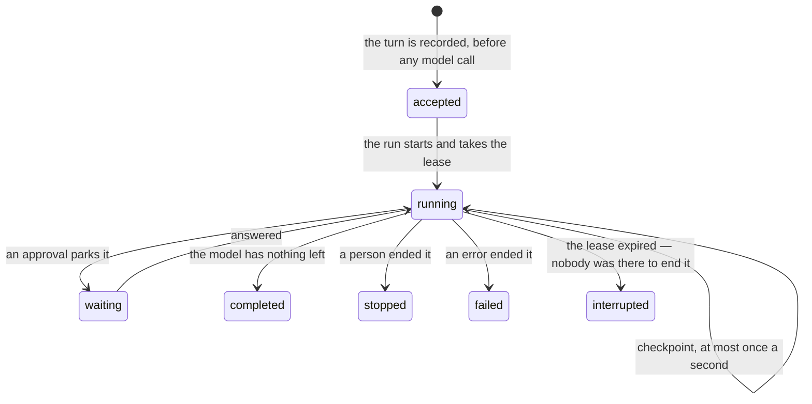

# History and persistence

## Summary

Three things in Froggy have three different lifetimes, and almost every surprise in the product comes from confusing them. **The archive** is written to durable storage before work is attempted and survives everything. **The server's memory** — the run registry, the replay buffer, the model budget's counts, the pairing codes, the browser seats — survives a reload but not a redeploy. **The tab's memory** — the draft, the held message, the markers in the margin, the notices above the composer, the scroll position — survives neither.

This document says where a person meets each boundary on each surface. [The conversation](../foundations/the-conversation.md) owns what a conversation and a turn are and what the eight statuses mean; [resuming](../workspace/conversation/resuming.md) owns replay and reconnection. This one owns what is still there afterwards.

## The simple case

A person asks for something and closes the laptop. The turn was recorded before the model was called, so it is already a fact. They open Froggy the next morning: Home lists the conversation, they open it, and the whole turn is there — the words, the tool cards, the receipts filed beneath them.

What is not there is everything the tab had been holding: the half-typed follow-up, the markers saying "Froggy paused, waiting for your answer", the notice about a turn that started from Telegram. None of it was ever written down.

## The three tiers

| Tier | What is in it | Survives a reload | Survives a sign-out | Survives a redeploy |
| --- | --- | --- | --- | --- |
| The archive and the ledger | Conversations, messages, runs, tool executions, artifacts; the mandate; receipts; tasks, purchases and sales; agent tokens and grants; schedules; the Telegram pairing | Yes | Yes | Yes, **when a database is configured** |
| The server's memory | The run registry, the 8 MB replay buffer, the model budget's daily counts, unredeemed pairing codes, workspace sessions and their browser seats | Yes | Yes | **No** |
| The tab | The draft, the held **Next** message, markers, notices, the Activity filters, scroll position | No | No | No |

> Technical note: the middle row and the top row collapse into one on a deployment with no database. The store and the archive both fall back to an in-memory implementation, the wallet pane marks `database` as stubbed, and **a redeploy then forgets the archive too**. Nothing above that line knows which it is holding, so nothing else in the interface changes.

## What is written, and when

The turn is recorded **before any model is called**: the person's message, an empty assistant message, and a run in status `accepted`. That order is what makes a detach safe.

While it streams, the turn is checkpointed at most once a second, with a ten-second heartbeat behind it so a turn producing nothing still proves it is alive. Each checkpoint renews a **thirty-second lease** on the workspace. A checkpoint that cannot be written aborts the run outright with "History could not be saved. Inspect this run before retrying."

What is saved is not exactly what was shown. Text and tool parts are kept; the model's reasoning and any binary attachment are deliberately not archived. Secrets are stripped on the way in — bearer tokens, key-shaped strings, `password=` pairs, credentials in a URL, and unlock paths all become `[redacted]`, and the record says it was redacted. A tool's input and result are previewed to about 4 KB and the full output kept once as an artifact to 64 KB; past that the record says "[Output truncated; inspect saved tool evidence.]" rather than pretending to be complete.

Only text the person typed is accepted at ingress. A client that sends assistant or tool parts is refused with "Only text messages can be sent here." — client-supplied parts must never become archive or payment provenance.

## What a redeploy leaves behind

A process that dies mid-turn cannot write a status. The next thing to touch that workspace finds a lease that expired and closes the run out on its behalf: the run becomes `interrupted` with the error **"Execution stopped before completion. Inspect payment evidence before retrying."**, its assistant message becomes `interrupted`, every question it was waiting on resolves as `interrupted`, and any tool execution still `running` or `waiting` becomes `uncertain`.

That sentence is not boilerplate. A run that died between reserving a spend and recording it may have paid for something that has no receipt.

The rest of the server's memory simply starts again. The model budget's counts are gone, which at worst hands everyone one more day's turns. A pairing code minted but not yet typed into Telegram stops working. A replay buffer is gone, so a person returning to a turn that survived nothing can only read the archive.

## Signing out, and deleting

Signing out stops the person watching. It does not stop the run, does not touch the archive, and does not clear what the browser saved for itself: the theme preference, the browser pane's width, and — on a local identity — the minted development token all stay in this browser's storage.

**Delete my data** in Account is the only thing that removes the record. It stops the running turn, closes the browser, cancels open purchases and trades, and removes the profile and the records. The dialog says what it does not remove: "Payments that already settled stay in the ledger, because money that moved is not a preference."

## Per surface

**The conversation.** Read back from the archive fifty messages at a time, oldest loaded on demand. A turn still `accepted`, `running` or `waiting` when the page loads is rejoined rather than re-rendered — but only on the first hydration of that conversation, not on every refresh of the snapshot.

**Telegram.** A thread is bound to one conversation, so everything said on the phone lands in the same thread every time. On the first binding only, the messaging SDK's expiring cache is imported so the conversation does not start empty; those messages are marked as recovered and never replace an archive that already exists. Each message Froggy sends is recorded as `pending` before it is sent and becomes `delivered` or `uncertain` — a send that threw is not recorded as delivered.

**The agent surface.** An agent's calls are recorded as executions against its grant. Calls that predate detailed capture are back-filled with their metadata and say so in place of their input; one still marked running ten minutes later becomes `uncertain` with "The call ended without a saved outcome. Inspect its linked business record before retrying."

**The wallet.** Receipts are the ledger's, not the conversation's. A session rehydrates its last hundred, and the ledger outlives everything short of the database going away.

## Variants

| Variant | Set before asking | Changed while it runs |
| --- | --- | --- |
| Who is asking | Recorded as the turn's source — web, telegram, agent or schedule — and never inferred later. | Cannot change. |
| The policy in force | Not part of the record of the turn; the rules that were checked live on each receipt instead. | No effect on what is kept. |
| Funds available | No effect. A refused turn is archived as faithfully as a paid one. | No effect. |
| What is being asked for | Decides how much there is to keep: a long tool output is truncated in the record and kept whole once as an artifact. | A turn past 8 MB stops being replayable; the archive is unaffected. |
| The asking agent's grant | An agent-sourced record is attributable to its grant. | Revocation is a timestamp, so past records stay attributable. |
| The shared browser | The pages visited are not part of the archive; what the browsing cost is. | No effect. |
| Appearance and motion | Rendering only. The theme is saved per browser, not per account. | Rendering only. |

## Cancel and interrupt

| Event | Before the work begins | While it runs |
| --- | --- | --- |
| Stop — the person halts this run | Nothing is recorded. | The turn is checkpointed as `stopped`, keeping everything it had already done. |
| Freeze — the wallet is frozen, mid-run | No effect on the record. | No effect; the refusals it causes are recorded like any other. |
| Denying a waiting approval, or leaving it unanswered | Not applicable. | How the question ended is kept on the run and on the receipt. |
| Asking something else while this request is still in flight | The new turn is appended. | The superseded run is archived as `stopped`, indistinguishable from a person's own stop. |
| Leaving the page, or switching to another conversation, mid-run | No effect. | No effect. The archive keeps being written with nobody watching. |
| Reload; the tab or the app closed | The draft is lost; nothing else is. | The archive is unaffected; the markers, notices and held message are gone. |
| Network lost; the socket drops | The message may never arrive, and nothing is recorded. | The server keeps checkpointing. The tab falls back to the last saved snapshot and says so. |
| The model, a service, or the facilitator errors or rate-limits mid-run | Nothing is recorded. | The turn is checkpointed `failed` with the sentence, or `uncertain` if a payment was in flight. |
| The session expires, or the person signs out | Nothing is recorded. | The record continues; the person stops being able to read it. |
| The policy or a cap changes mid-run | No effect. | No effect on the record of the turn. |
| Funds run out mid-run | No effect. | The refusal is recorded in the turn and on a receipt. |
| The person takes control of the shared browser mid-run | No effect. | No effect. Ownership of the page is not archived. |
| The same account open in a second tab or on a second device | Both read the same archive. | **Only one run may hold the workspace's lease.** The second tab is refused with "Another run is using this workspace. Wait for it or stop it before sending." |

## Interactions with other systems

**The leash.** Not archived as a document per turn. What was in force is reconstructed from the rule ids on each receipt, which is why an allow carries them.

**Money and receipts.** The ledger is the one tier that outlives even **Delete my data**. A spend row is written before the spend is attempted, which is what makes `abandoned` possible at all; see [money](../foundations/money.md).

**Approvals.** A parked turn is `waiting`, and the question is kept on the run with its title, amount, payee, purpose and the options offered — the last twenty per run. How it ended is kept whether or not anybody answered.

**Provenance.** The archive is not signed or posted anywhere. Only spending is provable; see [provenance](provenance.md).

**History and persistence.** This document is it.

**The shared browser.** Nothing the browser did is in the archive except what it cost and what a tool call recorded. Closing the browser view never stops the work and never removes a record.

**Connected agents and grants.** Revocation is a timestamp rather than a deletion, so "which agent asked for that task last Tuesday" stays answerable after the token is gone.

**Notifications.** Notices are archived when they went to Telegram, because a Telegram message is a message in a conversation. The markers a tab files in the margin are not; see [notifications](notifications.md).

**Navigation and URL state.** The conversation id in the URL is what makes a conversation restorable at all. The Activity page's filters are not in the URL and do not survive a reload; see [url state](url-state.md).

**Appearance, motion and accessibility.** The theme and the browser pane's width are saved in this browser rather than on the account, so they do not follow a person to a second device, and a browser that denies storage still works for the tab.

**Offline and reconnection.** An offline tab shows the last saved snapshot and says "Updates are delayed. Showing the last saved snapshot." rather than an empty page.

**Stubs.** A stubbed run is archived like any other. The one place stubbing changes durability is the database: `database=stub` means the archive is memory, and nothing else in the interface says so except the stub chip.

## Edge cases

- A conversation's title is the first hundred characters of the first message, taken once and never regenerated. A conversation opened with "hi" is called "hi" forever, and one started from an empty preview is called "New conversation".
- The preview line under a conversation is rewritten twice per turn: from the person's message when it arrives, and from the answer's text when the turn ends.
- **The model is not given the whole conversation.** The most recent messages are sent up to about 128 KB, and only completed turns go in full; a stopped, failed or interrupted one is reduced to "[Saved partial answer from a {status} run; incomplete.]" plus its text, so the model does not read a half-finished answer as a finished one.
- A repeat of the same message id returns the existing turn rather than appending a second one, so a retrying client cannot double the record or the bill.
- Sending to an archived conversation is refused with "Reopen this conversation before sending." — although nothing in the interface archives one.
- A conversation can be deleted through the API, but not while its run is active: "Stop the active run before deleting this conversation."
- Every record carries a revision, so two writers cannot silently clobber one another; the loser is told the record moved.
- A tool that returned but whose evidence could not be saved aborts the run with "Tool returned, but its evidence could not be saved. Outcome needs reconciliation; do not execute it again."

## Open questions and verification

- **Whether the deployed app runs with a database was not established here**, and it decides whether a redeploy loses the archive. It is visible in the wallet pane as a stub chip, and should be checked before any claim that history is durable is made in a demo.
- Renaming, archiving and deleting a conversation exist as endpoints, and **nothing in the interface calls them**. [The conversation](../foundations/the-conversation.md) says there is no delete and no edit; that is true of what a person can reach and not of what the server offers. The two should be reconciled.
- The eight-status set is written from the schemas and the lease path. An `interrupted` turn has not been watched happen, and what its transcript looks like to a person has not been checked.
- Whether a person is told anything at all when they open a conversation whose last turn is `interrupted` — beyond the recorded sentence — was not established.
- The claim that the tab's markers and notices are lost on reload was read from the reducer's initial state, not watched.
- Retention is not implemented anywhere that was read for this document: nothing appears to expire. `docs/CONVERSATION_RETRIEVAL.md` records production access paths and retention limits and should be read before that is stated as fact.

Verified against the Froggy tree at commit `5caed50`.
