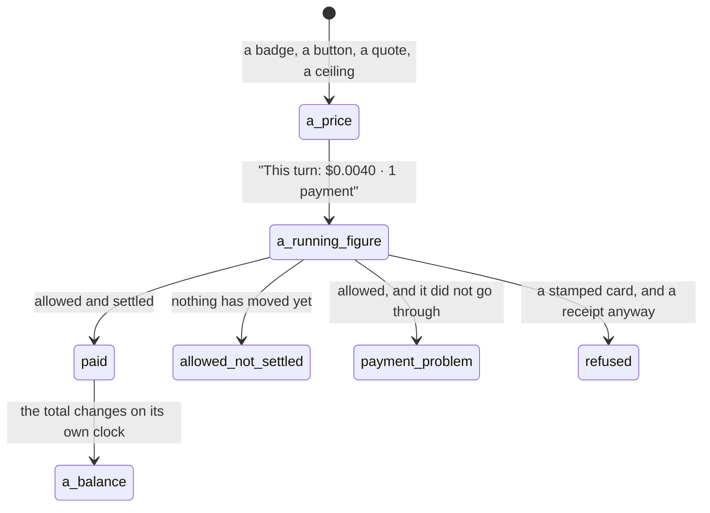

# Money and receipts, everywhere

## Summary

[Money](../foundations/money.md) owns the units, what a quote is, the life of a spend and what a receipt must contain. This document owns the shape of a cost as a person meets it: the price before, the figure while it runs, the receipt after, and the several places each of those turns up.

One thing holds the whole surface together. **The receipt is the same object everywhere** — in the conversation, in the wallet, in an activity record, under a purchase — rendered as the same ticket at the same size, so a person never has to learn a second layout to read what happened.

## A cost has three moments

### Before: the price

A price is shown before anything is bought, and it is a **quote** rather than an estimate — nothing is metered back afterwards.

- On a service card, as a badge: the fixed price beside what the service does and whether it is real on this build.
- On the button that buys it: the price is part of the label, so the last thing a person reads before pressing is what it costs.
- On a URL purchase, as a ceiling the person sets first — "Up to $1 per purchase. You approve the quoted amount." — and then as the seller's actual quote in a second card, laid out as Route, Network, Amount, Token and Recipient. The exact URL, network, token and recipient are promised before the request is made and shown when it is.
- On an approval ticket, as the largest thing on the card.
- For a browse, as a budget the request carries rather than a per-page price.

Beside the price, where it applies, sits the sentence people most need and least want: "Once paid, failed work is not automatically refunded."

### While it runs: the running figure

At the foot of a turn, once anything has been spent or refused: **"This turn: $0.0040 · 1 payment · 2 refusals"**. The refusal count is dropped when it is zero; the line is absent entirely when the turn had no receipts.

The conversation's empty state carries the balance as a link to the Wallet, and the `wallet_status` tool renders as rows rather than the JSON the model got: address, **spent this window**, balance, Hedera account. The window is the widest one any rule declares, so the number on screen is the one the binding rule is using rather than a second approximation that disagrees with the refusal message.

### After: the receipt

The body is for the person: the amount, the asset and payee, a headline, the purpose, and which layer refused if one did. The stub below the perforation is for whoever has to check: the code, the rule, the approval, the transaction, the HCS note, the evidence digest, and always the source of the quote.

The headline is one of five states, and they are five because authorization and settlement are separate facts:

| State | What it means |
| --- | --- |
| Paid | Allowed and settled. |
| Allowed, not settled | The leash said yes and nothing has moved yet. |
| Payment problem | Allowed, and it did not go through. The failure is quoted in the failing party's own words. |
| Refused | The leash said no. A stamp rather than a red box, because a refusal is the product working. |
| Approval required | The question is still open. |

A refused receipt is stamped rather than coloured, and the stamp lands with a stamping motion when the refusal happened while the person was watching.

## Where money is shown

**The Wallet** is one total, "USDC + HBAR", morphing rather than jumping when it changes. Underneath, a disclosure headed "Where it is" breaks it down by chain, with the address and the Hedera account linked out and copyable, and a "Held for Hedera payments" row when Froggy is holding some — "Kept by Froggy until your own Hedera account opens."

An amount the chain did not answer for reads **"Unavailable"**, never zero, and a total with a hole in it says "Total unavailable" rather than a smaller number: "Known balances are shown below. An unavailable balance is not zero."

Below that, Activity: every payment and every refusal as a compact receipt, with the empty state saying so — "Nothing spent or refused yet." / "Every payment and every refusal lands here with its receipt."

**Two things about money arrive as messages in the stream** rather than as a changing figure: "$5.00 arrived and is ready to spend", and, when Froggy converts on the person's behalf, "Froggy moved $0.50 to Hedera for payments; $0.50 is ready there."

**An activity record** shows the cost only once opened. The row carries the source and the status and no money at all; inside, the detail names the quoted price, the approval and its expiry, and the receipts under a heading of their own — with a caution where there are none: "No receipt is linked to this record. A completed call alone does not confirm payment." Repeated status checks are gathered into one line and explicitly excluded: "They are not additional payment receipts."

**Telegram** gets money only in a report of an unattended turn: Spent, Receipts, Refused. The Spent figure counts settled receipts and deliberately leaves out the USDC that only became HBAR, so a conversion inside a payment is not billed to the person twice.

**A connected agent** gets a price and an id. Its ticket carries what it paid and, when the payment settled, a sale id and a receipt id — but **no MCP tool returns a receipt**, so an agent can cite what it bought and cannot produce the record of it. The person's own wallet summary is readable by any grant, including the balance, what has been spent in the window and the allowance in force.

## Variants

| Variant | Set before asking | Changed while it runs |
| --- | --- | --- |
| Who is asking | Decides where the figure is printed: a turn line in the app, a report field on Telegram, an id over MCP. The arithmetic is identical. | No effect. |
| The policy in force | Decides whether a spend happens, not what it costs. A scheduled turn also carries a budget of its own — five cents for the digest, twenty-five for a prompt. | Applies from the next judgement. |
| Funds available | A balance too low is a refusal by balance, with a sentence that says what to do: "Add funds to continue." | Running dry mid-run refuses that spend and the turn line stops growing. |
| What is being asked for | Decides the action kind, its ceiling, and whether the price is fixed, quoted by a seller, or a budget. | The kind is fixed when the intent is built. |
| The asking agent's grant | Recorded against the agent, not in the arithmetic. Its invocations carry what they cost. | No effect. |
| The shared browser | Browsing is bought as an allowance of steps and time rather than a price per page. | Waiting for the person is not charged against it. |
| Appearance and motion | Figures are tabular and morph between values so a changing balance does not move the page. | Rendering only. |

## Cancel and interrupt

| Event | Before the spend is sent | After it is sent |
| --- | --- | --- |
| Stop — the person halts this run | The reservation becomes `abandoned` and consumes no allowance. The turn line keeps whatever it had. | Nothing is undone. The row settles or becomes `uncertain` on its own. |
| Freeze — the wallet is frozen, mid-run | The same: nothing sent, nothing consumed. | No effect on money already gone. |
| Denying a waiting approval, or leaving it unanswered | A receipt is still written, with the refusal and the person's answer in words. A refusal is a record, not an absence. | Not applicable. |
| Asking something else while this request is still in flight | The superseded run's unsent reservation is `abandoned`. | The payment stands and its receipt belongs to the superseded turn. |
| Leaving the page, or switching to another conversation, mid-run | No effect; the spending is the server's. | No effect. The receipts are waiting on return. |
| Reload; the tab or the app closed | No effect. | No effect. A turn that paid is never offered a retry, because that would be paying twice. |
| Network lost; the socket drops | No effect on the spend; the balance on screen goes stale, not wrong. | May end `uncertain`, and the purchase list says so: "Payment uncertain · do not buy again until checked". |
| The model, a service, or the facilitator errors or rate-limits mid-run | Nothing is spent. | "Payment problem", with the failure quoted. |
| The session expires, or the person signs out | No effect; the run is the server's. | No effect; receipts outlive sessions. |
| The policy or a cap changes mid-run | The next judgement uses the new numbers. | Never applied retroactively. |
| Funds run out mid-run | `pocket_exhausted` or `conversion_failed`, and the sentence names which. | No effect. |
| The person takes control of the shared browser mid-run | No effect on cost. | No effect. |
| The same account open in a second tab or on a second device | One ledger; both see the same rows and the same total. | Both see the same receipt. |

## Interactions with other systems

**The leash.** Every figure here is what the leash compares, in micro-dollars, rounded up. See [the leash everywhere](the-leash-everywhere.md).

**Money and receipts.** This document is the map; [money](../foundations/money.md) is the mechanism.

**Approvals.** The answer is part of the receipt in the person's own words, because "allowed" without "because you said so" has lost the fact that made the spend legitimate. See [approvals everywhere](approvals-everywhere.md).

**Provenance.** The receipt's stub is where a cost stops being a claim: the transaction, the note, the evidence. See [provenance](provenance.md).

**History and persistence.** The ledger is written before the attempt and receipts are never rewritten. A reconnecting tab is handed the last hundred receipts.

**The shared browser.** Browsing is paid like everything else and quoted as an allowance the request carries.

**Connected agents and grants.** A receipt says which run spent; the run says which agent asked. The agent itself sees ids, not records.

**Notifications.** Spending raises nothing on its own. Money arriving posts a line in the stream; a refusal does not reach the phone by itself.

**Navigation and URL state.** A record is linkable through the activity record parameter, and "Copy for agent" produces that link with its id. A receipt has no URL of its own.

**Appearance, motion and accessibility.** Figures are tabular numerals and animate between values; ids and digests are in the machine typeface, shortened for reading. A refusal is announced; a payment is not.

**Offline and reconnection.** The ledger is the server's, so an offline tab shows a stale total rather than a wrong one, and the receipts it missed arrive on reconnection with the rest of the turn. The wallet pane says so itself when it cannot refresh: "Updates are delayed. Showing the last saved snapshot."

**Stubs.** A stubbed payment is called a **simulated** one wherever it appears — "Simulated payment" instead of "Paid", a badge on the quote, a badge on the task — and the receipt carries the marker in its data. The one thing these pages must never do is let a fixture pass for a bought answer. See [stubs](stubs.md).

## Edge cases

- **The turn's own cost line counts an allowed-but-failed payment as a refusal**, and leaves its amount out of the dollar figure. Money may have moved. The receipt says "Payment problem" and the line above it says "refusal", which are not the same claim.
- A figure is shown to two decimal places, or four when it needs them, so a third of a cent reads as a third of a cent rather than as zero. A purchase quote can go to six.
- An activity row shows no cost at all. Two runs that spent a dollar and nothing look identical in the list.
- The Wallet shows no policy, though the navigation describes it as "the money, what may be spent, and by whom". The numbers live in Account.
- A conversion has its own receipt and is left out of what a scheduled job reports as spent, so the report's Spent and the sum of its receipts can differ, correctly.
- A person who deletes nothing still accumulates receipts for spends that never happened: refusals are records.
- The command-line tool prints the sale id and drops the receipts unless asked for raw output, so the friendliest surface is the one that shows the least.

## Open questions and verification

- Whether the balance figure includes reserved-but-unsettled rows is not established, and it decides what a person sees mid-run.
- Whether a `failed` receipt is ever reconciled afterwards, and by what, is not established; until then it consumes allowance.
- The agent-facing surface promises "a receipt" in its own installation document and offers ids instead. Either the wording or the tool surface should change.
- The wallet summary — balance, window spent, allowance, policy id — is readable by any connected agent with no scope required, while reading history needs one. Whether that is intended has not been confirmed.
- Whether refused receipts can be filtered apart from settled ones in the Wallet has not been checked by hand.
- Nothing here was watched in the running product; every figure and sentence was read from the tree.

Verified against the Froggy tree at commit `5caed50`.
