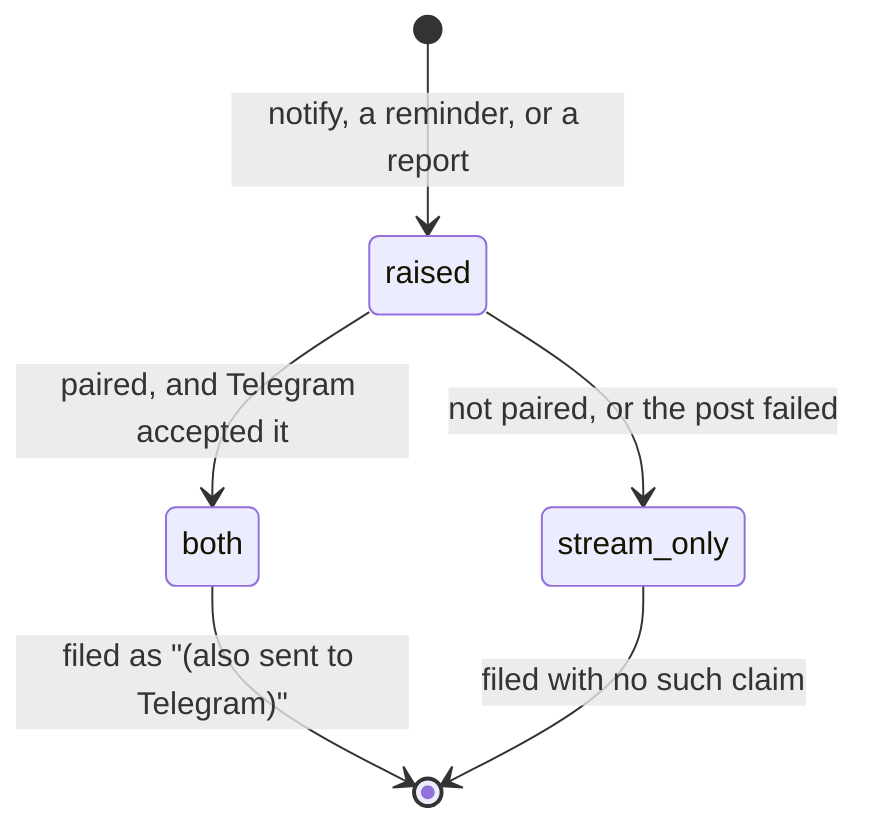

# Notifications

## Summary

Froggy interrupts a person in exactly three ways, and it is worth saying up front how few they are: **the waiting badge**, which follows them around the workspace when an approval is open; **Telegram**, which is the only way anything reaches a person who is not looking at the app; and **the digest and schedules**, which are the clock's way of starting a conversation nobody asked for.

There are no browser notifications, no push, no email and no sound. Everything else Froggy has to say is filed where the person will find it later rather than pushed at them: markers in the margin of the conversation, notices above the composer, receipts in the Wallet.

This document owns where a person meets each of those. [Approvals](../workspace/conversation/approvals.md) owns the ticket itself and the four answers; [the conversation](../foundations/the-conversation.md) owns what is kept.

## The simple case

An agent asks to spend more than the ask line allows on its own. The run parks. Wherever the person is in the workspace, Home grows a count — and if their phone is paired, the same question arrives there as a card with the same four buttons in the same order.

They answer on whichever surface they are looking at. The ticket clears on every tab and the count goes back to nothing.

## The waiting badge

The count is of open approvals and it is carried on Home, because Home is where work reports back.

On the desktop rail it is a number in a pill beside **Home**, and the count is in the link's accessible name as well as in the badge: "Home" and "Home, 1 approval waiting" are different places to a screen reader and the same place to a glance. On a phone the pill shows a **dot** rather than a number, with the count still in the accessible name — so the phone tells a person that something is waiting and not how many.

Home itself carries the fuller version: a card reading "A decision is waiting" or "{n} decisions are waiting", the sentence "Froggy will not spend anything until you answer.", and a **Review** button that opens the conversation.

There is one live region for the whole page, and an open approval outranks everything else in it: a screen reader hears "Your call: {title}". A refusal that landed while the person was watching is announced as "Refused: {sentence}" — but only if nothing is waiting, and only for refusals since this page loaded, so opening the app is not a recital of yesterday.

## Telegram, as a pager

[Pairing](../workspace/account/telegram.md) is a six-character code minted in the workspace and typed into the bot as `/start CODE`. The code avoids `0`, `O`, `1` and `I` because a person reads it aloud and types it on a phone, it is single-use, and it lasts ten minutes — a code that lasts is a code that leaks. Pairing answers with a card: "This chat is now your pager. Reminders, scheduled runs and your daily digest land here, approval questions come here with buttons, and you can talk to the agent by writing to it."

What arrives there:

- **Approval cards.** The same four answers in the same order as the web ticket, as buttons rather than instructions to type. **Allow once** is the primary and **Deny & stop** is the destructive one. Tapping an answer replies "Noted."; tapping a card somebody already answered replies "That question has already been answered." Tapping **Deny & stop** ends the run and withdraws every other open card, on every surface.
- **Notices.** Something the agent says without being asked, from one of three sources: the `notify` tool inside a turn, a reminder coming due, and the report of an unattended turn.
- **Report cards** for the digest and for a scheduled prompt: the outcome in a sentence, then three fields — Spent, Receipts, and how many of them were refusals.
- **Answers.** A message written to the bot starts a turn on the same session, under the same mandate, in the same run registry, so the web app can see it and a stop from either side ends it.

**A notice is filed with the truth about where it went.** The record carries whether Telegram actually took it, and the margin shows "(also sent to Telegram)" only when it did — so a screenshot of the web app cannot imply a message reached a phone when it did not. A notice never throws: the turn that produced it has already done its work, and a failed post is a warning in the log.

The one notice that is deliberately not sent to Telegram is a scheduled run's summary, because its report card has already gone; without that rule the phone would hear the same thing twice.

## The digest and schedules

[The digest](../workspace/account/the-daily-digest.md) is one schedule with an hour and a timezone, or off. When it fires, an unattended turn runs under the person's own mandate with five cents of budget whatever the mandate would allow, a dozen steps, a one-minute ceiling, three read-only tools and **no browser** — a page nobody is watching is a page nobody can take back from the agent. It writes at most four sentences: what changed, what it cost, what was refused and why.

A [scheduled prompt](../workspace/account/schedules.md) is the same shape with the person's own words, a quarter of budget, and a few more tools including `notify`.

Nobody can be asked during either, so an approval resolves as `unavailable` rather than waiting. That is the correct outcome and the report says so.

A person who is mid-conversation is not interrupted: the job reports `skipped` and the clock retries for fifteen minutes before giving up. A skip sends nothing — a "skipped" card every minute is the report nobody asked for.

A reminder is simpler still: it posts a notice and runs nothing. The warning that a mandate is about to expire rides the same clock and is posted as a reminder, so it reaches the phone of somebody who is not looking at Froggy.

## What is filed rather than pushed

The tab keeps its own margin of markers between turns, capped at a hundred: "Froggy paused, waiting for your answer.", "You answered: allowed once.", "$4.00 arrived and is ready to spend.", "Froggy moved $0.50 to Hedera for payments", and — for a turn this tab did not start — "A turn started from Telegram. Reload to follow it here."

Above the composer sit at most three **notices**: protocol errors, and a turn refused before it began. Each can be dismissed; the informational ones carry a **Reload** button.

None of it survives a reload. See [history and persistence](history-and-persistence.md).

## Variants

| Variant | Set before asking | Changed while it runs |
| --- | --- | --- |
| Who is asking | A person's run asks that person. A schedule and the digest have no screen, so their approvals resolve `unavailable` rather than raising anything. An agent's run raises the badge for the workspace's owner, never for the agent. | Cannot change. |
| The policy in force | The ask line decides whether anything is raised at all. | A change does not withdraw a question already asked, and does not clear the badge. |
| Funds available | No effect. A refusal by balance notifies nobody. | No effect. |
| What is being asked for | An `ask`-side action kind raises a ticket at any amount, so a one-cent transfer notifies as loudly as a large purchase. | No effect. |
| The asking agent's grant | **No scope raises or answers a notification.** An agent cannot page the person and cannot answer its own ticket. | No effect. |
| The shared browser | A payment a page demanded raises the same ticket on the same surfaces. | No effect. |
| Appearance and motion | The badge reserves no layout, so it does not shift the rail when it appears. | Rendering only. |

## Cancel and interrupt

| Event | Before anything is raised | After it is raised |
| --- | --- | --- |
| Stop — the person halts this run | Nothing to clear. | The approval resolves `aborted` and the badge clears. Stopping itself notifies nobody. |
| Freeze — the wallet is frozen, mid-run | The spend is refused before it can ask, so nothing is raised. | Open question: whether an open ticket is withdrawn. Freezing raises no notification of its own. |
| Denying a waiting approval, or leaving it unanswered | This is the event. | The badge clears on any answer, on every tab and on the phone at once. |
| Asking something else while this request is still in flight | No effect. | No effect. The ticket and the badge are unaffected by a queued message. |
| Leaving the page, or switching to another conversation, mid-run | No effect. | The badge follows the person; the countdown keeps running whether or not anyone is looking. |
| Reload; the tab or the app closed | Markers and notices are lost. | The ticket and the badge come back from the server; the markers do not. |
| Network lost; the socket drops | Nothing arrives. | The badge freezes at its last value and the answer cannot be delivered. **Telegram is unaffected** — it reaches the person's phone through the server, not through the tab. |
| The model, a service, or the facilitator errors or rate-limits mid-run | Nothing is raised. | The run may end underneath the ticket, resolving it `aborted`. |
| The session expires, or the person signs out | Nothing is shown. | The badge goes with the workspace. A paired phone keeps receiving; **signing out does not stop the pager.** |
| The policy or a cap changes mid-run | Changes whether a question is asked at all. | Does not withdraw a question already asked. |
| Funds run out mid-run | Refused rather than asked, and refusals do not notify. | No effect. |
| The person takes control of the shared browser mid-run | No effect. | No effect. Taking the page notifies nobody. |
| The same account open in a second tab or on a second device | Every tab shows the same count. | The ticket appears everywhere and clears everywhere the moment anyone answers, on any surface including the phone. |

## Interactions with other systems

**The leash.** Only one of the leash's three answers notifies. An allow and a deny are recorded and shown; only _ask_ reaches out.

**Money and receipts.** Spending raises nothing. Money **arriving** raises a marker in the margin — "$4.00 arrived and is ready to spend." — because a deposit lands minutes after the person walked away and the alternative is a total that quietly grew.

**Approvals.** The only thing in Froggy that interrupts. See [approvals](../workspace/conversation/approvals.md) for the ticket and [approvals everywhere](approvals-everywhere.md) for every place one can be answered.

**Provenance.** No interaction. A notification is not evidence.

**History and persistence.** A notice that reached Telegram is a message in a conversation and is archived as one. The badge is derived from open approvals rather than stored. Markers are the tab's and do not survive it.

**The shared browser.** Nothing the browser does notifies, including a takeover. The only page-driven notification is a payment a page demanded, which raises an ordinary ticket.

**Connected agents and grants.** An agent's request raises the same badge as the person's own. No scope answers it, and the agent is not told that a person was asked, only what the answer led to.

**Notifications.** This document is it.

**Navigation and URL state.** The badge is the only navigation-level notification, and it is on Home. Nothing in a notification is addressable by URL.

**Appearance, motion and accessibility.** One assertive live region for the page, fed a single derived sentence so nothing is said twice, with an open approval outranking a fresh refusal. The badge is in the accessible name as well as in the pixels, and it reserves no layout so it never shifts the page when it arrives.

**Offline and reconnection.** An offline tab cannot be notified. Telegram is the answer to that, and it is also the answer to being asleep — which is why the countdown does not pause.

**Stubs.** Without a bot token, Telegram is stubbed: the webhook answers 404 saying "Telegram is not configured on this deployment.", `notify` logs to the console and **returns false**, and every notice is therefore filed as stream-only. A deployment with no bot never looks like a deployment whose bot is silently ignoring people.

## Edge cases

- The phone's pill shows a dot, not a number. A person on a phone knows something is waiting and has to open Home to learn how many.
- The countdown runs on the server. Stepping away from a paired phone and a closed laptop still times a question out.
- **Signing out of the web app does not unpair Telegram.** A person who signs out is still reachable, and still able to approve spending, from their phone.
- A stale approval card is not removed from the Telegram thread when the question is answered elsewhere — it stays in the scrollback and answers "That question has already been answered." when tapped.
- The digest's summary reaches the phone as a card and the web stream as a notice, and the two are worded differently: the card leads with the outcome, the notice with the title.
- A notice is capped at a thousand characters, because it reaches every later prompt through the Telegram thread.
- A turn started from Telegram makes the web composer busy and files a marker offering a reload; the running answer does not stream into the open tab on its own.
- Nothing tells a person that money left, only that it arrived.

## Open questions and verification

- **Whether the Telegram approval card's four buttons behave identically to the web ticket's has not been watched.** The registry check, the "Noted." reply and the withdrawal of other cards on **Deny & stop** were read from the pager; `e2e/telegram.spec.ts` should be read against this section.
- How long the countdown is: the session's approval time-to-live is two minutes. Whether the card on Telegram shows that clock at all, or only the web ticket does, was not established.
- Whether a notice that failed to post to Telegram is retried anywhere was not found; it appears to be dropped after one warning.
- The digest is off until a person sets an hour, so a new account is paged by nothing. What that means for a workspace nobody has visited Account on — that an unattended turn never runs at all — is described in [the daily digest](../workspace/account/the-daily-digest.md) and has not been watched.
- Whether the waiting count includes approvals raised for a connected agent's run, or only the person's own, was read as "all open approvals for the workspace" and not confirmed.
- No verification of any of this can be done on a stubbed build, because a stubbed pager posts nothing.

Verified against the Froggy tree at commit `5caed50`.
