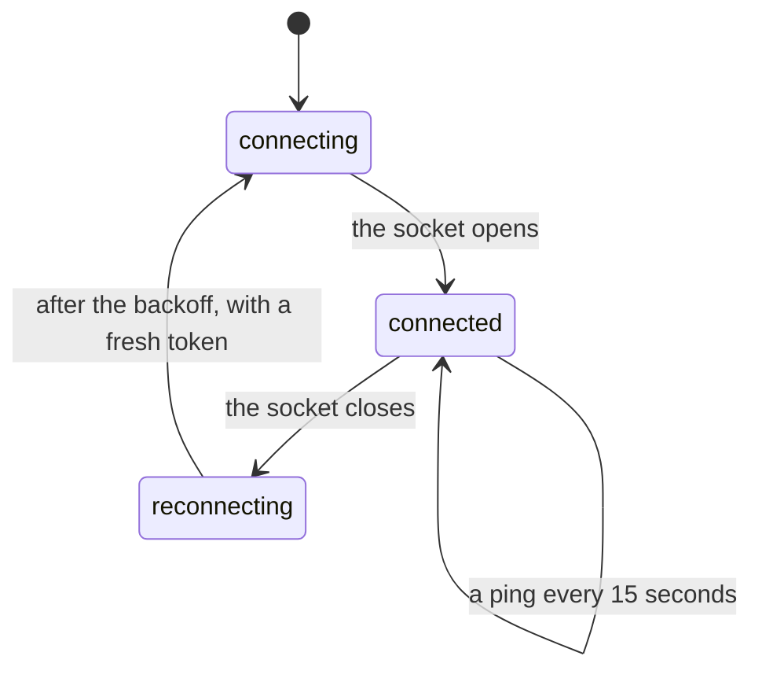

# Offline and reconnection

## Summary

Losing the connection is not losing the work. A run belongs to the server, so a dropped socket is a [detach](../workspace/conversation/resuming.md) — the loop keeps draining, keeps spending and keeps recording, and the person is handed what they missed when they return. This document is about the other half of that: what the workspace itself does while the connection is gone, on every surface, and what a person can and cannot do meanwhile.

[Resuming](../workspace/conversation/resuming.md) owns replay, the 8 MB ceiling and what a returning tab is given. This document owns the connection: how many there are, how they come back, what is disabled and what still works.

## Three connections, not one

The workspace holds two sockets and makes ordinary requests over HTTP, and they fail independently.

| Connection | What it carries | What its loss looks like |
| --- | --- | --- |
| The app socket | Wallet, mandate, receipts, approval tickets, policy decisions | The **reconnecting…** badge in the top bar; the composer locks |
| The browser socket | The screencast and the page's low-rate state | The browser pane's overlay says "Connecting…" and its start button is disabled |
| HTTP | History, receipts, purchases, connections, trades, schedules | Each pane shows its own error where it sits |

They are separate because they have opposite shapes: the browser socket is a firehose of large frames where the newest supersedes every earlier one, and the app socket is a low rate of small facts where every message matters. Sharing one would mean a backlog of frames delaying an approval acknowledgement.

A consequence a person will notice: **one can be down while the other is up.** The screencast can freeze while receipts keep arriving, and the badge in the top bar reports only the app socket.

## The simple case

The network drops mid-turn. Within a moment the top bar grows a small **reconnecting…** badge, and the composer greys out with "Connecting…" where its placeholder was. Nothing else changes: the answer already on screen stays, the wallet still shows its last figure, and the person can still move between pages.

The socket retries on its own, backing off from three-quarters of a second and doubling to a ceiling of five seconds between attempts. When it comes back the badge disappears, the composer unlocks, and the state that arrived while it was gone lands at once — the wallet figure, any receipts, any approval still waiting.

If the turn was still running, it still is. It kept spending while nobody was watching.

## What is disabled, and why

**The composer.** Locked, with "Connecting…" as its placeholder and its send button disabled. A person cannot type a message into a socket that is not there, and the alternative — accepting it and failing on send — loses what they wrote. The composer is disabled for two other reasons that read the same way: while saved history is loading, and after a history load failed, where the placeholder becomes "Reload history before sending."

**Starting the browser.** The overlay's button is disabled while disconnected, so a person cannot ask for a browser nobody will hear about.

**Answering an approval.** The answer has to reach the server. The countdown does not pause for the connection — an approval can time out while a person is offline looking at it, and that is the sharpest cost of a drop.

## What still works

Everything already loaded. Navigation between pages is client-side, so the pages a person has visited still render. The look and every animation are local. The wallet address in [add funds](../workspace/wallet/add-funds.md) is still there and still copies. Receipts and history already on screen are still readable.

They are **stale, not wrong**. The ledger is the server's, and a person offline sees the last figure they were told rather than an invented one. Nothing in the interface marks a figure as stale; the badge in the top bar is the only signal that what is on screen may have moved on.

## Coming back

Reconnection is a first-class path rather than error handling. Three things happen on the way back.

**A fresh token, per attempt.** The token is fetched again for every attempt rather than once at the start, because a laptop that slept for an hour wakes with an expired one, and a socket retrying forever with a stale credential would never come back.

**The whole state, resent.** The server opens with a welcome carrying the session, which integrations are live or stubbed, the MCP address, and the signer and policy in force; then the mandate, then the wallet, then the receipts. The tab is not asked to reconcile a diff — it is told what is true.

**The turn, replayed.** If a run is still going in this conversation, what was missed arrives at once and the rest continues live. That is [resuming](../workspace/conversation/resuming.md), and it is checked against both the person and the conversation before anything is handed over.

> Technical note: a ping every fifteen seconds keeps both sockets from being closed by an idle proxy. It is not a health check the person ever sees.

## Variants

| Variant | Set before asking | Changed while it runs |
| --- | --- | --- |
| Who is asking | Only the person in a browser has sockets. An agent over MCP, a Telegram message and a schedule reach the server directly and do not care whether a tab is open. | No effect. |
| The policy in force | No effect. Judgement is the server's and continues with nobody watching. | A refusal that happened while offline is seen on return, not missed. |
| Funds available | No effect. | A spend that ran out of money while offline is a receipt waiting on return. |
| What is being asked for | A browsing turn depends on a second socket, so it has a second thing that can drop. | The screencast can freeze while the answer keeps streaming, and vice versa. |
| The asking agent's grant | No effect. | Revoking a grant does not need the person's tab. |
| The shared browser | The pane's overlay reports the browser socket, separately from the top bar. | The browser itself is unaffected by the person's connection; only the picture stops. |
| Appearance and motion | No effect. Both are entirely local. | No effect. |

## Cancel and interrupt

| Event | While disconnected | On reconnection |
| --- | --- | --- |
| Stop — the person halts this run | Offline is exactly when a stop cannot be delivered, which is why an unconfirmed stop is an alert with **Retry stopping** rather than a silent failure. See [freeze](../workspace/conversation/freeze.md). | The stop is retried by hand, not automatically. |
| Freeze — the wallet is frozen, mid-run | Cannot be delivered either. The wallet keeps spending until the freeze arrives. | Takes effect from the next judgement. |
| Denying a waiting approval, or leaving it unanswered | The answer cannot be sent. The countdown continues on the server. | The ticket may already have resolved as `timeout`. |
| Asking something else while this request is still in flight | Cannot be asked; the composer is locked. | The composer unlocks with the draft intact. |
| Leaving the page, or switching to another conversation, mid-run | Free. Pages already loaded still render. | Nothing to reconcile. |
| Reload; the tab or the app closed | A reload while offline gets nothing: the app cannot load. | The run is found still going and replayed. |
| Network lost; the socket drops | This document is that event. | Backoff, fresh token, full state, replay. |
| The model, a service, or the facilitator errors or rate-limits mid-run | It happens anyway; nobody is watching. | Seen as a failed card on return. |
| The session expires, or the person signs out | The socket cannot reopen — the token fetch returns nothing and the retry keeps backing off, indefinitely and silently. | Signing in again is what fixes it. |
| The policy or a cap changes mid-run | A change made in another tab or by another agent applies on the server regardless. | The new mandate arrives with the rest of the state. |
| Funds run out mid-run | Refused on the server, receipted, and seen later. | The receipt is waiting. |
| The person takes control of the shared browser mid-run | Cannot be done: input needs the browser socket. | Ownership is whatever it was left as. |
| The same account open in a second tab or on a second device | The other tab may still be connected and watching the same run. | Both converge on the same state; neither is authoritative. |

After a drop the person is left where they were, with what they were last told, and nothing is rolled back — because nothing on the client was ever the record.

## Interactions with other systems

**The leash.** Unaffected. A person offline is not less protected; they are less informed. See [the leash everywhere](the-leash-everywhere.md).

**Money and receipts.** Money moves while the tab is gone. Receipts are the record and are waiting on return; the balance on screen meanwhile is the last one delivered. See [money](../foundations/money.md).

**Approvals.** The one thing genuinely lost to a drop, because the clock does not stop. See [approvals](../workspace/conversation/approvals.md).

**Provenance.** No interaction. What is provable is on a chain, not in a socket.

**History and persistence.** History is durable and read back over HTTP; replay is a convenience over it. A turn whose replay was lost to the 8 MB ceiling is still in history.

**The shared browser.** Reconnects on its own, independently of the conversation. The browser is not affected by the person's connection — only the picture of it is. See [the shared browser](../foundations/the-shared-browser.md).

**Connected agents and grants.** An agent's run needs nobody watching at all, so a person's connection is irrelevant to it. See [identity and agents](../foundations/identity-and-agents.md).

**Notifications.** Telegram is how a person finds out something happened while they were not connected, and the only channel that reaches them off the page.

**Navigation and URL state.** Client-side, so it works offline for pages already loaded. The conversation id in the URL is what a resume is matched against; see [url state](url-state.md).

**Appearance, motion and accessibility.** The loss is a visual badge only — nothing is announced. See [accessibility](accessibility.md).

**Stubs.** No interaction. Which integrations are stubbed is delivered with the rest of the state on connection, and a stubbed build reconnects exactly like a live one. See [stubs](stubs.md).

## Edge cases

- **Nothing distinguishes "your network is down" from "the server is down" from "you are signed out".** All three produce the same **reconnecting…** badge and the same locked composer. The browser's own online state is never consulted anywhere in the app.
- The badge reports the app socket only. A frozen screencast with a healthy app socket shows no badge at all.
- The backoff ceiling is five seconds, so a long outage retries steadily rather than giving up. There is no "reconnect now" control and no attempt count shown.
- A signed-out tab retries forever without saying so, because the token fetch failing is treated the same as a socket failing.
- Popping the browser out drops the main tab's browser socket deliberately, so the server casts to one watcher. To the main tab this is indistinguishable from a disconnection.
- A pane fed by HTTP that failed while offline does not retry when the socket comes back; its own error stays until something re-requests it.
- The composer's draft survives a drop, because it never left the tab.

## Open questions and verification

- Whether a pane fed by HTTP refetches on reconnection, or waits for a navigation, was not established and is the most likely source of a stale page after a long outage.
- Whether the two sockets ever reconnect at meaningfully different times, and what the pane looks like in between, has not been watched.
- The signed-out case — a retry loop with no message — was read from the token path in the socket hook, not observed.
- Whether an approval that timed out while the person was offline leaves any trace they can find afterwards, beyond a receipt with the `approval_timeout` code, is not established.
- No specification in `e2e/` exercises a socket drop and recovery; `screens.spec.ts` asserts only that the **reconnecting…** badge is absent on a healthy load.
- The "about a moment" for the badge to appear is the close event firing, which in a real network partition can take much longer than a deliberate close. Not timed.

Verified against the Froggy tree at commit `5caed50`.
