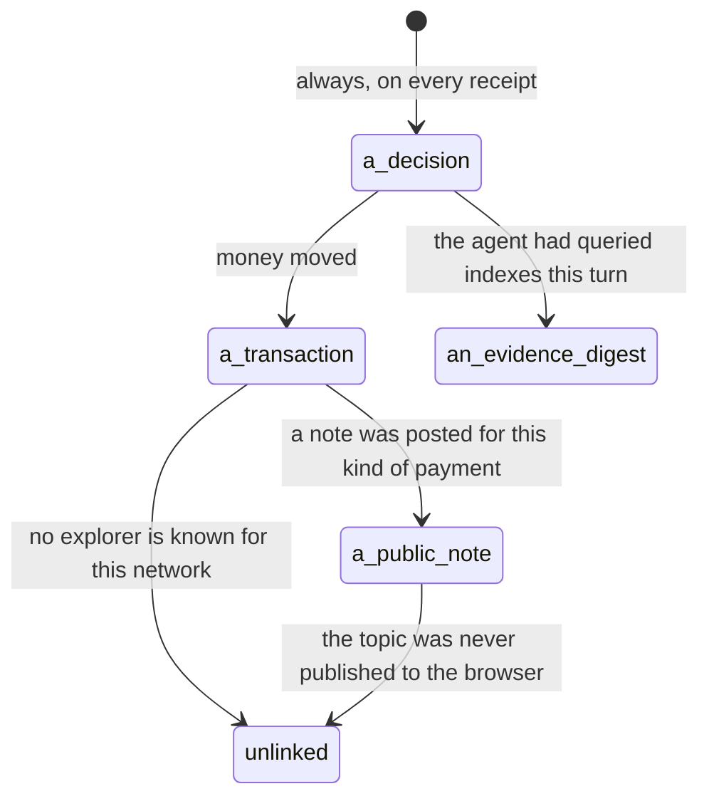

# Provenance

## Summary

Provenance is what makes a spend checkable afterwards by someone who was not there. It is the answer to "prove it" — and Froggy's answer is not one thing but four: the transaction on a chain, a public note on a Hedera topic, the evidence the agent was acting on, and the decision that let it through.

The word carries two meanings in this product and they must not be run together. A payee's **origin** — `mandate`, `server`, `user`, `model`, `page` — is a rule about what may be paid, and belongs to [the leash](../foundations/the-leash.md). Everything else here is about what can be shown afterwards. This document owns the second: where the proof appears, what it links to, and — the part that matters most — **what is not provable**.

## The four things a receipt can point at

Every one of them appears on the stub of a [receipt](../workspace/wallet/receipts.md), in the machine typeface, below the perforation.

**The decision.** `rule rul_…` for an allow, or `code` and the rule for a deny. This is the only one that is always there. It is Froggy's own record and nothing outside Froggy can confirm it.

**The transaction.** The network and the chain's own transaction identifier, linked to an explorer when Froggy knows one: HashScan for Hedera, Basescan for Base. A Hedera transaction id is not a `0x` hash — it looks like `0.0.7162784@1788674975.439553201` — and it is shown as it is. Where no explorer is known the id is shown as plain text rather than linked to a guess, because a wrong explorer is worse than none.

**The HCS note.** A short public message on a Hedera Consensus Service topic, shown as `hcs #N` and linked to that message when the topic is known. It carries seven fields and no identifiers: the amount, the asset, the network, the time, the transaction id, whether Froggy was buying or selling, and the app's own reference id. The point is an audit trail that does not depend on trusting Froggy's database — and the absence of user identifiers is why it can be public at all.

**The evidence.** A disclosure headed "Because 4 of 12 Graph indexes answered at a current block", opening onto one line per index: its label, the block it was at, and whether it was `fresh`, `stale` or `unavailable`, with the snapshot digest at the foot. A stale index contributed nothing to the answer — an index more than two hours behind is dropped rather than quietly folded in, because a borrow rate from an index that stopped six weeks ago looks exactly like a fresh one.

> Technical note: the topic is one per deployment, not one per person or per session, and the note is posted by the host's own Hedera account. Posting is best effort and never fails a payment: a note that cannot be posted leaves the receipt with no `hcs` line and no other trace.

## Where a person meets it

**In the conversation and the wallet**, on every receipt ticket, in the same shape. The evidence disclosure is closed by default; the transaction and the note are one click from the page.

**On the balance**, indirectly: the Wallet's "Where it is" disclosure links the wallet address to a block explorer and the Hedera account to HashScan, so the figure on the page can be checked against the chains it is made of.

**On a one-time unlocked page**, when a purchase delivers something: the seller, the price, the network, the linked transaction and the HCS note number, beside the thing that was bought. It opens once and expires in ten minutes; the receipt in the workspace is the durable record.

**Before paying anything at all**, at `/.well-known/x402.json`: what this server sells, how it is paid, and where the trail is, including the topic id. Plain JSON anyone can fetch before they trust it.

**At `/health`**, which says per integration whether it is live or stubbed. This is how a person or a judge answers "was any of this real" without reading a receipt.

## What is actually provable

Worth being exact, because the honest list is shorter than the impression:

| Claim | Provable? |
| --- | --- |
| This much of this asset moved on this network | Yes, by the transaction, on a public explorer. |
| A note about it exists that Froggy cannot silently edit | Yes, when the receipt carries an `hcs` line. |
| The agent was looking at these indexes at these blocks | Yes, as a claim on the receipt; the digest ties the receipt to one snapshot. |
| That snapshot really held those numbers | Only if you kept the snapshot. The receipt carries a digest, not the data. |
| This rule allowed it | No. That is Froggy's own record, and a reader is trusting the database for it. |
| The person answered at 14:02 | No, same reason. The approval's resolution is on the receipt, not on a chain. |

The design is explicit about where the line is. The public note deliberately names nobody, which is what lets it be public — and is also why it cannot prove **whose** payment it was.

## Variants

| Variant | Set before asking | Changed while it runs |
| --- | --- | --- |
| Who is asking | No difference in what is recorded. A receipt from a schedule, an agent or Telegram carries the same four parts, minus the tool call it was filed under. | No effect. |
| The policy in force | Decides the decision the receipt records, not what is provable about the payment. | The next spend's receipt reflects the new numbers. |
| Funds available | A spend refused for want of funds has a decision and no transaction, so there is nothing on a chain to point at. | No effect. |
| What is being asked for | This is the biggest difference. Only the built-in lending oracle attaches evidence; only some payment paths post an HCS note. | The kind is fixed when the spend is built. |
| The asking agent's grant | Recorded on the agent's trail, not in the proof. | No effect. |
| The shared browser | Browsing produces receipts with a transaction and no evidence: what a page said is not part of the record. | No effect. |
| Appearance and motion | The stub is machine type; links are dotted underlines that solidify on hover. Rendering only. | Rendering only. |

## Cancel and interrupt

| Event | Before the payment is sent | After it is sent |
| --- | --- | --- |
| Stop — the person halts this run | Nothing to prove; the reservation is `abandoned`. | The transaction is on the chain whatever the run did next. The HCS note may not be posted if the run ended first. |
| Freeze — the wallet is frozen, mid-run | The receipt records a refusal with no settlement. | No effect on what already settled. |
| Denying a waiting approval, or leaving it unanswered | The resolution is recorded on the receipt in the person's own words — "you said no", "nobody answered", "nobody to ask". | Not applicable. |
| Asking something else while this request is still in flight | The superseded run's reservation is `abandoned` and proves nothing. | The receipt belongs to the run that made it, not to the one that replaced it. |
| Leaving the page, or switching to another conversation, mid-run | No effect. The recording is the server's. | No effect. |
| Reload; the tab or the app closed | No effect. | No effect. |
| Network lost; the socket drops | No effect on what is recorded. | A payment that cannot be confirmed becomes `uncertain`; the mirror node is asked again before anything is called failed. |
| The model, a service, or the facilitator errors or rate-limits mid-run | No settlement, so no transaction and no note. | The receipt says the mandate allowed and the payment did not go through, in the failing party's own words. |
| The session expires, or the person signs out | No effect. | No effect; receipts outlive sessions. |
| The policy or a cap changes mid-run | The next receipt cites the new rules. | Never applied retroactively; a receipt is never rewritten. |
| Funds run out mid-run | A refusal with a code and no chain trace. | No effect. |
| The person takes control of the shared browser mid-run | No effect. | No effect. |
| The same account open in a second tab or on a second device | Both see the same receipts. | Both see the same links. |

## Interactions with other systems

**The leash.** The decision on the receipt is the leash's own record, and the payee's origin is the one provenance check that happens _before_ money moves rather than after. See [the leash everywhere](the-leash-everywhere.md).

**Money and receipts.** A receipt is where all of this lives; [money and receipts](money-and-receipts.md) owns its shape and the life of a spend.

**Approvals.** The person's answer is on the receipt beside the rule, because "allowed" without "because you said so" has lost the fact that made the spend legitimate. It is not on any chain.

**Provenance.** This document is it.

**History and persistence.** Receipts are durable and are never rewritten. A `failed` or `uncertain` spend is reconciled by asking a mirror node — three times, two seconds apart, because the first look after a failure is usually too early — and "nobody knows" stays `uncertain` rather than being resolved by assumption.

**The shared browser.** Nothing a page showed is part of the proof. A screenshot is not evidence in this product's sense, and the browser produces none.

**Connected agents and grants.** An agent reading its own receipts sees the same four parts. Which agent asked is on the invocation trail, not on the chain.

**Notifications.** Nothing about provenance is pushed. A person who wants the trail goes and looks at it.

**Navigation and URL state.** Explorer and HashScan links leave the app in a new tab. A receipt is reachable through the activity record parameter.

**Appearance, motion and accessibility.** The evidence disclosure is a plain `details` element, closed by default and openable by keyboard; the digest and ids are in the machine typeface and truncated for reading, never for the record.

**Offline and reconnection.** Nothing about the trail depends on the person's connection: notes are posted, transactions are reconciled and receipts are written with nobody watching. What a person loses by being away is the moment, not the record — and the explorer links need the network like any other link.

**Stubs.** This is where stubbing matters most and the design is unusually careful about it. A stubbed payment produces a transaction id that is literally the string `stub-not-a-real-hedera-transaction-…`, never anything shaped like a real id. A stubbed HCS writer returns nothing at all rather than a fake sequence number, so there is no `hcs` line to mistake for one. Stubbed evidence reports **every** index as `unavailable`, noted "fixture, not queried", because a stub claiming four healthy indexes would be exactly the screenshot the whole split exists to make impossible. And a real payment made on fixture evidence marks the entire receipt `stubbed`: paying real money against a fixture is still not a real answer. See [stubs](stubs.md).

## Edge cases

- **The topic id the browser is told is the configured one.** When no topic is configured, Froggy creates one at first use and logs it — but the browser is still told there is none, so receipts show a bare `#7` with nothing to click. The proof exists and the link does not.
- Not every payment gets a note. A note is posted for the oracle's own purchases and sales and for what Froggy pays The Graph; ordinary third-party x402 purchases and trades post none. A receipt with no `hcs` line is not necessarily a stub.
- The note for a sale is posted without waiting, because the buyer is owed an answer now and the note is for whoever audits later. A note for a purchase is waited for, because its sequence number belongs on the receipt.
- Evidence exists only when a Graph query ran earlier in the same turn and the purchase was Froggy's own oracle. Every other receipt has no "Because" disclosure at all, and its absence says nothing about whether the agent had a reason.
- The snapshot digest includes the moment of capture, so two identical queries a minute apart produce different digests. It ties a receipt to one snapshot; it cannot be used to tell whether two receipts saw the same numbers.
- Solana is a network the product can hold assets on and has no explorer mapping, so a Solana settlement would show an unlinked id.
- The Hedera topic link falls back to testnet for any network it does not recognise, so a note whose settlement network is not Hedera mainnet links to a testnet topic page.
- A settlement can carry a one-sentence side note — a USDC transfer that also opened and funded the person's Hedera account says so — and the receipt ticket does not render it anywhere.

## Open questions and verification

- Nothing here was checked in the running product. Every link shape, id format and disclosure was read from the tree.
- Whether a person can tell, from the workspace alone, that a topic exists but was not published to the browser has not been established; from the code they cannot.
- The one-time unlocked page's link table does not handle Hedera mainnet, so a mainnet purchase's transaction would appear there unlinked. Not confirmed by hand and worth treating as a defect.
- Whether anything reconciles a `failed` receipt to `settled` after the fact, beyond the mirror-node check at the moment of failure, is not established.
- What an external agent is shown of the trail — whether the receipts it reads carry the same links and digests — was not confirmed here; see [reading results and receipts](../agent-surface/reading-results-and-receipts.md).
- The claim that the HCS note names nobody was read from the message shape; whether the reference id can be correlated to a person by someone holding other data has not been analysed.

Verified against the Froggy tree at commit `5caed50`.
