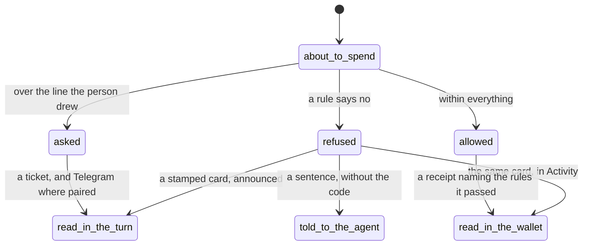

# The leash, everywhere

## Summary

There is one leash and one judgement. [The leash](../foundations/the-leash.md) owns what the rules are, the three decisions, the order they run in and the denial codes; this document is about where a person **meets** them — the four numbers they set, the sentence they read when something is refused, and the fact that the same sentence is the same sentence on every surface.

The thing worth carrying away is that the leash is never a mode. There is no "supervised" toggle, no place where it is off, and no surface that shows a decision a different surface would not have made. What changes between surfaces is only how much room there is to say it.

## Where the numbers are set

Two places, and they are the same form mounted twice.

**At the moment of granting**, in the sheet that asks the person to let the agent pay: "Up to $2.00 a payment, $10.00 a day, asking you above $1.00, for 30 days", with **Adjust** beside it. Tapping through without changing anything gives those numbers. Thirty days is Privy's own ceiling rather than a product choice, and the form says so when a person tries for more: "Privy allows at most thirty days; ask again when it runs out."

**In [the policy editor](../workspace/wallet/the-policy-editor.md) afterwards**, reached from Account, under **Connection** — not from the Wallet, which shows the money and not the rules. The card states the leash in a sentence — "Your agent may pay up to $2.00 at a time and $10.00 a day, and asks you above $1.00" — with **Change these** and **Extend to 30 days** beneath it, and a line saying when the permission runs out.

The four fields say what each number means rather than naming it: "Anything above this is refused outright, not asked about", "Rolling, not midnight to midnight, so it cannot be emptied twice in two minutes", "Below this the agent pays on its own. Paying a person always asks, whatever this says", "Days, up to thirty."

Two combinations are refused before they can be saved, because both are accepted arithmetic that mean the opposite of what the person intended: a daily limit below the single-spend limit ("so no spend could ever happen"), and an ask line above the single-spend limit ("means you would never be asked").

Saving is not instant and not guaranteed: the button reads "Asking Privy…", and if Privy refuses, the refusal is shown in its own words rather than swallowed — "If Privy will not let a person edit a policy they own, this is where everyone finds out."

**One other surface adds to the leash without touching the numbers**: the paid-endpoints directory, under Account. Adding a host puts it and its payee on the mandate's allowlists, and the page is explicit that this is the consequential click — "A stranger's 402 becomes payable only once it is in this list", and it is a person's click, never the agent's.

Nowhere else. No agent, no scope, no tool and no Telegram command changes any of it, and no answer to an approval raises a cap — the one exception writes a rule rather than editing a number, and it is described below.

> Technical note: those four numbers are compiled into two enforcements from one shape: an allow rule per standing action kind in the person's Privy policy, and the matching per-transaction cap, window cap, expiry and approval threshold in Froggy's own mandate. They cannot drift apart because there is only one shape. An `ask` kind gets no Privy rule at all, so the signer's default refusal catches it.

## Where a decision is read

### In a conversation

A refusal arrives as a card in the turn — a receipt ticket with a **Refused** stamp, which lands with a stamping motion when it happened while the person was watching. It is a card, not an error banner: a refusal is the product working, and it is rendered like every other receipt rather than like a fault.

The card says which of two layers refused, in its own sentence:

| What the ticket says | What happened |
| --- | --- |
| "The mandate refused, before any key was touched." | The leash said no. The stub carries the denial code and the rule that produced it. |
| "The mandate allowed; the signer refused, under its own policy." | Privy refused after the mandate allowed. |
| "The mandate allowed; the payment did not go through." | Nobody refused; it failed. |

Under that sits the plain sentence for the code — "Over the cap for one payment.", "That payee is not on the list.", "The address came from a page or from the model, not from you.", "The wallet is frozen." — and on the stub, the code itself and a short form of the rule id. The code is the record; the sentence is what the person reads.

A [tool call](../workspace/conversation/tool-calls.md) whose spend was refused takes the phase `refused`; one a person refused takes `denied`. The words are different because the facts are.

A refusal is also announced: one live region per page carries "Refused: {the sentence}", so a person not looking at that corner hears it. A waiting approval outranks a fresh refusal in that region, because a question is more urgent than a fact.

### In the wallet

Refusals sit in the same list as payments, as receipts with the same shape. That is deliberate: the wallet's record of what was refused is as complete as its record of what was paid, and a person auditing their own agent can read both in one place.

### On an approval ticket

_Ask_ is the leash handing the decision over; every place it can be answered is [approvals everywhere](approvals-everywhere.md). The leash's part is what happens after the answer: **an approval satisfies only the question "is this big enough to want a person"**. Every cap, every allowlist and the payee's origin are judged again afterwards, so a mandate edited while the card was open still refuses.

### On Telegram

The same four buttons in the same order, as a card rather than a page. A refusal does not reach Telegram on its own — no refusal is ever pushed to the phone by itself. It arrives folded into what the agent said, or as the count on a report card for an unattended turn: Spent, Receipts, **Refused**.

### On a schedule

An unattended turn is held to a budget of its own on top of the leash: five cents for the daily digest, twenty-five cents for a prompt the person wrote. Past it, the refusal is `run_budget_exceeded` — "This scheduled run has reached its spending budget." The digest's own setting says the rest out loud: "Nobody can be asked, so a spend that needs your answer is refused."

### To a connected agent

An agent is told a sentence and nothing more. **The denial code does not cross the MCP surface**: the agent reads the refusal as a task that failed with prose — "This spend is over the automatic limit and there is no one to ask from here" — with no code and no rule id. The code is kept, on the receipt, for the person.

What it is not told is not a way around anything. No scope raises a cap, adds a payee, or answers a ticket; the routes that would are refused to an agent token outright, with "An agent token cannot do this." An agent with every scope Froggy offers still spends under the person's numbers, and the instructions it is handed say what to do when it meets them: "A refusal from the wallet … is the person's rule. Report it in those words and stop."

## Variants

| Variant | Set before asking | Changed while it runs |
| --- | --- | --- |
| Who is asking | Nothing. The same judgement for the person, an agent, Telegram and a schedule. What differs is where the sentence is printed. | No effect. |
| The policy in force | This is the subject. The numbers in force at the instant of each spend are the ones applied. | Applies from the next judgement; a spend already allowed is never revisited. |
| Funds available | The leash judges before the balance does. A spend can pass every rule and then be refused by the pocket. | Running dry mid-run refuses with `pocket_exhausted` or `conversion_failed`, which no policy change fixes. |
| What is being asked for | The action kind decides the ceiling and which side of the human line the spend sits on, before any amount is considered. | The kind is fixed when the intent is built. |
| The asking agent's grant | Bounds what may be asked for; the leash independently bounds what may be spent. The narrower wins. | Revoking mid-run does not un-judge what was already allowed. |
| The shared browser | The browser is why the origin check exists: an address read off a page is the canonical thing the leash refuses. | Taking the page is not a spending question. |
| Appearance and motion | The refused stamp and the tone of the ticket. Rendering only. | Rendering only. |

## Cancel and interrupt

| Event | Before a spend is judged | After it is allowed |
| --- | --- | --- |
| Stop — the person halts this run | The spend never reaches the leash. | Money already moved has moved; stopping is not a rollback. |
| Freeze — the wallet is frozen, mid-run | The sentence exists — "The wallet is frozen." — and nothing in the tree produces the code that shows it. See the edge cases. | No effect on what settled. Freezing outlives the run. |
| Denying a waiting approval, or leaving it unanswered | Recorded as `approval_denied`, `approval_timeout` or `approval_unavailable` — three codes, three different facts. | Not applicable. |
| Asking something else while this request is still in flight | The new run supersedes the old; a reservation the old run never sent is `abandoned` and consumes no allowance. | The spend stands and keeps its receipt. |
| Leaving the page, or switching to another conversation, mid-run | No effect. Judgement is the server's and continues with nobody watching. | No effect. |
| Reload; the tab or the app closed | No effect. | No effect. |
| Network lost; the socket drops | No effect on the judgement. The person sees the refusal when they return. | A payment sent and never confirmed is `uncertain`, not refused. |
| The model, a service, or the facilitator errors or rate-limits mid-run | No spend is judged. | The receipt says the mandate allowed and the payment did not go through. |
| The session expires, or the person signs out | The mandate's expiry is its own clock and outlives the session. | No effect. |
| The policy or a cap changes mid-run | The next judgement uses the new numbers, including a question already on screen when it is answered. | Never applied retroactively. |
| Funds run out mid-run | Refused by balance rather than by rule — `pocket_exhausted`, `conversion_failed`. A person reading the sentence should know no rule refused them. | No effect. |
| The person takes control of the shared browser mid-run | No effect. | No effect. |
| The same account open in a second tab or on a second device | One leash, one set of counts. Both tabs see the same refusal. | Both see the same receipt. |

## Interactions with other systems

**The leash.** This document is where it is met; [the leash](../foundations/the-leash.md) is what it is.

**Money and receipts.** Every decision lands on a receipt — the rules satisfied, or the code and the rule that refused. See [money and receipts](money-and-receipts.md).

**Approvals.** _Ask_ is the leash's third answer, and answering "allow for this session" is the one way a person writes a rule without opening the editor: an ask exemption for one payee, one ceiling, one expiry. The threshold rule stays.

**Provenance.** Where a payee came from is the first thing checked and the only check no amount can be small enough to pass. See [provenance](provenance.md).

**History and persistence.** Rules and their edits are durable, and the rolling window is computed over recorded spends rather than a counter, so a restart cannot lose or invent allowance.

**The shared browser.** Browsing is paid, so the leash is in the loop of every page fetched for money, and a paid browse carries its own budget on top of the person's.

**Connected agents and grants.** Two independent bounds. Neither substitutes for the other, and no scope widens the leash.

**Notifications.** A refusal raises no notification of its own. An _ask_ raises the waiting count on Home and a card on Telegram where it is paired.

**Navigation and URL state.** No part of the leash is in the URL. The editor is a page on the Wallet; a refusal is a card, not a route.

**Appearance, motion and accessibility.** Refusals are announced through the page's one live region, and the stamp is motion carrying meaning rather than decoration. The approval buttons put the primary yes last, furthest from a stray click.

**Offline and reconnection.** Judgement happens on the server. A person offline is not less protected; they are less informed, and catch up on reconnection.

**Stubs.** The leash is never stubbed — it is local arithmetic over local rules, which is what makes the refusal demo honest. What is stubbed is the settlement underneath, and the receipt says so. See [stubs](stubs.md).

## Edge cases

- The first refusal wins, so a spend that breaks three rules is explained by one, and fixing that reason can immediately produce the next.
- Two of the codes a person will read are not the leash refusing at all: `pocket_exhausted` and `conversion_failed` are the money not being there. The sentence for the first says what to do — "Add funds to continue."
- `unpriceable` carries no rule id, so its ticket has a code and a sentence and nothing to point at.
- The window cap moves continuously. A refusal now can become an allowance twenty minutes later with nothing changed and nothing announced.
- An address the person typed this turn passes the origin check and still meets every cap, which is the intended shape: a person naming a payee is refused by a rule, not by a rule about where the address came from.
- A refused spend still writes a receipt, so the wallet accumulates a history of things that did not happen. That is the record working as designed and it surprises people.
- The same amount to the same address is judged differently depending on what it is called: `service_payment` is standing, `transfer` always asks.
- **There is no freeze control in the workspace.** The denial code, its sentence and the interface's handling of it all exist, and nothing writes it: the kill-switch rule was removed and the code is kept so older receipts still read. Meanwhile the signed-out page still promises "Freeze spending or disconnect an agent whenever you need." Disconnecting works; freezing has no button.
- The Wallet is described in the navigation as "the money, what may be spent and by whom", and shows no policy at all. A person looking for their own numbers has to be in Account.
- A person whose permission is near its end is nudged on Telegram rather than in the app — "Your agent's permission to spend runs out in 3 days. Extend it in Settings whenever suits you; nothing changes until then" — at most once a day, in the three days before expiry.

## Open questions and verification

- Whether the policy editor can produce a mandate with no expiry rule, and what the engine does with one, is not established.
- **Freeze is documented across this repo as a live control and appears not to be one.** [Stopping and freezing](../workspace/conversation/freeze.md) describes what freezing does; nothing found in this tree writes the `frozen` code and no control raises it. Either the document or the product is wrong, and it should be settled before anyone demonstrates it.
- Explore spends nothing and shows no decision: a service card's fixed price is the only money on the page, and refusals appear only after buying, on `/services`. Whether a refusal is ever visible on Explore has not been checked by hand.
- The `frozen` sentence is quoted here from the interface's own table of denial sentences. Whether a person can reach it at all today follows from the point above.
- Which regime a live workspace is under — the allowance-driven human line, or the older numeric threshold rules alone — has not been confirmed by hand.
- The allowance form's own note says it sends the numbers on the app socket "and nowhere else"; both places it is mounted now post them over HTTP instead, with the same rule enforced on the server. The security argument still holds and the note no longer describes the path.
- Nothing here was watched in the running product; every sentence quoted was read from the tree.

Verified against the Froggy tree at commit `5caed50`.
