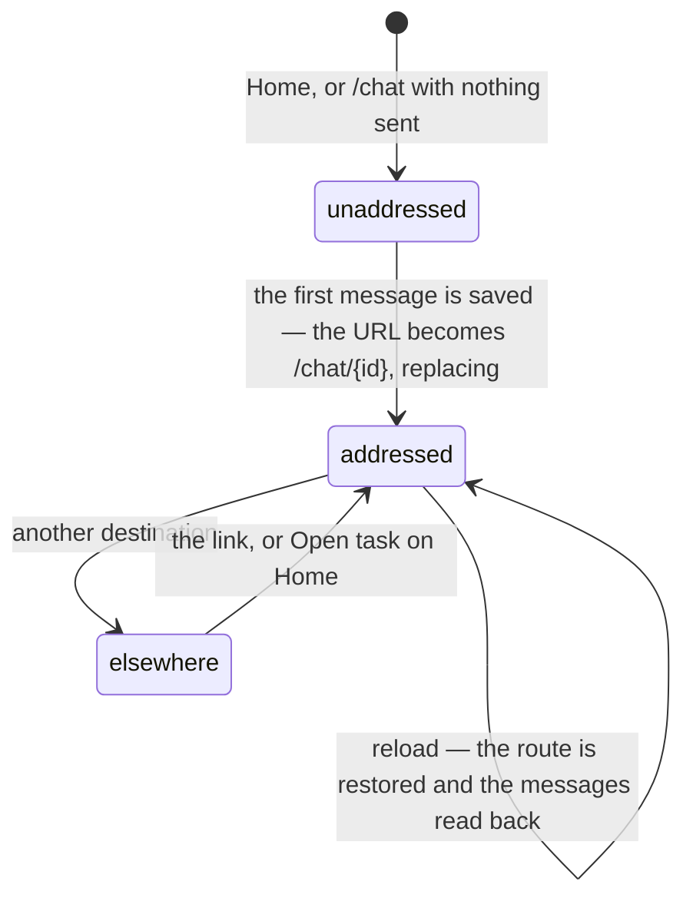

# URL state

## Summary

Froggy keeps almost nothing in the URL. A route, a conversation id, a chosen service, a task, a record to open — that is the whole list. Everything else a person has arranged on a page is held by the page and lost when they leave it.

That is a smaller list than most workspaces keep, and it has a consequence worth stating plainly: **what can be sent to somebody else, or bookmarked, or found again after a reload, is exactly the five things above.** A filtered Activity view, a scroll position, an open dialog, a running turn and an unanswered approval are none of them.

[Navigation](../foundations/navigation.md) owns where a person can be and what a page change does. This document owns what the address bar carries and what comes back on return.

## The simple case

A person starts work from Home. The conversation is created and the URL becomes `/chat/{id}`, replacing rather than stacking, so **Back** goes to Home and not to an empty conversation.

They send the link to themselves, open it on another machine, and get the same conversation read back from the archive — including a turn still running, which they join.

## What is in the URL

| Route | What it carries | Restored on return |
| --- | --- | --- |
| `/` | Nothing. | Home. |
| `/chat` | Nothing. Upgrades itself to `/chat/{id}` once the conversation is saved. | A new, unsaved conversation. |
| `/chat/{conversationId}` | The conversation id. | The conversation, fifty messages at a time, with a running turn rejoined. |
| `/explore` | Nothing. | The page. |
| `/wallet` | Nothing. | The page. Which dialog was open is not kept; see [add funds](../workspace/wallet/add-funds.md). |
| `/activity` | `record` — one history record to open. | The record's detail. **Not the filters.** |
| `/services` | `service` — the chosen service. `task` — one task to show. | The chosen service and the task's result. |
| `/agents`, `/agents/{id}` | The agent's id in the path. | The connection's detail. |
| `/settings` | Nothing. | The page. |
| `/browser` | Nothing. Opened as a named window for the pop-out. | The page alone, with no workspace around it. |
| `/oauth/authorize` | `client_id` and `redirect_uri`, required; `scope`, `state`, `response_type`, `resource`, `code_challenge` and `code_challenge_method`, optional. | The consent screen, rebuilt from the query. |
| `/oauth/manual` | `code`, or `error` with `error_description`. | The code to paste, or the refusal. |

One query works on every route: **`?theme=`**. It sets the appearance for this tab only, is read once before anything renders, and never overwrites what the person saved. It is how a link can show somebody the other theme without changing theirs.

## What a bad value does

Two routes validate what is in their query, and both do the same thing with what fails: **they drop it silently and behave as though nothing was named.** `/services?service=nonsense` is the catalog with no choice made, not an error. `/activity?record=garbage` is the Activity page with no record open.

The theme query is the same: a value that is not one of the three known names is ignored and the saved preference stands.

Nothing anywhere tells a person that part of the link they followed was discarded. That is deliberate for a query somebody may have hand-edited and questionable for a link Froggy itself generated, and it is the one place in this area worth calling a defect risk.

The consent route is the exception that refuses rather than shrugging: without `client_id` or `redirect_uri` it says "This link is missing the client or where to return to. Start again from your agent." — because a consent screen that guessed what it was consenting to would be the worst possible place to be forgiving.

## What is deliberately not in the URL

- **The run.** A conversation is addressable; the turn inside it is not. There is no way to link somebody to work in flight.
- **The approval.** A ticket has no route, so a person cannot be sent straight to the question they need to answer.
- **The Activity filters.** Source, status, connection and since are page state. Reload and they are gone, and a filtered view cannot be sent to anyone.
- **The draft, and the held Next message.** Neither is persisted anywhere.
- **Scroll position**, in the conversation or anywhere else.
- **The browser pane's width**, which is saved in this browser instead.
- **Which dialog is open.** Add funds, Delete my data and the approval card are all unaddressable.
- **The shared browser's page.** What the hosted browser is looking at is never in Froggy's address bar.

## Where a link comes from

Two are generated rather than typed. A conversation is linked as `/chat/{id}` and a record as `/activity?record={id}` — including inside the evidence the history tool hands the model, so an answer can point at the thing it is describing. Home's **Open task** navigates to `/chat/{id}` directly.

The pop-out browser window is opened by name at `/browser` with nothing in its query at all; it picks up the theme from the browser's own storage.

## Variants

| Variant | Set before asking | Changed while it runs |
| --- | --- | --- |
| Who is asking | Only a person has a URL. Telegram, a schedule and an agent over MCP have no address bar; an agent is given ids and reads by id. | No effect. |
| The policy in force | No effect. No route is gated by the leash. | No effect. |
| Funds available | No effect. | No effect. |
| What is being asked for | Decides which route, and whether a service or task is named in the query. | Choosing a service rewrites the query in place. |
| The asking agent's grant | The consent route's query is the agent's own request, and the scopes in it are what the person is asked about. | Cannot change; a new request is a new URL. |
| The shared browser | The pop-out has its own route; the page it shows is not in it. | Navigating away from the browser view does not stop browsing. |
| Appearance and motion | `?theme=` overrides the saved preference for this tab only. The direction of the page transition is computed from the two paths' positions in the navigation order. | Changing the theme **removes `?theme=` from the URL** with a replace, so the override does not outlive the choice. |

## Cancel and interrupt

| Event | Before the URL changes | After it has changed |
| --- | --- | --- |
| Stop — the person halts this run | Unrelated; stopping does not navigate. | Unrelated. The URL is unchanged by a run ending. |
| Freeze — the wallet is frozen, mid-run | No effect. | No effect. Freezing is not in the URL. |
| Denying a waiting approval, or leaving it unanswered | No effect. The ticket is not a route. | No effect. |
| Asking something else while this request is still in flight | No effect; a held message is not in the URL. | No effect. |
| Leaving the page, or switching to another conversation, mid-run | The new route replaces or pushes; the run is the server's and continues. | Returning to the conversation's URL resumes it; another conversation's URL gets nothing. |
| Reload; the tab or the app closed | The route and its validated query are restored. Filters, drafts and scroll are not. | The same. |
| Network lost; the socket drops | Navigation is client-side and still works for pages already loaded. | The route stands; the page shows the last saved snapshot. |
| The model, a service, or the facilitator errors or rate-limits mid-run | No effect. A person is never moved by an error. | No effect. |
| The session expires, or the person signs out | The signed-out surface replaces the workspace; the URL is not what changes. | The same. |
| The policy or a cap changes mid-run | No effect. | No effect. |
| Funds run out mid-run | No effect. | No effect. |
| The person takes control of the shared browser mid-run | No effect. Taking the page does not navigate. | No effect. |
| The same account open in a second tab or on a second device | Each tab has its own route and its own query. | Two tabs on the same conversation both watch it; two tabs on different conversations see different things and neither is told about the other. |

## Interactions with other systems

**The leash.** No route is gated by it. A frozen wallet changes what the Wallet says, not where a person may go.

**Money and receipts.** A receipt is reachable through `/activity?record={id}` and nowhere else in the URL. The Wallet's own lists are not addressable by filter.

**Approvals.** Not addressable. A person told "there is a question waiting" has to navigate to it through Home rather than being handed a link.

**Provenance.** A record deep link is the closest thing to a citable reference Froggy has, and it is the form the model is given when it quotes past evidence.

**History and persistence.** The conversation id in the URL is the join between what is in the address bar and what is in the archive. Everything else the URL carries is a view over data, not the data. See [history and persistence](history-and-persistence.md).

**The shared browser.** `/browser` exists as a route even though the browser is deliberately not a destination, so it can be opened directly and popped out. What it is looking at is never in the URL.

**Connected agents and grants.** The consent routes are the only ones whose query comes from outside Froggy. Everything in them is treated as a claim to be vetted server-side rather than as fact.

**Notifications.** Nothing in a notification is addressable. The badge is not a link to the question.

**Navigation and URL state.** This document owns the URL half; [navigation](../foundations/navigation.md) owns the destinations, the rail and the pill.

**Appearance, motion and accessibility.** `?theme=` is the only appearance state that travels in a link, and it is read before React mounts so there is no flash of the wrong theme. A move between two paths outside the navigation order gets no transition at all rather than a wrong one.

**Offline and reconnection.** Routing is client-side, so an offline person can still move between pages already loaded and the URL still means what it meant.

**Stubs.** No effect. Nothing about a route depends on which integrations are live.

## Edge cases

- `/chat` upgrades itself to `/chat/{id}` with a **replace**, so the intermediate URL never enters history. This is deliberate: keying that upgrade on `/` instead once dragged every returning person off Home and into their last conversation.
- Home is the current destination for `/` and for every `/chat` path, so a conversation highlights Home rather than nothing.
- A route not in the navigation order is treated as position −1 and gets no page transition, which is why a conversation is deliberately given Home's slot.
- Choosing a service rewrites `/services?service=…`, and clearing it navigates to `/services` with an empty query rather than removing one key.
- The Activity page's **close** control navigates to `/activity` with an empty search, which clears the open record but leaves the filters — they were never in the URL to clear.
- Two different tabs can hold `?theme=` overrides in opposite directions and neither disturbs the saved preference; a theme change in a third tab is ignored by both while their override stands.
- A conversation link opened by somebody who is not its owner gets nothing, because every history read is scoped to the caller.
- The pop-out window has no navigation, no composer and no URL of its own beyond `/browser`, so there is no way back to the workspace from inside it.

## Open questions and verification

- **A discarded search parameter is silent.** A link with a mistyped service or a stale record id looks like an ordinary page. Whether that is intended, and whether a generated link can ever go stale in a way a person would notice, was not established; it is worth a bug entry.
- Whether the Activity filters ought to be in the URL is a product question this document does not answer. As built, a filtered view cannot be shared or restored, which is the one thing a record page is usually wanted for.
- Whether `?theme=` is honoured on the consent routes and the pop-out, which sit outside the workspace layout, was read as yes from where the theme is initialised and not checked by hand.
- Whether the browser pop-out is bound to the conversation that opened it, or shows whatever the workspace's browser is doing, was not established from the route alone.
- The `task` parameter on `/services` was read as "show this task's result"; whether a task id belonging to another surface's run can be opened this way has not been checked.
- None of the URL behavior in this document has been exercised by hand; it is read from `apps/web/src/router.tsx`, the pages' own search handling, and `apps/web/src/lib/theme.ts`.

Verified against the Froggy tree at commit `5caed50`.
