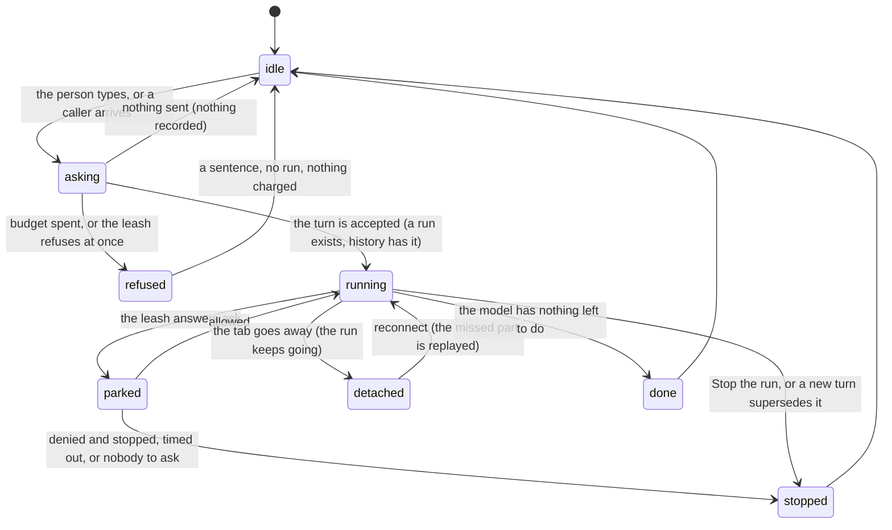

# The request

## Summary

A request is the unit this whole description is built on: the smallest thing someone asks Froggy to do that has a beginning, a possibly long and expensive middle, and an end. A person typing in the composer makes one. So does a connected agent calling a paid tool over MCP, a schedule firing at three in the morning, and a Telegram message arriving while nobody is looking at the app.

They are one kind of thing because they run through one loop. The web chat and a Telegram message start the same model, with the same tools, the same session and the same mandate; the only thing that differs is where the words go afterwards — an SSE response, or a Telegram thread. This document owns the phases every other document refers to, what a run is, what stops one, and what merely stops watching one.

## The simple case

A person types into the composer and presses Enter. The message is accepted, a run starts on the server, and the answer begins arriving a moment later — words, then perhaps a tool call, then more words. If the model needs to spend money, [the leash](the-leash.md) judges it before anything moves; if it needs a person's say-so, the run parks and asks. When the model has nothing left to do, the turn ends, the answer is in history, and the composer is ready for the next one.

If the person closes the tab in the middle of that, the work carries on. If they come back, they are handed the part they missed and the rest arrives live. If they press **Stop the run**, it ends.

## The request, event by event

### Asking

A request is composed and submitted. On the web that is the composer; over MCP it is a tool call carrying an idempotency key; from Telegram it is a message; from a schedule it is the clock.

Two things are checked before any model is called, and both can end it here. The **model budget** counts the turns this person has started today and refuses past the ceiling — before the first model call, so a refusal costs nothing. And a repeat of a request already in history is recognised as the same request rather than treated as a second one.

> Technical note: a duplicate submission does not start a second run. If the original run is still current, its stream is handed back and the client simply joins it. If it is not, the answer is a plain acknowledgement carrying the run and conversation ids, so the caller can go and find the result rather than asking again.

### Answered at once

The request ends before a run exists. Nothing is charged, nothing is spent, and there is nothing to stop.

The ways this happens: an empty composer; the day's turns are spent, which is said as "This account has used its N turns for today. It resets in about H hours."; the leash refuses the very first thing that was going to be attempted; or a connected agent asks for something no scope in its grant allows.

Nothing is recorded in the wallet either way. A refusal by the leash _is_ recorded — a refusal is as much a fact about the leash as an allowance is — but no money moved and no receipt of a payment exists.

### The work begins

A run exists. This is the line, and it matters for one reason: **from here on, stopping is no longer free**, because the loop can reserve a spend at any step.

Three things become true at once. The turn is in history, so it survives a reload. The run is registered against the session — and **starting a run supersedes whatever that session was already doing**, aborting it. And the run holds its own abort signal, which is not the request's: a client hanging up is a detach, not a cancellation.

> Technical note: this is the single most important rule in the agent half of the product, and the reason is money. If a run died with its socket, closing a tab mid-turn would abort the loop _after_ a payment had been reserved and possibly settled, leaving a spend on the ledger with no receipt and no record of what it bought.

### While it runs

The model works in steps, capped at twelve — enough for look-then-pay-then-explain with room to recover from a mistake, short enough that a doom loop costs a few cents rather than an afternoon. The **model budget** counts steps too, and a turn that crosses the day's step ceiling stops before its next one rather than being cut mid-step.

The answer streams as it is produced. Tool calls appear as they are made. A spend that needs a person parks the run and raises [an approval](../workspace/conversation/approvals.md); a parked run is not a stopped one, and it resumes where it was if the answer is yes.

Everything the stream says is recorded as it goes, so that someone who reconnects can be given what they missed. That recording is also what keeps the loop draining while nobody is listening.

The person can watch, take the browser, stop the run, freeze the wallet, or leave. They cannot edit the request that is running, and sending another one replaces this run rather than queueing behind it.

### Finishing

The model has nothing left to do, or the step cap is reached, or something ended it. The turn is written to history with what it did, any receipts it produced are in the wallet, and the composer is ready again.

A run that ended by being stopped is still a run that happened: what it spent before it stopped is spent, and the receipts for it exist. Stopping is not a rollback and nothing about it is undone.

The failure path is the same shape. An error ends the turn, is shown, and leaves behind whatever had already been committed. A payment that was sent but never confirmed either way is not called a failure: it is _uncertain_, its own status, because "we do not know whether that money moved" is a different thing to tell a person than "it did not".

## Variants

| Variant | Set before asking | Changed while it runs |
| --- | --- | --- |
| Who is asking | Decides where the answer goes and what is available. The web gets a stream and a browser; Telegram gets a thread; a schedule has no screen, so an approval it raises resolves as `unavailable` rather than waiting. An agent over MCP gets a task id. | Cannot change. A run belongs to the surface that started it. |
| The policy in force | Read at the moment each spend is judged, not latched when the run starts. | A change takes effect on the _next_ judgement, not retroactively on one already allowed. |
| Funds available | A run can start with an empty balance; it fails at the first spend, not at the start. | Running out mid-run refuses that spend and the model is told why; the run continues and usually explains. |
| What is being asked for | Decides which tools are offered and whether a browser is provisioned at all. | The model chooses tools step by step; the set does not change mid-run. |
| The asking agent's grant | Bounds what may be asked for. The leash independently bounds what may be spent; both apply and the narrower wins. | Revoking a grant mid-run does not retroactively stop a run already accepted. |
| The shared browser | A browsing request provisions one. Ownership starts with the agent. | The person can take the page at any moment without stopping the work. |
| Appearance and motion | Rendering only. | Rendering only. |

## Cancel and interrupt

| Event | Before the work begins | While it runs |
| --- | --- | --- |
| Stop — the person halts this run | Nothing to stop. | Ends the run. What was already spent stays spent; receipts remain. The interface confirms with "Stop requested". |
| Freeze — the wallet is frozen, mid-run | The next spend will be refused with `frozen`. | The run keeps going but every spend from that moment is refused. Freezing does not by itself end the turn. |
| Denying a waiting approval, or leaving it unanswered | Not applicable. | **Deny** refuses that spend and lets the model try something else. **Deny & stop** ends the run. Unanswered ends as `timeout`; no screen to ask means `unavailable`. |
| Asking something else while this request is still in flight | The earlier request had not started; the new one simply starts. | **The new run supersedes and aborts the old one.** There is one run per session, and it is the most recent. |
| Leaving the page, or switching to another conversation, mid-run | Nothing was started. | A detach. The run keeps going and keeps spending. |
| Reload; the tab or the app closed | Nothing was started. | A detach. On return the run is found still going and the missed part is replayed. |
| Network lost; the socket drops | The request never arrives; nothing starts. | A detach, indistinguishable from any other. The run continues on the server. |
| The model, a service, or the facilitator errors or rate-limits mid-run | The turn does not start and the reason is shown. | The step fails; the model is told and usually recovers or explains. A failure after a payment was sent leaves the task `uncertain`. |
| The session expires, or the person signs out | The request is refused before anything starts. | The run is the server's and continues; the tab stops being able to watch it. |
| The policy or a cap changes mid-run | Applies to everything in the run. | Applies from the next judgement onward. A spend already allowed is not revisited. |
| Funds run out mid-run | The first spend is refused. | That spend is refused with a code naming what was short; the run continues. |
| The person takes control of the shared browser mid-run | No browser yet. | Ownership moves to the person. The run is not stopped. |
| The same account open in a second tab or on a second device | Either can start the request. | Both watch the same run. A new request from either supersedes it for both. |

After an interrupt the person is left where they were, with the conversation showing how the turn ended. Nothing is rolled back, because money cannot be.

## Interactions with other systems

**The leash.** Every spend inside a run is judged by it. The leash cannot stop a run; it can only refuse what the run tries to spend, and a run whose every spend is refused still ran.

**Money and receipts.** A run is the thing receipts belong to. A stopped run keeps the ones it earned.

**Approvals.** Parking is a state of the run, not a separate thing. A parked run holds its place and resumes; the four answers are in [approvals](../workspace/conversation/approvals.md).

**Provenance.** What a run spent is provable afterwards through its receipts; what a run _said_ is in history and is not signed or posted anywhere.

**History and persistence.** The turn is in history from the moment the work begins, which is what makes a reload find it. In-memory state — the run registry, the replay buffer, the model budget's counts — does not survive a redeploy.

**The shared browser.** Provisioned by a request that needs one, and outliving the run that made it. Closing the browser view never stops the work.

**Connected agents and grants.** A run started by an agent carries which agent asked, and its invocations are kept as a trail against that grant.

**Notifications.** A run that needs an approval raises a badge; Telegram and the digest are told about outcomes, not about runs starting.

**Navigation and URL state.** The conversation has a URL; the run does not. There is no way to link to a run in flight.

**Appearance, motion and accessibility.** Stop is a button with an accessible name, and its three states — requested, unconfirmed, retryable — are announced rather than only shown.

**Offline and reconnection.** Reconnection is a first-class path, not error handling: the missed part is replayed and the rest arrives live. Past 8 MB in one turn the run keeps going but stops being replayable, and a reconnecting client gets the live remainder without the beginning.

**Stubs.** A stubbed run is a real run: it takes turns from the budget, writes history, and produces receipts marked `stubbed: true`. Nothing about the shape of a run tells you whether it was real; only its receipts do.

## Edge cases

- **One run per session.** A second request does not queue. It replaces, and the first is aborted mid-step, possibly between reserving a spend and finishing it.
- Stopping can itself fail. When the stop request does not get through, the interface says "Stopping is unconfirmed" as an alert and offers **Retry stopping**; the run is still going until a stop is confirmed.
- The step cap and the daily step ceiling produce the same visible ending — the turn stops having done part of the work — for different reasons, and the sentences differ.
- The model budget lives in memory and is per UTC day. A redeploy forgets every count, which at worst hands everyone one more day's allowance.
- One account is exempt from the budget entirely, so that a judge mid-recording is never told to come back tomorrow. Its behavior is not representative.
- A run superseded by a new one may finish its teardown _after_ its replacement has started; the registry is careful that a late finisher cannot evict its successor.
- A turn that never streamed anything and a turn stopped instantly look nearly identical in the conversation afterwards.

## Open questions and verification

- Whether a spend already reserved when a run is superseded is completed or abandoned has not been established from the code, and it is the case most likely to lose money without a receipt. Worth confirming by hand before it is claimed either way.
- The exact turn and step ceilings are configuration, not constants, and are not stated here for that reason. The step cap within one turn is twelve.
- Whether freezing the wallet mid-run also ends the run, or only refuses its spends, is documented above from the code's structure and has not been watched happen.
- "Stopping is unconfirmed" was read from `e2e/stop.spec.ts`, which exercises both an HTTP failure and a network failure. The wording in the running product has not been checked.
- What a Telegram-started run shows a person watching the web app at the same time is not established.

Verified against the Froggy tree at commit `5caed50`.
