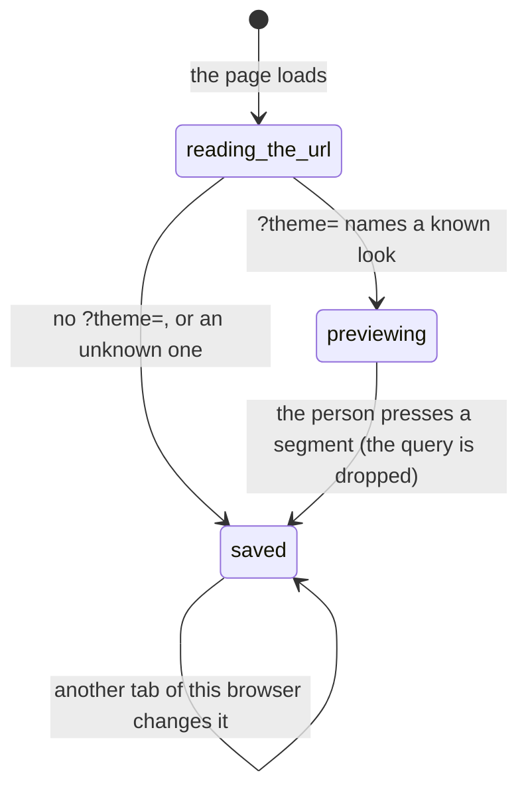

# Appearance

## Summary

Appearance is one card on the Account page with three choices — **Passbook**, **Lilypad**, **System** — and no save button. Choosing one repaints the whole surface at once and remembers the choice in that browser. There is a fourth way in that is not a choice at all: a `?theme=` on any URL previews a look for that page load without touching what was saved.

The card sits on `/settings`, the page the navigation labels **Account**. It is the second card down the right-hand column, under Connection. Nothing here reaches the server, spends anything, or is judged by [the leash](../../foundations/the-leash.md): appearance is rendering, and the variant table of every other document says so in its last row.

## The simple case

The person goes to Account and finds a card headed "Appearance" with one sentence under it: "Passbook is light. Lilypad is dark. System follows your device. Your choice is saved in this browser." Beneath that, three segments in a row, the current one carrying a raised pill behind it.

They press **Lilypad**. The pill slides across, and the entire page — background, cards, type, the frog — crossfades from light to dark in a quarter of a second. Nothing reloads and nothing loses its place: a half-typed message in the composer is still there, a dialog stays open, a stream keeps streaming.

The choice is kept in that browser. A reload comes back dark; a second device, or a private window, starts on Passbook again.

There is no confirmation, no toast and no undo, because there is nothing to undo: the three segments are always all available, and pressing a different one is the whole correction.

## The request, event by event

### Asking

There is nothing to compose. The interaction is a single press on one of three segments, and the appearance in force is decided long before that — before React mounts, in fact, so the first frame the person sees is already in the right palette rather than flashing light and correcting itself.

Two things are consulted at that instant, in order. A `theme` in the URL's query wins if it names one of the three; otherwise the value saved in this browser wins; otherwise Passbook. **A dark device does not make Lilypad the default.** Passbook is the default look and **System** is a choice a person makes, not the starting state.

> Technical note: the saved value lives under `froggy-theme` in that browser's local storage. Reading it is wrapped, because a private window can refuse storage outright; when it does, appearance still works for that tab and simply starts from Passbook every time.

The card is not gated on anything. It renders identically whether the wallet has loaded or not, whether the identity is a real sign-in or a local one, and whether the deployment is live or stubbed — there is nothing behind it to be waiting for.

### Answered at once

Pressing the segment that is already current does nothing visible and writes the same value back. An unknown value — a `?theme=fuchsia`, a storage entry left by an older build — is ignored rather than treated as an error, and the saved preference is used instead.

There is no failure path here and no message to show. Nothing is sent, so nothing can be refused.

### The work begins

There is no run and no spend, so the line [this phase](../../foundations/the-request.md#the-work-begins) names is never crossed. Appearance is the one interaction in the workspace that cannot cost anything.

### While it runs

The change takes about a quarter of a second. The whole surface is crossfaded as a single image — old out, new in — rather than each element animating separately, which is what keeps forms, scroll positions and in-flight streams from remounting underneath it. The pill behind the three segments slides to its new position over two-tenths of a second.

Both are skipped entirely when the person is working from the keyboard: a tab-and-space through the three segments repaints instantly, because a keyboard user moving quickly should not be made to wait for a fade they did not ask for.

While the crossfade plays, the page is fully usable. It is an overlay of two rendered images rather than a modal, so a click during it lands on the control underneath, and a stream arriving mid-fade is not dropped.

### Finishing

The palette is the new one, the pressed segment is the new one, and the value is in this browser's storage. If the URL carried a `?theme=`, it is quietly removed — the address bar loses the query without a navigation and without adding a history entry, so Back still goes where the person expects.

Under **System**, finishing is not final: the device's own light/dark setting is watched from then on, and a phone crossing into its evening schedule repaints the open page with nobody pressing anything.

## Variants

| Variant | Set before asking | Changed while it runs |
| --- | --- | --- |
| Who is asking | Only a person in a browser. No MCP tool, Telegram command or schedule can set the appearance, and none can read it. | No effect. |
| The policy in force | No effect. Appearance is never judged by the leash and works normally while the wallet is frozen. | No effect. |
| Funds available | No effect. | No effect. |
| What is being asked for | The three segments are the whole surface. There is no accent, density or font choice. | No effect. |
| The asking agent's grant | No effect. No scope reads or writes appearance. | No effect. |
| The shared browser | No effect on the page being browsed — that is a remote page in [the shared browser](../../foundations/the-shared-browser.md) and keeps its own colours. The pop-out browser window reads the same saved value, so its own frame matches. | A theme changed in the workspace does not repaint an already-open pop-out until it reloads. |
| Appearance and motion | This document is the variant. Reduced motion shortens the sliding pill to nothing; keyboard interaction removes both animations. | A device-level light/dark change repaints live under System only. |

## Cancel and interrupt

| Event | Before the press | After the press |
| --- | --- | --- |
| Stop — the person halts this run | No effect. Appearance is not a run. | No effect. A stop does not revert the palette. |
| Freeze — the wallet is frozen, mid-run | No effect. A frozen wallet can still be repainted. | No effect. |
| Denying a waiting approval, or leaving it unanswered | No effect. Appearance raises no approval. | No effect. |
| Asking something else while this request is still in flight | No effect. The composer is on another page. | No effect; the crossfade does not remount the stream, so a turn streaming underneath keeps streaming. |
| Leaving the page, or switching to another conversation, mid-run | No effect. | The palette follows the person across every page; it is set on the document, not on the page. |
| Reload; the tab or the app closed | No effect. | The saved choice survives; a preview from `?theme=` does not, unless the query is still in the reloaded URL. |
| Network lost; the socket drops | No effect. Appearance never touches the network. | No effect. |
| The model, a service, or the facilitator errors or rate-limits mid-run | No effect. | No effect. |
| The session expires, or the person signs out | No effect. The choice is the browser's, not the account's, so signing out leaves it in place. | The signed-out surface uses the same saved value; the next person on that browser inherits it. |
| The policy or a cap changes mid-run | No effect. | No effect. |
| Funds run out mid-run | No effect. | No effect. |
| The person takes control of the shared browser mid-run | No effect. | No effect. Ownership of the page and the palette of the frame are unrelated. |
| The same account open in a second tab or on a second device | Each tab starts from the same saved value. | **A second tab of the same browser repaints too**, because the storage change is watched. A second device does not: nothing about appearance is sent to the server. A tab currently previewing a `?theme=` ignores the other tab's change. |

After any of these the person is left where they were, in whatever palette is in force. There is nothing to undo and nothing to confirm.

## Interactions with other systems

**The leash.** None. No rule is consulted and no decision is recorded. See [the leash](../../foundations/the-leash.md).

**Money and receipts.** None. Appearance is the only setting in the workspace with no cost at any point, and no [receipt](../wallet/receipts.md) mentions it.

**Approvals.** None raised, ever.

**Provenance.** No interaction. Nothing about appearance is signed, posted or provable; it is not a fact about the account at all.

**History and persistence.** Persisted in that browser only, under `froggy-theme`. It is not part of the account, so it does not travel to a second device, is not exported, and is not cleared by **Delete my data** — that removes what the server holds about the person, and this is not held by the server.

**The shared browser.** The workspace's own frame is themed; the remote page inside it is not. The pop-out window at `/browser` reads the same saved value when it opens, so a person who pops the browser out gets a matching frame without doing anything.

**Connected agents and grants.** No interaction. An agent over MCP has no appearance and no way to ask about one; see [identity and agents](../../foundations/identity-and-agents.md).

**Notifications.** None. Changing the appearance raises no badge, no [Telegram](telegram.md) message and no line in [the daily digest](the-daily-digest.md).

**Navigation and URL state.** `?theme=` is the one appearance-related thing that lives in a URL, and it is a preview rather than state: it works on any page, is removed the moment a choice is pressed, and is described alongside the rest in [url state](../../cross-cutting/url-state.md). See also [navigation](../../foundations/navigation.md) for where the Account page sits.

**Appearance, motion and accessibility.** The three segments are one labelled group, each a real button reporting whether it is pressed, each clearing 44px. The sliding pill is decorative and hidden from assistive technology. The description sentence is tied to the group, so a screen reader hears what the three words mean before it hears the choices. `color-scheme` is set on the document in both looks, so browser-drawn things — scrollbars, form controls, the caret — match the palette rather than staying stubbornly light.

**Offline and reconnection.** Entirely local. Appearance is chosen, saved and applied with no network at all, and works on a page loaded before the connection dropped.

**Stubs.** No effect. There is no integration behind appearance, so there is nothing to stub and nothing marked; see [stubs](../../cross-cutting/stubs.md).

## Edge cases

- The two looks are not one palette inverted. They differ in corner radius, in shadow, and in typeface: the machine typeface is a monospace in Passbook and a proportional face in Lilypad, so a wallet address changes shape, not just colour, when the theme changes.
- **System never appears as a saved look on the document.** The document is always marked as one of the two real palettes, with System resolved; only the pressed segment reveals that the choice was System.
- A `?theme=` preview is indistinguishable from a real choice in the card itself: the previewed look shows as the pressed segment, so a person landing on a shared link that carries one will believe it is their saved setting until they reload without it.
- While a preview is in force, this tab stops following changes made in other tabs of the same browser. It resumes when the preview goes.
- Pressing a segment while a preview is in force saves that segment and drops the query — so the only way out of a preview, other than editing the URL, is to make a real choice.
- The default is Passbook even on a device set to dark. A person who never opens this card and never touches System sees a light app on a dark phone.
- The person's own choice, once made, wins over the device forever, unless they come back and choose System.
- Choosing a theme rewrites the current URL in place. On a page whose query carries other state, only the `theme` key is removed; the rest is left exactly as it was.
- The card has no loading state, no error state and no disabled state. It is the only control on the Account page that cannot fail.
- The names are the product's own and are not explained beyond the one sentence: nothing tells a person that Passbook is the default, or that Lilypad is what a dark device would have given them had they chosen System.

## Open questions and verification

- **The whole-surface crossfade is not shortened under reduced motion.** The page-to-page transition is explicitly cut to 125 ms for a person who asks for reduced motion, and the shimmer and the browsing indicator are switched off entirely, but the 250 ms appearance crossfade has no such rule — only the small sliding pill is suppressed, and that through the component rather than the stylesheet. A person who has asked their system for less motion still gets the full-screen fade. Worth treating as a defect.
- A `?theme=` preview showing as the pressed segment is stated above from reading the code, not watched by hand. No spec asserts which segment reads as pressed while a preview is in force.
- Whether an already-open pop-out browser window repaints when the workspace's theme changes was not established. Both windows share the same storage, and the storage listener exists in both, so it may well repaint; it has not been watched.
- Whether the signed-out marketing surface honours the same saved value was not read out of the tree.
- The e2e specs cover the Passbook default on a dark device, persistence across a reload, a preview that does not stick, System following the device in both directions, an unknown `?theme=` falling back, and the query being dropped when a choice is pressed. They also render the whole workspace in both looks at 1440, 768, 390 and 320 pixels with reduced motion on. Nothing covers a storage-denying private window, or two tabs following each other.

Verified against the Froggy tree at commit `5caed50`.
