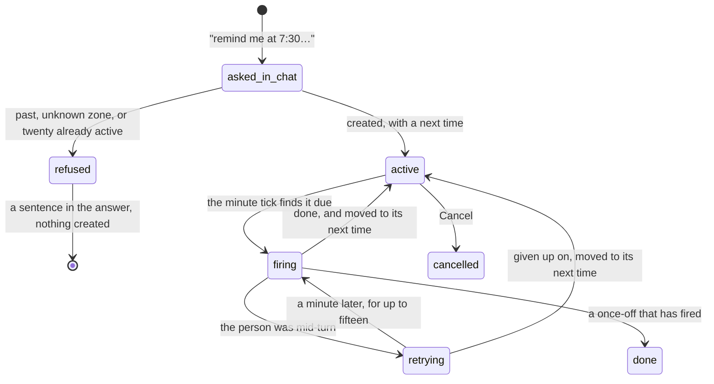

# Schedules

## Summary

A schedule is something the person asked Froggy to do later — once, or on a cadence, in their own clock. There are two kinds. A **reminder** says their words back to them at the time. A **scheduled run** takes their words as an instruction and carries out an unattended turn: no browser, a small budget, and nobody to ask, so an approval it raises resolves as `unavailable` rather than waiting for someone who is not there.

The Account page lists what is scheduled and gives each row one button: **Cancel**. It does not create them. **The only way to make a schedule is to ask for one in the chat** — "remind me in 20 minutes to take the bread out", "every morning at 7:30, check the USDC borrow rate" — and the list is where they are seen and stopped afterwards.

The list sits inside the card headed "Reminders" on `/settings`, the page [the navigation](../../foundations/navigation.md) labels **Account**, above [the daily digest](the-daily-digest.md)'s hour control. The digest is itself a schedule and appears in the list beside the rest.

## The simple case

The person types "remind me at 7:30 every morning to check the rates" into the composer. Froggy answers in words: what it scheduled, when it next runs on their clock, and what it will do — "I will remind you on Telegram when it is paired, and in the web stream."

They go to Account. Under **Scheduled** there is one row: the label in bold, then "Every day at 07:30 · next 8 Sept 2026, 07:30", then "Remind: check the rates". A **Cancel** button sits at the right.

At 7:30 the reminder arrives on their phone if Telegram is paired, and appears in the web stream as a marker reading "Reminder: check the rates" — with "(also sent to Telegram)" appended when the phone got it too. The row stays, its next time moved on a day.

Pressing **Cancel** removes the row at once. Nothing confirms and nothing can be undone; the schedule is asked for again in the chat if it was a mistake.

## The request, event by event

### Asking

Nothing on the Account page asks for a schedule. The asking happens in the chat, and what the model is allowed to hand over is bounded: a label of at most eighty characters, a reminder of at most five hundred or an instruction of at most two thousand, and a time expressed one of four ways — in so many minutes (up to thirty days out; further than that is a date, not a delay), at a local date and time, daily at a clock time, or weekly at a clock time on a named day.

The clock is the person's, not the server's. If they have said where they are, that zone is used; otherwise their most recent schedule's zone; otherwise UTC, and the answer says so out loud: "Timezone assumed UTC; tell me yours and I will reschedule."

> Technical note: scheduling changes _when_ the agent runs, not _what_ it may spend. A scheduled run is held to the same mandate as a chat turn, with fewer tools and a smaller budget on top. That is the reason the model is allowed to create one without asking anybody.

### Answered at once

Three refusals end it before anything exists, each said in plain words in the answer: "That time has already passed." for a once-off in the past; a named refusal for a zone the server does not recognise, with an example of the right shape; and "You already have 20 active schedules. Cancel one first." A ticker is not a job queue, and twenty is where the line is.

Cancelling is the other instant ending. It takes effect immediately, the row disappears, and a failure says "Couldn't cancel it. Try again." — the row staying put, because an unconfirmed cancel is not a cancel.

### The work begins

A schedule exists with a next time. From here it is the server's, exactly as a run is: it survives the tab closing, the person signing out, and the browser being on the other side of the world.

Once a minute the server claims every row that is due and fires it. Two servers on one database split the rows rather than both firing the same one.

For a reminder, "firing" is a message and nothing more; there is no run and nothing can be spent. For a scheduled run, the line [this phase](../../foundations/the-request.md#the-work-begins) names is genuinely crossed: a turn starts, and it can spend.

### While it runs

A reminder is over immediately.

A scheduled run is bounded three ways at once: a minute of wall clock, a dozen steps, and a quarter of a dollar under whatever the mandate would have allowed anyway — past which the loop stops before its next call rather than after it. It gets no browser at all, deliberately: a page nobody is watching is a page nobody can take back from the agent, and being able to take the page back is the one guarantee the [shared browser](../../foundations/the-shared-browser.md) makes.

It also has nobody to ask. A spend the leash would have put on a card is refused instead, with the reason "This spend is over the automatic limit and there is no one to ask from here." The instruction the model is given says this in as many words and calls it the correct outcome, not a problem to work around.

Meanwhile a person who happens to be looking at the workspace sees a marker appear in the conversation: "A turn started from a schedule. Reload to follow it here."

### Finishing

A scheduled run posts a report. On a paired phone it is a card titled with the schedule's own label, carrying the outcome and three figures — what was spent, how many receipts, how many refusals. In the web stream it is a marker reading "Scheduled run: {label}: {summary}". The phone's card and the stream's marker are deliberately not the same message twice: the report has already gone to Telegram, so the stream's copy is filed without a second post.

The row is then moved to its next occurrence, computed afresh from the cadence rather than by adding a day — so "07:30" is still half past seven on the morning the clocks change. A once-off that has fired has no next occurrence, becomes `done`, and **disappears from the list**, which shows only active rows.

Whatever a scheduled run spent is spent. Its [receipts](../wallet/receipts.md) are in the wallet like any others.

## Variants

| Variant | Set before asking | Changed while it runs |
| --- | --- | --- |
| Who is asking | A person asks in the chat, and the model creates it. A person on Telegram can ask the same way. A connected agent over MCP has no scheduling tool. A schedule cannot create another schedule: the unattended tool set does not include scheduling. | No effect. |
| The policy in force | Read when each spend inside a scheduled run is judged, not latched when the schedule was created. A schedule made under a generous mandate is held to whatever is in force when it fires. | A change lands on the next judgement, as everywhere. See [the leash](../../foundations/the-leash.md). |
| Funds available | No effect on creating or listing. A scheduled run with an empty balance still runs, is refused at its first spend, and reports the refusal. | Running out mid-run refuses that spend; the run continues and the report names it under "Refused". |
| What is being asked for | A reminder cannot spend anything and needs no run. A scheduled run may query, buy a listed service, and notify — nothing else. | The model chooses within that set; the set does not change mid-run. |
| The asking agent's grant | No effect. No scope creates, lists, cancels or reads a schedule. | No effect. |
| The shared browser | No effect on scheduling. **A scheduled run is given no browser**, so a browser attached to the workspace is neither used nor disturbed. | No effect. |
| Appearance and motion | Rendering only. Times are formatted in the schedule's own zone, not the browser's, so a person abroad sees the time they set rather than their current local time. | No effect. |

## Cancel and interrupt

| Event | Before it fires | While it is firing |
| --- | --- | --- |
| Stop — the person halts this run | No effect. A pending schedule is not a run and cannot be stopped, only cancelled. | Ends the scheduled run. What it spent stays spent; the report says it stopped early and why. |
| Freeze — the wallet is frozen, mid-run | The schedule still fires; its spends are refused. Freezing does not cancel anything. | Every spend from that moment is refused with `frozen`, and the report shows them under "Refused". See [freeze](../conversation/freeze.md). |
| Denying a waiting approval, or leaving it unanswered | No effect. | Not reachable. **A scheduled run raises no card at all**: an `ask` resolves as `unavailable` immediately, so there is nothing to deny and nothing to leave unanswered. |
| Asking something else while this request is still in flight | No effect. | **The person's own turn wins.** A schedule that comes due while a turn is running does not interrupt it; it waits, retries every minute, and gives up after fifteen. |
| Leaving the page, or switching to another conversation, mid-run | No effect. Schedules do not need a tab. | No effect. The run is the server's and finishes without anyone watching. |
| Reload; the tab or the app closed | No effect. | No effect. The report arrives regardless; on return it is in the stream. |
| Network lost; the socket drops | No effect. | No effect on the run. The web marker and the notice arrive when the socket comes back. |
| The model, a service, or the facilitator errors or rate-limits mid-run | No effect. | The failure ends the turn and the report says "Stopped early" with the reason. The row still moves to its next time, so one bad morning does not become a schedule that fires every minute. |
| The session expires, or the person signs out | No effect. Schedules belong to the account, not the session, and keep firing while nobody is signed in. | No effect. |
| The policy or a cap changes mid-run | Applies whenever it next fires. | Applies from the next judgement onward. |
| Funds run out mid-run | The schedule fires anyway and reports the refusal. | That spend is refused; the run continues and usually explains. |
| The person takes control of the shared browser mid-run | No effect. | No effect. There is no browser in a scheduled run to take. |
| The same account open in a second tab or on a second device | Every tab lists the same rows; a cancel in one is reflected in the others when they next look. | Both tabs file the same "A turn started from a schedule" marker. |

After a cancel or a firing the person is left on the Account page with the list redrawn. Nothing is rolled back.

## Interactions with other systems

**The leash.** A schedule is not spending authority and is never judged when created. Every spend inside a scheduled run is judged normally, with one difference that matters: the human line cannot be reached, so a spend above the approval threshold is refused rather than parked. See [the leash](../../foundations/the-leash.md).

**Money and receipts.** A reminder costs nothing. A scheduled run spends under the mandate and a quarter-dollar ceiling of its own, and its receipts are ordinary receipts in the wallet. The report's "Spent" figure counts settled payments and deliberately leaves out the conversions that only turned one asset into another. See [money](../../foundations/money.md).

**Approvals.** None can be answered. Every `ask` in a scheduled run resolves `unavailable` — one of the three ways an approval ends without an answer, alongside `timeout` and `aborted`. See [approvals](../conversation/approvals.md).

**Provenance.** A scheduled run's spends are as provable as any other's; the schedule that caused them is recorded on the notice it produced. See [provenance](../../cross-cutting/provenance.md).

**History and persistence.** A scheduled run is written to history under the source `schedule`, one of the four the history knows beside `web`, `telegram` and `agent`. The schedule row itself persists in the database, survives a redeploy, and is removed with everything else by **Delete my data**. See [history and persistence](../../cross-cutting/history-and-persistence.md).

**The shared browser.** Deliberately absent from scheduled runs. This is the one place in the product where a tool set is narrowed for a reason that is about trust rather than cost.

**Connected agents and grants.** No interaction. Schedules are the person's; no agent can create, read or cancel one.

**Notifications.** Reminders and reports are two of the three things that reach a person unasked, alongside the agent's own `notify`. Each goes to [Telegram](telegram.md) when paired and to the web stream always. See [notifications](../../cross-cutting/notifications.md).

**Navigation and URL state.** The list is a region on `/settings` with no URL of its own. A schedule cannot be linked to, and there is no detail page for one.

**Appearance, motion and accessibility.** The list is a labelled region with its own heading. Loading is an announced skeleton; both failures are alerts. Each **Cancel** carries the schedule's label in its accessible name — "Cancel morning rates" — so the buttons are distinguishable without reading the row, and each clears 44px. Long labels and long instructions wrap rather than truncate.

**Offline and reconnection.** The list needs the network to load and to cancel, and says so when it cannot. The ticker does not: schedules fire on the server whether or not any tab is connected, and the markers and notices a firing produced are waiting in the stream when the socket comes back. See [offline and reconnection](../../cross-cutting/offline-and-reconnection.md).

**Stubs.** The ticker itself is real on every deployment. What a scheduled run can do depends on which integrations are live: on a stubbed build it still runs, still writes history, and still produces receipts — marked `stubbed: true`. Reports reach the log rather than a phone when there is no bot. See [stubs](../../cross-cutting/stubs.md).

## Edge cases

- The list shows only active rows. A once-off that has fired and a schedule that was cancelled both vanish, with no record on this page that they ever existed.
- There is no edit. Changing a time means cancelling and asking again.
- Nothing on the row says when it last ran, whether that run succeeded, or what it spent. The report in the stream is the only account of it, and only until it scrolls away.
- The empty state teaches the only creation path there is: "Ask Froggy in the chat: 'remind me in 20 minutes to…' or 'every morning at 7:30, check…'."
- The daily digest is a row in this list like any other, labelled "Daily digest", and cancelling it here switches the hour control below back to **Off**.
- Times are shown in the schedule's own zone. Two schedules made in two countries show two clocks in one list, and neither is necessarily the reader's.
- A time that does not exist on the morning the clocks go forward lands an hour late; one that happens twice in the autumn lands on one of them. Both are minutes a year and both were chosen over an error.
- A schedule created while the model had to assume UTC keeps that zone until it is cancelled and asked for again. The answer says so at the time; the list does not repeat the warning.

## Open questions and verification

- **A schedule given up on after fifteen busy minutes is silent, and is recorded as though it ran.** When the person is mid-turn the row is retried each minute; past fifteen minutes it is moved to its next occurrence with its last-run time set to that moment, and **no report of any kind is delivered** — the code says a "skipped" card every minute would be the report nobody asked for, which is true of the retries but leaves the final give-up unannounced. A person whose 07:30 digest never arrives because they were chatting at 07:31 is told nothing. Worth treating as a defect.
- **A scheduled run can fire twice.** A claim whose process died goes stale after ten minutes and is fired again — at-least-once by design, bounded by the job's own budget. But the budget is per run, so two firings are two budgets, and a paid service could be bought twice. The idempotency that protects a repeated task does not obviously cover this path; not confirmed either way.
- The fifteen-minute retry window is held in the server's memory. A restart mid-retry restarts the fifteen minutes, so a busy schedule could in principle be retried far longer than intended across a rolling deploy.
- The zone used when a request names none is taken from the person's most recent schedule **whatever its status**, so a cancelled schedule created while travelling silently sets the zone for the next one.
- Scheduled runs appear not to consume the person's daily turn and step allowance — the unattended path does not pass the budget the web and Telegram paths pass. Read from the code, not confirmed by hand; if right, a person cannot be locked out of their own digest by a busy day, which is probably the intent.
- The row's next-run text has words for `done` and `cancelled` that the list can never show, because it filters to active rows. Harmless, but a sign the filter and the formatter disagree about what the list is for.
- The e2e spec covers listing two rows, their cadence and action wording, and cancelling one. Nothing exercises a firing: no spec waits for a tick, a reminder, a report, or the busy path.

Verified against the Froggy tree at commit `5caed50`.
