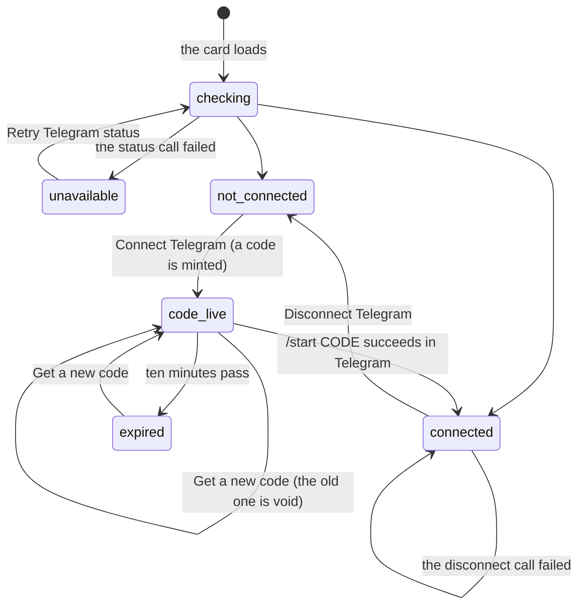

# Telegram

## Summary

Pairing Telegram turns a phone into a second surface on the same workspace. Once paired, Froggy can reach the person when they are not looking — a reminder, a scheduled run's report, [the daily digest](the-daily-digest.md) — and the person can reach Froggy back by writing to the bot, which starts [a real request](../../foundations/the-request.md) on the same session under the same mandate. Approval cards go to the phone as well as the screen, with the same four answers as buttons.

Pairing is a six-character code the person mints while signed in and types into Telegram as `/start CODE`. It is short because a person types it, random because it is the only thing between a stranger's Telegram and this wallet's approval cards, and it dies in ten minutes because a code that lasts is a code that leaks.

> Technical note: the control is on **Connections** (`/agents`), in a region labelled "Telegram connection" — a secondary destination, like Account itself; see [navigation](../../foundations/navigation.md) — not on the Account page — despite this repo filing the document under `account/`. The bot's own unpaired reply agrees with the interface and sends people to "Connect an agent → Telegram". See [Open questions](#open-questions-and-verification).

## The simple case

The person opens Connections and finds a card headed "Telegram": "Talk to Froggy and answer its questions from your phone, under the same rules as here." Under it, "Telegram not connected." and a **Connect Telegram** button.

Pressing it produces a small panel: "Open the bot in Telegram, then tap Start to link your account", a link reading **Open Telegram** that opens the bot in a new tab, and beneath that the manual path — "Or send this command to the bot. Keep it private; it expires in ten minutes" — with `/start ABCDEF` printed large and selectable, a **Copy Telegram command** button, and a **Check connection** button. A quiet line at the foot reads "Waiting for Telegram. This updates when you finish linking", and it means it: the page polls every couple of seconds while the code is alive.

The person taps Start in Telegram. The bot answers with a card titled "Paired with Froggy": "This chat is now your pager. Reminders, scheduled runs and your daily digest land here, approval questions come here with buttons, and you can talk to the agent by writing to it." Back in the workspace, without a refresh, the panel is replaced by "Telegram connected." and a **Disconnect Telegram** button.

## The request, event by event

### Asking

The card asks the server whether this person is paired, and shows "Checking Telegram connection…" while it waits. If that call fails it says so as an alert — "Couldn't check your Telegram connection." — and offers **Retry Telegram status**. It does not guess: an unreachable server is never rendered as "not connected".

Before any of that, the card checks whether this deployment has a bot at all. Without one it shows a single sentence — "Telegram is not configured on this deployment." — and no buttons, because there is nothing a person could do.

Pressing **Connect Telegram** mints a code. **Minting voids any earlier code of that person's**, so a code copied five minutes ago and not yet used stops working the moment a second one is asked for. After the first mint the button relabels itself **Get a new code**.

> Technical note: the code is six characters from an alphabet with no `0`, `O`, `1` or `I`, so nothing is ambiguous read aloud or typed on a phone. It is held in the server's memory, not the database, which is why a redeploy voids every code in flight.

### Answered at once

Several endings need no Telegram at all. The mint can fail — "Couldn't create a Telegram code. Try again." Copying the command records nothing; it is a clipboard write. Closing the page throws the code away as far as the workspace is concerned, though the code itself stays redeemable on the server until it expires.

A code typed into Telegram that is unknown, already used, or older than ten minutes gets the bot's standard refusal: "This chat is not paired with a Froggy account yet." It does not say which of the three it was.

### The work begins

Pairing is committed the instant a valid code is redeemed in Telegram. The Telegram account and its DM thread are bound to this person, and the code is spent — **single use**, gone from the server whether or not the person sees the confirmation.

From here the phone is a real surface. It can be written to first rather than only in reply, which is what makes reminders and the digest possible at all.

> Technical note: a Telegram account can belong to exactly one person. Pairing an account that is already somebody else's silently unpairs it from them; the earlier owner is not told, and their next notice quietly stops arriving.

### While it runs

While a code is live the card polls the server every two seconds and stops as soon as the answer is "paired" or the code expires — so the change appears on its own, usually within a couple of seconds of tapping Start, without the person touching **Check connection**. That button is there for the case where the polling has already given up.

When the ten minutes run out the panel is replaced by one line: "This code expired. Get a new code to connect." The link and the command go with it, so an expired code cannot be copied by mistake.

### Finishing

Paired, the card shows "Telegram connected." and offers **Disconnect Telegram**, which unbinds the account and returns the card to "Telegram not connected." A failed disconnect says "Couldn't confirm the disconnect. Try again." and **leaves the card showing connected**, which is the honest reading: the server did not confirm, so the pairing may well still exist.

Nothing about pairing is a spend, so there is no receipt and no ledger row.

## Variants

| Variant | Set before asking | Changed while it runs |
| --- | --- | --- |
| Who is asking | Only a signed-in person can mint a code — that is the whole point of the code. An agent over MCP, a schedule and the bot itself cannot pair, unpair, or read whether a pairing exists. | No effect. |
| The policy in force | No effect on pairing. It changes what the phone will be asked to approve afterwards; see [the leash](../../foundations/the-leash.md). | No effect. |
| Funds available | No effect. Pairing costs nothing, and a paired phone with an empty balance still receives refusals and reports. | No effect. |
| What is being asked for | Three things share this one pairing: notices, approval cards, and turns the person starts by writing. There is no way to take one without the others. | No effect. |
| The asking agent's grant | No effect. No scope reaches the pairing, and a turn started from Telegram is the person's, not an agent's. | No effect. |
| The shared browser | No effect on pairing. A turn started from Telegram gets no browser view the person can watch, though the tools that browse are still offered. | Taking control in the workspace does not disturb a Telegram thread. |
| Appearance and motion | Rendering only, and only of the card. Telegram draws its own messages in its own theme; [appearance](appearance.md) does not reach the phone. | No effect. |

## Cancel and interrupt

| Event | While pairing | Once paired |
| --- | --- | --- |
| Stop — the person halts this run | No effect. Pairing is not a run. | A stop from either surface ends the run for both: the same run registry backs the web and the phone. |
| Freeze — the wallet is frozen, mid-run | No effect. A frozen wallet pairs normally. | The phone is told what the screen is told: a spend attempted while frozen is refused, and the refusal reaches whichever surface asked. See [freeze](../conversation/freeze.md). |
| Denying a waiting approval, or leaving it unanswered | No effect. | **Deny & stop** tapped on the phone aborts the run and withdraws every other open card, on both surfaces. An unanswered card times out after two minutes wherever it was raised. |
| Asking something else while this request is still in flight | No effect. | A second Telegram message while a turn is running **waits for the first rather than being dropped**, which is the opposite of the web, where a new request supersedes the old. |
| Leaving the page, or switching to another conversation, mid-run | The code stays valid on the server; the panel and its polling are gone. Returning shows "not connected" with no code, and the person must mint a new one. | No effect. The phone does not care which page the workspace is on. |
| Reload; the tab or the app closed | The same: the minted code is lost from the interface though not from the server. | No effect. The pairing is the server's. |
| Network lost; the socket drops | The status call fails and the card says so rather than guessing. Polling resumes when it can. | Nothing about Telegram rides the workspace's socket; the bot is reached from the server. A person offline at their desk still gets messages on their phone. |
| The model, a service, or the facilitator errors or rate-limits mid-run | No effect. | A failed post is recorded as an attempt that did not land, and never unwinds the turn that produced it. A notice is best-effort by design. |
| The session expires, or the person signs out | The code cannot be minted or checked without a session. | **The pairing survives.** It belongs to the account, not the browser session, so the phone keeps working while nobody is signed in anywhere. |
| The policy or a cap changes mid-run | No effect. | No effect on the pairing; it changes what the next card says. |
| Funds run out mid-run | No effect. | The refusal is delivered to whichever surface asked, and appears in the run's report either way. |
| The person takes control of the shared browser mid-run | No effect. | No effect. |
| The same account open in a second tab or on a second device | Each tab can mint, and **the newest code voids the others**, so two tabs racing leaves only the later one working. | Every tab sees the same paired state; disconnecting in one is reflected in the others when they next check. |

## Interactions with other systems

**The leash.** Pairing is not a spend and is never judged. What the pairing changes is where an `ask` decision is put: a paired phone gets the same card as the screen, so the person can answer from either. See [the leash](../../foundations/the-leash.md).

**Money and receipts.** Nothing here costs anything. A turn started from Telegram spends exactly as a web turn does, and its [receipts](../wallet/receipts.md) land in the same wallet with no marking that a phone asked for them.

**Approvals.** Every approval raised while a pairing exists is posted to the phone as a card with the same four buttons in the same order — the primary yes last, **Deny & stop** styled as the dangerous one. Answering on either surface resolves it for both; a stale tap gets "That question has already been answered." rather than silence. See [approvals](../conversation/approvals.md).

**Provenance.** Each outgoing message is recorded as an intention and then as a delivery carrying the id Telegram gave it, or nothing when the send failed — so the record distinguishes "we meant to tell them" from "they were told". Nothing about a Telegram message is posted on-chain; see [provenance](../../cross-cutting/provenance.md).

**History and persistence.** A Telegram turn is written to the same history as a web turn, under the source `telegram` — one of the four the history knows, beside `web`, `agent` and `schedule`. Messages that queued behind a running turn are recorded too, so the record shows what the person actually sent and in what order. See [the conversation](../../foundations/the-conversation.md).

**The shared browser.** A turn started from Telegram runs on the same session and can use the same browser, but there is no page for the person to watch on their phone. Unattended scheduled runs are given no browser at all, deliberately; a Telegram turn is not unattended and keeps them.

**Connected agents and grants.** None. The phone is the person, not an agent: it holds no grant, appears in no list on [Connections](../connections/the-agent-list.md), and has no scopes. It shares the Connections page with the agents purely by placement.

**Notifications.** This is the notification surface. Three things reach it unasked — a message the agent chose to send, a reminder coming due, and a scheduled run's report — and each is also filed in the web stream, marked "(also sent to Telegram)" when the phone got it too. When no pairing exists the same line appears without that suffix, so a screenshot of the web app can never imply a message reached a phone that it did not. See [notifications](../../cross-cutting/notifications.md).

**Navigation and URL state.** The card is a region on `/agents` with no URL of its own. A minted code is never in the URL and cannot be linked to.

**Appearance, motion and accessibility.** Status changes are announced through live regions rather than only shown. The failure sentences take an alert role; "Telegram connected", the waiting line and the expiry line are status updates. The command is printed in the money face at a large size, selectable in one gesture, and every button clears 44px.

**Offline and reconnection.** The card needs the network to check, mint or disconnect, and says so plainly when it cannot rather than guessing at a state. The pairing itself does not ride the workspace's socket at all: the bot is reached from the server, so a person whose desk connection has dropped still receives everything on their phone, and can still answer an approval card there. See [offline and reconnection](../../cross-cutting/offline-and-reconnection.md).

**Stubs.** A deployment without a bot token is not silently broken: the card says "Telegram is not configured on this deployment.", the bot's webhook answers with the same sentence, and the honest `false` from every attempted notification makes the web stream say "shown in the web stream only". **A pairing cannot be demonstrated on a stubbed build at all.** See [stubs](../../cross-cutting/stubs.md).

## Edge cases

- Commands are ignored by the general message handler, so a paired person typing `/anything` other than `/start` gets no reply at all — not an error, not a hint.
- A person who pairs a second Froggy account to the same Telegram account takes it from the first, silently. The first account's card still says "Telegram connected." until it next checks.
- The **Open Telegram** link is absent when the deployment knows its bot token but not its bot username; the manual `/start CODE` path is then the only way in.
- **Check connection** and the automatic polling do the same thing. The button exists because the polling stops when the code expires.
- The day's turn allowance is refused in the thread before any model call, in the same sentence the web composer would show.
- A repeat of a Telegram message already in history is ignored outright rather than answered twice.
- Disconnecting also clears any code shown on screen, so the panel cannot be left offering a code for a pairing that no longer exists.
- **Delete my data** removes the pairing along with everything else the server holds about the person. The bot does not say goodbye; the next message to it gets the unpaired refusal.

## Open questions and verification

- **The document is filed under `account/` and the feature is on Connections.** The README's structure puts Telegram in the Account cluster; the tree puts the card on `/agents`, and the bot's own unpaired message names that route. Either the structure or the placement should move. Recorded rather than smoothed over.
- Pairing codes live in the server's memory. A redeploy between minting and redeeming voids the code with no message on either surface; the person sees "Waiting for Telegram" until it expires. Not watched happen.
- Taking a Telegram account from another Froggy account leaves the first account's card claiming a pairing it no longer has until it refetches. Read from the store, not confirmed by hand; worth treating as a defect.
- Whether the polling ever announces its own end — the code expiring while the person is looking elsewhere — was read as replacing the panel with the expiry line. The timing has not been watched.
- What a Telegram-started turn shows a person watching the web app at the same time is a marker in the conversation reading "A turn started from Telegram. Reload to follow it here." Whether reloading actually joins it mid-stream has not been confirmed by hand.
- The e2e spec covers a failing status call and its retry, a failing mint and its retry, the code and link being shown, the automatic transition to connected, a failing disconnect that keeps the connected state, a successful one, an expired code, and minting a fresh one after that. Nothing exercises a real bot: no spec pairs, sends a message, or taps an approval button, because none can run without a bot token.

Verified against the Froggy tree at commit `5caed50`.
