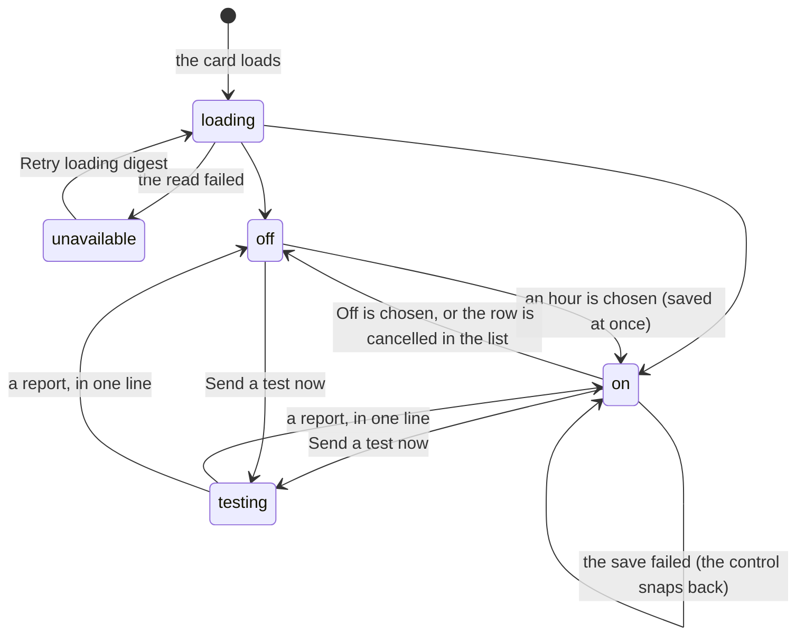

# The daily digest

## Summary

The daily digest is one unattended turn a day: Froggy looks at the lending picture, checks the wallet, and writes at most four sentences — what changed, what it cost, what was refused and why. It arrives on the person's phone when Telegram is paired, and in the web stream always.

It is set with one control: an hour, or **Off**. There is no save button and no wizard. Beside it is **Send a test now**, which runs the real thing immediately so the person can see the digest land rather than wait until morning.

The control sits at the top of the card headed "Reminders" on `/settings`, the page [the navigation](../../foundations/navigation.md) labels **Account**, above [the list of what is scheduled](schedules.md). The digest is itself a schedule and appears in that list.

## The simple case

The person opens Account. Under **Daily digest** is a sentence — "An unattended turn, once a day, under the same rules. Nobody can be asked, so a spend that needs your answer is refused." — and a dropdown reading **Off**.

They pick **7 AM**. Nothing else happens: the choice saves as it is made, and the zone appears beneath it in the machine typeface, read from the browser rather than asked for, because nobody knows their own IANA name and everybody knows what time it is where they are.

Curious, they press **Send a test now**. The button reads "Sending…" for a few seconds and then a line appears beside it: "Sent. Check Telegram if it is paired, and the chat." followed by the digest's own summary in quotes. On the phone, a card titled "Your daily digest" carries the same words and three figures: what was spent, how many receipts, how many refusals.

Below, in the **Scheduled** list, a row has appeared: "Daily digest — Every day at 07:00 · next 11 Sept 2026, 07:00 — The daily digest."

## The request, event by event

### Asking

The control asks the server what the digest is set to and shows "Loading…" while it waits, disabled, because a dropdown that can be changed before it knows its own value is a dropdown that will lose somebody's setting.

If that read fails it says "Couldn't load your daily digest." as an alert, shows **Unavailable** rather than **Off**, stays disabled, and offers **Retry loading digest**. **An unknown digest is never presented as an off one** — the difference between "you have no digest" and "we could not find out" is exactly the difference a person would act on.

Choosing an hour, or **Off**, is the whole of the asking. There is no confirmation step.

> Technical note: the hour is stored underneath as an ordinary daily schedule at the top of that hour, labelled "Daily digest", which is why it appears in the list below and why cancelling it there turns this control back to **Off**. One clock in the process rather than two.

### Answered at once

A save that fails ends here: "Couldn't save your daily digest. Try again." appears beneath the control, the control is marked invalid, and **it snaps back to the value that is actually saved**. A person who tried to switch a digest on and failed sees **Off**, which is the truth.

**Send a test now** can also end without a digest. When a turn is already running for that person the answer is "Not sent: a turn is already running. Try again in a moment." — the person's own conversation wins, and the test is not queued behind it.

### The work begins

Two quite different lines exist here.

Setting an hour commits nothing but a row in a table. Nothing runs and nothing is spent; the first digest is a day away at most.

**Send a test now** crosses [the real line](../../foundations/the-request.md#the-work-begins) immediately. It is not a preview and not a dry run: the same unattended turn the clock would fire at the hour, delivered the same way, spending real money and writing real history. Nothing warns the person of this before they press it.

### While it runs

The digest turn is bounded three ways: a minute of wall clock, a dozen steps, and five cents — whatever the mandate would otherwise have allowed — past which the loop stops before its next call rather than after it.

It is given three tools and no others: query the indexes, buy the paid lending snapshot at most once if the mandate allows it, and read the wallet. **No browser**, because a page nobody is watching is a page nobody can take back from the agent. **No notify**, so the digest cannot page the person twice.

And nobody to ask. A spend above the approval threshold is refused where it would ordinarily have raised a card, with the reason "This spend is over the automatic limit and there is no one to ask from here." The instructions the model is given say so plainly and call it the correct outcome rather than a problem to work around.

While that happens, a person looking at the workspace sees a marker in the conversation: "A turn started from the daily digest. Reload to follow it here." The button reads "Sending…" and cannot be pressed again.

### Finishing

The report goes two places. On a paired phone, a card titled "Your daily digest": the summary — or "Nothing to report." when there is none, or "Stopped early: …" when something ended it — and three fields, **Spent**, **Receipts**, **Refused**. In the web stream, a marker reading "Scheduled run: Your daily digest: {summary}". The stream's copy is filed without a second Telegram post, so the phone does not hear it twice.

After a test, one line appears beside the button and stays until the page is left. "Sent. Check Telegram if it is paired, and the chat.", with the summary quoted after it when there is one. "Stopped early: {reason}. Check the chat for what was filed." when it ended early — pointing at the chat because a run that stopped may still have spent. "Couldn't run the test. Try again." when the request itself failed.

Whatever the digest spent is spent, and its [receipts](../wallet/receipts.md) are in the wallet like any others.

## Variants

| Variant | Set before asking | Changed while it runs |
| --- | --- | --- |
| Who is asking | Only a person in the workspace sets the hour or presses the test. A schedule fires the real one. No MCP tool and no Telegram command reaches this control; the model's scheduling tool cannot create a digest either. | No effect. |
| The policy in force | Read when each spend inside the digest is judged, not when the hour was set. A digest set under a generous mandate is held to whatever is in force at seven in the morning. See [the leash](../../foundations/the-leash.md). | A change lands on the next judgement. |
| Funds available | No effect on the control. A digest with an empty balance still runs, is refused at its first paid step, and reports the refusal under "Refused". | Running out mid-run refuses that spend; the turn continues and explains. |
| What is being asked for | Fixed. The digest's instruction, its three tools and its five cents are the product's, not the person's; nothing about what it looks at can be changed here. | No effect. |
| The asking agent's grant | No effect. No scope reads or writes the digest hour, and no agent can trigger one. | No effect. |
| The shared browser | No effect. **The digest is given no browser**, so an attached browser is neither used nor disturbed. | No effect. |
| Appearance and motion | Rendering only. The hour list is formatted in the browser's locale, so it reads "7 AM" or "07:00" depending on where the reader is. | No effect. |

## Cancel and interrupt

| Event | Before it fires | While it is firing |
| --- | --- | --- |
| Stop — the person halts this run | No effect. A pending digest is not a run; switching it off is the only way to stop it. | Ends the digest turn. What it spent stays spent; the report reads "Stopped early". |
| Freeze — the wallet is frozen, mid-run | The digest still fires; its paid step is refused. Freezing does not switch it off. | Every spend from that moment is refused with `frozen` and counted under "Refused". See [freeze](../conversation/freeze.md). |
| Denying a waiting approval, or leaving it unanswered | No effect. | Not reachable. **The digest raises no card**: an `ask` resolves `unavailable` at once, so there is nothing to deny. |
| Asking something else while this request is still in flight | No effect. | **The person's own turn wins.** A digest due while a turn is running does not interrupt it; the clock retries for a while, and a test says "Not sent" straight away. |
| Leaving the page, or switching to another conversation, mid-run | No effect. The hour is saved as it is chosen. | The run finishes without anyone watching. **The test's one-line result is lost** — it lives only as long as the page does. |
| Reload; the tab or the app closed | No effect. | The same: the report still arrives on the phone and in the stream, but the line beside the button is gone. |
| Network lost; the socket drops | The read fails and says so rather than guessing; the retry is offered. | The run is the server's and continues. The result line may never arrive, leaving the button stuck at "Sending…" until the page is left. |
| The model, a service, or the facilitator errors or rate-limits mid-run | No effect. | The turn ends and the report says "Stopped early" with the reason. The daily row still moves on, so one bad morning is not a digest that retries forever. |
| The session expires, or the person signs out | The control cannot be read or written without a session. | **The digest keeps firing.** It belongs to the account, not the session. |
| The policy or a cap changes mid-run | Applies at the next firing. | Applies from the next judgement onward. |
| Funds run out mid-run | The digest fires anyway and reports the refusal. | That spend is refused; the turn continues and explains. |
| The person takes control of the shared browser mid-run | No effect. | No effect. There is no browser in a digest to take. |
| The same account open in a second tab or on a second device | Both show the same hour; the last save wins. | Both file the same "A turn started from the daily digest" marker; only the tab that pressed the test sees its result line. |

## Interactions with other systems

**The leash.** Setting an hour is not spending authority and is never judged. Every spend inside the digest is judged normally, with the human line unreachable: above the threshold is a refusal, not a card. See [the leash](../../foundations/the-leash.md).

**Money and receipts.** The digest may spend up to five cents a run, under whatever the mandate allows — the tighter of the two winning, as always. Its receipts are ordinary receipts. The report's "Spent" figure counts settled payments and leaves out conversions, which only turned one asset into another. See [money](../../foundations/money.md).

**Approvals.** None can be raised or answered. `unavailable` is the resolution, one of the three ways an approval ends without an answer. See [approvals](../conversation/approvals.md).

**Provenance.** The digest's spends are as provable as any other's; the schedule that caused them is recorded on the notice it produced. See [provenance](../../cross-cutting/provenance.md).

**History and persistence.** The digest turn is written to history under the source `schedule`, alongside `web`, `telegram` and `agent`. The hour and its zone persist in the database, survive a redeploy, and are removed with everything else by **Delete my data**. See [history and persistence](../../cross-cutting/history-and-persistence.md).

**The shared browser.** Deliberately absent, and for a reason about trust rather than cost: the person cannot take back a page they are not watching.

**Connected agents and grants.** No interaction. No agent can read the hour, change it, or trigger a digest.

**Notifications.** The digest is one of the three things that reach a person unasked, alongside a reminder and the agent's own message. It goes to [Telegram](telegram.md) when paired and to the web stream always, and the two are deliberately not the same message twice. See [notifications](../../cross-cutting/notifications.md).

**Navigation and URL state.** The control is part of a card on `/settings` with no URL of its own. Neither the hour nor a test result is in the URL.

**Appearance, motion and accessibility.** The dropdown carries its own accessible name and is tied to the explanatory sentence, so a screen reader hears what an unattended turn is before it hears the hours. Failures are alerts; the test's result is a status update, announced without stealing focus. The control is disabled while it is loading and while it is saving. Every target clears 44px.

**Offline and reconnection.** The control needs the network to read, save and test, and distinguishes "could not read" from "off" rather than guessing. The digest itself does not: it fires on the server with no tab connected, and its marker and notice are waiting in the stream on return. See [offline and reconnection](../../cross-cutting/offline-and-reconnection.md).

**Stubs.** The digest runs on a stubbed build: it takes a real turn, writes history, and produces receipts marked `stubbed: true`. What differs is where the report goes — a log line rather than a phone when there is no bot — and what the paid step can honestly claim. **A digest on a stubbed build proves the machinery, not the money.** See [stubs](../../cross-cutting/stubs.md).

## Edge cases

- The hour is the top of the hour, exactly. There is no half past.
- Turning the digest off does not delete the history of past ones; it removes the row, and the stream keeps what was filed.
- Cancelling the "Daily digest" row in the list below is the same act as choosing **Off** here, and each is reflected in the other at once.
- A failed save leaves the control showing the saved value, not the attempted one — including the case where the person was switching a digest **on** and it stayed **off**.
- **Send a test now** has no confirmation, no cost estimate beforehand, and no limit on how often it can be pressed. Each press is a separate run with its own five cents.
- Two figures on the report can disagree with intuition: "Receipts" counts refusals as well as payments, and "Refused" counts them again, so a run that was refused once shows one of each.
- The digest is instructed to write at most four sentences and to use plain language with no headings, so it will not look like the model's usual formatted answer.
- A digest that found nothing to say reports "Nothing to report." rather than an empty message.

## Open questions and verification

- **The zone shown under the control is the browser's, not the digest's.** The line beneath the hour is read live from the browser, while the digest fires in the zone it was saved with. A person who sets 08:00 in Berlin and later opens the page in New York sees "America/New\_York" printed under a digest that still fires at 08:00 Berlin time — and nudging the hour there silently moves it. The saved zone is returned by the server and never displayed. Worth treating as a defect.
- **"Send a test now" spends real money with no warning.** The label says "test", the run is not one. Nothing before the press says it will pay, and nothing caps how many times it may be pressed. Worth treating as a defect, or at least a sentence.
- Whether a test run's report is distinguishable from the morning's real one, on the phone or in the stream, could not be determined: both carry the same title and the same shape.
- If the test's result never arrives — the network dropped while the run was going — the button appears to stay at "Sending…" indefinitely, with no timeout observed. Not confirmed by hand.
- The five-cent ceiling is described in the code as "five cents a day", but it is applied per run. A test and the morning's digest are two runs and two ceilings. Whether the daily reading was intended was not established.
- The digest appears not to consume the person's daily turn and step allowance, unlike a web or Telegram turn. Read from the code, not confirmed by hand.
- The e2e specs cover a failed save that reports itself and keeps the true value, an unavailable digest that is not shown as off and can be reloaded, the digest and the scheduled list staying in step in both directions, and **Send a test now** reporting one of its three outcomes within a minute. No spec asserts what the phone received, because none can run without a bot token.

Verified against the Froggy tree at commit `5caed50`.
