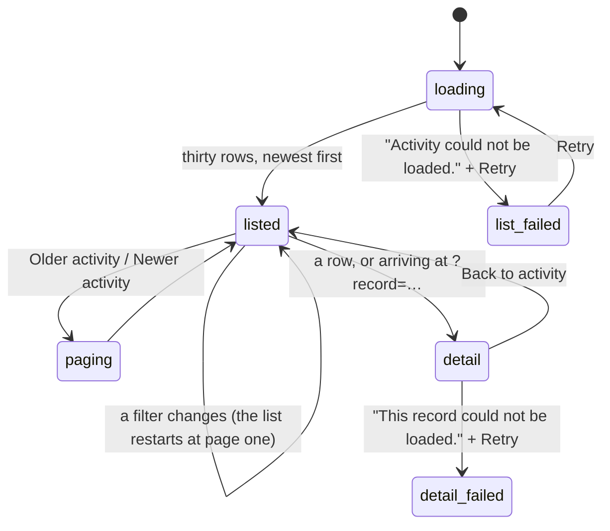

# Activity

## Summary

Activity is the record of what happened: requests, tool calls, results and payment evidence across the whole workspace, in one list, filterable four ways. It lives at `/activity` and it is **not a destination** — it is reached from the line at the foot of [Explore](explore.md), from the **Activity** button above a conversation, and from an **Inspect call** link on a connected agent's page.

Its second half is the record deep link. Any row can be opened by id, at `/activity?record={id}`, which puts the evidence beside the list on a wide screen and in a sheet on a phone. That URL is the one thing on the page built to be handed to someone else — or to an agent, which is what the **Copy for agent** button is for.

The page argues one thing throughout: a call that completed is not a payment that settled. It says so in as many words when a record has no receipt attached.

## The simple case

The person opens Activity. Four filters sit across the top — Source, Status, Connection, Since — all set to "All". Below them, thirty rows, newest first: each a run or a tool call, with its title, a status badge, a two-line preview of what came back, and a footer reading where it came from and when, plus how long it took.

They press a row. The URL becomes `/activity?record=…` and the evidence opens beside the list: the title again, the source and time, the status, then three buttons — **Open conversation**, **Explain this run**, **Copy for agent** — and then the evidence itself. At the bottom, under **Payment evidence**, either the receipts for that record or one sentence: "No receipt is linked to this record. A completed call alone does not confirm payment."

**Back to activity** clears the record from the URL and the list widens to fill the page again.

## What a row is, and what a record holds

A row is a run or a tool call. Its title is the conversation run itself, or the tool's name with its underscores turned into spaces; its badge is the status; its footer is the source, the time, and — for a finished call — how long it took to the tenth of a second.

Opening one shows everything kept about it, in a fixed order:

| Section | What it holds |
| --- | --- |
| Heading | The title, the source and time, and the status. |
| The three buttons | **Open conversation** when the record belongs to one, **Explain this run**, **Copy for agent**. |
| Business | A URL purchase or a service task: its status, payment and delivery kept apart, the quoted price, the approval and when it expires, and any error. |
| The record itself | A message's text and delivery; a stored result; a run's error; a run's approvals with their resolutions. |
| Tool call detail | The recorded input, the outcome, and badges for **Preview truncated** and **Credentials removed**. |
| Related | The run's messages in order, then its tool calls, each a link to its own record. |
| Payment evidence | The receipts, or the sentence saying there are none. |

## The request, event by event

### Asking

Arriving on Activity asks for one page of the record with whatever the four filters say. The filters are Source (web, telegram, agent, schedule), Status, Connection (each connected agent and each grant by name), and Since (a date). All four start empty, meaning all.

Before the list is read, the server does two things the page never mentions: it recovers anything an agent or Telegram wrote outside the workspace's own history, and it expires any run whose lease has run out — so a run that died mid-turn is already marked `interrupted` by the time the person sees it.

> Technical note: the list is runs and tool calls only. Conversations, messages and stored results are not rows here; they are reached through the record they belong to. A tool call made inside a run is folded under that run rather than listed twice.

### Answered at once

Almost everything here ends without a run. Filtering, paging, opening a record, copying the deep link and inspecting a stored result are all reads, and none of them spends, records, or changes anything.

The one exception is **Explain this run**, which starts a turn.

An unreadable `record` in the URL is not an error: anything that is not a valid record id is dropped silently and the page opens on the plain list, as though nothing had been asked for.

### The work begins

**Explain this run** sends a request into the current conversation asking Froggy to read this record with its own history search, cite the recorded evidence, distinguish payment from delivery, and repeat no operation. From that instant it is an ordinary turn with an ordinary cost — see [the request](../foundations/the-request.md).

**The page does not go to the conversation.** The person stays on Activity, the button greys out while the turn runs, and the answer arrives somewhere they are not looking.

### While it runs

Activity keeps working while a turn runs elsewhere. Nothing is disabled except **Explain this run** itself, which stays disabled while the workspace is busy or history is still loading.

New records do not stream in. The list is a page that was fetched, not a live feed; the run that is happening right now appears on the next fetch.

When the workspace has fallen behind — the socket is down, or the recovery cursor could not be caught up — one line sits above the filters: "Updates are delayed. Showing the last saved snapshot."

### Finishing

Nothing finishes on Activity. A record's status is whatever it was when the page was fetched, and the way to see it change is to fetch again.

## Variants

| Variant | Set before asking | Changed while it runs |
| --- | --- | --- |
| Who is asking | Only a person sees this page, but every source is in it: the Source filter is the four values a turn can come from, and Connection narrows it to one agent or one grant. A connected agent reads the same record over MCP rather than here. | No effect. |
| The policy in force | No effect. The record is readable whatever the mandate says, and a frozen wallet changes nothing about it. What the leash decided is _in_ the record, as receipts and refusals. | No effect. |
| Funds available | No effect. Reading costs nothing. **Explain this run** costs whatever a turn costs. | No effect. |
| What is being asked for | Decides what the evidence looks like: a purchase and a service task get a business block, a message gets its text and its delivery, a tool call gets its recorded input and outcome, a run gets its approvals. | No effect. |
| The asking agent's grant | Populates the Connection filter with every agent and grant by name, revoked or not, so a revoked agent's trail stays filterable — revocation is a timestamp, not a deletion. | No effect. |
| The shared browser | No effect on the page. A browsing turn's calls appear as rows like any other. | No effect. |
| Appearance and motion | The theme styles the rows and badges. Width decides everything about the detail: at 768px and above it is a sticky panel beside the list; below, a full-width sheet. | Crossing that width mid-read moves the evidence from the panel to the sheet. |

## Cancel and interrupt

| Event | Reading the list | With the evidence open |
| --- | --- | --- |
| Stop — the person halts this run | Nothing to stop from here. There is no stop control on Activity. | A turn started by **Explain this run** can only be stopped from the conversation. |
| Freeze — the wallet is frozen, mid-run | No effect. The record is readable while frozen. | No effect. Refusals with the code `frozen` appear as records like any other. |
| Denying a waiting approval, or leaving it unanswered | No effect on the list. | A run's Approvals section shows each question's resolution, or "Awaiting answer" with the instant it expires. |
| Asking something else while this request is still in flight | No effect. | Pressing **Explain this run** again is prevented while busy; the button is disabled. |
| Leaving the page, or switching to another conversation, mid-run | The filters and the page position are lost; they are not in the URL. | The record _is_ in the URL, so the deep link survives the return; the filters around it do not. |
| Reload; the tab or the app closed | The list is fetched again from page one with the filters cleared. | The record reopens from the URL. |
| Network lost; the socket drops | The delayed-updates line appears. A first load fails to "Activity could not be loaded." with a **Retry**. | The detail fails to "This record could not be loaded." with its own **Retry**; the list beside it keeps what it had. |
| The model, a service, or the facilitator errors or rate-limits mid-run | No effect on reading. | The failure is what the record will say: a run's own error text is shown, and a business record shows its error line. |
| The session expires, or the person signs out | Every request fails with the error state. | The same. |
| The policy or a cap changes mid-run | No effect. The record is what was decided at the time, not what would be decided now. | No effect. |
| Funds run out mid-run | No effect on reading. | **Explain this run** can be refused for the day's model budget like any other turn, and the refusal is shown in the conversation, not here. |
| The person takes control of the shared browser mid-run | No effect. | No effect. |
| The same account open in a second tab or on a second device | Each tab has its own filters and its own page position. | Both can open the same record; the deep link is the same URL. |

## Interactions with other systems

**The leash.** Every decision it made is in this record, as receipts, as refusals, and as the approvals a run parked on. The page does not re-judge anything; it shows what was judged. See [the leash](../foundations/the-leash.md).

**Money and receipts.** **Payment evidence** is the last section of every record, and it is the page's whole argument: receipts if there are any, and if there are none, the sentence saying that a completed call is not a settled payment. A business record shows the quoted price beside the payment and the delivery, kept apart on purpose. See [receipts](wallet/receipts.md).

**Approvals.** A run's evidence lists each approval it raised, its resolution or "Awaiting answer", when it expires, and the raw request that was asked about. Nothing here can answer one; answering happens in the conversation. See [approvals](conversation/approvals.md).

**Provenance.** This is where provenance is read. The receipts carry their settlement and their evidence, a stored result carries the source it came from, and a tool call carries what was sent and what came back — with **Credentials removed** on the ones that were redacted. See [provenance](../cross-cutting/provenance.md).

**History and persistence.** Activity is the reading surface for [the conversation](../foundations/the-conversation.md)'s record. Everything on this page is durable and none of it can be edited or removed from here.

**The shared browser.** No interaction. A browsing turn's calls are rows; the pages it visited are not replayable from here.

**Connected agents and grants.** The Connection filter narrows the record to one agent, which is how "what has this assistant been doing" is answered. In the other direction, an agent's own page links straight to a call with **Inspect call**. See [the agent detail](connections/the-agent-detail.md).

**Notifications.** None. Activity raises no badge and clears none.

**Navigation and URL state.** Activity is not a destination and appears in no navigation. It holds exactly one thing in the URL — `record` — and validates it: a valid record id opens the evidence, anything else is dropped without a word. **The four filters and the page position are not in the URL**, so a filtered view cannot be linked or restored. See [url state](../cross-cutting/url-state.md).

**Appearance, motion and accessibility.** One `h1`, "Activity". Every filter has a real label and is a native control. Times are `<time>` elements with a machine-readable value beside the readable one. Both error states are announced. The evidence panel is a landmark beside the list on a wide screen and a titled sheet — "Activity details" — on a phone, with **Back to activity** at the top of each. Recorded input, results and raw approval requests are in scrolling blocks so a large body cannot push the page apart.

**Offline and reconnection.** The delayed-updates line is the page's whole offline story: it says what is being shown is the last saved snapshot rather than pretending it is current. Records already fetched stay readable. See [offline and reconnection](../cross-cutting/offline-and-reconnection.md).

**Stubs.** A stubbed receipt is marked as stubbed on its own ticket, and stubbed evidence says so in words — a snapshot taken "at a current block (a recorded fixture)". The list itself does not distinguish stubbed rows from live ones. See [stubs](../cross-cutting/stubs.md).

## Edge cases

- Status checks and list calls are folded away. Any tool call whose name ends in "status" or "list" goes into a collapsed **Status and list checks (n)** below the list, with the reason: "Checks are recorded individually. They are not additional payment receipts." A person hunting for a poll will not find it in the main list.
- The Status filter offers seven of the eight statuses a turn can have. **`accepted` is missing**, so a turn that was taken but never started cannot be filtered for.
- The Connection filter lists agents and grants by name, and two connections with the same name are indistinguishable in the list.
- Changing any filter restarts paging at the first page. There is no way to hold a position across a filter change.
- **Copy for agent** copies two lines — "Froggy activity {id}" and the full deep link — and the button then reads "Copied" for as long as that record stays open. It does not go back to its old label.
- A tool call's preview falls back through three things: the result, then the input, then "Historical call body unavailable". An old record can therefore show a row with nothing in the middle of it.
- A stored result opens under **Inspect recorded result** rather than inline, is capped in height, and is marked **Result truncated** when the whole of it was not kept. **Open source** is offered only when the record kept a URL.
- A message record shows its delivery state, and adds "Recovered from Telegram cache" when the text came back from somewhere other than the run that wrote it.
- The evidence for a run also lists the run's messages and its tool calls, each of the latter a link to its own record — so the same call is reachable both as a row of its own and as a child of the run.
- The two links out to a task go to different places by different means: a business record's "View task and sale" is a plain link, and a tool call's "View task" is a router link. Both land on `/services` with the task named.

## Open questions and verification

- **Explain this run does not take the person to the answer.** It sends a turn into the current conversation and leaves them on Activity with a disabled button and no other feedback. Worth treating as a defect: the whole point of the button is to read the explanation.
- The turn it sends is written for the model, not the person, and includes the record id verbatim — so the conversation shows a request the person did not phrase. Whether that is intended has not been established.
- **`accepted` missing from the Status filter** is more likely an oversight than a decision; the eight statuses are fixed in one place and seven of them are listed here.
- The list mixes runs and tool calls in one ordering. Whether a run and the call it contains can both appear at the top of the list — the call is filtered out only when it names a run — was not confirmed by hand.
- Whether a record deep link opened by someone else's agent, or pasted into a chat, still resolves for that person was not established; the URL carries no token and the page requires a session.
- The delayed-updates line comes from the history client's own recovery loop. What it takes to clear it, and how long it stays up after the network returns, has not been watched happen.
- `e2e/history.spec.ts` covers the deep link, the presence of **Payment evidence** and **Explain this run** on a run, and that **Back to activity** clears the URL. No spec exercises the four filters, paging, the folded status checks, or **Copy for agent**.

Verified against the Froggy tree at commit `5caed50`.
