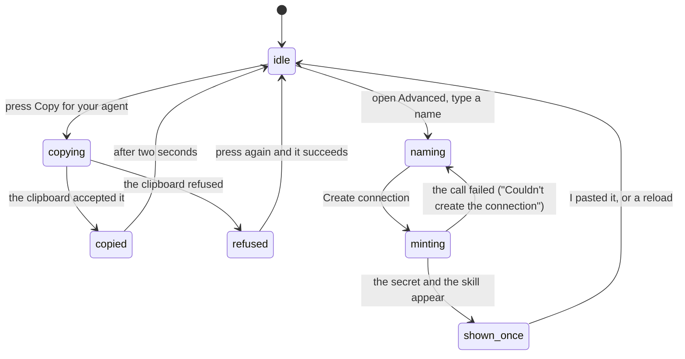

# Connecting an agent

## Summary

Connecting an agent is one button. **Copy for your agent** puts a single sentence on the clipboard; the person pastes it into their agent's chat, the agent reads a public document, installs a skill, and asks to connect. The person then approves the connection in their own browser. Nothing on this page hands out a secret and nothing on it grants permission — the permission is given later, on the consent screen, by the person.

Behind a disclosure marked **Advanced: connect with a token** there is a second way in for an agent that cannot open a browser: the person names it, Froggy mints a connection token, and shows the secret exactly once.

Both paths live on **Connections**, which is [reachable and visibly not a destination](../../foundations/navigation.md). The copy button also appears on Home and on the Wallet, so the first connection can be made from wherever the person happens to be.

## The simple case

The person opens Connections. The page's first section says: "Paste these instructions into your agent's chat. It installs the skill and connects to Froggy; you approve access in your browser." Under it is one button, **Copy for your agent**.

They press it. A line of small text under the button changes from "Paste into your agent's chat, then approve access in your browser." to "Copied. Paste this into your agent's chat." for two seconds. What is on the clipboard is one sentence:

> Read {the workspace's origin}/llm.md and follow it to connect yourself to my Froggy wallet as an MCP server; then tell me what you can do.

They paste it into Claude Code, Cursor, or whatever they use. The agent fetches `/llm.md`, saves the skill, adds Froggy as an MCP server by URL, and starts the OAuth flow. Froggy opens in the person's browser with [the consent screen](../../agent-surface/oauth-consent.md), naming the client and listing the five scopes — brief, browse, pay, services, history — each with a switch. The person leaves on what they want and presses Allow.

The agent is now in [the agent list](the-agent-list.md), and the connection count under the copy button on Home and the Wallet changes from "No agent connected yet." to "1 agent connected".

## The request, event by event

### Asking

Pressing **Copy for your agent** is the whole of the asking. There is nothing to fill in: the sentence is built from the workspace's own MCP origin, or from the address bar when the workspace does not name one.

The token path asks for one thing, an **Agent name**, pre-filled with "Hermes". **Create connection** is disabled while the name is empty, while the call is in flight, and while a previously minted secret is still on screen — one at a time, so two secrets cannot be confused for each other.

### Answered at once

The copy can end here. If the clipboard refuses — a browser that will not write without a gesture, a permission denied, a page that is not focused — the button does not fail silently. A read-only text area labelled "Instructions for your agent" appears under it holding the exact same sentence, and an alert says "Couldn't copy. Try again, or select and copy the text yourself." **This is the manual-copy recovery**, and it is the reason a clipboard refusal is not a dead end: the text is still there to be selected by hand.

Nothing is recorded when the sentence is copied. Froggy does not know the person copied it, and no connection exists until an agent turns up and the person approves it.

### The work begins

For the copy path, the line is crossed outside Froggy: the agent registers itself as an OAuth client, sends the person to the consent screen, and a grant exists only once Allow is pressed.

For the token path, the line is crossed when **Create connection** is pressed. A row is written immediately and the secret is generated. What comes back is shown in a panel headed "Give your agent its connection": the token in its own field, labelled "Connection token" and beginning `fgy_`, with a **Copy connection token** button; and beneath it the reusable `SKILL.md`, in a text area labelled "Skill for your agent", with **Copy skill**. The two are deliberately apart — the skill contains the person's server URL and **no secret**, so it can be pasted anywhere.

> Technical note: only a SHA-256 hash of the secret is stored. The secret exists in the response to that one request and in the browser's memory; there is no route that can show it again. See [identity and agents](../../foundations/identity-and-agents.md).

### While it runs

The panel says what it is worth knowing: "Save the token as your agent's `FROGGY_TOKEN`. It is shown only here." and, at the foot, "You can leave this page and come back to it. Reloading clears this copy; if you haven't saved it, disconnect this connection and create another."

Both are true. The secret is held in module memory rather than in the page, so walking to the Wallet and back leaves it on screen. A reload does not.

The new connection appears in the list below at the same time, before the person has done anything with the secret.

### Finishing

**I pasted it** dismisses the panel and forgets the secret. There is no confirmation and no undo. The connection stays; only the copy of its secret is gone.

For the copy path, finishing happens in the agent: it reports back what it can do. The person's evidence that it worked is the connection count changing and a new row in the list.

## Variants

| Variant | Set before asking | Changed while it runs |
| --- | --- | --- |
| Who is asking | Only a person can connect an agent. There is no tool, Telegram command or schedule that mints a token or answers a consent screen; the token route is refused to agent callers on every path but the few they are allowed. | No effect. |
| The policy in force | No effect. Connecting spends nothing, so [the leash](../../foundations/the-leash.md) never judges it. It works while the wallet is frozen. | No effect. |
| Funds available | No effect. A connection can be made with a balance of zero. | No effect. |
| What is being asked for | Two paths: the copy, which ends at a consent screen with chosen scopes; and the token, which is minted with no scope check at all. | The person can copy the sentence and mint a token in the same visit. |
| The asking agent's grant | No scope reaches this page. An agent already connected cannot connect another, widen itself, or mint a token. | No effect. |
| The shared browser | No interaction. The consent screen opens in the person's own browser, not [the shared browser](../../foundations/the-shared-browser.md). | No effect. |
| Appearance and motion | The "Copied" tick fades only when the press came from a pointer; a keyboard activation shows it with no transition. | A theme change restyles the page in place. |

## Cancel and interrupt

| Event | Before the connection exists | After it exists |
| --- | --- | --- |
| Stop — the person halts this run | No effect. Connecting is not a run. | No effect. |
| Freeze — the wallet is frozen, mid-run | No effect. An agent may be connected to a frozen wallet; it simply cannot spend. | No effect. |
| Denying a waiting approval, or leaving it unanswered | No effect. Connecting raises no approval. | No effect. |
| Asking something else while this request is still in flight | No effect. The composer is elsewhere. | No effect. |
| Leaving the page, or switching to another conversation, mid-run | The copy is already on the clipboard; nothing is lost. | The minted secret survives navigation inside the app — it is held outside the page. |
| Reload; the tab or the app closed | Nothing is lost; nothing existed. | **The secret is gone.** The connection remains and must be disconnected and remade. |
| Network lost; the socket drops | The copy still works: the sentence is built locally. Minting fails with "Couldn't create the connection." | The list stops refreshing; the secret on screen is unaffected. |
| The model, a service, or the facilitator errors or rate-limits mid-run | No effect. None is involved. | No effect. |
| The session expires, or the person signs out | Minting fails; the copy still works and still names the right server. | The connection is the workspace's, not the browser session's, and outlives the sign-out. |
| The policy or a cap changes mid-run | No effect. Scopes and caps are separate mechanisms. | No effect. |
| Funds run out mid-run | No effect. | No effect. |
| The person takes control of the shared browser mid-run | No effect. | No effect. |
| The same account open in a second tab or on a second device | Both offer the same sentence. | The new connection appears in the other tab within ten seconds; **the secret does not** — it exists only in the tab that minted it. |

## Interactions with other systems

**The leash.** None at this point. Connecting grants no spending room: the caps, allowlists and approval threshold apply to the agent exactly as they apply to the person, and no scope changes them.

**Money and receipts.** Nothing is spent and no receipt is written. What the connection later costs is recorded against it and shown on [its own page](the-agent-detail.md).

**Approvals.** None here. The consent screen is not an approval — it is a grant of what may be asked for, not permission for a particular spend.

**Provenance.** The instruction sentence carries an origin the workspace supplied, not one a model wrote. An address or URL an agent later brings is `model` provenance and is not payable whatever scopes it holds.

**History and persistence.** The connection and its dates are persisted. The copy is not: Froggy records nothing when the sentence is copied, so there is no trace of an attempt that never reached consent.

**The shared browser.** No interaction. `browse` is a scope the person may leave on, but nothing here opens a browser.

**Connected agents and grants.** This document is the front door to both; [identity and agents](../../foundations/identity-and-agents.md) owns what a grant and a token are.

**Notifications.** None. A new connection raises no badge, no Telegram message and no digest line. The person finds out because the count under the button changed.

**Navigation and URL state.** Connections is `/agents`. Neither the disclosure state nor the minted secret is in the URL, so neither survives a reload or can be linked to.

**Appearance, motion and accessibility.** The button is at least 44px tall, reports `aria-busy` while the clipboard call is outstanding, and shows a spinner in place without changing size, so nothing moves under a second press. The confirmation is a live region; the refusal has an alert role. The token and the skill are in the machine typeface, read-only, and reachable by keyboard.

**Offline and reconnection.** The copy works offline. Minting does not, and says so.

**Stubs.** The connection paths are real on every build: a stubbed workspace still mints tokens, still runs consent, and still records invocations. What is stubbed is what the agent's spending settles against — see [stubs](../../cross-cutting/stubs.md).

## Edge cases

- The copy button appears in four places — Connections, Home, the Wallet, and the welcome panel of an empty conversation — and copies the identical sentence from all of them.
- The connection-status line under the button links to the single agent's page when exactly one is connected and to the list when more are. While it is loading it is a skeleton; when the list call fails it reads "Connection status unavailable." with a **Retry connection status** button, and the copy button never disappears while any of that happens.
- The sentence names `/llm.md`, which is public. Anyone holding it can read what Froggy offers; it is not a credential and grants nothing.
- Pressing **Create connection** with the name left as "Hermes" is allowed. Names are trimmed and cut to 80 characters, and an empty one becomes "agent".
- A minted token has no scopes to choose and no expiry. It is refused only when the person disconnects it, and until then it may do everything an agent may do.
- The skill text tells the agent that the person "can disconnect you on the Agents page at any moment" — the page the navigation calls **Connections**.
- The panel's own advice for a lost secret is to disconnect the connection and make another. There is no rotate.

## Open questions and verification

- **The area has two names.** The navigation rail says **Connections**; the page's own heading says "Agents", its intro says "let another agent request tasks on this wallet", and the skill text handed to every agent says "the Agents page". The route is `/agents`. One of the two is wrong, and a person told to look at "the Agents page" will not find that word in the navigation.
- A minted token bypasses the scope check entirely — a token caller carries no scope set, and the code's own comment says it "may do everything an agent may". The consent screen's careful five switches therefore describe only the OAuth path, and the safest connection to make is the one behind the disclosure marked "Advanced".
- The `services` scope is described in the domain as what every MCP tool call needs, but each tool is classified to exactly one scope: the x402 and trading tools require `pay` and `froggy_history` requires `history`. A grant holding only `services` appears to be refused those tools. Not confirmed by hand.
- Whether the consent screen can be reached at all without the agent first registering itself as a client has not been checked; the copy path assumes the agent does that unattended.
- The e2e specs cover the copy on Home, the Wallet and Connections, the clipboard refusal and its fallback text area, the pending state, minting, navigating away and back with the secret intact, and disconnecting. No spec exercises the full OAuth path from an outside client.
- Whether a reload really clears the secret, as the panel promises, is asserted by the store's comment and not exercised by a spec.

Verified against the Froggy tree at commit `5caed50`.
