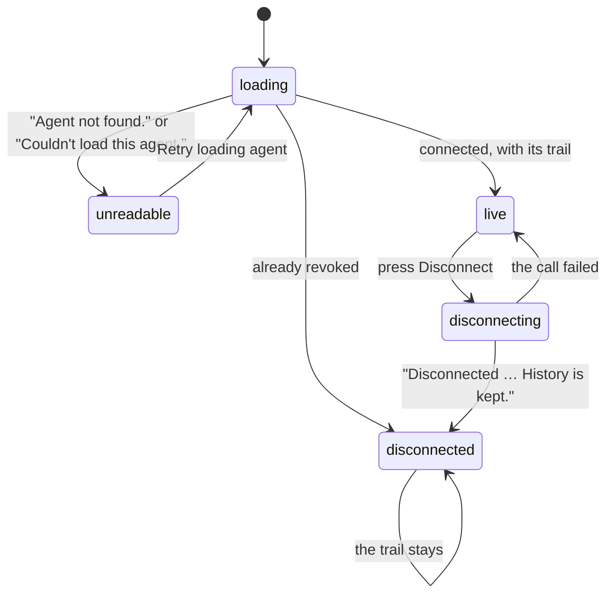

# The agent detail

## Summary

One connection, in full. The page is reached by pressing a card in [the agent list](the-agent-list.md), or by the "1 agent connected" line under the copy button when exactly one is connected. It is titled with the agent's own name and holds two things: what the connection is — its scopes, when it connected, when it was last used, and a **Disconnect** button — and, under that, the trail of what it has actually done.

The trail is the reason the page exists. Every call an agent makes is written down before it runs, so a call that never came back is still visible; each row says what was called, how it ended, what it cost, and links out to the task it bought and to the record of the call itself.

Only the owner can read it. The agent whose page it is gets a refusal, and another person gets "no such agent" — the page does not confirm that an id exists to anyone who does not own it.

## The simple case

The person presses a card in Connections. The page opens on the agent's name, with **All agents** above it as the way back.

The first block is a small definition list: **Scopes** — "brief, browse, pay, services" — **Connected since**, and **Last used**, which reads "Never" until the agent has actually called. Below it, **Disconnect**.

The second block is headed "Invocation history", with **Refresh history** beside it and one line of small text: "Newest 50 calls and requests. Calls made before history was added are unavailable." Then the rows, newest first. A typical one reads `froggy_service_run`, a badge saying "accepted", "Task request · 9 September 2026, 14:06:40", "$0.01 paid", "Task · done: tsk_…", and **Inspect call**.

The page refetches itself every ten seconds, so a run in progress fills the list while the person watches.

## The request, event by event

### Asking

The page asks for one connection by its id. An id that is neither a token id nor a grant id is refused before anything is looked up.

While it loads there is a single skeleton labelled "Loading agent" and nothing else — no name in the title, which shows "Agent" until the real one arrives.

### Answered at once

Two endings need nothing more. "Agent not found." is what a 404 says: an id that does not exist, one that belongs to somebody else, or one that is malformed — the three are deliberately indistinguishable. Anything else says "Couldn't load this agent." Both appear as an alert with a **Retry loading agent** button beneath.

A connection that was already disconnected loads normally. In place of the button it says "Disconnected {date and time}. History is kept.", and the trail below is complete.

### The work begins

The only action on this page is **Disconnect**, and it behaves exactly as it does in the list: no confirmation, the button disables and reads "Disconnecting…", and on failure a small alert says "Couldn't confirm the disconnect. Try again or refresh status." with the retry named after the agent.

On success the page does not navigate away. The section swaps the button for the "Disconnected … History is kept." sentence, and every row of the trail stays exactly where it was — which is the whole point of revoking by timestamp rather than deleting.

### While it runs

Each row of the trail is one invocation and shows five things at most.

The **name** is what was called, in the machine typeface: an MCP tool name like `froggy_services`, or an endpoint name like `tasks.get`, `services.run`, `brief`, `Protocol validation`.

The **outcome** is a badge. `ok`, `accepted`, `replayed`, `signed`, `completed`, `refused`, `payment_required`, `insufficient_scope`, `invalid_request`, `error` — underscores are shown as spaces. A row still reading `started` is shown as **"Outcome not recorded"**, which is what an interrupted call leaves behind. A second badge, **Simulated**, marks anything that touched a stub.

The **kind and time**: "MCP tool", "Task request" or "Payment request", then the local date and time.

The **money**, when there is any: "$0.05 paid", or "$0.05 signed · settlement not confirmed" when the agent signed a payment header and settlement was never confirmed back. The distinction is deliberate — signing is not settlement.

The **links**: the task id, with its status, linking to that task on the Services page; and **Inspect call**, linking to [the record](../activity.md) of the call itself.

> Technical note: what is kept is metadata only — never arguments, results, payment headers or credentials. A row is appended before the call executes and updated when it finishes, which is why an interrupted call appears with no outcome rather than not at all.

### Finishing

Nothing on this page finishes; it is a record, and it ends when the person leaves. **Refresh history** re-reads it on demand and is disabled while a fetch is outstanding.

## Variants

| Variant | Set before asking | Changed while it runs |
| --- | --- | --- |
| Who is asking | Only the owner. The agent itself is refused with a 403 and a stranger with a 404, so an agent cannot read its own trail through this route. | No effect. |
| The policy in force | No effect. Reading a trail spends nothing and [the leash](../../foundations/the-leash.md) is not consulted. Works while the wallet is frozen. | No effect. |
| Funds available | No effect on the page. What is shown is what was already spent. | No effect. |
| What is being asked for | Reading, or disconnecting. There is nothing else to press. | No effect. |
| The asking agent's grant | Decides the Scopes line. An OAuth grant shows the scopes the person left on; **a minted token shows brief, browse, pay, services** — a fixed list it did not actually agree to. See [Open questions](#open-questions-and-verification). | Scopes cannot be edited here. |
| The shared browser | No interaction. A `browse` invocation appears as a row like any other. | No effect. |
| Appearance and motion | Rows are styled by the saved theme; the money line uses the money typeface and the name the machine one. New rows appear on a poll with no animation. | A theme change restyles in place. |

## Cancel and interrupt

| Event | Before Disconnect is pressed | After it is pressed |
| --- | --- | --- |
| Stop — the person halts this run | No effect on the page. A stopped run's invocation keeps whatever outcome was recorded. | No effect. |
| Freeze — the wallet is frozen, mid-run | No effect on the page; later rows will carry refusals. | No effect. |
| Denying a waiting approval, or leaving it unanswered | No effect here. The refusal surfaces as the invocation's outcome and on the task. | No effect. |
| Asking something else while this request is still in flight | No effect. | No effect. |
| Leaving the page, or switching to another conversation, mid-run | Nothing is lost; the trail is on the server. | The revocation completes without the page. |
| Reload; the tab or the app closed | The page reloads from the URL. | The reloaded page shows whichever state the server settled on. |
| Network lost; the socket drops | The next poll fails and the page becomes its error state with a retry. | "Couldn't confirm the disconnect." — it may still have happened. |
| The model, a service, or the facilitator errors or rate-limits mid-run | The failure is recorded as that invocation's outcome and its row says `error`. | No effect. |
| The session expires, or the person signs out | The page fails to load and offers its retry. | The call fails; the connection's state is whatever the server did. |
| The policy or a cap changes mid-run | No effect on the page. Scopes and caps are separate mechanisms and neither is edited here. | No effect. |
| Funds run out mid-run | No effect on the page; subsequent rows carry refusals with their reason. | No effect. |
| The person takes control of the shared browser mid-run | No effect. | No effect. |
| The same account open in a second tab or on a second device | Both show the same trail within ten seconds. | The other tab swaps to "Disconnected … History is kept." on its next poll. |

**Disconnecting does not cancel an accepted run.** The page gives no indication either way, and the trail will go on gaining rows for work that was already under way.

## Interactions with other systems

**The leash.** Not editable here and not consulted here. What the leash decided shows up as an invocation's outcome — a refusal reaches the agent in the leash's own words and lands on the row as `refused` or `payment_required`.

**Money and receipts.** This is the only place a connection's spending is visible as a per-agent list, and even here it is per-call rather than totalled. A figure appears only where one was recorded: an accepted paid task shows the task's price, a signed payment shows the amount signed for and says settlement is unconfirmed, and a replay of an idempotent request shows nothing at all, because polling or replaying a task is not another purchase. Receipts themselves live in [the wallet](../wallet/receipts.md).

**Approvals.** An invocation that hit the approval threshold is recorded like any other; the ticket is answered by the person elsewhere. No scope lets an agent answer its own.

**Provenance.** **Inspect call** is the bridge from "this agent did something" to the full record with its inputs, results and linked receipts. What the invocation itself keeps is bounded metadata.

**History and persistence.** The trail is capped at the newest fifty and ordered newest first. Older calls are not paged to — they are simply not shown, and the page says so. A note admits the other gap: calls made before this history existed are unavailable.

**The shared browser.** No interaction beyond a browse task appearing as a row.

**Connected agents and grants.** [Identity and agents](../../foundations/identity-and-agents.md) owns what a grant, a token and an invocation are.

**Notifications.** None. Nothing on this page raises a badge and nothing tells the person when a new invocation arrives; the list simply grows.

**Navigation and URL state.** The route is `/agents/{id}` and the id is the whole of its state. **All agents** returns to the list; the task link goes to `/services?task=…` and **Inspect call** to `/activity?record=…`.

**Appearance, motion and accessibility.** The two blocks are labelled regions — "Agent connection" and "Invocation history". The trail is an ordered list. Times carry machine-readable datetimes beside their human ones. Load failures and disconnect failures carry an alert role. Every control clears 44px, and the page is checked at 1440, 390 and 320 pixels wide with no horizontal scroll.

**Offline and reconnection.** The page needs the network for everything. Offline it holds what it had and then shows its retry.

**Stubs.** Any invocation that touched a stub carries a **Simulated** badge, taken from the sale where there was one and otherwise from the build. A stubbed row's money figure is not a settled payment — see [stubs](../../cross-cutting/stubs.md).

## Edge cases

- A row reading "Outcome not recorded" is a call that was written down and never came back — a crash, a timeout, or a disconnect mid-call. It is not an error state and there is nothing to press.
- A malformed MCP request from a connected agent still produces a row, named "Protocol validation" with the outcome `invalid request`. What was malformed is not kept.
- The task id is a plain machine-typeface string rather than a link when the task cannot be resolved — a task that was deleted, or one from another surface — so the id is always readable even when it goes nowhere.
- The page title falls back to "Agent" while loading and after a failure, so a failed load shows a page titled "Agent" with an alert under it.
- The fifty-row cap is applied server-side. An agent that makes fifty-five calls shows fifty rows and no indication that five are missing beyond the standing note.
- Disconnecting from this page leaves the person on it. Going back to the list will not find the connection there any more.
- The trail includes reads — `tasks.get`, `tasks.list`, `tasks.events` — so a polling agent fills fifty rows quickly and can push its own paid calls out of view.
- An agent's own attempt to read this page is refused with 403 rather than 404, which tells it the connection exists; a stranger gets 404.

## Open questions and verification

- **The Scopes line lies about a minted token, in the direction that matters.** A token holds no scope set at all and may do everything an agent may do, including reading history; the page prints "brief, browse, pay, services" for it — a list it never consented to, and one that wrongly implies `history` is withheld. Worth treating as a defect: the page should say what a token is, not describe it as a narrower grant than it is.
- No total is shown. Adding the figures on the rows is left to the person, and the fifty-row cap means the sum of what is on screen is not the sum of what was spent.
- "Calls made before history was added are unavailable" is shown to every person on every connection forever, including connections made after that point. It is a permanent apology for a one-off gap.
- Whether **Refresh history** can surface a row that ten-second polling would not is unclear; both call the same endpoint.
- Whether a task link resolves for a task bought through a route other than services has not been checked by hand.
- The e2e specs cover eight recorded invocations of every kind, the fifty-row cap and its ordering, arguments and secrets being absent from the record, the money line in both its forms, the task link, the 403 and 404 refusals, three viewport widths, and the trail surviving a disconnect. No spec exercises an OAuth grant's detail page, so the Scopes line is described from the code for grants.

Verified against the Froggy tree at commit `5caed50`.
