# The agent list

## Summary

The agent list is the section of **Connections** headed "Connected agents". It answers one question — who else may act on this wallet — and it answers it as a flat list of live connections, each a link to [that agent's page](the-agent-detail.md) and each with its own **Disconnect** button beside it.

It does not answer the second question a person usually asks in the same breath. **The list shows no money.** What a connection has spent is on its detail page, one click away; the list carries only a name, its permissions where it has them, when it connected, and when it was last used. See [Open questions](#open-questions-and-verification).

Two kinds of connection appear here and look almost identical: an OAuth grant made by a client that came through consent, and a token the person minted under "Advanced: connect with a token". They are shown in two consecutive lists with no heading between them.

## The simple case

The person opens Connections. Under the copy button is a row: the heading "Connected agents" and, at its right, a **Refresh status** button.

With nothing connected there is an illustration and the words "No connections yet." with "Copy the instructions above into your agent's chat. Its connection will appear here."

With something connected there is one card per connection. Each card shows the name — the label the person typed, or the name the client gave itself at registration — as a heading, then, for an OAuth grant only, "Permissions: brief, browse, pay" and so on, then "Connected since 9 September 2026, 14:02:11", then either "Last used 9 September 2026, 14:06:40" or "Waiting for first use". The whole block is one link to that agent's page. To its right sits **Disconnect**.

Pressing **Disconnect** removes the card. Nothing is asked first.

## The request, event by event

```mermaid
stateDiagram-v2
    [*] --> loading
    loading --> empty : no live connection
    loading --> listed : one or more
    loading --> unloadable : the call failed
    unloadable --> loading : Retry loading agents
    listed --> disconnecting : press Disconnect
    disconnecting --> listed : the call failed ("Couldn't confirm the disconnect")
    disconnecting --> listed : revoked; the card is gone
    listed --> empty : the last one was disconnected
```

### Asking

The list asks for itself. It loads when the page opens, refetches every ten seconds, and refetches again whenever the window regains focus — so an agent that connects while the person is looking at the tab appears without a press.

While it is loading there is a skeleton card labelled "Loading agents". **Refresh status** is disabled while a fetch is outstanding and reads "Refreshing…".

### Answered at once

Two endings need nothing further. If nothing is connected, the empty state stands in for the list. If the call fails, an alert reads "Couldn't load your agents. Retry to see their latest status." and the button relabels itself **Retry loading agents** — the same control, renamed to say what pressing it is now for.

A failed load shows no cards at all. It does not show the last good list with a warning; a connection the person cannot see is not reported as absent, because the empty state is suppressed while the call is in error.

### The work begins

Pressing **Disconnect** is the only thing on this page that changes anything. There is no confirmation step, no typing of the name, and no undo. The button disables itself and reads "Disconnecting…".

For a token, the row is marked revoked and stops resolving on the very next request the agent makes. For an OAuth grant, the grant is marked revoked **and every access and refresh token it issued is revoked with it**, so a client cannot go on acting with a token it already holds.

> Technical note: both are a timestamp, not a deletion. The connection's past invocations stay attributed to it. See [identity and agents](../../foundations/identity-and-agents.md).

### While it runs

Nothing else on the page is blocked. Other cards keep their buttons live, the list keeps polling, and the copy button above is unaffected.

### Finishing

On success the list is refetched and the card is gone, because the list shows only connections whose revocation is still null. On failure a small alert appears under the button — "Couldn't confirm the disconnect. Try again or refresh status." — the card stays, and the button's accessible name changes to "Retry disconnecting {name}", so the second press is described as a retry rather than a first attempt.

The wording is chosen with care: _couldn't confirm_. A disconnect that failed on the way back may still have happened, which is why the sentence offers refreshing status as well as trying again.

## Variants

| Variant | Set before asking | Changed while it runs |
| --- | --- | --- |
| Who is asking | Only the person sees this list. An agent cannot list, read or revoke connections — every path here is refused to an agent caller. | No effect. |
| The policy in force | No effect. Nothing here spends, so [the leash](../../foundations/the-leash.md) is not consulted. The list works while the wallet is frozen. | No effect. |
| Funds available | No effect. | No effect. |
| What is being asked for | Reading the list, or disconnecting one entry. Nothing else is offered. | No effect. |
| The asking agent's grant | Decides what a card shows: an OAuth grant prints "Permissions: …", a minted token prints no permissions line at all. | Scopes cannot be changed from here. Narrowing a grant means disconnecting and reconnecting. |
| The shared browser | No interaction. | No effect. |
| Appearance and motion | Cards are styled by the saved theme; there is no entry animation, so a card that arrives on a poll simply appears. | A theme change restyles in place. |

## Cancel and interrupt

| Event | Before Disconnect is pressed | After it is pressed |
| --- | --- | --- |
| Stop — the person halts this run | No effect. The list is not a run. | No effect. Disconnecting is not stopping. |
| Freeze — the wallet is frozen, mid-run | No effect. The list is unchanged and every card still disconnects. | No effect. |
| Denying a waiting approval, or leaving it unanswered | No effect. | No effect. |
| Asking something else while this request is still in flight | No effect. | No effect; the request is a single call. |
| Leaving the page, or switching to another conversation, mid-run | Nothing is lost. | The revocation is the server's and completes without the page; the error message, if there is one, is lost. |
| Reload; the tab or the app closed | The list reloads. | Same: the revocation stands or it does not, and the reloaded list says which. |
| Network lost; the socket drops | The next poll fails and the list becomes the error state. | "Couldn't confirm the disconnect." — the honest answer, since the request may have landed. |
| The model, a service, or the facilitator errors or rate-limits mid-run | No effect. | No effect. |
| The session expires, or the person signs out | The list fails to load and shows its retry. | The call fails; the connection's state is whatever the server did with it. |
| The policy or a cap changes mid-run | No effect. Scopes and caps are separate. | No effect. |
| Funds run out mid-run | No effect. | No effect. |
| The person takes control of the shared browser mid-run | No effect. | No effect. |
| The same account open in a second tab or on a second device | Both show the same list within ten seconds. | The other tab's card disappears on its next poll, up to ten seconds later. Pressing Disconnect there in the meantime fails. |

**A disconnect does not stop work already in flight.** Nothing in the list says so, and a person reaching for Disconnect as a panic control is reaching for the wrong one; freeze is the control that halts spending. See [freeze](../conversation/freeze.md).

## Interactions with other systems

**The leash.** Independent of it. A connection's scopes bound what it may ask for; the leash bounds what it may spend, and neither is edited here.

**Money and receipts.** Absent from this surface. The list names no figure — not a total, not a last spend — and the money a connection has moved is visible only on its own page or in [receipts](../wallet/receipts.md).

**Approvals.** None raised here. Disconnecting is immediate and unreviewed.

**Provenance.** Nothing here is provenance-bearing. A client's name is the name it gave itself at registration and is not verified, so two clients can present the same name.

**History and persistence.** Revocation is a timestamp, so a disconnected connection leaves the list but not the record. Its page and its invocation trail stay reachable by URL.

**The shared browser.** No interaction, though `browse` in a card's permissions line is what admits that agent to it.

**Connected agents and grants.** This is the index of both. [Identity and agents](../../foundations/identity-and-agents.md) owns what they are; [the agent detail](the-agent-detail.md) owns one of them in full.

**Notifications.** None. A new connection, a first use and a disconnect are all silent.

**Navigation and URL state.** The section lives on `/agents` and has no state of its own in the URL. Each card links to `/agents/{id}`.

**Appearance, motion and accessibility.** The section is labelled "Your agents"; the loading state is a live region announcing "Loading agents"; load and disconnect failures carry an alert role. Every button clears 44px. Each card is a link wrapping a heading and three lines of small text, with the Disconnect button outside the link so it is a separate stop for the keyboard.

**Offline and reconnection.** The list needs the network. Offline, it holds whatever it last had until a refetch fails, then shows the retry.

**Stubs.** No difference. Connections are real on a stubbed build; only what their spending settles against is stubbed.

## Edge cases

- Tokens and grants are rendered as two separate `<ul>` lists back to back, with nothing telling the person the second kind is different. A minted token and an OAuth client sit in one apparent list, distinguishable only by the presence or absence of a "Permissions:" line.
- A revoked connection vanishes from the list entirely. Its page still exists at `/agents/{id}` and says "Disconnected … History is kept.", but **there is no link to it from anywhere once the card is gone** — the person needs the URL.
- A grant with no scopes left on would render "Permissions: " followed by nothing. The consent screen does not obviously prevent leaving every switch off.
- The empty state is suppressed while the list is in error, so "No connections yet." never appears as a false reassurance.
- The connection count under the copy button and the list are the same data from the same cache, so they cannot disagree.
- Ten-second polling means the list is up to ten seconds stale; a connection made from another device appears without a reload but not instantly.
- Both the list heading's button and the empty-state copy point back at the same instruction sentence above.

## Open questions and verification

- **The list shows nothing about money, which is the first thing a person wants from a page about who can spend their wallet.** Every figure exists — each invocation carries what it cost — and none is summed onto the card. A per-connection total spent, or a last-spend line, is the obvious missing element and is worth treating as a gap rather than a decision.
- Disconnect has no confirmation. It is a single click that ends a connection permanently, sits beside a link, and its failure message says "couldn't confirm" rather than "didn't happen".
- Whether a disconnect stops an accepted run the agent already started is not established from the code read here, and matters to anyone using it as an emergency control.
- Whether an OAuth client re-connecting after being disconnected produces a second grant row or reuses the first has not been checked.
- The e2e specs cover the failed load and its retry, the empty state, a minted connection appearing with its name, a failed disconnect and its retry, and the list emptying afterwards. No spec exercises a grant card, so the "Permissions:" line is described from the code only.
- Whether the two lists ever appear at once in the deployed app has not been observed by hand.

Verified against the Froggy tree at commit `5caed50`.
