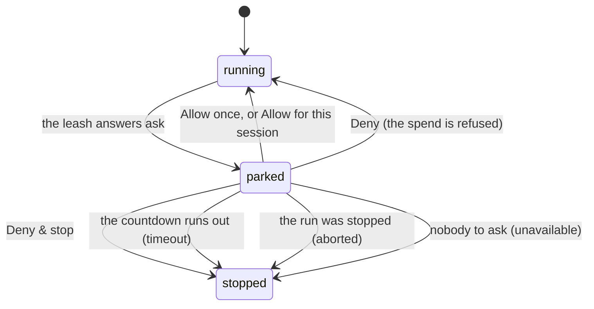

# Approvals

## Summary

An approval is the moment the agent stops and asks. It is what [the leash](../../foundations/the-leash.md) does when its answer is neither yes nor no: the run parks, a ticket appears, and nothing moves until a person answers or the clock runs out.

It is the product's central claim made visible. Everything else is arrangements for this to be possible.

## The simple case

The agent is about to spend more than the person's ask line allows on its own. A ticket appears above the composer: what it wants to do, for how much, to whom, and why. The composer's placeholder changes to "Waiting for your answer above". A countdown says how long the question stays open.

The person presses one of four buttons. The ticket disappears — on every tab, the moment anyone answers — and the run either continues or ends.

## The four answers

They are in the same order on every surface, and the order is deliberate: **the primary yes sits last, furthest from a stray click.**

| Answer | What it does |
| --- | --- |
| **Deny & stop** | Refuses this spend and ends the run. Shown as the destructive option, and it is the one the keyboard lands on. |
| **Deny** | Refuses this spend. The run continues and the model may try something else. |
| Allow for this session | Allows it, and writes an _ask exemption_ — this payee, up to this ceiling, until this expiry — so the same thing is not asked again. The threshold rule stays. |
| **Allow once** | Allows exactly this spend. |

"No, and stop" and "no, try something else" are different instructions, and collapsing them would lose the ability to say the first.

> Technical note: when the ticket appears, focus moves to **Deny** — but only if the person is not typing. If a text box has focus, the card takes nothing, because the card arrives while someone may be mid-sentence. When it does take focus, the safe answer is the one a keypress away.

## The three ways it ends without an answer

| Resolution    | What happened                                            |
| ------------- | -------------------------------------------------------- |
| `timeout`     | The countdown ran out.                                   |
| `aborted`     | The run was stopped underneath it.                       |
| `unavailable` | There was nobody to ask — a scheduled run has no screen. |

These are kept apart from a denial, and from each other, because a receipt that records "refused" when what happened was "nobody was there" has lost the fact that mattered.

## The request, event by event

### Asking

The leash answers _ask_ rather than allow or deny. The run parks — it is not stopped, and it holds its place.

The question is composed from the spend itself: the amount, the payee's label, and the purpose, in the form "Approve $2.50 to Acme? (lending snapshot)".

### Answered at once

Nothing here ends at once. An approval that appears has already parked the run; the only immediate ending is `unavailable`, when there is no screen to show it on, and that is decided without anyone seeing a ticket.

### The work begins

The ticket is shown, on every tab watching that workspace. The countdown starts.

### While it runs

The countdown ticks down. The person can still read the conversation, take the browser, and type — the composer is not locked, only relabelled. Answering from any tab clears it everywhere.

### Finishing

The answer is recorded **on the receipt**, with the same care as a rule id: a receipt that says "allowed" without saying "because you said so at 14:02" has lost the one fact that made the spend legitimate.

Then the run continues or ends according to the answer.

## Variants

| Variant | Set before asking | Changed while it runs |
| --- | --- | --- |
| Who is asking | A person's run asks that person. A schedule has no screen, so its approvals resolve `unavailable` rather than waiting. An agent's run asks the workspace's owner — never the agent. | No effect. |
| The policy in force | The ask line decides whether this happens at all. An `ask`-side action kind asks however small the amount. | A change does not un-ask a question already asked. |
| Funds available | No effect on whether a person is asked. A spend can be approved and then fail for want of funds. | No effect. |
| What is being asked for | `transfer` and `trade` ask whatever the amount; the rest ask by amount. | No effect. |
| The asking agent's grant | **No scope approves a ticket.** An agent cannot answer its own question at any grant. | No effect. |
| The shared browser | A payment a page demanded parks the run the same way. | No effect. |
| Appearance and motion | The ticket has a perforation and a stub; approvals spring in and out. | Rendering only. |

## Cancel and interrupt

| Event | Before the ticket appears | While it is open |
| --- | --- | --- |
| Stop — the person halts this run | Nothing to answer. | The approval resolves `aborted` and the run ends. |
| Freeze — the wallet is frozen, mid-run | The spend is refused before it can ask. | Open question: whether the ticket is withdrawn or answering it then fails. |
| Denying a waiting approval, or leaving it unanswered | This is the event. | Deny continues; Deny & stop ends; unanswered ends as `timeout`. |
| Asking something else while this request is still in flight | Sent normally. | Held by the composer. The ticket is unaffected. |
| Leaving the page, or switching to another conversation, mid-run | No effect. | The countdown keeps running. An unanswered ticket times out whether or not anyone is looking. |
| Reload; the tab or the app closed | No effect. | The ticket is still there on return, if the countdown has not run out. |
| Network lost; the socket drops | No effect. | The answer cannot be delivered; the countdown continues on the server and may time out. |
| The model, a service, or the facilitator errors or rate-limits mid-run | No ticket. | The run may end underneath the ticket, resolving it `aborted`. |
| The session expires, or the person signs out | No ticket is shown. | The person can no longer answer; it will time out. |
| The policy or a cap changes mid-run | Changes whether a question is asked. | Does not withdraw a question already asked. |
| Funds run out mid-run | Refused rather than asked. | An approved spend can still fail afterwards for want of funds. |
| The person takes control of the shared browser mid-run | No effect. | No effect. The ticket stays. |
| The same account open in a second tab or on a second device | No effect. | **The ticket appears on every tab and disappears from all of them the moment anyone answers.** |

## Interactions with other systems

**The leash.** Ask is the leash's third answer, and this is what it looks like.

**Money and receipts.** The answer is part of the receipt, not a separate log.

**Approvals.** This document is it.

**Provenance.** An approval never makes an untrusted address payable. A page-sourced address is refused before anyone is asked, so no ticket can be used to talk a person into it.

**History and persistence.** A parked turn is `waiting`. How the question ended is kept.

**The shared browser.** A payment demanded by a page parks the run identically.

**Connected agents and grants.** No scope answers a ticket. This is the hard line between what an agent may buy and what only a person may decide.

**Notifications.** A waiting approval shows as a count on Home that follows the person across pages, and reaches Telegram where it is paired.

**Navigation and URL state.** The ticket is not a route; it cannot be linked to.

**Appearance, motion and accessibility.** The focus rule is the accessibility decision that matters: the card never steals focus from a half-written message, and when it does take focus it lands on the safe answer.

**Offline and reconnection.** An answer needs the network. The countdown does not.

**Stubs.** A stubbed run raises real approvals about spends that will settle against a stub. The ticket does not say so; the receipt does.

## Edge cases

- The countdown runs on the server, so leaving the page does not pause it. A person who steps away comes back to a timed-out question, not a waiting one.
- "Allow for this session" is the only way a person writes a durable rule without visiting the policy editor, and the only rule written mid-run.
- A `transfer` asks at any amount, so a one-cent payment to a person raises a full ticket.
- Answering in one tab clears the ticket in all of them, which means two people watching the same workspace cannot both answer and cannot see who did.
- Focus lands on Deny, so pressing Enter on a ticket that just appeared refuses. That is the intended direction, and it is the opposite of most dialogs.
- A scheduled run's approval never appears anywhere; it resolves `unavailable` and the receipt says so.

## Open questions and verification

- How long the countdown is has not been established; it comes from the request rather than a constant read here.
- What happens to an open ticket when the wallet is frozen — withdrawn, or answerable but doomed — is not established and is worth checking, because it is the combination a nervous person is most likely to produce.
- Whether the ticket is shown anywhere other than the conversation, in particular on the Wallet, is not established.
- Whether Telegram can answer an approval or only announce it is not established here; see the Telegram document.
- The exact question wording was read from the policy engine, not seen rendered.

Verified against the Froggy tree at commit `5caed50`.
