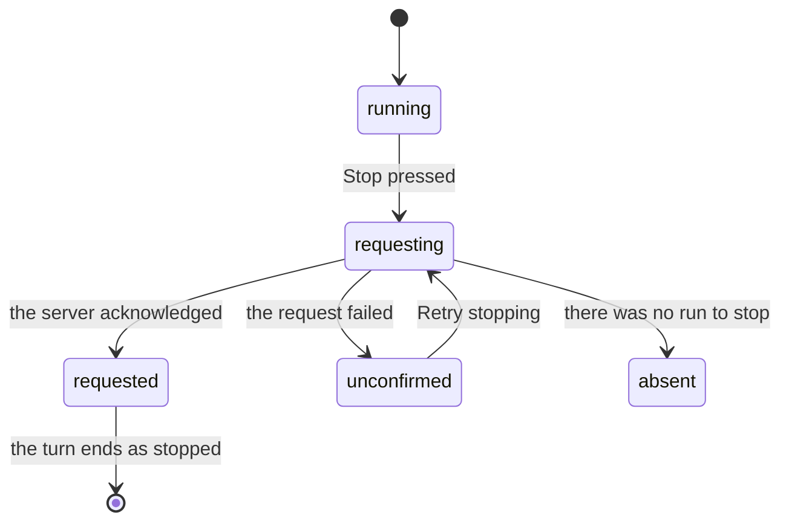

# Stopping and freezing

## Summary

Two controls end things, and they end different things. **Stop** halts the run that is going. **Freeze** halts spending, and outlives any run. A person reaching for "make it stop" needs to know which one they want, and the product keeps them apart rather than offering one button that does both.

This document owns both, and what each leaves behind.

## The simple case

A turn is running and the person wants it to end. The send button has become a Stop button; pressing it ends the run. The conversation says what it got to before it stopped, and any money it had already spent is spent.

If instead what the person wants is "stop spending my money", that is the wallet being frozen. The run may continue talking, but every payment from that moment is refused, and the refusal names the wallet rather than a rule.

## Stopping is two things at once

Pressing Stop does a local detach **and** a server abort, and the second is the one that matters: the run belongs to the server and would otherwise keep spending with nobody watching.

Because it is a request to the server, it can fail, and the interface says so rather than pretending. Stop has five states with their own words:

| State       | What is shown                                                  |
| ----------- | -------------------------------------------------------------- |
| idle        | Nothing.                                                       |
| requesting  | "Requesting stop…"                                             |
| requested   | "Stop requested. Payments already submitted may still settle." |
| absent      | "No active run."                                               |
| unconfirmed | "Stopping is unconfirmed. The agent may still be working."     |

Two of these are unusual and both are honest. **Requested** does not claim the work stopped; it claims the request was made, and warns that money already in flight may still land. **Unconfirmed** admits the stop may not have arrived at all, and offers to retry — which is the state a person most needs, because a stop that silently failed is the worst possible outcome for a control like this.

`/stop` in the composer does the same thing as the button.

## The request, event by event

### Asking

The person presses Stop, or types `/stop`. Nothing has happened yet.

### Answered at once

There was no run: "No active run." Nothing is changed and nothing is recorded.

### The work begins

The stop request goes to the server. Locally the client detaches at the same time, so the stream stops arriving whether or not the server answers.

### While it runs

Briefly, "Requesting stop…". If the request fails — an error, or the network — the state becomes unconfirmed and a **Retry stopping** control appears. The run is still going until a stop is confirmed, and the wording says so.

### Finishing

The run is aborted. The turn takes the status `stopped` and keeps everything it had already done. A spend that was reserved but never sent becomes `abandoned` and does **not** consume the person's allowance; one already sent settles or becomes `uncertain` on its own. Nothing is rolled back, because money cannot be.

## Freezing

Freezing is a state of the wallet, not of a run. While frozen, every spend is refused with the code `frozen` and the interface says "The wallet is frozen".

It outlives the run that was in flight when it happened, which is the whole difference: a person who freezes and then walks away has stopped their money being spent by anything — this run, the next one, an agent connecting an hour later. Stopping a run stops only that run.

A spend reserved but not yet sent when the wallet freezes becomes `abandoned`, so freezing mid-run does not consume allowance for a payment that never left.

## Variants

| Variant | Set before asking | Changed while it runs |
| --- | --- | --- |
| Who is asking | Only a person stops or freezes. No scope lets an agent do either, and no scope lets an agent undo either. | No effect. |
| The policy in force | Freeze is not a rule; it is a state that refuses everything. | No effect. |
| Funds available | No effect. A frozen empty wallet and a frozen full one behave the same. | No effect. |
| What is being asked for | No effect on stopping. | No effect. |
| The asking agent's grant | An agent's run can be stopped by the person who owns the workspace. | No effect. |
| The shared browser | Stopping a browsing run tears down the browser with the work. | Freezing prevents anything that needs paying for. |
| Appearance and motion | The stop states are announced, not only rendered. | Rendering only. |

## Cancel and interrupt

| Event | Before the stop is requested | After it is requested |
| --- | --- | --- |
| Stop — the person halts this run | This is the event. | Pressing again while unconfirmed retries. |
| Freeze — the wallet is frozen, mid-run | Independent; both can be done. | Freezing after stopping protects against the _next_ run too. |
| Denying a waiting approval, or leaving it unanswered | **Deny & stop** ends the run without touching the Stop control. | No effect. |
| Asking something else while this request is still in flight | Held by the composer, not sent. | The held message goes when the turn ends, including when it ended by being stopped. |
| Leaving the page, or switching to another conversation, mid-run | The run keeps going. Leaving is not stopping. | The stop was already sent to the server and stands. |
| Reload; the tab or the app closed | The run keeps going and keeps spending. | The stop stands; it was the server's to act on. |
| Network lost; the socket drops | Stop cannot be delivered: unconfirmed, with a retry. | The same. |
| The model, a service, or the facilitator errors or rate-limits mid-run | The turn may end on its own before the stop lands. | "No active run" if it already ended. |
| The session expires, or the person signs out | The stop request is refused; the run continues. | Worth knowing: signing out does not stop a run. |
| The policy or a cap changes mid-run | No effect. | No effect. |
| Funds run out mid-run | The run continues and is refused, which is not the same as stopping. | No effect. |
| The person takes control of the shared browser mid-run | Taking the page does not stop the run. | No effect. |
| The same account open in a second tab or on a second device | Either tab can stop the run. | Both see the turn end. |

After a stop the person stays in the conversation, which shows how far the turn got.

## Interactions with other systems

**The leash.** Freeze is enforced by the leash as a denial code. Stop is not a leash concept at all.

**Money and receipts.** Everything spent before a stop keeps its receipt. `abandoned` is the state that makes stopping cheap when nothing had been sent.

**Approvals.** **Deny & stop** is a second way to end a run, reached from a ticket rather than the composer.

**Provenance.** No interaction.

**History and persistence.** A stopped turn is recorded as `stopped`. A superseded one is recorded the same way, which the record does not distinguish.

**The shared browser.** Stopping ends the browsing that belonged to the run.

**Connected agents and grants.** Disconnecting an agent is a third kind of stopping, with its own open question about work already in flight.

**Notifications.** Stopping raises none.

**Navigation and URL state.** Neither control is in the URL.

**Appearance, motion and accessibility.** The stop states are live-region text, so a person not looking at that corner still hears that stopping is unconfirmed.

**Offline and reconnection.** Offline is exactly when stop cannot be delivered, and exactly when a person most wants it to work. The unconfirmed state and its retry exist for this.

**Stubs.** Stopping a stubbed run behaves identically. The warning about payments already submitted is not true of a stubbed run, and is shown anyway.

## Edge cases

- "Stop requested" is not "stopped". Payments already submitted may still settle, and the sentence says so.
- A stop that fails leaves the run going. Only the unconfirmed wording and the retry tell the person; there is no automatic retry.
- Signing out or closing the tab does not stop a run. This surprises people who expect closing a tab to end things, and it is deliberate.
- Freezing does not end the turn. The model may keep talking, and keep being refused, until it finishes or is stopped.
- There is no "stop everything" in the conversation. The panic path that aborts every run exists on the server and is reached elsewhere.
- A turn that ends on its own while a stop is in flight reports "No active run", which reads like a failure and is not one.

## Open questions and verification

- Where freeze is operated from in the interface, and whether unfreezing is the same control, was not established from the code read for this document.
- Whether freezing also aborts the running turn, or only refuses its spends, is described here as the latter from the structure of the denial code, and has not been watched happen.
- The panic path that aborts every run at once is called "before the browser gate flips"; what a person does to trigger it, and what they see, is not established.
- Whether a person can stop a run started by a connected agent from the agent's page as well as from the conversation was not established.
- The five stop states were read from the component. Whether all five are reachable in the running product has not been checked; `e2e/stop.spec.ts` exercises unconfirmed and requested.

Verified against the Froggy tree at commit `5caed50`.
