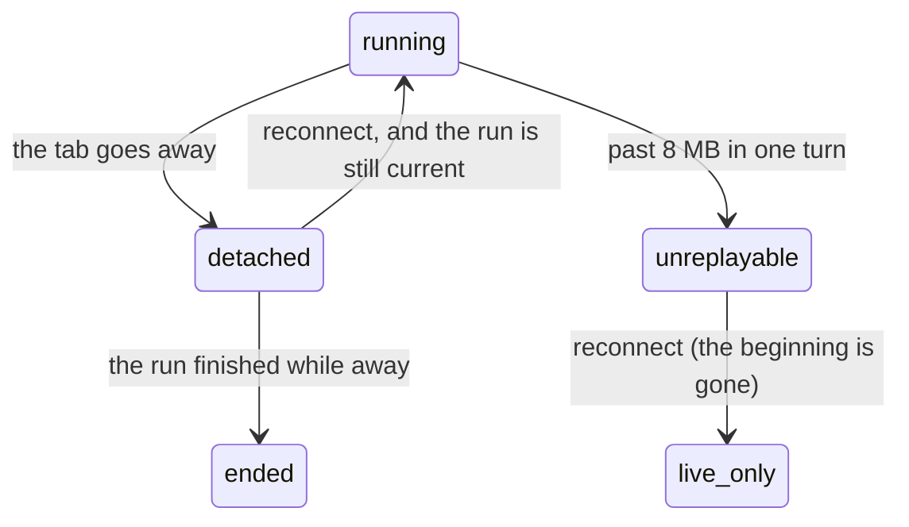

# Resuming

## Summary

Leaving is not stopping. Close the tab mid-turn, lose the network, walk away — the run keeps going, keeps spending, and keeps recording. Come back and you are handed the part you missed, and the rest arrives live.

This document owns detach, replay and reconnection. It is the other half of [stopping](freeze.md): between them they cover every way a person stops watching, and which of those also stop the work.

## The simple case

The person asks for something long and closes the tab. The run does not notice: it is the server's, and it carries on.

They open the workspace again and go to the conversation. The turn is still running. Everything that happened while they were away appears at once, and then the answer continues arriving word by word as if they had never left.

## What a detach is

A detach is any way of ceasing to watch that is not a stop: navigating away, closing the tab, reloading, losing the socket, the laptop sleeping.

**A detach has to be a detach.** If a run died with the socket that started it, closing a tab mid-turn would abort the loop after a payment had been reserved and possibly settled, leaving a spend on the ledger with no receipt and no record of what it bought. So an explicit stop cancels a run and a closed socket does not.

While nobody is listening, the recorder is what keeps the loop draining.

## What is kept for you

Everything the turn said is recorded as it goes, up to a ceiling of 8 MB in one turn. Past that the run **keeps going but stops being replayable**: an unbounded buffer is a memory leak that only shows up on the longest and most expensive turn, which is exactly the turn nobody wants to lose the server to.

A person returning to a turn past that ceiling gets the live remainder without the beginning. The record in history still has the turn; it is the moment-by-moment replay that is gone.

> Technical note: the snapshot of what has happened and the subscription to what happens next are taken together, in one step, so it is impossible to miss a chunk between the two. A reconnect cannot land in the gap.

## The request, event by event

### Asking

The person returns and the conversation asks the server whether there is anything to resume.

### Answered at once

There is nothing to resume, and the workspace says nothing about it — the person simply sees the conversation as recorded.

This case is answered deliberately rather than by silence: "nothing to resume" is its own answer, distinguishable from a stream that ended the instant it opened. The difference matters because the second would look like a turn that died.

### The work begins

There is a run, it belongs to this person, and it belongs to **this conversation** — both are checked. A run going in another conversation is not handed to whoever asks.

### While it runs

What was missed arrives, then the rest live. Nothing distinguishes the replayed part from the live part in the conversation; it reads as one answer.

### Finishing

The turn ends as it would have with someone watching.

## Variants

| Variant | Set before asking | Changed while it runs |
| --- | --- | --- |
| Who is asking | Only the owner can resume, and only into the conversation the run belongs to. | No effect. |
| The policy in force | No effect on resuming. | No effect. |
| Funds available | No effect. A run kept spending while nobody watched. | No effect. |
| What is being asked for | A very long turn may exceed the replay ceiling. | Crossing the ceiling mid-turn silently ends replayability. |
| The asking agent's grant | An agent's run is resumable by the person, in the conversation it belongs to. | No effect. |
| The shared browser | The browser was never in the tab; the screencast reconnects separately. | No effect. |
| Appearance and motion | The replayed part arrives at once rather than animating in as a live stream would. | Rendering only. |

## Cancel and interrupt

| Event | While detached | On reconnecting |
| --- | --- | --- |
| Stop — the person halts this run | Cannot be pressed; there is nothing on screen. | Available again, and the run is probably still going. |
| Freeze — the wallet is frozen, mid-run | Spending stops even with nobody watching. | The refusals are in the replay. |
| Denying a waiting approval, or leaving it unanswered | **The countdown runs while you are away.** A question raised after you left may time out before you return. | An unanswered ticket still within its countdown is there. |
| Asking something else while this request is still in flight | Not possible from a closed tab. Another surface can. | The composer holds it as before. |
| Leaving the page, or switching to another conversation, mid-run | This is the event. | Returning to the right conversation resumes; another conversation gets nothing. |
| Reload; the tab or the app closed | The same. | The same. |
| Network lost; the socket drops | Indistinguishable from any other detach. | Resumes. |
| The model, a service, or the facilitator errors or rate-limits mid-run | The turn may end while away. | The finished turn is read from history rather than resumed. |
| The session expires, or the person signs out | The run continues; the person cannot resume until signed in again. | Signing in again resumes if the run is still current. |
| The policy or a cap changes mid-run | Applies while away. | Visible in the replay. |
| Funds run out mid-run | The refusal happens while away. | Visible in the replay. |
| The person takes control of the shared browser mid-run | Not possible while detached. | Available again. |
| The same account open in a second tab or on a second device | The other tab is still watching and the run is not detached at all. | Both watch the same run. |

## Interactions with other systems

**The leash.** Judgement continues while nobody watches, which is the point of the leash existing at all.

**Money and receipts.** Money is spent while detached. The receipts are waiting on return.

**Approvals.** The countdown does not pause for an absent person. This is the sharpest consequence of detaching.

**Provenance.** No interaction.

**History and persistence.** History is the durable record; replay is a convenience over it. A turn past the replay ceiling is still in history.

**The shared browser.** Reconnects independently of the conversation stream.

**Connected agents and grants.** An agent's run needs nobody watching at all.

**Notifications.** Telegram is how a person finds out something happened while they were not looking.

**Navigation and URL state.** The conversation id in the URL is what a resume is matched against.

**Appearance, motion and accessibility.** The replayed part appears at once, which for a long turn is a large sudden change rather than a gradual one.

**Offline and reconnection.** This document is it.

**Stubs.** No effect on resuming.

## Edge cases

- **An approval raised while you are away can time out before you return**, ending the run for want of an answer nobody was there to give.
- A turn longer than 8 MB loses its replay. The person sees the answer from wherever it had got to, with no marker saying the beginning is missing.
- A run in a different conversation is not resumed, so opening the wrong conversation shows a static transcript while a run is going elsewhere.
- Only one run per session exists, so "resume" is always "resume the one run", never a choice.
- The replayed part is not visually distinguished from the live part, so a person cannot tell what happened while they were gone.
- A run that finished while away is not resumed; it is simply read, which is indistinguishable to the person and correct.

## Open questions and verification

- Whether the person is told anything at all when a turn's replay was lost to the ceiling has not been established, and it is the case where the conversation is silently incomplete.
- Whether the browser screencast and the conversation stream reconnect independently, and what happens if one succeeds and the other does not, is not established.
- Whether there is any indication in the interface that a run is in progress in a conversation the person is not currently looking at was not established.
- The 8 MB ceiling is per turn; whether a person could reach it in ordinary use has not been estimated.
- The claim that the replayed and live parts are indistinguishable was read from the mechanism, not watched.

Verified against the Froggy tree at commit `5caed50`.
