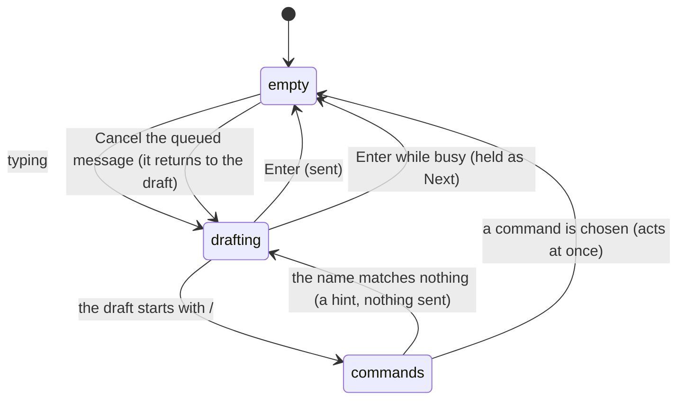

# The composer

## Summary

The composer is where you ask. One box at the foot of the conversation: Enter sends, Shift+Enter breaks a line, and a slash opens the commands. While a turn is running the send button becomes **Stop**, and a message typed meanwhile is held rather than sent.

It owns [asking and answered-at-once](../../foundations/the-request.md) for the web surface. What happens after a turn is accepted belongs to [the streaming answer](the-streaming-answer.md).

## The simple case

The person types and presses Enter. The box empties, the message appears in the conversation, and the answer begins.

While that runs the box stays usable and its placeholder changes to "Froggy is working… Enter queues your next message". Pressing Enter now does not interrupt anything: the message is held as a chip labelled **Next** above the box, showing what will be sent, with a control to take it back. When the turn ends, it goes on its own.

## The request, event by event

### Asking

The box accepts text. What it says when empty depends on what the turn is doing, and there are four states with their own words:

| State | Placeholder |
| --- | --- |
| Ready | "Ask Froggy to do something, or type / for commands…" |
| A turn is running | "Froggy is working… Enter queues your next message" |
| An approval is open above | "Waiting for your answer above" |
| Unavailable | The reason it is unavailable, in place of the prompt. |

Above the box, when there is anything worth suggesting, a row of chips offers things to ask next. Pressing one submits it exactly as typing it would. The chips are hidden when the box is unavailable.

A draft beginning with `/` opens the command list, filtered as the name is typed.

### Answered at once

An empty or whitespace-only message does nothing. A message sent while the box is unavailable does nothing.

There are **two** commands, and they behave differently on purpose: `/stop` acts at once on the run, and `/status` is an ask — it goes as an ordinary turn in plain words. A slash name matching neither is not sent; the box keeps the draft and shows a hint saying what was wrong, so a mistyped command never becomes a message to the model.

> Technical note: the component's own description says a slash opens "the four commands". There are two. See [Open questions](#open-questions-and-verification).

### The work begins

The message is sent, the box empties, and the turn starts. From here the send button is a Stop button.

### While it runs

The box remains usable. Enter holds one message — exactly one — as the **Next** chip, with its text truncated to a line. Pressing Enter again replaces what is held rather than queueing a second.

Cancelling the queued message puts the text **back into the draft** rather than discarding it, so nothing a person typed is thrown away by a control labelled cancel.

### Finishing

When the turn ends, a held message is sent automatically.

Unless the composer has become unavailable in the meantime — a lost socket — in which case the held message is **returned to the draft instead of sent**. A message must not fall into a wallet that is no longer taking requests, and a person who has been offline for a minute should find their sentence waiting rather than discover it was sent into a gap.

## Variants

| Variant | Set before asking | Changed while it runs |
| --- | --- | --- |
| Who is asking | This box is the person's. Telegram, agents and schedules do not pass through it. | A turn started elsewhere makes this box busy, so a person watching sees "Froggy is working…" for work they did not start. |
| The policy in force | No effect on what may be typed. The leash judges spending, not asking. | No effect. |
| Funds available | No effect. Nothing here checks the balance. | No effect. |
| What is being asked for | No effect on the box. | No effect. |
| The asking agent's grant | No effect. | No effect. |
| The shared browser | No effect. | No effect. |
| Appearance and motion | The chips scroll horizontally on a phone and wrap on a desktop. | Rendering only. |

## Cancel and interrupt

| Event | Before the turn starts | While it runs |
| --- | --- | --- |
| Stop — the person halts this run | Nothing to stop. | The send button is the Stop button; `/stop` does the same. A held message is unaffected and still goes when the turn ends. |
| Freeze — the wallet is frozen, mid-run | No effect on the box. | No effect on the box; the turn continues and its spends are refused. |
| Denying a waiting approval, or leaving it unanswered | Not applicable. | While a ticket is open the placeholder says so. Answering returns the box to its running state. |
| Asking something else while this request is still in flight | Sent normally. | **Held, not sent.** This is the composer's answer to superseding: the person cannot supersede their own run from this box. |
| Leaving the page, or switching to another conversation, mid-run | The draft is lost with the page. | The draft and any held message are lost; the run continues. |
| Reload; the tab or the app closed | The draft is lost. Nothing is persisted. | The same. A held message does not survive. |
| Network lost; the socket drops | The message cannot be sent. | The box becomes unavailable, and a held message goes back to the draft when the turn ends rather than being sent. |
| The model, a service, or the facilitator errors or rate-limits mid-run | The reason is shown in place of the prompt. | The turn ends; the box returns to ready and a held message goes. |
| The session expires, or the person signs out | Unavailable, with the reason. | The same. |
| The policy or a cap changes mid-run | No effect. | No effect. |
| Funds run out mid-run | No effect on the box. | No effect on the box. |
| The person takes control of the shared browser mid-run | No effect. | No effect. |
| The same account open in a second tab or on a second device | Each tab has its own draft. | Each tab shows busy; a message held in one tab is held only there. |

## Interactions with other systems

**The leash.** None. Asking is free and never judged.

**Money and receipts.** None directly; what the turn spends is the turn's.

**Approvals.** An open ticket changes the placeholder and does not lock the box.

**Provenance.** What the person types here is the **only** thing that can make an address `user` provenance, and only its text parts count — a tool result or an assistant message quoting an address does not make it the person's. This box is therefore load-bearing for [the leash](../../foundations/the-leash.md).

**History and persistence.** The draft is not persisted anywhere. Nothing typed and not sent survives a reload.

**The shared browser.** No interaction.

**Connected agents and grants.** No interaction.

**Notifications.** No interaction.

**Navigation and URL state.** The draft is not in the URL.

**Appearance, motion and accessibility.** The queued chip has a labelled cancel control. The keyboard hint is rendered as key caps. Suggestion chips are ordinary buttons.

**Offline and reconnection.** Going offline makes the box unavailable with a reason rather than failing on send, and protects a held message by returning it to the draft.

**Stubs.** No effect.

## Edge cases

- Only one message can be held. A second Enter replaces the first, and the replaced text is gone — unlike cancelling, which returns it to the draft.
- The held chip truncates to one line, so a long held message cannot be read in full before it is sent.
- `/status` is sent as an ordinary turn, which means it takes a turn from the daily budget and can itself be queued behind a running turn.
- A person watching a turn that Telegram or a schedule started sees the composer busy for work they did not start, with no indication of where it came from.
- The suggestion chips submit immediately, with no confirmation, and are hidden rather than disabled when the box is unavailable.
- The draft survives switching between pages only if the composer is not unmounted; navigating away and back loses it.

## Open questions and verification

- The component's description says "a slash opens the four commands" and there are two. Either two commands were removed without the comment being updated, or two are missing. Minor, and worth correcting in whichever direction is true.
- Whether the four placeholder states are all reachable in the running product, in particular the unavailable one, has not been checked by hand.
- What `disabledReason` actually says to a person — the exact sentences — was not read; only that the reason replaces the prompt.
- Whether the suggestion chips are generated per turn or fixed was not established.
- Whether a held message survives switching conversation and returning has not been checked.

Verified against the Froggy tree at commit `5caed50`.
