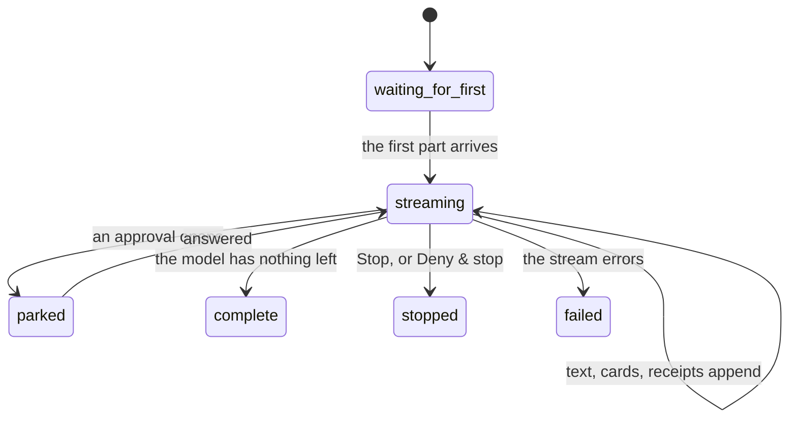

# The streaming answer

## Summary

The answer is not a message that arrives; it is a thing that grows. Text, then what the agent did, then the page it opened, then the receipts it produced — appearing in the order they happened, under the frog's mark.

This document owns [while it runs and finishing](../../foundations/the-request.md) for an ordinary turn in the web conversation. What a tool call looks like inside it is [tool calls](tool-calls.md); the ticket that parks it is [approvals](approvals.md).

## The simple case

The person's message appears in a bubble on the right. Below it, the frog's mark, and then the answer as it comes: a sentence, then a card saying what the agent is doing, then more text. If it opened a page, the live page appears under the turn that touched it. If it spent money, the receipt is filed underneath.

The scroller keeps the _start_ of the answer in view rather than chasing its end: a new message from the person pins to the top of the viewport, with a peek of what came before, so a long answer is read from its beginning. Scrolling away disengages that following; a button brings it back.

## The shape of a turn

The person's words are a bubble. **The agent's answer is not a bubble** — it is the mark and then the parts as they came. That asymmetry is deliberate: what the person said is a discrete thing that was said; what the agent did is a sequence of events.

The parts, in order:

1. **Text**, rendered as it streams.
2. **What it did** — one card per tool call.
3. **The page it opened**, when a turn touched the browser: the live view sits under the last turn that touched it, not under every turn.
4. **The receipts** it produced, filed beneath the turn that produced them.

Each turn is an anchor the scroller can hold onto, which is what makes the pinning possible.

## The request, event by event

### Asking

Covered by [the composer](the-composer.md). By the time this document applies, the turn has been accepted.

### Answered at once

Not applicable: a turn that got this far has a run.

### The work begins

The person's message is in the conversation and the agent's side of the turn exists with nothing in it yet. The composer becomes busy.

### While it runs

Parts append as they arrive. Text renders as markdown while incomplete, so a partial sentence reads as a sentence rather than as markup.

The agent is instructed to narrate before it acts — to say what it is about to do, because the person is watching the page change — so the ordinary rhythm is a sentence, then the thing, then a sentence.

The person can scroll freely, follow or stop following, read receipts, take the browser, and type. Nothing is disabled.

The whole turn is checkpointed to history as it goes, at most once a second. **If those checkpoints cannot be written, the run is deliberately aborted** with "History could not be saved. Inspect this run before retrying." — an answer that cannot be recorded is worth less than the record, when the answer may have spent money.

### Finishing

The turn takes its status. What is left is the complete answer, its cards, its page, and its receipts, all of which stay exactly where they were.

Only a completed turn is carried into later turns in full. A stopped, failed or interrupted one is carried forward reduced, so the model does not read a half-finished answer as a finished one.

## Variants

| Variant | Set before asking | Changed while it runs |
| --- | --- | --- |
| Who is asking | A turn from Telegram or a schedule appears in the conversation the same way; the person watching may not have started it. | No effect. |
| The policy in force | Decides which cards will be refusals. | The next spend is judged by the new numbers. |
| Funds available | No effect on the shape of the answer. | A refusal appears as a card and the model usually explains it. |
| What is being asked for | Decides which cards appear and whether a page is shown. | The model chooses step by step. |
| The asking agent's grant | No effect on rendering. | No effect. |
| The shared browser | A browsing turn carries the live page beneath it. | Taking the page does not change the stream. |
| Appearance and motion | Cards rise and stagger in; figures morph rather than jump; the running sentence shimmers. | Reduced motion removes the movement, not the cards. |

## Cancel and interrupt

| Event | Before the first part arrives | While parts are arriving |
| --- | --- | --- |
| Stop — the person halts this run | The turn ends having said nothing. | Parts stop. Everything already shown stays. |
| Freeze — the wallet is frozen, mid-run | The first spend will be refused. | Refusal cards appear; the text continues. |
| Denying a waiting approval, or leaving it unanswered | Not applicable. | The stream resumes on allow or deny, and ends on Deny & stop. |
| Asking something else while this request is still in flight | Held by the composer. | Held by the composer. |
| Leaving the page, or switching to another conversation, mid-run | The turn continues. | The turn continues and keeps checkpointing. See [resuming](resuming.md). |
| Reload; the tab or the app closed | The turn continues. | The same; on return the missed part is replayed. |
| Network lost; the socket drops | Nothing appears. | Parts stop appearing. The server keeps going. |
| The model, a service, or the facilitator errors or rate-limits mid-run | The turn ends `failed`. | "The model stream failed." and the turn ends `failed`, keeping what arrived. |
| The session expires, or the person signs out | Nothing is shown. | The view stops; the run does not. |
| The policy or a cap changes mid-run | No effect on rendering. | No effect on what is already rendered. |
| Funds run out mid-run | The first spend is refused. | A refusal card appears. |
| The person takes control of the shared browser mid-run | No effect. | No effect on the stream. |
| The same account open in a second tab or on a second device | Both see the turn. | Both see the same parts; each scrolls independently. |

## Interactions with other systems

**The leash.** Refusals are rendered as cards in the turn, not as errors that replace it. **The refusal appears in the wallet pane before the model narrates it** — that ordering is the demo.

**Money and receipts.** Receipts are filed under the turn that produced them and appear in the Wallet as well.

**Approvals.** A ticket opens above the composer, not inline in the stream.

**Provenance.** Sources are sent with the stream and rendered; the agent's reasoning is not.

**History and persistence.** Checkpointed at most once a second, with a heartbeat behind it. The record, not the stream, is what survives.

**The shared browser.** The live page sits under the last turn that touched it.

**Connected agents and grants.** An agent-sourced turn renders identically.

**Notifications.** The `notify` tool puts a short message into the stream always, and onto the person's phone through Telegram when it is paired.

**Navigation and URL state.** Scroll position is not in the URL.

**Appearance, motion and accessibility.** Pinning a new message to the top with a peek of what came before is the load-bearing motion decision: it makes a long answer readable from its start. Reduced motion keeps the pinning and drops the animation.

**Offline and reconnection.** The stream stops; the turn does not. See [resuming](resuming.md).

**Stubs.** A stubbed turn streams identically, and its receipt cards carry the marker.

## Edge cases

- A turn that streams nothing and a turn stopped immediately look nearly identical afterwards.
- The live page appears under the _last_ turn that touched the browser, so an earlier browsing turn loses its page view as soon as a later one browses.
- Text renders as markdown while still incomplete, so a partially-arrived table or code fence can render oddly for a moment.
- Scrolling away disengages following, and nothing re-engages it automatically; the person must press the button.
- The agent is told to be brief and to narrate before acting, so a silent turn that acts first is a departure from instruction rather than a rendering fault.
- A checkpoint failure aborts a turn that was otherwise going fine, which will look to the person like an unexplained stop.

## Open questions and verification

- The turn's own description says the agent's parts include "what it thought", and a reasoning component exists, but the stream is created with reasoning **not** sent. Whether reasoning is ever visible — perhaps only for a paid browse — is unresolved and the two should be reconciled.
- Where the "refusal appears before the model narrates it" ordering is enforced was not found in the code read here; it is asserted by the repository's own verification skill and should be confirmed by hand.
- Whether a failed stream shows its message to the person, or only records it, has not been checked.
- The scroll-pinning behavior was read from the component's description and not watched.
- What the person sees when a turn arrives from Telegram while they are looking at the conversation has not been established.

Verified against the Froggy tree at commit `5caed50`.
