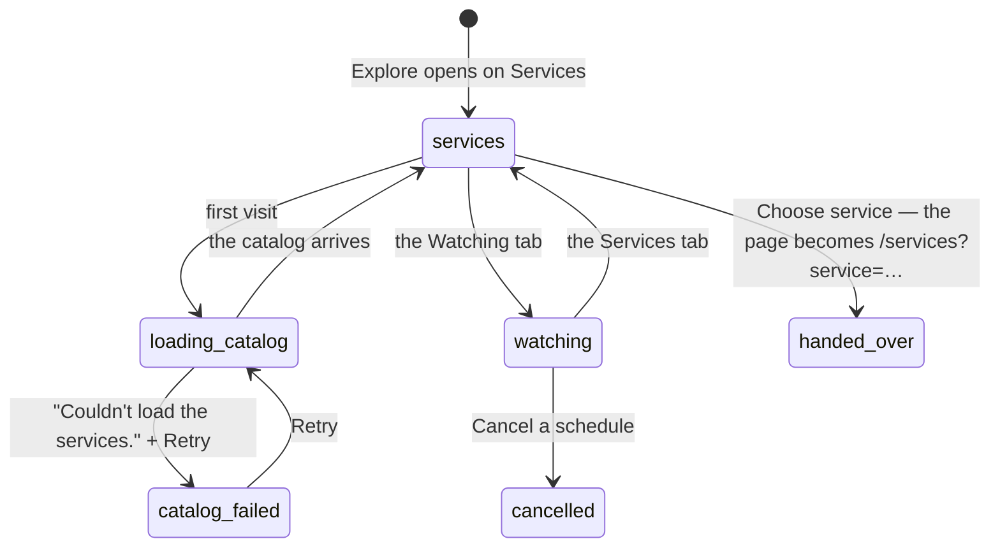

# Explore

## Summary

Explore is where you look things up and act on them without writing a sentence first. It is the second of the three destinations, at `/explore`, and it holds two tabs: **Services**, the catalog of what Froggy can be paid to do, and **Watching**, the work already standing on a schedule. Under both, one line pointing at [Activity](activity.md) for everything that already happened.

Explore is a place for finding, not for buying. Choosing a service hands the person to the Services page, which owns the request form, the quote and the receipt. Nothing on Explore spends, quotes, or commits anything.

The page exists because Services, scheduled work and past activity used to be three destinations of their own. They are one here — and Activity is a link rather than a tab — because a destination per capability is how a workspace becomes a dashboard. Nothing was removed: the old routes still resolve, so a bookmark or a deep link keeps working; they simply stopped being top-level.

## The simple case

The person opens Explore. The heading says "Explore" and under it "What Froggy can use, and what it is doing on a schedule." The Services tab is selected.

Below, a grid of service cards, two to a row on anything wider than a phone. Each shows an icon, a price, a title and a description, who provides it, and a badge saying whether it is **Ready**, **Simulated**, or **Unavailable**. Every card has one button, **Choose service**.

Pressing it takes the person to the Services page with that service already chosen. Explore's job is over.

Switching to **Watching** replaces the grid with what is scheduled: each active schedule's label, its cadence and next run in the person's own words and clock — "Every day at 07:30 · next 11 Sep 2026, 07:30" — what it will do, and a **Cancel** button. With nothing scheduled, a vignette and two sentences: "Nothing scheduled." and where to ask for one.

## Two tabs, and what is not on them

| Tab | What it lists | What it will not do |
| --- | --- | --- |
| **Services** | Every service Froggy can be paid to run, with its price, its provider and whether it is ready, simulated or unavailable. | Quote, buy, or check whether the person can afford it. |
| **Watching** | Every schedule that is currently active, with its cadence, its next run and what it will do. | Create a schedule, or show one that has finished. |

Three things a person might look for on Explore are somewhere else on purpose. What already happened is in [Activity](activity.md), one link away at the foot of the page. What has been bought is in the Wallet. And the directory — pasting a URL that answers 402 and making it payable — is on Account, because adding a payee is a change to [the leash](../foundations/the-leash.md) rather than a piece of browsing.

## The request, event by event

### Asking

Arriving on Explore asks for two things without being told to: the service catalog and the schedule list. The catalog is shared with the Services page, so a person who has already been there sees it at once.

The Services tab is always the one selected on arrival. Which tab is open is remembered nowhere — not in the URL, not across a reload.

### Answered at once

Almost everything on Explore ends here, because nothing on Explore is a request in the sense [the request](../foundations/the-request.md) means.

Switching tabs is instant and local. Choosing a service navigates and commits nothing — no quote is asked for, no money is reserved, and coming back leaves no trace. An unavailable service cannot be chosen at all: its button is disabled and a sentence beneath it says why, tied to the button so a screen reader hears the reason with the name.

Cancelling a schedule is the one thing on the page that changes anything, and it changes only what will happen later. It is a single button press with no confirmation and no undo.

### The work begins

Nothing on Explore crosses this line. The first spend for a service is reserved on the Services page, after a price has been shown; see [buying a service](services/buying-a-service.md).

### While it runs

Explore shows nothing about a turn in flight. A run started elsewhere keeps going while the person browses the catalog, and Explore neither reports it nor is disabled by it. The **Watching** tab lists only what is scheduled, not what is currently running.

### Finishing

Cancelling a schedule refreshes the list and the digest; the row disappears. Everything else on Explore finishes by leaving the page.

## Variants

| Variant | Set before asking | Changed while it runs |
| --- | --- | --- |
| Who is asking | Only a person sees Explore. A connected agent reads the same catalog over MCP without a page; a schedule appears here as a row rather than as a reader. | No effect. |
| The policy in force | No effect. The catalog shows every service and its price whatever the mandate says, including while the wallet is frozen. What the leash refuses is refused later, on the page that pays. | No effect. |
| Funds available | No effect. A price is shown; the balance is not, and nothing here compares the two. | No effect. |
| What is being asked for | Decides which tab: a service to buy, or work already standing. Neither offers browsing or a trade — those are asked for in the conversation. | No effect. |
| The asking agent's grant | No effect on the page. An agent's grant governs what it may call, not what a person may read. | No effect. |
| The shared browser | No effect. Explore has no browser view; a run driving one is invisible here. | No effect. |
| Appearance and motion | The theme styles the cards and the readiness badges. | A theme change restyles in place; the selected tab survives it. |

## Cancel and interrupt

| Event | On the Services tab | On the Watching tab |
| --- | --- | --- |
| Stop — the person halts this run | Nothing to stop. Explore has no composer and no stop control. | The same. Cancelling a schedule is not stopping a run. |
| Freeze — the wallet is frozen, mid-run | No effect. Every card still shows its price and stays choosable. | No effect. A frozen wallet does not cancel or pause a schedule. |
| Denying a waiting approval, or leaving it unanswered | No effect on the catalog. A purchase ticket may be showing above the page, since those render above every page. | No effect. |
| Asking something else while this request is still in flight | Not applicable; nothing on Explore is in flight. | No effect. |
| Leaving the page, or switching to another conversation, mid-run | The tab selection is forgotten. Nothing else is lost. | An in-flight cancel is abandoned; whether it took effect is only visible on return. |
| Reload; the tab or the app closed | The page returns on the Services tab, whichever tab was open before. | The same. |
| Network lost; the socket drops | The catalog shows whatever was last loaded; a first visit shows the error alert with a **Retry**. | "Couldn't load what is scheduled." A cancel fails with "Couldn't cancel it. Try again." |
| The model, a service, or the facilitator errors or rate-limits mid-run | No effect. Neither is involved in reading a catalog. | No effect. |
| The session expires, or the person signs out | Both requests fail and both tabs show their error. | The same. |
| The policy or a cap changes mid-run | No effect. Explore never reads the mandate. | No effect. |
| Funds run out mid-run | No effect. An empty balance leaves every card choosable. | No effect. A schedule whose run cannot be paid for fails at its run, not here. |
| The person takes control of the shared browser mid-run | No effect. | No effect. |
| The same account open in a second tab or on a second device | Both show the same catalog. | A schedule cancelled in one tab stays listed in the other until that tab refetches. |

## Interactions with other systems

**The leash.** Explore neither consults it nor shows it. A person cannot tell from this page whether a service is within the caps that would let it be bought; that is answered on the page that buys, and finally by [the leash](../foundations/the-leash.md) at the moment of payment.

**Money and receipts.** Each card carries a price, formatted from micro-dollars, and that is the whole of money on this page. No receipt appears here, and no running total. See [money](../foundations/money.md).

**Approvals.** Explore raises none. It can display one: a URL purchase ticket is rendered above every page, so a person browsing the catalog may find the question sitting above it.

**Provenance.** No interaction. Nothing on Explore is provable because nothing on Explore happens.

**History and persistence.** Explore writes nothing to history. It reads none of it either — the line at the foot of the page hands that job to [Activity](activity.md), which is the record.

**The shared browser.** No interaction.

**Connected agents and grants.** The same catalog is what an agent discovers over MCP, and the readiness badge is the same fact it is told. See [discovery](../agent-surface/discovery.md).

**Notifications.** None. Explore raises no badge, and the waiting count on Home is unaffected by anything here.

**Navigation and URL state.** Explore is `/explore` and holds the middle slot in the navigation order, so arriving from Home slides forward and arriving from the Wallet slides back. **Neither the selected tab nor anything else on the page is in the URL**, so a tab cannot be linked to or restored. Choosing a service is the one navigation Explore performs, to `/services?service={name}`. See [navigation](../foundations/navigation.md).

**Appearance, motion and accessibility.** One `h1`, "Explore". The tabs are a real tab list, traversable with the arrow keys. The loading state for the catalog is four labelled skeleton cards announced as "Loading services", and the schedule list's is announced as "Loading schedules", so a screen reader hears that something is coming rather than that there is nothing. An unavailable card's explanation is tied to its disabled button. The empty-schedule vignette is decorative and hidden. Every button clears 44px.

**Offline and reconnection.** Both lists are ordinary requests rather than socket state, and neither retries on its own: the catalog offers a **Retry** and the schedule list simply says it could not load. The page does not recover when the network comes back until something asks it to.

**Stubs.** This is the one place the stub shows as a first-class fact: a service running against a fixture is badged **Simulated** rather than **Ready**, on the card, before anything is chosen. A missing credential shows as **Unavailable** with a sentence. See [stubs](../cross-cutting/stubs.md).

## Edge cases

- The Services tab is the default on every arrival, including a return from the Services page. A person who was looking at Watching and stepped away comes back to Services.
- The catalog's empty state is not designed for: with no services at all, the grid renders empty and the page shows only its heading and the Activity line.
- The schedule list shows only schedules whose status is active. One that has finished or been cancelled vanishes without a word, and there is no view of past schedules anywhere on this page.
- Cancel has no confirmation step. A misplaced press ends a standing schedule immediately, and the only recovery is to ask for it again in the conversation.
- The empty state tells the person to ask in the chat — "remind me in 20 minutes to…" — which means the only way to _create_ scheduled work is from a page other than the one that lists it.
- **The directory is not here.** Pasting a URL that answers 402 and adding it — the one and only way a stranger's endpoint becomes payable — lives on Account, not on Explore, even though it is the most literal instance of looking something up and acting on it. The server's own words to an agent point at "Details → Directory".
- A service marked **Simulated** is chooseable and buyable exactly like a ready one. The badge is the only warning, and it is on the card rather than on the button.
- The two tabs fail independently and differently: the catalog offers a **Retry**, the schedule list does not.
- Choosing a service that the URL then rejects leaves the Services page with no choice made; Explore's navigation does not verify the name it passes, and only a known service survives the other page's validation.

## Open questions and verification

- Whether the tab selection ought to be in the URL is an open design question rather than a defect, but it is the only state on the page and it is lost on every visit.
- The catalog is fetched by both Explore and the Services page through one shared cache; how stale a card's readiness badge can be — a service that went from **Ready** to **Unavailable** while the person was reading — was not established.
- Whether the Watching tab shows a schedule that is mid-run, and what its next-run line says while it runs, has not been watched happen.
- The claim that the old routes still resolve is the code's own comment; `/services` and `/activity` do resolve, but no spec exercises an old bookmark.
- `e2e/directory.spec.ts` covers the probe-and-add flow on Account, not on Explore. **There is no e2e spec for the Explore page itself** — not the tabs, not the catalog's error state, not cancelling a schedule. `navigation.spec.ts` visits `/explore` only to prove the destination is reachable.
- Whether a service card's price can differ from the price finally quoted on the Services page was not established; prices are quoted, not metered, but the catalog's figure and the quote are read at different moments.

Verified against the Froggy tree at commit `5caed50`.
