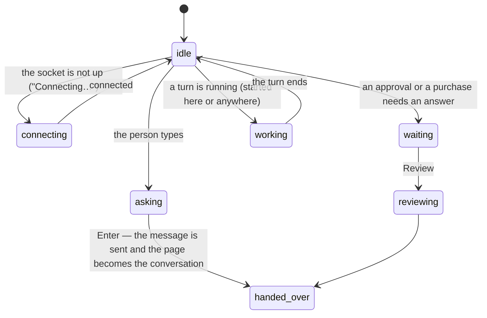

# Home

## Summary

Home is where work starts, resumes and reports back. It is the first of the three destinations, it lives at `/`, and it is the only page that both begins a request and tells the person what is outstanding. A frog and a sentence carry the mood; a composer carries the work; a card carries anything waiting on a decision; up to three recent tasks carry the way back in.

Home is deliberately not a chat log. A conversation is something a task _has_ and it lives at `/chat`; Home writes the first sentence and then hands the person over. It is also deliberately not a place to answer approvals: it counts them and offers a route to them, because two places to approve the same thing is how a person pays twice.

## The simple case

The person opens the workspace. The frog is idle and the heading says "Nothing needs you.", with "Ask Froggy to look into something, or pick up where you left off." beneath it.

They type into the composer and press Enter. The message is sent and the page changes to the conversation, where the answer streams. Nothing on Home waits for it.

Coming back later, the frog is idle again and three cards sit below the composer, each a recent task with its title, the time it last changed, and an **Open task** button. Under them, **Copy for your agent** and a line saying whether any agent is connected. At the foot, when something is scheduled, one quiet line with a dot: "One watch, Every day at 07:30." and when it next runs.

If instead something is waiting, the frog changes pose, the heading becomes "One thing needs you." and a bordered card appears: "A decision is waiting", "Froggy will not spend anything until you answer.", and a **Review** button that opens the conversation.

## What is on the page, in order

The order is priority, not recency, and every row is present only when it has something to say.

| In order | What it is | When it appears |
| --- | --- | --- |
| The frog and the greeting | The mascot's pose and the page's one heading. | Always. |
| The composer | Where work starts. | Always; disabled until the socket is up. |
| The waiting card | "A decision is waiting" and a **Review** button. | Only when something needs an answer. |
| Recent tasks | Up to three, each with **Open task**. | Only when there are conversations to show. |
| "Nothing yet" | Two sentences suggesting what to ask for. | Only when nothing is waiting and there is no history. |
| Connect your agent | **Copy for your agent** and the connection line. | Always. |
| The scheduled line | One sentence with a dot. | Only when a schedule is active. |

## The request, event by event

### Asking

The composer on Home is the same one the conversation uses, with two differences: it offers no suggestion chips, and it is disabled with the placeholder "Connecting…" until the app socket is up. Otherwise the empty box reads "Ask Froggy to do something, or type / for commands…". Enter sends, Shift+Enter breaks a line. See [the composer](conversation/the-composer.md) for what the input accepts.

What Home decides at this instant is only the mood: the count of things needing a person, which is the open approvals plus any purchase sitting at awaiting approval, and whether a turn is running.

### Answered at once

Two things end on Home without a run.

An empty or whitespace-only message does nothing at all — no navigation, no record.

A slash command is handled here rather than passed on. `/stop` stops the running turn from Home, in place, with no navigation. **Anything else, including `/status`, navigates to the conversation and is discarded**: the command is not sent, and the person arrives at an empty composer having apparently typed nothing. See [Open questions](#open-questions-and-verification).

### The work begins

Pressing Enter with text does two things in one motion: the message is sent on the existing socket, and the page becomes `/chat`. The run belongs to the server from that instant — see [the request](../foundations/the-request.md) — so the navigation is not what starts it and leaving would not stop it.

Nothing is spent by starting a turn. What a turn may spend is [the leash](../foundations/the-leash.md)'s question, asked later and elsewhere.

### While it runs

Home does not show the answer. If the person navigates back to Home while a turn is running, the frog takes the working pose and the heading reads "Working on it."; the composer's placeholder becomes "Froggy is working… Enter queues your next message", and Enter holds one message for the moment the turn ends.

The recent-task cards do not update to show the running turn, because they list conversations by when they last changed and the list is fetched on its own schedule.

### Finishing

Nothing lands on Home. A finished turn leaves its record in the conversation and its receipts in the Wallet; Home's only trace is that the frog goes idle, the heading returns to "Nothing needs you.", and the conversation eventually appears among the three recent cards.

## Variants

| Variant | Set before asking | Changed while it runs |
| --- | --- | --- |
| Who is asking | Only a person sees Home. A connected agent, Telegram and a schedule have no page; their work reaches Home only as a count, a recent card, or the scheduled line. | No effect. |
| The policy in force | No effect on what Home offers. Home never spends and is never gated; a frozen wallet does not disable the composer. | A cap or a threshold changing mid-turn changes what the turn can do, not what Home shows. |
| Funds available | No effect. Home does not show the balance and does not check it before sending. | No effect. |
| What is being asked for | Decides nothing here. Home takes a sentence and hands it over; what kind of work it becomes is settled in the conversation. | No effect. |
| The asking agent's grant | Changes only the connection line under **Copy for your agent**: no agent, one agent (linking to that agent), several (linking to Connections), or "Connection status unavailable." with a Retry. | Revoking a grant does not change the count or the recent cards. |
| The shared browser | No effect. Home has no browser view and no indication that one is open. | A run browsing in the background is invisible from Home. |
| Appearance and motion | The saved theme styles the page; the frog mark is drawn either way. | A theme change restyles in place. Reduced motion removes the page transition into the conversation, not the change. |

## Cancel and interrupt

| Event | On Home, with nothing running | With a turn running |
| --- | --- | --- |
| Stop — the person halts this run | Nothing to stop. | `/stop` from Home's composer stops the run on the server. **Home shows no confirmation**: the stop feedback lives in the conversation's composer stack, not here. |
| Freeze — the wallet is frozen, mid-run | No effect. The composer stays live and a message may still be sent. | No effect on Home. The refusals appear in the conversation. |
| Denying a waiting approval, or leaving it unanswered | Not applicable. | The count drops as each is resolved; the card and the badge disappear when it reaches zero, and the heading returns to "Nothing needs you." |
| Asking something else while this request is still in flight | This is the ordinary path. | Enter queues one message rather than sending it, and Home navigates to the conversation, where the queued message goes when the turn ends. |
| Leaving the page, or switching to another conversation, mid-run | Nothing is lost; the draft in the composer is. | The run keeps draining. Home is a detach like any other. |
| Reload; the tab or the app closed | Home re-renders from the URL. An unsent draft is gone. | The run is rejoined when the person returns to the conversation; Home shows only the working pose. |
| Network lost; the socket drops | The composer disables and its placeholder becomes "Connecting…"; a queued message goes back to the draft rather than into a wallet that is no longer taking requests. | The counts stop moving. The recent cards keep whatever was last loaded. |
| The model, a service, or the facilitator errors or rate-limits mid-run | No effect. | The error is shown in the conversation, not on Home. A refused turn leaves Home looking as if nothing happened. |
| The session expires, or the person signs out | The recent cards fail to load and Home shows "Nothing yet". | The record continues on the server. |
| The policy or a cap changes mid-run | No effect. | No effect on Home. |
| Funds run out mid-run | No effect. Home does not check the balance. | No effect on Home. |
| The person takes control of the shared browser mid-run | No effect. | No effect. Home has no browser. |
| The same account open in a second tab or on a second device | Both show the same count and the same recent cards. | Both show the working pose; either can stop the run. |

## Interactions with other systems

**The leash.** Home is never gated by it. Nothing on the page spends, so no rule is consulted and no decision is recorded. The only way the leash reaches Home is as a count of the questions it has raised.

**Money and receipts.** No amount appears on Home. Neither the balance nor a receipt is shown, even for a purchase whose approval Home is counting; the price is on the ticket, in the conversation.

**Approvals.** Home carries the count and a route, never a second set of answer buttons. The count is the open approvals plus purchases awaiting approval, and pressing **Review** goes to the conversation, where [the approval](conversation/approvals.md) is answered. One exception is worth knowing: a **URL purchase ticket is rendered above every page, Home included**, so for that one kind of question the buttons _are_ on Home after all.

**Provenance.** No interaction. Home records nothing and proves nothing.

**History and persistence.** The three recent cards are the only history on the page, read from the conversation list. Home itself persists nothing — not the draft, not the scroll position. See [the conversation](../foundations/the-conversation.md).

**The shared browser.** No interaction. A browsing run is invisible from Home; the browser is a view inside a task, not a destination.

**Connected agents and grants.** **Copy for your agent** copies one sentence telling an outside assistant to read `/llm.md` and connect itself, and the line under it says how many agents are connected, linking to the one agent or to Connections. See [connecting an agent](connections/connecting-an-agent.md).

**Notifications.** Home _is_ the notification. The waiting count rides on Home's own navigation entry — a number in a badge on the desktop rail, a plain dot on the phone pill — and it travels with the person across every page. Its accessible name changes too: "Home, 1 approval waiting" is a different place to a screen reader and the same place to a glance.

**Navigation and URL state.** Home is `/` and holds slot zero in the navigation order, which is what gives a conversation somewhere to travel from. Home stays the highlighted destination for every `/chat` path. Nothing on Home is in the URL: no filter, no tab, no draft. See [navigation](../foundations/navigation.md).

**Appearance, motion and accessibility.** One `h1`, which is the greeting sentence, so the page's heading changes as its state does. The frog's pose is decorative; the sentence beside it carries the fact. The scheduled line's dot is hidden from assistive technology. Cards and buttons clear the 44px target; under reduced motion the transition into the conversation is removed rather than shortened.

**Offline and reconnection.** The composer disables with "Connecting…" while the socket is down, and re-enables on its own. The recent cards and the scheduled line come from ordinary requests, so offline they show whatever was last loaded, or nothing.

**Stubs.** Home does not mark stubbed mode. Nothing on the page is an integration; what is stubbed shows in the top bar and on the things that spend. See [stubs](../cross-cutting/stubs.md).

## Edge cases

- The greeting is one of exactly four sentences: "Nothing needs you.", "Working on it.", "One thing needs you.", and "N things need you." Needing a person always wins over being busy.
- Home asks for four conversations and shows three. The fourth is fetched and discarded.
- A conversation with no title falls back to "Untitled task" — but a title is always a string in the record, so the fallback appears never to fire.
- When something is waiting, the composer's placeholder becomes "Waiting for your answer above". **On Home there is nothing above**: the approval card is in the conversation. The sentence is correct in the conversation and misleading here.
- The scheduled line never says "monitoring". These run on a stated cadence with an expiry, which is a different promise from continuously watching.
- Only active schedules are counted. A cancelled or finished one leaves the line empty rather than saying so.
- "Nothing yet" is shown only when nothing is waiting _and_ there are no conversations; a person with a waiting decision and no history sees the decision card alone.
- The recent-history request has no error state on Home. A history service that is down produces an empty list, so **Home says "Nothing yet" to a person who has plenty**. The same request in the Recent dialog is careful to distinguish the two.

## Open questions and verification

- **`/status` typed on Home is silently dropped.** Home handles `stop` itself and navigates for everything else, so the one other command is lost between pressing Enter and arriving in the conversation. In the conversation it sends "What is the state of the wallet and the mandate?". Worth treating as a defect.
- **A failed conversation list is indistinguishable from an empty one on Home**, which is precisely the failure the Recent dialog was written to avoid. Worth treating as a defect.
- The composer's `asking` placeholder claims a card is above it when Home shows no card. Worth treating as a defect, or a sign that the count should not be passed through on this page.
- **Review** goes to `/chat`, the current conversation surface, rather than to the conversation holding the card. Approvals are held per socket rather than per conversation, so in practice the ticket is there — but a purchase raised against a different conversation has not been checked by hand.
- Whether the recent cards refresh when a turn finishes, or only on a page visit, was not established: the list has its own staleness window and the page does not subscribe to it.
- The phone pill shows a dot rather than the number, while the desktop rail shows the count. This resolves an open question in [navigation](../foundations/navigation.md), but the difference is deliberate only as far as the code shows.
- No e2e spec exercises Home's composer, its recent cards, or the scheduled line. `navigation.spec.ts` covers the waiting count on Home's navigation entry and that **Review** leads to the answer, and nothing else on the page.

Verified against the Froggy tree at commit `5caed50`.
