# Buying a service

## Summary

Buying a service is the shortest complete version of what Froggy does: a fixed price, a payment from the person's own wallet, work done on the server, and a result that is still there tomorrow. There is one form, one button with the price written on it, and a card in **Your tasks** that changes as the purchase moves. The price on the button is the price. Nothing is metered back, nothing is topped up afterwards, and the amount on the receipt is the amount on the card.

What the person is buying is a **task**: a delegated piece of work with an id that outlives every socket. Closing the tab does not stop it; reloading finds it where it was. The same request sent twice with the same key returns the same task rather than a second bill.

## The simple case

The person chooses a service from [the directory](the-directory.md) and gets its form. For the five prompt services it is one text box, labelled "Your request", with the service's own description under it and a live character count against that service's limit. For the five trading services it is a structured form instead: a network to pick, then addresses, amounts or a bounded RPC call.

Under the form is a line of small print combining the card's readiness note with a warning that does not change: "Once paid, failed work is not automatically refunded."

The button says what pressing it does and what it costs — **Run · $0.01**, or **Try simulated · $0.01** when the build has no live provider. Pressing it turns the button into "Starting…", and a moment later the form is gone: the page returns to the catalog and moves focus to the **Your tasks** heading, so the new card is what the person is looking at.

The card shows the service's title, a status badge, the price, and the words that were typed. The badge moves through **Quoted**, **Running**, **Paid** and lands on **Done**, and the result appears underneath — text, a list of sources with links, a picture, or a **Download audio** button.

## The request, event by event

```mermaid
stateDiagram-v2
    [*] --> composing
    composing --> composing : refused before anything was claimed
    composing --> quoted : press Run (a task id exists)
    quoted --> running : the payment is reserved and sent
    running --> paid : it settled; the sale is recorded
    paid --> done : the provider answered
    paid --> failed : the provider did not (paid, not refunded)
    running --> failed : the payment was refused, or never left
    running --> uncertain : it was sent and nothing confirmed it
    done --> [*]
```

### Asking

The text box is bounded by the service's own limit — 450 characters for _Listen on X_, 1,000 for _Search the web_ and _Read it aloud_, 2,000 for the two BlockRun services — and the count beside the description shows how much is left. The browser enforces the ceiling; the server checks it again.

A fresh idempotency key is generated when the form opens and again on every change to the text. That is what makes a double press one purchase: the same words, unedited, carry the same key, and the second press finds the first task instead of starting a second.

The submit button is disabled while the text is empty or only whitespace, and while a request is in flight. Editing the text also clears any error left over from the last attempt.

### Answered at once

Several refusals land here, before a task id exists and with nothing charged.

The text is empty or over the limit: "Service input is empty or too long." The card is unavailable on this build: the card's own note is returned as the error. A trading request names a network this deployment's provider does not serve: "This provider is not configured for the requested network. Nothing was charged." Nothing knows what an HBAR is worth: "No usable HBAR rate. Nothing was charged." A key that was already used for a _different_ request: "Idempotency key already belongs to a different request."

Each of these appears under the field in the form's own error line, the form stays as it was, and the text is not cleared.

A key that was used for the _same_ request is not an error at all. The earlier task is returned, and the person lands on the card they already had.

> Technical note: the claim on the idempotency key is the database's, not the code's. The task row is written with a unique constraint on the person and the key **before** anything is signed or charged, and a request that loses that race is answered with the winning task. Two tabs pressing at the same instant produce one purchase.

### The work begins

The line is crossed when the server accepts the request and answers with a ticket. From that moment a task id exists, the card is in **Your tasks**, and the browser is no longer part of the story: the work is detached and runs on the server whatever the tab does.

The status is **Quoted** for the instant it takes to build the payment, then **Running**. The payment is one spend of `service_payment` kind, judged by [the leash](../../foundations/the-leash.md) like any other: the payee is Froggy's own account, the origin is `server` because Froggy minted it rather than reading it off a page, and the purpose on the receipt is the card's title. The price in dollars is converted to HBAR at the current rate, **rounding up**, so the ceiling is never crossed by a fraction.

`service_payment` is on the standing side of the authority table. Buying a service is what the agent is for, so no human is asked because of what this is; the caps and the ask threshold still apply on top.

### While it runs

The card polls every three seconds while the status is still moving and every fifteen once it settles. There is no stream and no socket; the card simply refreshes.

The badge carries a spinner for **Quoted**, **Paid** and **Running**, and drops it for the final states. **Simulated** sits beside it when the payment or the provider was a stub. **Paid on Hedera** appears once the sale exists and nothing was stubbed.

What the person can do meanwhile is everything: choose another service, buy a second one, leave the page, close the tab. What they cannot do is stop it. There is no cancel control on a service task, and nothing in the workspace ends one once it has started.

Between **Paid** and **Done** the work is the provider's. _Make an image_ is the long one: the supplier may answer "still working", and Froggy polls it for up to four and a half minutes on the authorisation it already bought, never signing a second payment for the same job.

### Finishing

**Done** puts the result on the card. For a search it is a sentence and a list of sources, each a link with an excerpt, and only http and https links are made clickable. For _Ask another model_ it is text. For _Make an image_ it is a preview and a **Download image** button; for _Read it aloud_, a **Download audio** button. A trading service adds a "Structured provider data" disclosure holding the raw answer.

The image preview is fetched with the person's own credential rather than as a bare URL, so it is not a link anybody with the address can open. If that fetch fails the preview is replaced by "Preview unavailable. You can still download the image."

**Failed** replaces the result with an alert: "The task failed." and the provider's own words. If the money had already moved, the sentence ends "Paid task; not refunded." — the product says so plainly rather than implying a refund it will not make.

**Payment uncertain** is its own ending, not a failure: "Froggy is reconciling with the network. Do not buy this again." It means the payment was sent and nothing has said whether it landed. See [money](../../foundations/money.md) for why that is kept apart from "it did not".

Under every card is a **Details** disclosure with the task id, the sale id as a link to what that sale bought, and the supplier's own transaction id when there was one.

## Variants

| Variant | Set before asking | Changed while it runs |
| --- | --- | --- |
| Who is asking | A person uses the form. A connected agent calls `froggy_service_run` (or one of the five trading tools) with the same shape and gets the same ticket back — "a task ticket, not completed work" — and polls `froggy_service_status`. The model can buy one from inside a conversation, in which case the task carries that run's id. Telegram and a schedule reach it only through the model. | No effect. The buyer is fixed when the task is created. |
| The policy in force | Decides whether the payment is allowed at all. Every catalogue price is well under the default $2 per-spend cap and the $1 ask line, so under defaults a service purchase is never refused by a cap and never parked for a person. A tightened cap, an expired mandate or an emptied rolling day refuses it, and the card fails with the denial's own sentence. | A change applies to the next judgement. A payment already allowed is never revisited. |
| Funds available | A person with no Hedera account of their own gets one opened at first need, funded from the host's float with their pocket as the opening credit. A pocket too small to cover the price refuses the spend rather than half-opening an account. | Running out mid-purchase fails that task; it does not roll back. |
| What is being asked for | Five services take a sentence and five take a structured form. Trading services also check the network before claiming anything durable, so a bad network costs nothing. | No effect. |
| The asking agent's grant | An agent needs the `services` scope. No scope raises a cap, adds a payee or approves anything; the grant bounds what may be asked for and [the leash](../../foundations/the-leash.md) bounds what may be spent. | Revoking the grant stops the agent's next call. A task already bought keeps running and keeps its result. |
| The shared browser | No interaction. A service purchase never opens [the shared browser](../../foundations/the-shared-browser.md); the browse kind of task is a different thing bought a different way. | No effect. |
| Appearance and motion | The form, the badges and the price all follow the saved theme. Prices and counters use tabular numerals. | A theme change restyles in place; nothing about the purchase changes. |

## Cancel and interrupt

| Event | Before the payment is sent | After the payment is sent |
| --- | --- | --- |
| Stop — the person halts this run | No effect. There is no stop control on a service task. Stopping the conversation that asked for one does not reach the purchase, because the work was detached the moment the ticket was returned. | No effect. Money that moved has moved. |
| Freeze — the wallet is frozen, mid-run | The spend is refused with the code `frozen` and the task ends **Failed** with "The wallet is frozen". Nothing was reserved against the allowance. | No effect on a payment already sent. See [freeze](../conversation/freeze.md). |
| Denying a waiting approval, or leaving it unanswered | Under defaults no service purchase ever asks. If a raised threshold made one ask, there is nobody to ask from here and it is refused as `approval_unavailable` — "This spend is over the automatic limit and there is no one to ask from here." | Not applicable. |
| Asking something else while this request is still in flight | Nothing is superseded. Two purchases are two tasks and two bills; the list shows both, newest first. | The same. Each card polls on its own. |
| Leaving the page, or switching to another conversation, mid-run | No effect. The task is the server's. | No effect. The card is where it was on return. |
| Reload; the tab or the app closed | No effect. The e2e spec buys a demo service, reloads, and finds the request and its result still on the card. | No effect. |
| Network lost; the socket drops | The purchase does not use the socket. A failed poll shows "Couldn't refresh tasks. Your task may still be running." and the list keeps trying. | The same. The card may be stale, never wrong. |
| The model, a service, or the facilitator errors or rate-limits mid-run | The payment is not attempted; the task ends **Failed** with the reason, and nothing was charged. | A provider that errors after settlement ends **Failed** with "Paid task; not refunded." A facilitator that answers nothing ends **Payment uncertain**. Neither is retried automatically. |
| The session expires, or the person signs out | The form's submit fails with a request error. Nothing is claimed. | No effect. The task belongs to the person, not to the session, and is there at the next sign-in. |
| The policy or a cap changes mid-run | Applies to this purchase if it has not been judged yet. | Never applied retroactively. |
| Funds run out mid-run | Refused by balance rather than by rule — the pocket is dry, or a conversion could not be made — and the task ends **Failed** with which. | No effect on what already settled. |
| The person takes control of the shared browser mid-run | No effect. | No effect. |
| The same account open in a second tab or on a second device | Both tabs can submit. The same key from both produces one task; different keys produce two purchases. | Both see the same card and the same result once each has polled. |

A card that has not moved for fifteen minutes stops being believed: the list shows it as **Payment uncertain** with "No progress was recorded for 15 minutes. Check the payment before retrying; this request will not be purchased again automatically." The stored status is unchanged — this is the interface declining to keep showing a spinner it no longer trusts.

## Interactions with other systems

**The leash.** One spend, of kind `service_payment`, judged before anything is sent. Standing by kind, capped by the person's numbers, refused with a code and a rule id when refused. See [the leash](../../foundations/the-leash.md).

**Money and receipts.** The price is a quote in the strict sense: fixed when the card was rendered, charged in full, never metered back. The receipt carries the decision, the payee, the purpose, the rate used and the settlement. See [money](../../foundations/money.md) and [receipts](../wallet/receipts.md).

**Approvals.** In principle a purchase over the threshold would raise one. In practice it cannot: the purchase runs detached with nothing to interrupt, so the leash's _ask_ resolves as `unavailable` rather than parking. The card has a branch that says "Waiting for your answer" with a link to answer in Chat, and nothing on this path can reach it.

**Provenance.** The payee is minted by Froggy from its own configuration, so its origin is `server` and it is payable without the person having added anything. Nothing the model produced and nothing read off a page is ever the payee here.

**History and persistence.** Tasks are durable, listed newest first, and shared between the workspace and every connected agent — "Results from you and your connected agents appear here." Each purchase also writes a sale row, which is the seller's side of the same event; see [selling a service](selling-a-service.md).

**The shared browser.** No interaction.

**Connected agents and grants.** The agent that bought a task is recorded on it, and its call is kept on that agent's invocation trail with the task id and whether it was stubbed. A repeat with the same key is recorded as "replayed" rather than as a second purchase. See [the agent detail](../connections/the-agent-detail.md).

**Notifications.** None. A finished task raises no badge, no Telegram message and no digest line; the person finds out by looking, or by their agent polling.

**Navigation and URL state.** `?service=` holds the chosen service and `?task=` opens one task on its own above the page. Both are validated: an unrecognised value is dropped rather than shown as an error.

**Appearance, motion and accessibility.** After a purchase starts, focus moves to the **Your tasks** heading and the heading is scrolled into view, so a keyboard or screen-reader user lands on the result rather than back at the top of a catalogue. Errors are announced. The status badge carries a spinner with a text label rather than colour alone.

**Offline and reconnection.** The purchase never used the socket, so there is nothing to reconnect. Offline, the last poll's card stays on screen and the list says it could not refresh.

**Stubs.** With Hedera stubbed, everything runs and nothing moves: the button says **Try simulated**, the result is a fixture reading "DEMO — {title}: {what you typed}. This is a fixture, not a provider result.", and the card wears **Simulated** rather than **Paid on Hedera**. The mark is in the data as well as on screen. See [stubs](../../cross-cutting/stubs.md).

## Edge cases

- The task list is capped at fifty rows and filtered to services **after** the cap, so a person with fifty recent browse or brief tasks sees an empty service list. The empty state says "No tasks yet." either way.
- Submitting the same words again after a successful purchase is a second purchase. The key is regenerated when the form clears, so idempotency protects a double press, not a repeat.
- Editing one character of a request already bought makes it a different request with a different key, and a second bill.
- The card's **Sale** link opens a plain JSON view of what that sale bought, in a new tab, with no authentication: the id is the credential.
- A trading service that is **Unavailable** for want of a configured price shows $0.00 on its card, which reads as free rather than as unpriced.
- Two purchases of the same service run in parallel with no queue and no shared budget.
- The result text of a search says what it is worth: "Read the sources before relying on their claims", and a post from X is described as "claims, not verified facts".
- The download button builds the file in the browser from an authenticated fetch. A failure shows "Download failed. Please try again." beside it, and the card is otherwise unchanged.
- Nothing on the card says which rule allowed the payment. That lives on the receipt in the Wallet, reached separately.

## Open questions and verification

- **The `awaiting_approval` branch on the task card appears to be unreachable for a service purchase.** The purchase is made with no way to interrupt it, so the leash's _ask_ resolves as `unavailable` and the task fails instead of parking. Either the branch is dead code or a service purchase over the threshold is meant to be answerable and is not. Worth treating as a defect.
- The word **Paid** never appears for long enough to be seen in the common case: the status goes from **Running** to **Paid** to **Done** between two three-second polls whenever the provider is quick. Not confirmed by hand.
- Whether a task ever reaches the `paused` status through this path is not established. The status exists in the domain and the services page has no word for it, so one would render as "Unknown".
- The fifteen-minute staleness rule was read from the ticket builder and not observed. What happens if the task later completes normally — whether the card returns to **Done** — has not been checked.
- Whether the person's own Hedera account is opened on the first purchase in the deployed configuration, or whether the host pocket pays, depends on this deployment having a key-encryption key. Not confirmed live.
- The only e2e coverage is the demo path: buy a simulated web search, reload, find it. No spec exercises a live payment, a refusal, a failure after settlement, or the uncertain ending, because none can run without real credentials.

Verified against the Froggy tree at commit `5caed50`.
