# Selling a service

## Summary

Froggy is on both sides of the market. It buys — that is [buying a service](buying-a-service.md) — and it also sells, over the same protocol, to anyone who can pay a 402. Three things are for sale: a cross-protocol lending snapshot at a fixed price per query, a delegated task with a durable id, and a demonstration report that unlocks after payment. What each sale is, what settled it, and what it bought are kept in one book, and the buyer can read their own row afterwards without any credential but the sale's id.

Under all three is one order that never varies: **proof, book, work.** The payment is settled first, then written down, and only then is the answer assembled. A person who never sells anything still meets this book, because every service they buy writes a row in it too — Froggy sells to its own workspace at the price on the card.

Beneath that is a second supplier relationship, in the other direction: what Froggy pays its own suppliers, from its own treasury, under rules the person never sets and never sees.

## The simple case

A buyer asks for the snapshot without paying. The answer is 402, with the challenge in the body for older clients and in a header for newer ones: what it costs, which network, which payee, and the fee payer the network needs to build the payment at all.

The buyer builds a payment and asks again with the proof attached. Froggy hashes the proof and looks it up. A proof it has seen is answered from what that proof already bought — no facilitator is asked a second time. A proof it has not seen goes to the facilitator, and if the money moves, a sale is written down before anything else is allowed to fail. Then the answer is assembled, stored on the sale, and returned, with the settlement handed back in the response headers and the sale's id in one of its own.

If assembling the answer fails after the money moved, the buyer gets a 502 that says `settled: true` and names the sale — not a 500 with a debit and no record.

## The request, event by event

```mermaid
stateDiagram-v2
    [*] --> challenged : asked without a payment (402)
    challenged --> pending : a proof arrives and is claimed
    pending --> rejected : the facilitator refused it (402)
    pending --> uncertain : the facilitator said nothing conclusive
    pending --> settled : the money moved; the row is written
    settled --> delivered : the answer was assembled and stored
    settled --> failed : it was not (502, settled: true)
    delivered --> delivered : the same proof again, replayed
```

### Asking

A request with no payment is not an error. It is the shop window: a 402 carrying the price, the asset, the network, the payee, the scheme, and a timeout. The same challenge goes out in the body and in the `payment-required` header, deliberately, so a buyer written against either version of the protocol can read it.

What is on sale is also published where nobody has to guess. `/.well-known/x402.json` is plain JSON anyone can fetch before paying: the service's name, a sentence describing it, the facilitator being used, the Hedera topic the public notes go to, the source repository, and one resource entry with its method, price, asset, network, payee and scheme. It is cached for five minutes and contains no secret.

The snapshot is priced per query rather than per seat — five hundredths of an HBAR, from one constant, so the advertisement and the 402 cannot disagree. A delegated task is priced by kind: a paid data brief and a browse are different amounts, and the browse's price buys a fixed number of steps.

### Answered at once

Everything the book can answer, the book answers, before the facilitator is asked anything.

A proof already recorded is looked up by its hash. What comes back depends on the state of the sale it bought: a delivered sale returns its stored answer again, marked `replayed`; a sale still being worked returns 409, "This payment is being answered. Ask again in a moment."; a pending or uncertain one returns 409 with "Settlement is pending or uncertain. Do not pay again."; a rejected one returns 402 with the reason; a failed one returns 502 with the settlement still attached. The same proof presented for a _different_ resource is refused with 409 rather than honoured: "This proof is already recorded for a different purchase and will not be settled again."

A payment the facilitator declines is answered 402 again, not 400 — the request was well formed, the payment was not accepted, and a buyer that retries with a better one is behaving correctly rather than repeating a mistake.

> Technical note: the unique claim on the proof hash is the database's, and it is made before the facilitator is called. Two copies of the same proof arriving at two server processes at once produce one settlement; the loser is answered from the winner's row.

### The work begins

The line is settlement. Once the facilitator says the money moved, the sale row is written — amount, asset, network, payer as the payload named them, the proof's hash, the resource, the transaction id, and whether any of it was stubbed — and only then is anything else attempted.

The public note is posted at the same moment and is deliberately not waited for: the buyer paid and is owed an answer now, and the note is for whoever audits later. It records the amount, the asset, the network, the kind (`sold`), the sale's id and the transaction id on a Hedera Consensus Service topic.

### While it runs

The answer is queried **after** settlement, not before, so the buyer pays for a fresh answer rather than one assembled before they committed to buying it. The sale sits at `settled` while that happens, which is exactly the window in which a second arrival of the same proof is told to come back in a moment rather than being allowed to fetch a second time.

For a delegated task the same window is longer and is visible to the buyer as a task status: paid, then running, then done, polled by id.

### Finishing

A delivered sale stores the whole document it sold — for the snapshot, the answer sentence, every market row with its protocol, chain, deployment id, block number and rates, the snapshot's own hash, the source, and whether it was stubbed. Storing it is what makes a replay possible; the buyer who lost the answer gets the same one back rather than a second charge.

Three things travel back with it. The settlement envelope, base64, in both `x-payment-response` and `payment-response` — the x402 convention for handing the settlement to the payer, which is what any agent puts on its own receipt. The sale's id in `x-froggy-sale`. And the answer itself, with `saleId` in the body.

A failure after settlement is its own ending: 502, the error in the buyer's own words, `settled: true`, and the sale marked `failed` with the settlement still on it. The money is not returned and the record says so.

Afterwards, `GET /oracle/sales/{id}` returns what that sale bought: the amount, asset, network, timestamps, status, error, transaction id, whether it was stubbed, and the result. Never the proof. **The id is the credential** — there is no token, because the id is unguessable and names nothing about who paid.

### The other supplier: what Froggy pays upstream

When a person buys _Search the web_, _Make an image_, _Ask another model_ or _Read it aloud_, Froggy buys something upstream with its own money, from its own treasury on Base, and the person is never asked about it.

The rules on that leg are stricter than anything the person's own mandate holds, and none of them can be widened at request time. The supplier's 402 is accepted only if the network is Base mainnet, the scheme is `exact`, the asset is Base USDC, the payee matches the address configured for that exact host, the amount is a positive integer, and the amount is at or under a per-service ceiling written beside the price in the same table. Anything else is refused with one sentence — "Supplier quote refused: unexpected payee, asset, network or price. No supplier payment was signed." — and the person's task fails having already paid Froggy.

There is **exactly one paid attempt.** A timeout is not permission to buy again. A long-running image job is polled on the authorisation already bought, up to ninety times at three-second intervals, and never re-signed.

The person sees one trace of this: the supplier's transaction id under **Details** on their task card, when the supplier returned one. The amount Froggy paid is not shown anywhere in the workspace.

## Variants

| Variant | Set before asking | Changed while it runs |
| --- | --- | --- |
| Who is asking | Anybody who can pay. An outside agent buying a delegated task, another Froggy buying the snapshot, a browser opening the demonstration page — and the person's own workspace, which pays Froggy's own account for every service on the card and writes a sale row like any other buyer. | No effect. The buyer is whoever the proof says paid. |
| The policy in force | The seller has no leash: it does not spend, it receives. The person's own leash governs only the buying half. What bounds the seller is the challenge — the price, the asset, the network and the payee are fixed by configuration and never by a caller. | No effect. |
| Funds available | Irrelevant to the seller. The buyer's funds are the facilitator's problem, and its refusal comes back as a 402 with the reason. | No effect. |
| What is being asked for | The snapshot takes an optional `?symbol=`, defaulting to USDC, which changes the answer and the resource recorded on the sale. A task takes a kind — a brief or a browse — priced differently. | No effect; the resource is fixed when the sale is claimed. |
| The asking agent's grant | A grant is not how the seller is reached: the 402 is open to anyone, and the payment is the permission. A connected agent buying a _task_ additionally needs its scope, because that route is inside the workspace's own API. | Revoking a grant does not reach a sale already paid for. |
| The shared browser | A browse task is the one thing sold that drives [the shared browser](../../foundations/the-shared-browser.md), on the buying person's own Chrome and under their mandate. The snapshot and the demonstration page use none. | A person taking control of the page changes who is driving, not whether the sale was delivered. |
| Appearance and motion | The demonstration page carries its own stylesheet rather than the app's, so it can be opened standalone; it uses the same palette and the same stub colour. | No effect. |

## Cancel and interrupt

| Event | Before settlement | After settlement |
| --- | --- | --- |
| Stop — the person halts this run | No effect. A sale is not the person's run. Stopping a conversation does not withdraw an offer. | No effect. A delivered sale stays delivered. |
| Freeze — the wallet is frozen, mid-run | No effect on selling. Freeze halts spending; money arriving is not spending, and the seller keeps answering 402s and keeps settling. | No effect. |
| Denying a waiting approval, or leaving it unanswered | No effect. Selling raises no approval on the seller's side. | No effect. |
| Asking something else while this request is still in flight | Two proofs are two sales. The same proof twice is one sale, answered twice. | The same. |
| Leaving the page, or switching to another conversation, mid-run | No effect. Nothing about a sale lives in a tab. | No effect. |
| Reload; the tab or the app closed | No effect. A buyer that hangs up mid-settlement leaves a durable row that cannot charge again. | The answer is still retrievable by sale id. |
| Network lost; the socket drops | The sale uses no socket. A dropped connection before the proof arrives leaves nothing behind. | A buyer who lost the response replays the same proof and gets the same answer, free. |
| The model, a service, or the facilitator errors or rate-limits mid-run | A facilitator that throws leaves the sale `uncertain` with "The facilitator did not return a conclusive settlement result. This proof must not be resubmitted." One that declines leaves it `rejected`. | An index or supplier that errors after settlement leaves the sale `failed`, the buyer with a 502, and the money where it went. |
| The session expires, or the person signs out | No effect. A sale has no session. | No effect. |
| The policy or a cap changes mid-run | No effect on the seller. It changes what Froggy may buy, never what it may be paid. | No effect. |
| Funds run out mid-run | Not applicable on the seller's side. On the supplier side, a treasury that cannot sign refuses the upstream purchase with "Treasury refused" and its reason, and the buying task fails having already paid Froggy. | No effect. |
| The person takes control of the shared browser mid-run | Only reaches a browse task, and only changes who is driving. | No effect on the sale record. |
| The same account open in a second tab or on a second device | One book. Both see the same sale by id. | Both see the same delivered result. |

## Interactions with other systems

**The leash.** The seller is outside it. The leash judges what leaves the person's wallet; a sale is money arriving. The one place the two meet is the workspace buying from Froggy: one spend judged by the leash, one sale recorded by the seller, one event.

**Money and receipts.** A sale is not a receipt and does not replace one. The receipt answers why money left; the sale answers what a payment bought. A service purchase produces both, and the task card links them: the task id, the sale id, and the supplier's transaction id side by side. See [money](../../foundations/money.md).

**Approvals.** None on the seller's side, ever. A payment is not a request for permission.

**Provenance.** This is where provenance is made rather than checked. The settlement envelope handed back, the transaction id on the sale, the consensus sequence number from the public note, and — for the snapshot — the snapshot hash with every index's deployment and block number are what let somebody who was not there confirm the sale afterwards. A stored answer that a later version can no longer read is refused with "The stored answer is no longer readable" rather than half-served.

**History and persistence.** The sales book is durable and is the same book for all three things sold. Every delivered answer is stored in full, which is what makes replay free and what makes a lost response harmless.

**The shared browser.** Only a browse task uses it, and the price bought a fixed number of steps rather than unlimited work.

**Connected agents and grants.** An agent that buys a task has it recorded against its token, and the trail keeps the invocation whether it created the task or replayed one. See [the agent detail](../connections/the-agent-detail.md).

**Notifications.** None. A sale badges nothing, messages nobody, and appears in no digest.

**Navigation and URL state.** None of the seller's surfaces are workspace routes. The advertisement, the paid endpoints, the sale lookup and the demonstration page all sit outside the app and outside its navigation.

**Appearance, motion and accessibility.** The demonstration report is standalone HTML with its own palette, focus outlines and tables in scrollable containers, because it must be readable without the app's stylesheet.

**Offline and reconnection.** Nothing on the seller's side uses a socket, so there is nothing to reconnect. A buyer that lost its connection mid-settlement recovers by presenting the same proof again, which is answered from the book rather than settled a second time.

**Stubs.** A stubbed sale is still a real 402 and a real payment shape — that is deliberate, so the flow is exercised before any key exists — and it is loud about not being real: the settlement returns a visibly fake transaction id, `stubbed: true` travels onto the sale and onto the receipt, and the interface says **Simulated** rather than **Paid on Hedera**. See [stubs](../../cross-cutting/stubs.md).

## Edge cases

- Two of the six sale states are only ever produced by the demonstration seller. The snapshot and the task sellers write a sale at `settled` and move it to `delivered` or `failed`; `pending` and `rejected` come from the demo path, which claims the proof before settling.
- A sale's `uncertain` and a task's `uncertain` are the same fact seen from two sides, and both refuse to be collapsed into "it failed".
- `/oracle/sales/{id}` has no rate limit and no authentication. The id is the whole credential.
- The advertisement is cached publicly for five minutes; a payee changed in configuration can be five minutes stale to a buyer reading it.
- The snapshot's price is in tinybars and is the same number whether the deployment is on Hedera testnet or mainnet.
- A sale row records the payer "as the payload named it, or null when it could not be read". A null payer is legal and is not a failure.
- The public note is posted only when there is a transaction id, so a stubbed settlement posts nothing at all rather than posting a fake note.
- A person's own service purchase writes its sale with the task's own URL as the resource, so the workspace appears in its own book as a customer.

## Open questions and verification

- Whether anything in the workspace shows the person that their deployment is _selling_ has not been established. The only visible thread is the **Sale** link on a task card; there is no seller's page, no list of sales, and no running total.
- Whether the demonstration seller's `pending` state can be reached by the snapshot or task paths at all was read from the code and looks like a no. If it cannot, the sale states are two vocabularies in one field.
- The consensus sequence number is described as part of what a receipt records, but the note is posted detached and its result is not awaited. Whether the sequence number ever reaches the sale row has not been confirmed.
- What a buyer is shown when the deployment has no payment requirements configured — a 500 with "No payment requirements." — has not been reproduced.
- The per-service supplier ceilings sit beside the prices in the same table; whether any of them has ever refused a real supplier quote is unknown, since none of these suppliers has been exercised live from this tree.
- No e2e spec covers the seller at all. The unit tests around the sale book and the demonstration page cover the replay and rejection paths; the snapshot's live delivery has not been observed.

Verified against the Froggy tree at commit `5caed50`.
