# The directory

## Summary

Two lists answer the question "what can I buy, and who is selling it". The first is Froggy's own catalog: ten cards, each with a fixed price, a named provider, and a badge saying whether it is real on this build. The second is the person's own directory of outside paid endpoints — a URL they probed, saw the price of, and decided to keep. The two are different in kind. The catalog is what Froggy offers and cannot be edited; the directory is the only way a payment ever leaves for a host Froggy did not put there itself.

Reading either list is free. Nothing on this page is judged by [the leash](../../foundations/the-leash.md), because nothing here spends: the catalog is a price list, and a probe is a read. The one act with consequences is **Add to the directory**, which spends nothing and changes what may be spent later.

## The simple case

The person opens Explore, or goes straight to the Services page. A grid of cards appears, two to a row on a wide screen. Each card carries an icon, the price as a badge in the top right, a title, a sentence saying what it does, the provider's name — "X API", "You.com", "BlockRun", "Birdeye", "Quicknode", "Uniswap" — and a second badge saying **Ready**, **Simulated** or **Unavailable**. At the foot is **Choose service**.

Pressing **Choose service** does not buy anything. It puts the service's name in the URL and swaps the grid for that service's request form, which is where [buying](buying-a-service.md) begins.

An **Unavailable** card cannot be chosen. Its button is disabled and a line underneath says what is missing — "X API access is not configured", or "Supplier payee and Base treasury signing must be configured". The card is still shown, priced and described, rather than hidden: the person can see what the product would offer if it were configured.

The second list lives in **Account**, under the directory panel. The person pastes a URL that answers 402 and presses **Probe**. Froggy fetches it once, without paying, and reports what came back: the host, each payment option it offered — the amount, the network, the payee — and beside each one either "payable" or the reason it is not. If at least one option is payable from this wallet, an **Add to the directory** button appears. Pressing it re-probes and, if the seller still asks for the same kind of thing, records the entry and puts its host and its payee onto the mandate's allowlists.

## The request, event by event

```mermaid
stateDiagram-v2
    [*] --> loading : open Explore or Services
    loading --> catalog : the price list arrives
    loading --> catalog_error : it did not (Retry)
    catalog_error --> loading : press Retry
    catalog --> chosen : press Choose service
    chosen --> catalog : press Back
    [*] --> idle : open the directory panel
    idle --> probing : press Probe
    probing --> probed : the seller answered
    probing --> idle : the probe could not be sent
    probed --> added : press Add to the directory
    probed --> idle : probe something else
    added --> idle : the entry is listed; host and payee are now allowed
```

### Asking

Opening the Services page or Explore's **Services** tab asks the server for the catalog. While it is coming, four skeleton blocks stand in for cards under the label "Loading services". The list is cached for a minute, so moving between Explore and Services does not re-fetch it.

What each card says is decided per request, not stored: the price comes from one table in the code, and the readiness badge is computed from what this deployment actually has. For the five prompt services, **Simulated** is decided by one thing only — whether Hedera is stubbed. If Hedera is live, the card is **Ready** when its supplier is configured (an X API token for _Listen on X_; a Base treasury signer and a payee for that supplier's host for the other four) and **Unavailable** when it is not. The five trading services add a third condition: the provider's own credentials, and an explicit price. A trading service with no price set is **Unavailable** and shows $0.00.

In the directory panel, asking is pasting a URL and pressing **Probe**. The field is labelled "A URL that answers 402" and is shown in the machine typeface. An empty field leaves the button disabled.

### Answered at once

Most of what happens here ends here. Reading the catalog commits nothing. Choosing a service commits nothing. Pressing **Back** returns to the grid.

If the catalog cannot be loaded, the grid is replaced by an alert — "Couldn't load the services." — with the underlying message and a **Retry** button. There is no automatic retry.

A probe ends at once in three ways. The URL answered something other than 402: "{host} answered {status}, not 402. It is not asking to be paid." The URL could not be reached at all: "Could not probe {host}: {reason}." Or it asked to be paid but for nothing this wallet can pay: every option is listed with its reason, and instead of a button there is a sentence — "Nothing here can be paid from this wallet. A seller on Hedera testnet needs the exact scheme and a fee payer in the challenge." No entry is written and no allowlist changes.

> Technical note: which networks count as payable is not fixed. Hedera is always one. The two Base networks are added only when Privy is live and an agent key exists, because the signature for an EVM leg comes from there. The same seller can therefore be payable on one deployment and not on another.

### The work begins

For the catalog there is no such line: it never spends.

For the directory the line is **Add to the directory**. It is a person's click and never the agent's — an agent token that posts to the directory endpoint is refused outright. The endpoint probes the URL a second time before writing anything, because a seller can change its price between being looked at and being kept. What is stored is what the second probe found: the host, the label, the URL, the payee, the network, the asset, and the amount as the seller quoted it at that moment.

### While it runs

**Probe** is disabled while a probe is in flight. Nothing else on the page is. The catalog behind it keeps working, and a service already chosen keeps its form.

### Finishing

An added entry appears in the list underneath, showing its label and, in the machine typeface, its price and payee. Hedera testnet prices are converted to tHBAR to four decimal places; anything else is shown in the seller's own units. Once the wallet has paid that host at least once, the row gains "· paid *n*×", counted from the receipts on hand rather than from a stored total.

The list's empty state is a sentence rather than a blank: "Nothing beyond Froggy's own paid endpoint yet." The panel's standing explanation sits above it — "Endpoints the agent may pay a 402 to. Adding one puts its host and payee on the mandate; removing it takes them off."

Removing an entry is one press of the × beside it, with no confirmation. It takes the host and the payee off the allowlists **unless another entry still needs them**, so two entries on one host survive the loss of either.

## Variants

| Variant | Set before asking | Changed while it runs |
| --- | --- | --- |
| Who is asking | A person sees both lists. A connected agent can read the catalog — `froggy_services` lists the same cards with the same readiness — and cannot read, add to or remove from the directory at all: those are the person's, and the endpoint answers an agent token with 403. Telegram and a schedule never show either list. | No effect. |
| The policy in force | Does not change what is listed. It changes what the listing means: a card priced above the ask threshold is still shown as **Ready**, and the refusal, if any, arrives at the moment of buying. | Adding or removing a directory entry rewrites the host and payee allowlists immediately; the catalog is unaffected. |
| Funds available | No effect. Prices are shown whatever the balance is, and an empty wallet still browses the whole catalog. | No effect. |
| What is being asked for | Five services take a sentence; five take a structured form and are limited to particular networks. The card carries which kind it is, and the page picks the form to match. | No effect. |
| The asking agent's grant | Listing the catalog needs the `services` scope, like every other MCP call. No scope reaches the directory. | Revoking a grant mid-read ends the agent's next call, not the person's page. |
| The shared browser | No interaction. Neither list uses [the shared browser](../../foundations/the-shared-browser.md); a probe is a plain server-side fetch with the same private-network rules as any other outbound request. | No effect. |
| Appearance and motion | Cards are styled by the saved theme; the **Simulated** badge wears the same colour every stub in the product wears. Prices use tabular numerals. | A theme change restyles in place. |

## Cancel and interrupt

| Event | Reading the catalog | Probing or adding an entry |
| --- | --- | --- |
| Stop — the person halts this run | No effect. Neither list is a run. | No effect. A probe is not a run and has no stop control. |
| Freeze — the wallet is frozen, mid-run | No effect. The catalog is readable and every card keeps its price and badge; nothing warns that buying is now impossible. | No effect. An entry can be added and removed while the wallet is frozen. |
| Denying a waiting approval, or leaving it unanswered | No effect. Neither list raises an approval. | No effect. |
| Asking something else while this request is still in flight | No effect. Choosing a second service replaces the first form; nothing was started. | Probing a second URL replaces the first result. |
| Leaving the page, or switching to another conversation, mid-run | No effect. The chosen service is in the URL, so returning restores it. | A probe result is lost; the entry list is re-fetched on return. |
| Reload; the tab or the app closed | The chosen service survives, because it is in the URL. The catalog is fetched again. | A probe result does not survive. An entry already added does. |
| Network lost; the socket drops | Neither list uses the socket. A cached catalog keeps rendering; a cold load shows the error alert with **Retry**. | "The probe could not be sent." |
| The model, a service, or the facilitator errors or rate-limits mid-run | No effect. Reading the catalog calls no provider and no facilitator. | A seller that errors is reported as unreachable, with its reason. |
| The session expires, or the person signs out | The next fetch fails and the error alert appears. | The next call fails the same way; nothing half-written is left. |
| The policy or a cap changes mid-run | No effect on what is listed. | An entry added by one tab appears in another on its next fetch. |
| Funds run out mid-run | No effect. The catalog does not consult the balance. | No effect. A probe costs nothing. |
| The person takes control of the shared browser mid-run | No effect. | No effect. |
| The same account open in a second tab or on a second device | Both see the same catalog. | Both see the same directory once each has re-fetched; there is no live push, so one tab can be stale for up to its next fetch. |

## Interactions with other systems

**The leash.** The catalog never consults it. The directory is one of the two ways its allowlists change — the other being a person answering an approval with _allow for this session_. Adding an entry appends its host and payee; removing one takes them off unless another entry still needs them.

**Money and receipts.** Nothing here writes a receipt. The prices on the cards are quotes in the sense [money](../../foundations/money.md) means: a card's price is what will be charged, and nothing is metered back. A directory row's price is the seller's own, in the seller's own units, recorded as it stood at the moment of adding.

**Approvals.** None raised by either list.

**Provenance.** A directory entry is the mechanism behind the `mandate` origin: an address the person added by hand is payable, and the same address suggested by the model or read off a page is not. The entry is why "the agent paid a stranger" can always be traced to a click a person made.

**History and persistence.** Directory entries are durable and per person. The catalog is not stored at all; it is recomputed for every request from the deployment's configuration, so a credential arriving flips a card from **Unavailable** to **Ready** with no migration.

**The shared browser.** No interaction.

**Connected agents and grants.** An agent may list the catalog and may not touch the directory. The e2e specs check exactly this: an agent token reaches the MCP tool list and gets 403 from the directory endpoint.

**Notifications.** None. Neither list badges, buzzes or messages.

**Navigation and URL state.** The chosen service lives in the query string as `?service=`, so Back works and a conversation can point at one. An unrecognised value is dropped rather than shown as an error. The directory has no URL of its own; it is a panel on Account.

**Appearance, motion and accessibility.** The grid is a plain two-column layout that becomes one column on a phone. Each **Choose service** button has an accessible name of the form "Choose search the web", and an unavailable one is described by the note explaining why. The loading state is a labelled live region, not a bare spinner. Every control clears the 44px target size.

**Offline and reconnection.** Neither list depends on the socket. A cached catalog renders offline; a cold load fails with a retryable alert.

**Stubs.** This is the surface where stubbing is most visible: with Hedera stubbed, every one of the five prompt cards reads **Simulated**, and the request form repeats it — "Simulated on this build. There is no live provider here. The result is a fixture and is marked as one." See [stubs](../../cross-cutting/stubs.md).

## Edge cases

- The catalog has ten cards, not five. The component that renders it still describes itself as "the five services": the five trading cards were added later and the comment was not updated.
- A trading card can be **Simulated** in two different senses, and says which: "Payment is simulated. This operation calls the configured live provider" when the provider is real and Hedera is not, against "Demo fixture and simulated payment. No live provider call." A person reading only the badge cannot tell those apart.
- The price on a **Ready** card is the price to the person. What Froggy pays its own supplier is different and is never shown here; see [selling a service](selling-a-service.md).
- _Listen on X_ costs six times _Search the web_ and the reason is in the code rather than on the card: X bills per post read, so ten posts cost about five cents to serve.
- Explore and Services show the same grid from the same cache, but Explore's cards navigate away rather than opening a form in place.
- A probe follows no redirects and is bounded; a seller behind a redirect reads as unreachable rather than as free.
- Adding an entry probes twice. A seller that changes its price between the two sees the second price recorded, with nothing on screen saying it changed.
- The "paid *n*×" count is computed from the receipts the panel happens to hold, so it is a count of recent payments to that host rather than a lifetime total.
- Removing an entry has no confirmation step and no undo. The row disappears and the allowlists change on the same click.

## Open questions and verification

- Whether a **Ready** badge ever appears in practice on the deployed build has not been confirmed: it needs live Hedera _and_ a configured supplier payee for that host, and the readiness rule for the four BlockRun and You.com services also requires the treasury signer to be on Base mainnet specifically.
- The stated behaviour when a directory entry's seller later changes its payee is not established. The entry keeps the payee recorded at adding time, and nothing re-probes afterwards, so an entry can go stale silently.
- Whether the directory panel is reachable on a phone, and where it sits within Account, was read from the settings page's composition and not checked by hand.
- The 403 for an agent posting to the directory is covered by an e2e spec. The corresponding refusal for `DELETE` was read from the same permission table and not exercised.
- Four words used here — _service_, _provider_, _probe_ and _artifact_ — are Froggy's own interface wording and are not yet in [the glossary](../../glossary.md). They should be added in the consistency pass rather than invented here.
- No spec covers the catalog's error alert or its **Retry**.

Verified against the Froggy tree at commit `5caed50`.
