# Trades

## Summary

A trade is a swap, a vault deposit, a withdrawal or a claim, prepared as an exact set of transactions, simulated by somebody other than the venue that quoted it, and then shown to the person one transaction at a time for a yes or a no. Nothing is signed until they answer, every answer is bound to those precise bytes, and every state the trade passes through is written down as an audit receipt.

Trading lives on the **Services** page, in a region called **Trading desk**, and it is the one place in the workspace where money moves in an asset's own smallest units rather than in dollars. It is deliberately not judged by the ordinary spending rules: `trade` sits on the **ask** side of the authority table in [the leash](../foundations/the-leash.md) — "a trade is judged by its own rule or by you, never by this table" — so no standing signature can ever reach one. What authorises a trade is either the person answering this card, or a trading rule the person wrote beforehand.

Why a particular trade is worth making is out of scope for this repository. What follows is what the person sees.

## The simple case

The person opens Services and scrolls to the trading desk. It offers a route — a network and a venue, "Base · Uniswap V3 swap", "Solana · Jupiter swap", "Robinhood · Pons" — a wallet with a badge saying whether this is live or **Simulated · no funds move**, the token to spend, the token to receive, an amount in smallest units, a maximum native fee, and slippage in basis points, defaulting to 100.

They press **Prepare trade**. The button reads "Preparing & simulating…", and a card appears in **Trade history**: the venue and action as its title, a status badge reading _awaiting approval_, the input amount and the minimum they will receive, the fee budget, the wallet, and a numbered list of transactions — often two, an approval and then the swap. Each says what it does, what its simulation found ("Simulation passed · tenderly · block 21…"), and hides the exact bytes behind **Review exact transaction**, with the approval fingerprint under them.

One sentence sits above the buttons: "Approve step 1 once. Simulation is refreshed before signing these exact transaction bytes." The person presses **Approve this step**. Privy asks them to sign; the badge moves through _executing_ to _completed_; the transaction id appears against the step. Behind **Audit receipts · 5** is the trail: prepared, allowed, signed, submitted, confirmed, each with a time and a sentence, the first of the "allowed" rows reading "trade.approval: exact human approval."

## The request, event by event

```mermaid
stateDiagram-v2
    [*] --> preparing : Prepare trade
    preparing --> awaiting_approval : transactions built and simulated
    preparing --> failed : the venue or simulator refused
    awaiting_approval --> cancelled : Decline, or Decline & stop trading
    awaiting_approval --> executing : Approve this step
    executing --> awaiting_approval : a step confirmed; another remains
    executing --> completed : every step confirmed
    executing --> partial : one confirmed, then a bound was broken
    executing --> failed : the chain confirmed a revert
    executing --> uncertain : signed or sent, and no answer came back
    uncertain --> completed : Check transaction status reconciles it
```

### Asking

The form is disabled outright when there is nothing it could do: no wallet, an unconfigured route, trading stopped, or capabilities still loading. When every route is unavailable the desk says so — "Live trading is not configured. Execution needs the trading provider, independent simulation, and chain connection. Existing trade records remain available below."

What is typed is checked before anything is sent: valid addresses for the two tokens, positive whole numbers of smallest units for the amount and the fee budget, and slippage between 1 and 5000 basis points. Anything else produces one sentence — "Enter valid token addresses, positive whole-unit amounts, and slippage from 1 to 5000 basis points." — and no request.

Identical submissions reuse one idempotency key, so a double press produces one proposal rather than two. A key already bound to a different request is refused rather than quietly rebound.

### Answered at once

A proposal can end before any transaction exists. Trading stopped refuses it ("the person stopped trading"). Twenty unresolved proposals refuse it, and say to resolve the existing ones first. A wallet that is not the authenticated owner's embedded wallet refuses it. A route with no configured backend refuses it. In each case nothing is written but the refusal.

Preparation itself can fail after the proposal exists: the card appears with status _failed_ and one sentence saying why. A trade that fails here has signed nothing and reserved nothing.

### The work begins

The line is crossed at **Approve this step**, and it is crossed for one transaction, not for the trade. Before anything is signed the desk re-runs the simulation on those exact bytes, reads the wallet's balances, and then, inside a single atomic claim, checks everything at once: trading is not stopped, the step is still unclaimed and unexpired, its simulation passed and is under thirty seconds old, every preceding step has confirmed, the fee bounds across all steps still fit the approved budget, and the approval the person gave matches this step's fingerprint. Capital is then reserved — the principal and the fee budget, less anything other live trades already hold — and only then is a signature asked for.

If any of that fails, nothing is signed and a denial is written into the audit trail in the trade's own words: `trade.simulation`, `trade.expired`, `trade.replay`, `trade.sequence`, `trade.balance`, `trade.pending`, `trade.gas`, `trade.approval`.

### While it runs

The badge reads _executing_ and the approve buttons are gone. One sentence explains the money: "Capital remains reserved until the transaction outcome is known", beside a **Check transaction status** button. The desk polls on its own — the trade list every three seconds, the stopped state every five — so the card moves without the person doing anything.

The rest of the workspace is unaffected: a conversation keeps streaming, other spending keeps being judged, and only this wallet's other trades are blocked, because one wallet may hold one live transaction at a time.

### Finishing

Every step confirmed, and the trade is **completed**. The settlement is checked against what was approved before it is accepted as success: proceeds below the approved minimum, principal above the approved input, or fees above the approved budget each turn the outcome into **partial** or **failed** with the reason on the card, and cancel any steps still waiting. A confirmed revert is **failed**. A signature or a broadcast that returns no answer is **uncertain**, never a failure — "reconcile this transaction before another order. No replacement was signed." A reservation is released on completion or on a bound being broken, and held through everything else.

After a confirmed withdrawal or claim, the card offers **Use proceeds in a swap**. That swap is a new trade with its own approval and its own fee budget; the proceeds cannot leave the wallet, network, asset or execution mode they arrived in, and cannot be spent twice.

## Variants

| Variant | Set before asking | Changed while it runs |
| --- | --- | --- |
| Who is asking | The person prepares and approves. A connected agent over MCP can prepare, simulate, read status and execute under an existing rule — never answer an approval ("An agent cannot answer or cancel a human approval") and never create or revoke a rule ("Only the workspace owner may manage trading authority"). An agent sees only the trades it created. Telegram and schedules reach trading only through a rule. | No effect on a proposal already prepared. |
| The policy in force | The spending caps do not judge trades. What judges them is the person's answer, or a trading rule with its own bounds: venues, actions, input and output assets, input per entry and in total, native fee per trade and in total, slippage, number of entries and open positions, and an expiry. | Revoking a rule stops the next execution under it; a step already claimed is not revisited. |
| Funds available | Checked as balances in the asset itself, at claim time, less what other live trades reserve. Short means "available balance after other reservations is insufficient" and nothing is signed. Balances older than fifteen seconds are refused as stale. | A balance that empties after the claim shows up as a reverted or failed settlement, not as a refusal. |
| What is being asked for | The route decides the shape: a swap names two tokens, a deposit names the shares to receive, a withdrawal names the shares to redeem. A bonding-curve venue shows _Maximum input_ and _Minimum at full input_ instead, warns that a partial fill scales the minimum, and says unused input is refunded. | Fixed at preparation. Changing anything means preparing a new trade. |
| The asking agent's grant | An agent needs `services`, like every MCP call. No scope lets it approve, and no scope creates trading authority. | Revoking the grant leaves its prepared trades in the person's desk, answerable by the person. |
| The shared browser | No interaction. The desk is a page in the workspace, not something driven in [the shared browser](../foundations/the-shared-browser.md). | No effect. |
| Appearance and motion | Rendering only. Amounts use the machine typeface and wrap rather than truncate, because a token address that is nearly right is worse than one that is unreadable. | A theme change restyles in place. |

## Cancel and interrupt

| Event | Before the step is claimed | After it is claimed |
| --- | --- | --- |
| Stop — the person halts this run | **Stop trading** is the desk's own halt: new signing attempts are blocked, the prepare button is disabled, and the banner says submitted transactions can still settle and stay available for reconciliation. It survives a reload. **Decline & stop trading** does the same and declines this trade. | Nothing already signed is recalled. Stopping blocks the next claim, not this one. |
| Freeze — the wallet is frozen, mid-run | The claim has a `frozen` input and refuses on it — but see Open questions: nothing appears to set it, and **Stop trading** is what actually stops a trade at this commit, and it is a different control from the one in [freeze](conversation/freeze.md). | No effect on a transaction already sent. |
| Denying a waiting approval, or leaving it unanswered | **Decline** cancels the whole proposal, cancels every unconfirmed step, releases the reservation and records "the person declined this transaction". Leaving it unanswered is not a timeout: the proposal simply waits, and each step expires on its own clock. | Not applicable; the answer has been given. |
| Asking something else while this request is still in flight | Trades do not supersede each other. A second proposal on the same wallet is prepared and then refused at claim time until the first is reconciled. | The same. |
| Leaving the page, or switching to another conversation, mid-run | Nothing is lost. The proposal is the server's and is still there on return. | Signing and broadcast continue without the tab. |
| Reload; the tab or the app closed | The desk restores from the server: the same trades, the same statuses, the same stopped state. | The same. Recovery rebroadcasts only the exact bytes already saved and never asks for a replacement signature. |
| Network lost; the socket drops | The desk stops polling and the last state stays on screen. Nothing is proposed. | The trade may reach _uncertain_. **Check transaction status** reconciles it when the network is back. |
| The model, a service, or the facilitator errors or rate-limits mid-run | None of them is on this path. A simulator or venue that errors makes preparation fail with a named reason. | A broadcast that throws leaves _uncertain_ rather than failed. |
| The session expires, or the person signs out | Approving needs a signed-in person: without a token the answer is refused with "Sign in to answer this trade approval." | The signature is already given; the transaction is on its way. |
| The policy or a cap changes mid-run — by the person, or by another agent | Spending caps do not apply. Revoking a trading rule refuses the next execution under it with "the trading rule was revoked or expired". | Never applied retroactively. |
| Funds run out mid-run | Refused at the claim, in the asset's own terms, before anything is signed. | Shows up as a revert or a failed settlement. |
| The person takes control of the shared browser mid-run | No effect. | No effect. |
| The same account open in a second tab or on a second device | Both desks show the same trades within three seconds and either can answer. | The claim is atomic, so the second answer is refused with "this step is absent or has already been claimed" rather than signing twice. |

## Interactions with other systems

**The leash.** The authority table names `trade` on the ask side so it can never ride a standing signature, and then hands the decision here. The caps, allowlists and approval threshold in [the leash](../foundations/the-leash.md) do not judge a trade; a trading rule's own bounds do, and a person's answer overrides nothing — it _is_ the authority.

**Money and receipts.** Trades are counted in an asset's smallest units, not the micro-dollars [money](../foundations/money.md) describes, and the desk shows no dollar figure anywhere. Their record is the trade's own audit-receipt trail rather than a wallet receipt, so a trade does not appear in the wallet's activity beside a purchase.

**Approvals.** A trade approval is not the leash's approval card. It lives on the trade, offers **Approve this step**, **Decline** and **Decline & stop trading**, and is bound to one step's fingerprint, so an answer cannot be replayed against a different transaction. Answering it needs a signed-in person; there is no allow-for-this-session, and none of the three resolutions that end an approval without an answer applies here. See [approvals](conversation/approvals.md) for the card this one is deliberately not.

**Provenance.** What makes a trade checkable is the exact payload shown before signing, its fingerprint, the independent simulation with its provider and block, and the transaction id afterwards. The signed bytes themselves are kept for recovery and are never returned to a caller.

**History and persistence.** Everything survives a reload and a restart: proposals, steps, reservations, the audit trail, the stopped flag and the rules. Fifty trades are listed, up to eight steps each, and the audit trail is bounded at 256 events — past 241 a trade refuses to start another attempt and says to prepare a new one. A trade's revision counts every change, and a simulation that finishes against a stale one is discarded rather than applied — "proposal changed while simulation was running."

**The shared browser.** No interaction.

**Connected agents and grants.** An agent prepares under its connection id and can see only its own trades. It can execute a step under a rule the person wrote, which is the only way a trade is ever signed without a person present, and the rule's bounds are checked on every attempt.

**Notifications.** A trade waiting on the person raises a strip across the whole workspace — "A trade is ready for your review." with a **Review trades** link — from wherever they are. There is no Telegram message and no badge on the navigation.

**Navigation and URL state.** The desk is a region on Services with the anchor `#trading`, which is what the review link points at. Individual trades have no URL; the list is not filterable and nothing about it is restored from the address bar.

**Appearance, motion and accessibility.** The desk, the trade history, the transaction steps and the trading rules are all named regions and lists. The exact payload sits behind a native disclosure rather than a dialog. Every control clears the 44px target, and the whole desk is exercised by the specs at 320px wide with a check that the page never scrolls sideways.

**Offline and reconnection.** The desk is entirely HTTP and polling; it does not use the app socket. Offline it shows the last state it had and every action fails with the route's own error.

**Stubs.** A stubbed trade is marked **Simulated · no funds move** on the wallet field, on the card, and as `stubbed` in the data, and its simulation is marked `fixture`. Mode is bound to the proposal: a trade prepared in one mode refuses to be approved in the other — "prepare a new trade after changing provider mode" — so a simulated run can never be finished as a real one. See [stubs](../cross-cutting/stubs.md).

## Edge cases

- Amounts are entered in smallest units with no conversion offered, next to a reminder that "for a token with 6 decimals, 1 token is 1000000 units". A misplaced zero is a trade a thousand times larger, and nothing but the caps in a trading rule stands between that and a signature.
- The fee budget is a separate field from the amount and is reserved separately. It is also a ceiling on the sum of every step's fee bound, so a two-step trade whose gas estimates together exceed it is refused at the claim rather than at preparation.
- The simulation must be under thirty seconds old at the moment of signing, so a card left open is re-simulated on approval — which is what the sentence above the buttons is promising.
- One wallet, one live transaction. Preparing two trades on the same wallet is allowed; approving the second before the first reconciles is not.
- **Decline** cannot be used to abandon a trade that has already signed something: it refuses with "reconcile the submitted transaction before cancelling remaining steps".
- A trading rule can authorise trades in a token that does not exist yet, by naming a launch factory instead of an output asset — and then only against a membership proof observed in the last thirty seconds.
- The desk shows balances and vault positions on demand behind **Refresh positions**, bounded to twenty tokens, and says so when there are more.
- A step's simulation line names the provider that ran it. `fixture` means nobody independent looked at these bytes, and it is shown in the same sentence and the same weight as `tenderly`.
- The status badge and the step badges can disagree and both be right: a trade reads _awaiting approval_ again after its first step confirms, because the next step has not been answered.
- Preparing under a route whose backend is configured but whose wallet is missing shows "Create your embedded wallet on the Wallet page to trade." where the address would be, and the whole form stays disabled.
- Nothing on the trading desk mentions the wallet balance the rest of the workspace is about. The two accounts of what the person owns do not meet.

## Open questions and verification

- **The workspace freeze does not appear to reach trading.** The claim refuses when `frozen` is set, but both callers — the person's approval and a rule execution — pass `frozen: false` unconditionally. On the evidence in the tree, only **Stop trading** stops a trade, and freezing the wallet does not. This matters because the two are presented to the person as the same kind of promise. Filed as suspected; [the leash](../foundations/the-leash.md) already records that the producer of `frozen` is unresolved at this commit.
- No spend of the `trade` action kind is ever built. Trades take an entirely separate path through their own authority and never reach `authorize`, so the row's per-spend ceiling and its place on the ask side are a statement of intent rather than something exercised at runtime. Whether that is the intended architecture or an unfinished join is not established.
- A trade's audit receipts are not [receipts](wallet/receipts.md) in the wallet's sense — different shape, different store, different surface. Whether a person is expected to find both accounts of their money, and where, has not been settled.
- `deny_stop` stops trading for the workspace, not just for the connection that proposed the trade. Whether an agent's bad proposal should be able to have a person stop everything is a product question this document cannot answer.
- The e2e suite covers a great deal of this — prepare, review, approve, reload, Solana and EVM routes, vault deposit and withdrawal, proceeds funding a second swap, bonding-curve phases, stop and resume, and rule creation and revocation — but every one of those runs against the fixture backend. **No spec exercises a live trade**, because none can without real trading credentials and a funded wallet.
- The uncertain path, the partial settlement and every bound-breaking refusal were read from code and are not covered by any spec.
- Whether Privy prompts once per step or once per trade during approval has not been observed by hand.

Verified against the Froggy tree at commit `5caed50`.
