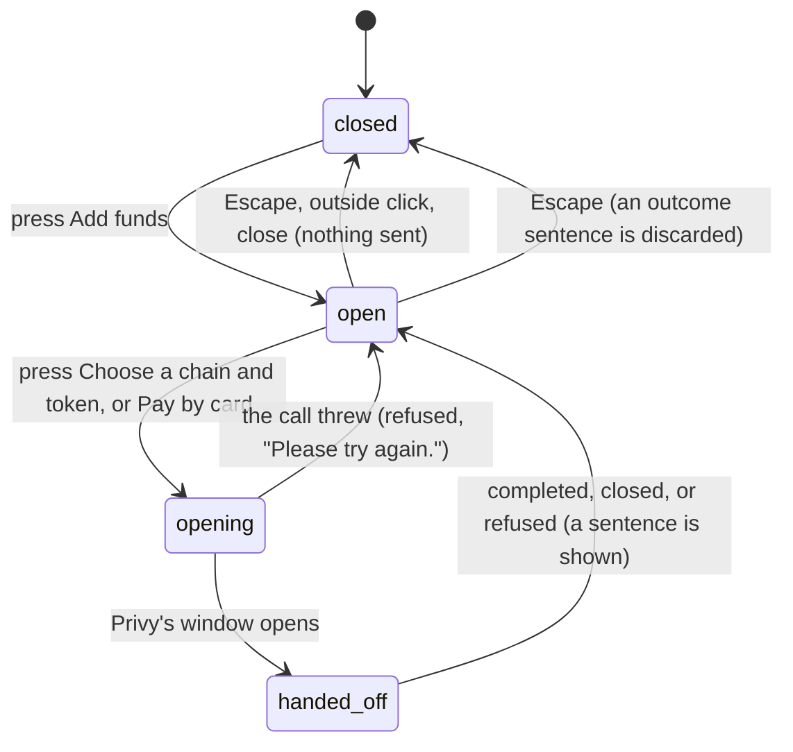

# Add funds

## Summary

Add funds is how money gets into the workspace. It is one button on the Wallet and one dialog behind it, offering three ways in: send from another chain and let Privy convert it, send USDC directly to the wallet address, or pay by card. The address always works and needs nothing; the other two need a Privy sign-in and a wallet on Base mainnet, and the dialog says which is missing rather than opening a window that cannot work.

The button sits on the Wallet, labelled **Add funds**. There is no route of its own and no keyboard shortcut; it is reached by going to the Wallet and pressing the button. The dialog is titled "Add funds" and described as "Add USDC on {network} to pay for services", naming the wallet's own network rather than assuming Base. Nothing here spends money, so [the leash](../../foundations/the-leash.md) never judges it and it is available whatever the mandate says — including while the wallet is frozen.

## The simple case

The person opens the Wallet and presses **Add funds**. The dialog opens with three sections stacked in one column: _Send from another chain_, _Send USDC on Base to_ with the wallet address beneath it, and _Or pay by card_.

The middle section is the one that always works. The wallet address is shown in full, in the machine typeface, wrapped rather than truncated, with a **Copy wallet address** button under it and one sentence saying what to send and how long it takes: from a wallet that supports this network, and the balance updates about a minute after the transfer confirms.

If instead the person presses **Choose a chain and token**, Privy's own deposit window opens over the app. Froggy's button reads "Opening…" while that happens and the sentence beneath becomes "Opening the deposit window…". What follows happens inside Privy's window, not Froggy's: the person picks a chain and a token, sends, and closes it. Froggy learns only how it ended, and says so — sent, closed without depositing, or refused for a named reason. The balance updates on its own clock afterwards.

Escape closes the dialog and focus returns to the **Add funds** button.

## The request, event by event

### Asking

Pressing **Add funds** opens the dialog. What it can offer is decided at that instant from two things: whether the identity is a real Privy sign-in or a local one, and which network the wallet is on.

While the wallet summary has not arrived, the dialog shows a labelled loading region — "Loading funding details" — with two skeleton bars and the sentence "Loading your wallet address and network…". The address section and the card section are absent, not disabled, because there is no address to show yet.

Once the wallet is known, the sections appear in a fixed order: send from another chain, then the address, then the card. Each is present only when it can do something. _Send from another chain_ is absent entirely when there is no Privy deposit flow to open or no address yet. The address section is absent until there is an address. The card section is always present once the wallet is known, but shows a sentence instead of a button when the card path is closed.

> Technical note: the order in the dialog is not the order of usefulness. The address is the path that always works, and it is second. This appears to be unintended; see [Open questions](#open-questions-and-verification).

### Answered at once

Closing the dialog — Escape, a click outside, the close control — sends nothing, records nothing, and returns focus to the **Add funds** button. Copying the address records nothing either: it is a clipboard write, and nothing is told to the server.

The card path can also end here without anything happening, with one of three sentences in place of a button. "This is a local identity. Adding real funds needs a Privy sign-in." when there is no Privy sign-in. "Card funding deposits USDC on Base mainnet. This wallet is on {network}." when the wallet is elsewhere. "A wallet is needed before you can add funds." otherwise. In every one of those cases there is no button to press; the dialog does not offer a path it knows will fail.

### The work begins

The line is crossed when the person presses **Choose a chain and token** or **Pay by card**. The button becomes disabled and reads "Opening…", a guard prevents a second press from opening a second window, and Privy's window opens over the app.

From that instant Froggy is no longer the thing in control. It has handed the person to Privy, and it does not know what they do there — how much they send, from which chain, or whether they hesitate. It will learn one of three endings and nothing else.

Nothing has been spent from the workspace at this point, and nothing can be: money is arriving, not leaving, and [the leash](../../foundations/the-leash.md) governs only what leaves.

### While it runs

Froggy shows "Opening the deposit window…" or "Opening the card checkout…" and waits. The rest of the dialog stays as it was and stays usable — the address is still there to copy, and the other path's button is still live. There is no progress, no amount, and no cancel, because none of those belong to Froggy while Privy's window is open.

### Finishing

Privy's window ends and Froggy replaces the sentence beneath the button with what happened.

For a deposit from another chain: **completed** reads "Sent. The balance updates when the conversion lands; the amount that arrives is a little less than the amount sent, because the conversion has a fee." **Closed** reads "Closed without depositing. Nothing was sent." **Refused** shows a sentence chosen for Privy's own reason code — that the amount is too small to convert after fees, that the route cannot reach USDC on Base today, that there is not enough liquidity, that deposits from other chains are not switched on for this app, and a dozen others. An unrecognised reason keeps Privy's own words rather than replacing them with a shrug.

For the card: **submitted or confirmed** reads "Submitted to the provider. The balance updates when the funds land; they may still be on their way." **Refused** reads "The card checkout could not finish: {reason}".

If the call itself throws, both paths say "Please try again." and the button becomes pressable again.

A refusal is announced, not merely shown: the sentence takes on an alert role so a screen reader hears it without the person going looking. A success is not announced; it is a status update in a live region.

The balance is not part of any of this. It updates when the money lands — about a minute after a direct transfer confirms — and nothing in the dialog waits for it or shows it happening.

## Variants

| Variant | Set before asking | Changed while it runs |
| --- | --- | --- |
| Who is asking | Only a person in the workspace can open this dialog. There is no MCP tool, no Telegram command and no schedule that adds funds; an agent that needs a funded wallet must ask the person. | No effect. |
| The policy in force | No effect. Adding funds is money arriving, and the leash governs only what leaves. The dialog works normally while the wallet is frozen. | No effect. |
| Funds available | No effect on what the dialog offers. A balance of zero and a balance of a hundred dollars produce the same three paths. | No effect. |
| What is being asked for | The three paths differ in what they need: the address needs nothing, the deposit needs a Privy sign-in, the card needs a Privy sign-in _and_ Base mainnet. | The person can start one path, get a refusal, and try another without closing the dialog. |
| The asking agent's grant | No effect. No scope grants an agent the ability to add funds. | No effect. |
| The shared browser | No effect. Privy's window is a modal over the app, not a page in [the shared browser](../../foundations/the-shared-browser.md), and a run browsing in the background is untouched. | No effect. |
| Appearance and motion | The dialog is styled by the saved theme. Under reduced motion it appears with no transition at all rather than a shortened one. | A theme change mid-dialog restyles it in place. |

Changing a variant mid-interaction changes little here, because the only variant that gates anything — the identity and the wallet's network — cannot change while the dialog is open.

## Cancel and interrupt

| Event | Before the window opens | After the window opens |
| --- | --- | --- |
| Stop — the person halts this run | No effect. This is not a run and there is nothing to stop. | No effect. Stopping a run in the background does not close Privy's window. |
| Freeze — the wallet is frozen, mid-run | No effect. Funds may be added to a frozen wallet. | No effect. |
| Denying a waiting approval, or leaving it unanswered | No effect. Adding funds raises no approval. | No effect. |
| Asking something else while this request is still in flight | No effect. The composer is on another page; going there closes the dialog. | The deposit window is Privy's and stays open over the app; the outcome sentence is lost when the dialog unmounts. |
| Leaving the page, or switching to another conversation, mid-run | Closes the dialog. Nothing is sent. | The dialog unmounts and forgets the outcome. Privy's window and any transfer already sent are unaffected. |
| Reload; the tab or the app closed | Closes the dialog. Nothing is sent. | Money already sent is on its way regardless; the balance reflects it when it lands. Froggy keeps no record that a deposit was started. |
| Network lost; the socket drops | The dialog stays open and the address is still copyable. The wallet summary may be stale. | The outcome may never arrive; the button stays disabled at "Opening…" until the dialog is closed and reopened. |
| The model, a service, or the facilitator errors or rate-limits mid-run | No effect. None of them is involved. | No effect. |
| The session expires, or the person signs out | The card path's sentence changes to the local-identity one and the deposit section disappears on the next render. | Privy's own window handles its own expiry; Froggy shows whatever reason comes back, likely "Sign in again and retry." |
| The policy or a cap changes mid-run | No effect. | No effect. |
| Funds run out mid-run | Not applicable; this is how funds stop running out. | No effect. |
| The person takes control of the shared browser mid-run | No effect. | No effect. |
| The same account open in a second tab or on a second device | Both tabs show the same address; either can be used. | A deposit started in one tab is invisible in the other. Both balances update when it lands. |

After any interrupt the person is left on the Wallet with the dialog closed and focus on **Add funds**. Nothing is kept: the dialog's memory of what happened lives only as long as it is open.

## Interactions with other systems

**The leash.** None. Adding funds does not spend, so no rule is consulted, no decision is recorded, and a frozen wallet still accepts money.

**Money and receipts.** No receipt is written. A deposit is not a spend, and [receipts](receipts.md) record why money left. The only trace of an arrival is [the balance](the-balance.md) changing.

**Approvals.** None raised, ever.

**Provenance.** Froggy records nothing about the deposit. What is provable afterwards is what the chain holds, not what Froggy saw.

**History and persistence.** Nothing is persisted. The dialog's outcome sentence is per-opening: close it and reopen it and the sentence is gone, whether it said "Sent" or named a refusal.

**The shared browser.** No interaction. Privy's window is a modal over the app.

**Connected agents and grants.** No interaction. No scope reaches this dialog.

**Notifications.** None. Money arriving raises no notification, no badge, and no Telegram message; the person finds out by looking at the balance.

**Navigation and URL state.** The dialog has no URL. Opening it does not change the address bar, and it cannot be linked to or restored by reload.

**Appearance, motion and accessibility.** The dialog is a focus trap; Escape closes it and focus returns to the button that opened it. The address is in the machine typeface and wrapped rather than truncated, so it can be read and selected in full. Every control clears the 44px target size. Refusals carry an alert role; successes and progress do not. Under reduced motion the dialog's transition duration is zero.

**Offline and reconnection.** The dialog does not depend on the socket. Its content comes from the wallet summary already loaded, so it opens and the address copies while offline; only the two windowed paths need the network.

**Stubs.** A stubbed identity is a local identity: the deposit section is absent and the card section says so in plain words. Neither path can be exercised without a real Privy sign-in, so **no funding path can be demonstrated on a stubbed build** — see [stubs](../../cross-cutting/stubs.md).

## Edge cases

- The dialog can be opened before the wallet summary arrives. It shows a loading region, then grows as the sections appear; the layout shifts as they do.
- _Send from another chain_ is listed first but is the least likely to be available: it is the only section that vanishes entirely on a local identity, leaving the dialog to open on the address instead.
- The stated route coverage is explicit about exclusions — Ethereum, Base, Arbitrum, Optimism, Polygon and Solana, "Not Bitcoin, not Hedera" — which is worth reading beside the fact that Froggy settles on Hedera. Money cannot be added on the chain a large part of the product pays on.
- The conversion fee is disclosed only after a completed deposit, not before it: "the amount that arrives is a little less than the amount sent".
- Pressing the button twice quickly opens one window, not two.
- A card refusal and a deposit refusal are shown in different places — under their own buttons — so a person who tried both sees two sentences at once.
- The card path checks for Base mainnet exactly. A wallet on Base Sepolia gets the "This wallet is on Base Sepolia" sentence, not a testnet card flow.
- Nothing in the dialog shows a pending or in-flight deposit. Between sending and the balance updating there is no indication anywhere in the workspace that money is on its way.

## Open questions and verification

- **The order of the three sections contradicts a deliberate decision made the day before, and is worth treating as a bug rather than documenting.** Commit `ffca8fe` (8 September) is titled "Offer the wallet address first in Add funds, and the card second" and rearranged this dialog to do exactly that. Commit `d998ff2` (9 September), which added funding from other chains, inserted the new section _above_ the address and left the ordering decision undone. The file's own comment still describes the old arrangement — "one dialog, two ways in" and "the address comes first because it always works" — while there are now three ways in and the address is second.
- Closing the dialog discards the outcome sentence, including "Sent". A person who closes the dialog after a completed deposit has no way to confirm from the workspace that it happened until the balance moves, which may be minutes. Worth treating as a defect: a deposit in flight is exactly the moment a person wants reassurance.
- If the outcome call never resolves — the network dropped while Privy's window was open — the button appears to stay disabled at "Opening…" indefinitely, with no timeout observed in the code. Not confirmed by hand.
- The "about a minute" figure for a direct transfer is the interface's own claim; it has not been timed.
- Whether Privy's window survives a Froggy page navigation, or is torn down with the app, has not been checked by hand.
- The e2e specs cover the local-identity case, the dialog's motion and focus return, and its appearance in both themes. No spec exercises a completed deposit, a refusal, or the card path, because none can run without a real Privy sign-in.

Verified against the Froggy tree at commit `5caed50`.
