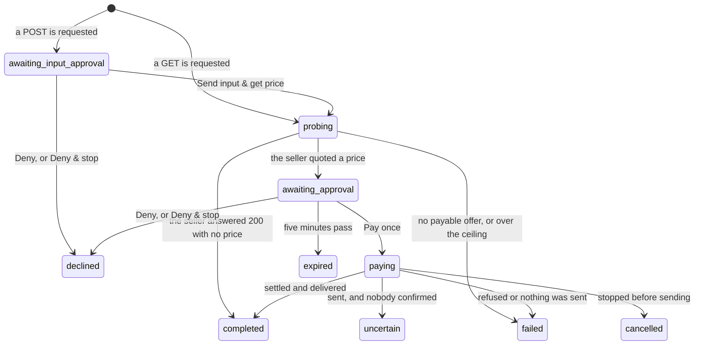

# Purchases

## Summary

A purchase is one paid HTTP request: Froggy asks a URL what it costs, shows the person the exact offer, and — only if they say yes — signs once, sends, and keeps the result. It is the plainest form of the thing Froggy exists to do, with the seller reduced to an address and a price.

The person meets it as **Pay a URL**: a form for the URL, the method, the input, a purpose and a ceiling; an approval band that appears across the top of whatever page they are on; and a list of recent purchases with their results kept. The same purchase record is what the agent in the conversation creates when it is asked to buy something, what a connected agent creates over MCP, and what the shared browser creates when it walks into a paywall. One record, four ways in.

What a spend costs and what its states mean belong to [money](../../foundations/money.md); which rule allowed it belongs to [the leash](../../foundations/the-leash.md); the ticket it leaves behind belongs to [receipts](receipts.md).

## The simple case

The person opens the Services page and scrolls to **Pay a URL** — "Get a price, approve once, keep the result." They press **Use demo report**, which fills the URL and a purpose, type nothing else, and press **Request purchase**.

Froggy fetches the URL, gets a 402 back with a price, and an approval band drops in at the top of the window: the method, the origin, the route, the network, the amount in tokens, the token id, the recipient, and a countdown. Three buttons, in this order: **Deny & stop**, **Deny**, **Pay once**. The person presses **Pay once**.

The band disappears. Below, in **Recent URL purchases**, the card for that purpose reads "Payment in progress", then "Paid · result delivered", and the response text is there, opened. A receipt for the spend is on the Wallet.

## The request, event by event

### Asking

The form takes five things. The **URL** must be a complete HTTP or HTTPS address with no embedded credentials — "Enter a complete HTTP or HTTPS URL." and "Use an HTTP or HTTPS URL without embedded credentials." are the two refusals. The **method** is GET or JSON POST. A POST adds a **JSON input** box, at most 16 KiB and parsed before anything is sent: "Enter valid JSON for the POST request." A **purpose** is required — "Add a purpose so you can recognize this purchase." — because the purpose is what the person will read the approval by. A **maximum price** between $0.000001 and $1, defaulting to $0.10.

Every one of these is checked in the page before a request leaves. Nothing is sent, quoted or spent while the form is being filled.

> Technical note: an idempotency key is minted from the exact draft and remembered, so editing a draft and returning to it re-submits the _same_ purchase rather than starting a second one. A lost response is a retry, not a second bill.

A **GET** and a **POST** are treated differently from the first instant. A GET goes straight to asking the seller for a price, because a GET is a request for a page. A POST parks first, on an approval titled **Send input and get price**: sending the person's own data to a stranger is a decision in its own right, and the price is a second one.

### Answered at once

A purchase can end before any money is considered. The seller answers 200 with no payment demanded and the result is simply kept — "Delivered · no payment". The seller answers anything else without a payable challenge: "The server answered 404 without a payable x402 challenge." The offer is in a scheme or on a network Froggy cannot pay: "This seller did not offer a supported x402 v2 payment in known USDC or native HBAR on the configured networks." The price is above the ceiling on this request: "The seller's price exceeds this request's spending ceiling. Nothing was signed."

The wallet that would have to pay is empty or missing, and the refusal says which and what to do — "Fund your Ethereum wallet with at least 0.05 USDC on eip155:8453, then request a fresh quote. Nothing was signed." Every one of these sentences ends by saying nothing was signed, which is the fact the person actually wants.

### The work begins

The line is crossed when the person presses **Pay once**. At that instant a grant is written down: this person, this exact request, this exact quote, expiring when the approval would have. It is a permission for one purchase and nothing else, and it is written by the person — never by whoever asked.

Then, and only then, the spend goes to the leash as a `service_payment` to the URL's host, with the purchase bound to it so the judgement can check that the thing being paid for is the thing that was approved.

Before signing, the conditions are re-checked rather than assumed: the requesting agent is still connected, the quote has not expired, and — for a plain GET — the seller is asked again and its offer must fingerprint identically. "The seller changed its payment terms. Nothing was signed; request a new quote."

### While it runs

The card in **Recent URL purchases** moves through its own words: "Getting price", "Needs your approval", "Payment in progress", and then a fuller sentence that keeps payment and delivery apart — "Payment signed · not yet sent", "Payment sent · settlement not yet confirmed", "Paid · waiting for the result", "Paid · result delivered", "Paid · delivery failed".

The list refreshes every two seconds while anything is in flight and every five otherwise. **There is no cancel button.** The person can leave, navigate, reload and come back; they cannot stop a purchase they have approved from this page.

The approval band is not part of the Services page. It sits above every page in the workspace, so an approval raised while the person is reading the Wallet is answerable from the Wallet, and it survives a reload.

### Finishing

A completed purchase keeps four things: the response text, capped and shown as text and never as markup; the HTTP status; the transaction id; and the id of the [receipt](receipts.md). The details disclosure prints the purchase id, the transaction and the receipt id in the machine typeface.

A declined purchase keeps a receipt too. The decline is persisted with no grant, and the spend is then put through the leash anyway so that it refuses — which is how "you said no" becomes a durable refusal record rather than an absence. **Deny & stop** does more: it aborts the run and cancels every unfinished purchase in the workspace.

The reading nobody wants is **"Payment uncertain · do not buy again until checked"**, which means the payment left and neither the seller nor the network has said whether it landed.

## Variants

| Variant | Set before asking | Changed while it runs |
| --- | --- | --- |
| Who is asking | The person uses the form. The agent in a conversation uses a tool and blocks on the same approval. A connected agent over MCP may request and read but **never answer** — "An agent cannot answer or cancel a human approval." A schedule cannot buy at all: an unattended run is told "URL purchases need a person's approval in Froggy." | No effect; the source is fixed when the record is created. |
| The policy in force | Judged as a `service_payment` to the URL's host, so the host allowlist, the caps and the approval threshold all apply on top of this request's own ceiling. | A change applies at the moment of signing, which is after the person answered. A cap that tightens between yes and signing refuses the purchase. |
| Funds available | Checked twice: when quoting, to choose an offer that can actually be paid, and again immediately before signing. | Running dry between the two produces a refusal naming the wallet and the network. |
| What is being asked for | A GET is a request for a page and is priced at once. A POST is a request to send the person's data and is approved twice. | No effect; the method is part of the fingerprint. |
| The asking agent's grant | An agent needs `pay` on a live grant. Its purchases are scoped to its connection: it can only read its own. | **Revocation is enforced mid-flight.** An agent disconnected between approval and signing gets "The requesting agent was disconnected before signing." |
| The shared browser | A 402 met in the shared browser becomes a purchase on its own, titled "Open paid page at {host}", ceilinged at $1, and paid by replaying the request through the browser. | The browser moving off the paid page invalidates it: "The browser moved away from this paid page. Open it again for a new quote." |
| Appearance and motion | The band and the cards follow the saved theme. The approval's amount is kept on one line down to 320px. | No effect. |

## Cancel and interrupt

| Event | Before Pay once | After Pay once |
| --- | --- | --- |
| Stop — the person halts this run | A purchase belonging to a run is cancelled with the run. A purchase made from the form belongs to no run and is untouched. | If nothing was sent, `cancelled`; if something was, `uncertain`. Stopping is never a refund. |
| Freeze — the wallet is frozen, mid-run | The spend is refused with `frozen` at the moment of signing, after the person already said yes. | No effect on money already sent. |
| Denying a waiting approval, or leaving it unanswered | **Deny** declines this purchase and writes a refusal receipt. **Deny & stop** additionally aborts the run and cancels every unfinished purchase. Unanswered, it expires after five minutes: "This approval expired. Start a new request for a fresh quote." | Not applicable. |
| Asking something else while this request is still in flight | No effect. Purchases are independent records; several can wait for approval at once and the band stacks them. | No effect. |
| Leaving the page, or switching to another conversation, mid-run | No effect. The band follows the person to every page. | No effect; the work is the server's. |
| Reload; the tab or the app closed | The approval is still there after a reload, on whatever page the person lands on. | The purchase finishes without a tab. The result is waiting on return. |
| Network lost; the socket drops | The list stops refreshing and shows its last error. The approval cannot be answered until the network returns. | No effect on the purchase. |
| The model, a service, or the facilitator errors or rate-limits mid-run | No spend is attempted. | Recorded as an error on the card and a failure on the receipt. |
| The session expires, or the person signs out | The answer needs a live sign-in: "Sign in to answer this approval." | The purchase continues; the credential it needed was taken at the moment of the answer. |
| The policy or a cap changes mid-run | Applies at signing. | A spend already made is never revisited. |
| Funds run out mid-run | The quote step refuses and says which wallet to fund. | The pre-signing check refuses and nothing is signed. |
| The person takes control of the shared browser mid-run | For a browser purchase, moving the page away invalidates the quote. For every other kind, no effect. | No effect. |
| The same account open in a second tab or on a second device | Both tabs show the band. Whoever answers first wins; the second answer finds the purchase no longer waiting and is a no-op. | Both see the same result. |

**The worker restart case is its own row in spirit.** A purchase left probing or paying with nothing working on it for five minutes is closed out — `failed` if nothing was sent, `uncertain` if something was — with "The worker stopped before this purchase finished. This request will not be paid again." The one-use credential is gone with the process, and it must never sign twice.

## Interactions with other systems

**The leash.** Every purchase is judged as a `service_payment` to the URL's host. The approval the person answers in the band is _not_ the leash's approval — it is the purchase's own — and the leash still applies afterwards, so a purchase can be approved by the person and then refused by a cap.

**Money and receipts.** Every purchase that reaches a judgement writes a receipt, including one that was declined. The payee label is the URL's host. See [money](../../foundations/money.md).

**Approvals.** The purchase approval has three answers, not four: **Deny & stop**, **Deny**, **Pay once**. There is no "allow for this session", so **no ask exemption can ever be written from a purchase** — every purchase is approved on its own.

**Provenance.** The payee comes from the seller's own 402 challenge and is recorded as `server` provenance: Froggy learned it by asking, not from a model or a page. The offer is fingerprinted so the thing signed is provably the thing shown.

**History and persistence.** Purchases are durable and listed fifty at a time; the panel draws the newest ten. The response body is capped at 64 KiB and hashed.

**The shared browser.** A top-level 402 in the browser raises a purchase automatically. With no browser provider configured the pane says "Browser Use is stubbed." and **no purchase is invented**.

**Connected agents and grants.** An agent may request a purchase and poll its status; it may not answer or cancel one. Its purchases are visible only to it and to the person. The tool's answer is deliberately narrow: no signing parameters, no credentials, and no redeemable proof ever reach a tool.

**Notifications.** A pending purchase counts toward the workspace's waiting badge alongside ordinary approvals. There is no Telegram message for one.

**Navigation and URL state.** The panel lives on `/services` and has no URL of its own; a purchase cannot be linked to. The conversation's "View saved result" button links to `/services` and not to the purchase.

**Appearance, motion and accessibility.** The band is a region labelled "Purchase approvals", capped at 45% of the viewport and scrollable. Focus moves to **Deny** when the approval arrives, unless the person is typing, so the safe answer is the one a stray keypress hits. The countdown is announced as "{n} seconds left" and all three buttons disable at zero.

**Offline and reconnection.** The purchase runs on the server and is unaffected by the tab. The list simply stops refreshing and shows its last error; the approval band cannot be answered until the network returns, and a countdown that runs out while offline expires the approval.

**Stubs.** A stubbed purchase carries a **Simulated** badge on the approval, on the result card and in the data, and the result reads "Simulated payment · result delivered". Stubbed wallets are badged "Simulated wallets". See [stubs](../../cross-cutting/stubs.md).

## Edge cases

- The panel also holds **Wallets for URL purchases**: three rows — USDC on the configured EVM network, USDC on Solana, HBAR on Hedera — each with a balance, a fundable address, a note, and Ready or Setup needed. A missing Solana wallet is offered a **Create Solana wallet** button.
- The Hedera row is marked Ready when Hedera is _stubbed_, and its note says "Demo wallet: payments and receipts are marked stubbed."
- The status badge and the result line can disagree: a purchase whose seller answered 200 without asking for money is badged **Completed** while the line reads "Delivered · no payment".
- The approval's payee is shown as the URL's host and its amount as the quoted dollars. When there is no quote yet — the POST input approval — the amount reads `$0`.
- Response text is rendered as plain text in a bounded, scrollable block; the spec asserts no frame, script or style element survives it.
- The countdown reads in raw seconds, so a five-minute approval opens at "300s".
- A cancelled purchase whose payment had already gone out ends as `uncertain` while its message still says "The purchase was stopped. A sent payment will not be retried."
- Redirects are not followed. A seller that answers a 301 is a seller that did not quote.

## Open questions and verification

- **The purchase surface is not on the Wallet.** This document sits under `workspace/wallet/` and everything it describes lives on `/services`, which is not one of the three destinations and is reached only by a link from the conversation or a typed URL. Either the structure or the placement is wrong; the placement is the more likely bug, because a person who has just been asked to approve a payment has no obvious route to its result.
- **There is no way to cancel a purchase from the interface.** The server offers one, and it is used by Deny & stop and by account deletion. A person watching "Payment in progress" has no button.
- **A purchase is marked stubbed when the _database_ is stubbed**, before anything about the payment is known. The payment's own stubbing is folded in later, so the marker is never wrong in the loud direction — but the reason it is set is not the reason a reader would assume.
- The five-minute approval window and the five-minute worker-restart window are the same number used for two unrelated things; whether that is deliberate is not established.
- Whether two people answering the same approval from two devices at the same instant can both be told they succeeded has not been tested by hand; the server's conditional update suggests not.
- The specs cover the demo report end to end, an approval surviving a reload and a navigation to the Wallet, a decline writing a deny receipt with no settlement, the chat path pausing and resuming, and the browser path refusing to invent a purchase when no browser is configured. **No spec exercises a real payment**, because none can without live credentials; every green run is a simulated one.

Verified against the Froggy tree at commit `5caed50`.
