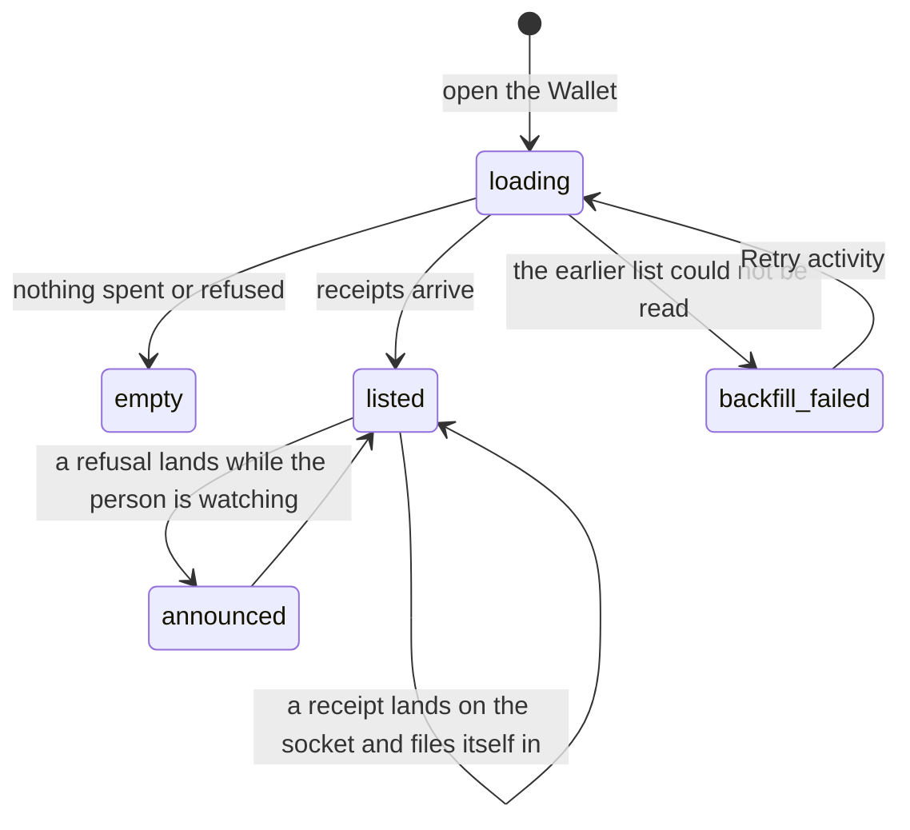

# Receipts

## Summary

A receipt is the durable record of a spend that answers _why_, not just whether. It is drawn as a ticket: a body for the person — how much, to whom, what for, and whether it happened — and, below a perforation, a stub for whoever has to check: the rule that decided, the transaction, the evidence digest, and the stub marker. A refused spend gets the same ticket with a **Refused** stamp on it, because a refusal is the product working rather than an error.

Receipts appear in four places and are the same object in all four: the Activity list on the Wallet, filed under the tool call that spent inside a conversation, behind an "Earlier" disclosure for turns that have scrolled past, and on an [activity record](../activity.md). This document owns the ticket — what it records, how it reads, and how a stubbed one is marked. What a spend costs and what its ledger states mean belong to [money](../../foundations/money.md); which rule refused belongs to [the leash](../../foundations/the-leash.md).

## The simple case

The person opens the Wallet and scrolls past [the balance](the-balance.md) to **Activity**. Newest first, one ticket each: `$0.05`, then the asset and the payee — "USDC · thegraph.com" — then a line saying what happened, "Paid thegraph.com", and on the right the clock time it happened. Under the perforation, in the machine typeface: the rule that let it through, the network and transaction id linked to an explorer, the consensus note's number, the evidence digest, and where the price came from.

With nothing spent yet the list says "Nothing spent or refused yet." and, beneath, "Every payment and every refusal lands here with its receipt."

## The request, event by event

### Asking

A person does not ask for a receipt; a spend produces one. What the person does is arrive somewhere a receipt is shown.

Two sources fill the list and they are merged rather than chosen between: the socket pushes each receipt as it is written, and one request per session backfills what earlier tabs and earlier days produced. Duplicates are collapsed by id and the result is sorted newest first, so a reconnect cannot file the same receipt twice.

While the backfill is outstanding, Activity shows two skeleton blocks in a region labelled "Loading wallet activity" and **does not** show the empty state. If it fails, one line — "Couldn't load earlier activity. Your wallet is still available." — with a **Retry activity** button beside it, and whatever the socket has already delivered stays listed.

### Answered at once

A spend that is refused writes a receipt exactly like one that settles. The refusal path is not a failure path here: the ticket is drawn in the refused tone, the clock time on the right is replaced by a **Refused** stamp, and the stub carries the denial code and the rule that refused.

### The work begins

A receipt exists at the moment a spend is judged, not at the moment money lands. It can therefore be complete, readable and permanent while nothing has settled — that reading is "Allowed, not settled", and it means the decision was made and the payment was never carried out.

### While it runs

A receipt written while the person is watching animates in: the ticket springs into the list, and a refusal's stamp stamps itself rather than fading. A receipt written before the page loaded appears without the animation, which is how a person can tell a fresh refusal from an old one at a glance.

One live region announces at most one thing at a time. A waiting approval outranks everything; below it, a refusal that landed since the page loaded is announced as "Refused: {the sentence}". **A successful payment is never announced** — money moving under the rules is the product working, and it is not news.

A receipt that carries an approval also files a marker in the conversation's timeline: "You answered: you allowed it once."

### Finishing

Nothing is left to do. The ticket is durable, its id is stable, and it will read the same after a reload, a sign-out, or a redeploy. Deleting the account removes the person's profile and records; the ledger's spend rows stay, because money that moved is not a preference.

## What a ticket says

The **body**, for the person:

- The amount in dollars, in the money face with tabular numerals, then the asset's symbol and the payee's label.
- One headline sentence. For a refusal it is the refusal's own sentence; for a parked decision, the question; otherwise one of **Paid {payee}**, **Allowed, not settled**, or **Payment problem: {what went wrong}**.
- The purpose, in the person's own words where they wrote them.
- **Which layer said no**, when something did, in two parts: "The mandate refused, before any key was touched." with the plain-words reason, or "The mandate allowed; the signer refused, under its own policy.", or "The mandate allowed; the payment did not go through." A person should be able to tell those apart without knowing what a policy engine is.
- **Because…** — a disclosure reading "Because 3 of 4 Graph indexes answered at a current block", opening to each index with its block number and whether it was fresh, stale or unavailable, and the snapshot digest.

The **stub**, for whoever has to check: the denial code; the rule id, shortened; what the person answered, in words — "you allowed it once", "you allowed it for this session", "you said no", "you stopped the agent", "nobody answered", "nobody to ask", "question withdrawn"; the network and transaction id, linked to an explorer where one is known; the consensus note's sequence number, linked when the topic is known; "not settled" and the failure in its own words; the evidence digest with how many indexes contributed; and where the quote came from.

The Wallet draws every ticket in its **compact** form. The compact form keeps the amount, the payee, the headline, the time or the stamp, the stubbed badge, and the whole stub — and drops the purpose, the layer sentence and the Because disclosure.

## Where a receipt appears

The same ticket is drawn in four places, and which one a person is looking at changes only how much of it is shown.

**The Wallet's Activity list.** Every receipt the workspace has, newest first, compact. This is the only place a receipt with no tool call behind it — a scheduled job, a replay — can be found at all.

**Under the tool call that spent.** Inside a conversation, a call that spent or tried to has the receipt as its body rather than a summary line beside it, in full. A receipt that lands while the person is watching stamps itself in. Where the payment unlocked a page, a button beside the ticket goes to that page in the shared browser; the link itself is never printed.

**Behind "Earlier".** Receipts belonging to turns that have scrolled out of the conversation collapse into one disclosure — "Earlier (3 receipts)" — rather than being dropped.

**On an activity record.** The full ticket, with the purpose, the layer sentence and the evidence. A record with none says so plainly: "No receipt is linked to this record. A completed call alone does not confirm payment."

## Variants

| Variant | Set before asking | Changed while it runs |
| --- | --- | --- |
| Who is asking | The person sees tickets. A connected agent gets the same receipts as data and never the drawing; a receipt records which run produced it, and the run records which agent asked. | No effect. |
| The policy in force | Decides what the receipt records: which rules were satisfied, or which one refused. | The next receipt reflects the new numbers; an existing one is never rewritten. |
| Funds available | A spend refused for want of funds is a receipt like any other, with a code naming what was short. | No effect on receipts already written. |
| What is being asked for | Decides the purpose, the payee label and whether there is evidence to show. A spend with no evidence simply has no Because line. | No effect. |
| The asking agent's grant | Not on the ticket. It is on the invocation trail against the agent. | No effect. |
| The shared browser | A purchase made through the browser produces an ordinary receipt; nothing on the ticket says the browser was involved. | No effect. |
| Appearance and motion | Tickets are styled by the saved theme; the refused tone is a tone, not a red box. | Under reduced motion the arrival spring and the stamp do not animate. |

## Cancel and interrupt

| Event | Before the receipt is written | After it is written |
| --- | --- | --- |
| Stop — the person halts this run | The spend may end as abandoned, which still writes a row and a receipt. | Nothing is removed. A receipt is a record of the past. |
| Freeze — the wallet is frozen, mid-run | The next spend is refused with `frozen` and its receipt says "The wallet is frozen." | No effect. |
| Denying a waiting approval, or leaving it unanswered | A receipt is written either way, with the answer or with `timeout`, `aborted` or `unavailable` in the approval line. | No effect. |
| Asking something else while this request is still in flight | The superseded run's receipts still belong to it and still appear. | No effect. |
| Leaving the page, or switching to another conversation, mid-run | The receipt is written on the server regardless. | The Wallet shows it on return. |
| Reload; the tab or the app closed | No effect. | The backfill re-reads it; the arrival animation does not replay. |
| Network lost; the socket drops | The receipt is written and waits. | The list goes quietly stale until the socket returns, then merges what it missed. |
| The model, a service, or the facilitator errors or rate-limits mid-run | The receipt records the failure in the service's own words. | No effect. |
| The session expires, or the person signs out | The receipt is written on the server. | Signing back in reads it again. Deleting the account keeps the spend rows and drops the rest. |
| The policy or a cap changes mid-run | Applies to the next judgement and the next receipt. | An existing receipt is never rewritten to match a new policy. |
| Funds run out mid-run | A refusal receipt naming what was short. | No effect. |
| The person takes control of the shared browser mid-run | No effect. | No effect. |
| The same account open in a second tab or on a second device | Both receive the same push. | Both lists agree; the arrival animation plays in whichever tabs were open. |

## Interactions with other systems

**The leash.** Every decision the leash makes lands here: an allow carries the ids of the rules it satisfied, a deny carries its code and the rule that refused. See [the leash](../../foundations/the-leash.md).

**Money and receipts.** This is the drawing of what [money](../../foundations/money.md) defines. Amounts are shown to two decimal places, or four when a price is a fraction of a cent.

**Approvals.** An approval's resolution is one line on the stub, in words rather than in codes, because a receipt that says "allowed" without saying "because you said so" has lost the fact that made the spend legitimate.

**Provenance.** The stub is the provable part: the transaction linked to its explorer, the consensus sequence number linked to its note, and the evidence with its snapshot digest and per-index block numbers.

**History and persistence.** Durable and append-only in spirit. One request per session backfills up to a hundred; the socket keeps it current from there.

**The shared browser.** A paid page produces a receipt whose tool card also offers a button back to the unlocked page. The link itself is never printed — it opens once, in the browser.

**Connected agents and grants.** A receipt names the run; the run names the agent. An agent reading its own receipts is [reading results and receipts](../../agent-surface/reading-results-and-receipts.md).

**Notifications.** A refusal that arrives while the person is watching is announced once. A payment is not.

**Navigation and URL state.** The Activity list has the anchor `#activity` and no per-receipt route. A single receipt is deep-linked through the activity record parameter instead.

**Appearance, motion and accessibility.** Each ticket has an accessible name of the form "Refused: {sentence}" or "Receipt: {sentence}", so the list is traversable without reading the stub. The stub's links are dotted-underlined and open in a new tab. Amounts are tabular.

**Offline and reconnection.** The list stays as it was and merges the missed receipts by id on reconnection; nothing is duplicated and nothing is announced twice.

**Stubs.** A stubbed receipt carries `stubbed: true` in the data and a **stubbed** badge on the ticket, and stubbed evidence adds "(a recorded fixture)" to the Because line. This is the rule the whole design exists to protect: a screenshot must never be presentable as a settled payment. See [stubs](../../cross-cutting/stubs.md).

## Edge cases

- A receipt with no settlement and no failure is legal and means the decision was never carried out. The two absences say different things.
- A receipt with no tool call is not an error. Scheduled jobs and replays produce them, and they appear only in the Wallet.
- Refusals and payments are one list. There is no filter, no separate refusals view, and no way to hide either.
- The Because summary counts fresh indexes, so an answer where nothing was fresh reads "Because 0 of 3 Graph indexes answered at a current block" — literally true and awkward.
- The rule id shown for an allow is the **last** rule satisfied, not all of them; the full set is in the data.
- A receipt written for a Hedera settlement carries a transaction id that is not a `0x` hash, and the explorer link is built accordingly.
- The list holds a hundred receipts. There is no paging control and no "load more".

## Open questions and verification

- **A refused receipt shows no time.** The right-hand column is either the clock time or the Refused stamp, never both, so the Wallet's list of refusals carries no timestamps at all. On a list sorted newest first with no dates on it, that is a real loss. Worth treating as a defect.
- **The Wallet is the one surface that drops the purpose and the layer sentence.** The compact ticket omits both, and the Wallet is where a person goes to ask "why did that happen". The reason is legible in the conversation and on the activity record and not in the place the question is most likely to be asked.
- Whether a `failed` receipt is ever reconciled afterwards, and by what, is not established — the same open question [money](../../foundations/money.md) records.
- Whether refused receipts and settled ones are ever visually confusable at a glance in the compact form, given the tone is the only difference besides the stamp, has not been checked in the running product.
- The backfill asks once per session and is not refetched on reconnect; whether a long-lived tab can drift behind after a socket outage that spanned a receipt has not been tested.
- The specs cover the loading and empty states and, through the purchase suite, that a declined purchase writes a receipt whose decision is a deny with no settlement. No spec exercises the evidence disclosure, the consensus link, or a receipt with a failure on it.

Verified against the Froggy tree at commit `5caed50`.
