# The balance

## Summary

The balance is the first thing on the Wallet and the only number on it: one dollar figure, large, that says what may be spent. It is two chains added together — USDC on Base and HBAR on Hedera, valued at the mirror rate — and the disclosure beneath it says which part is which. What the chains have not answered for is shown as **unavailable**, never as zero, and a total with a hole in it is not shown at all.

The figure is a display, not a control. Nothing about it can be pressed, changed or refused; [the leash](../../foundations/the-leash.md) never judges it, and it reads the same whether the wallet is frozen or not. It is reached by going to Wallet, the third destination in [the navigation](../../foundations/navigation.md). What the units mean and what "spent" means belong to [money](../../foundations/money.md); this document owns the one figure, what is inside it, what is deliberately outside it, and when it moves.

## The simple case

The person opens the Wallet. A card headed **Your wallet** carries a chip reading "USDC + HBAR", and under the heading the figure counts up from `$0.00` to what they hold, digit by digit, over about six-tenths of a second. Beneath it, one line: "USDC on Base and HBAR on Hedera, in dollars."

Under that sit two buttons — **Add funds** and **Copy for your agent** — and a disclosure labelled **Where it is**. Opening it lists the parts: USDC on Base with the wallet address, short, linked to a block explorer and copyable; HBAR on Hedera with the amount in HBAR "at the mirror rate", the account id, linked and copyable. Below the card, the Activity list of every [receipt](receipts.md).

The figure does not tick. It changes when something happens that makes it change, and one of those things is not a clock.

## What the figure includes

Two things are added, and everything else is deliberately left out.

**USDC on the wallet's EVM network**, whose units are already dollar millionths, so no conversion happens at all. **HBAR on Hedera**, converted at the rate the mirror node reports at the moment the summary is built; the breakdown says "at the mirror rate" so the figure is not mistaken for a fixed one.

Left out, and each for its own reason:

- **Anything reserved and not yet settled.** The figure is what the chains report holding, not what the ledger thinks is committed. A spend judged and written down but not sent is not deducted, so during a run the balance can read higher than what is really free to spend.
- **How much has been spent in the rolling window.** That is the number the caps are compared against, and it is computed in the same breath — and shown elsewhere, never here.
- **Money held for Hedera payments before the person has a Hedera account.** It is shown as its own row so it is not hidden, and it is excluded from the sum because once the account opens the same money is HBAR and would otherwise be counted twice.
- **Every other chain.** Nothing on Solana, and nothing on any network the wallet is not configured for, contributes.

## The request, event by event

```mermaid
stateDiagram-v2
    [*] --> loading : open the Wallet
    loading --> known : the summary arrives with a total
    loading --> unavailable : the summary arrives with a hole in it
    known --> known : a receipt lands; the figure morphs
    unavailable --> known : a later summary can be read
    known --> unavailable : a later summary cannot
    known --> breakdown : open Where it is
    breakdown --> known : close it
```

### Asking

Arriving at the Wallet is the whole of the asking. There is no input, no confirmation and nothing to submit.

Until the wallet summary arrives the card shows a labelled loading region — "Loading wallet balance" — with a single skeleton bar where the figure goes and the line "Loading your balances…". This state is held deliberately: the app does not show "Total unavailable" or "$0.00" while it does not yet know, because both are claims about money and neither would be true.

### Answered at once

There is nothing to refuse and nothing that can end early. The nearest thing to a refusal is the summary arriving without enough in it to add up, which is the unavailable case below.

### The work begins

Nothing is committed and nothing is spent. Reading the balance costs nothing, raises no approval, writes no receipt, and appears nowhere in [history](../activity.md).

> Technical note: the summary is computed on the server and pushed over the app socket. It is deliberately written never to throw — it is read on every socket open, and an exception there once took the process down. Spending reads the ledger separately and does fail closed; this path degrades instead.

### While it runs

The figure updates in place, morphing between values rather than jumping, with tabular numerals so the card does not resize as digits change. Three things cause an update and nothing else does: a socket opening, a receipt landing, and a connected agent's signing grant attaching. **There is no polling.** Money that arrives on a chain does not move this figure until one of those three happens, or until the page is reloaded.

Rapid updates settle rather than queue: three arriving in a row leave the last value on screen, and the page does not scroll under the person while they do.

### Finishing

There is no finishing state; the balance is a standing display. What it lands on is one of three readings.

**A total.** Every part was readable and the figure is their sum.

**"Total unavailable."** The description changes to "Known balances are shown below. An unavailable balance is not zero." The parts that _are_ known still appear in the breakdown; only the sum is withheld. This happens whenever the USDC balance could not be read, and also when a Hedera account exists but its HBAR or the HBAR rate could not be read.

**A total with no Hedera in it.** A person with no Hedera account yet holds a _known_ zero of HBAR, not an unknown one, so the total is their USDC alone and the HBAR row reads `$0.00`.

## Variants

| Variant | Set before asking | Changed while it runs |
| --- | --- | --- |
| Who is asking | The Wallet page belongs to the person. A connected agent reads the same summary over MCP and gets the same figure plus what the person's page does not show: how much has been spent in the current window. Telegram and a schedule never show it. | No effect. |
| The policy in force | No effect. Caps and allowlists do not change what is held, and none of them appears on this page — the leash is edited on Account, in [the policy editor](the-policy-editor.md). | No effect. A cap change does not move the figure. |
| Funds available | This is the figure. Zero renders as `$0.00`; unreadable renders as "Total unavailable"; the two are kept visibly apart. | Every receipt triggers a fresh read, so a spend is followed by a new figure. |
| What is being asked for | No effect. The balance is the same number whatever is about to be bought. | No effect. |
| The asking agent's grant | No effect on the figure. A grant attaching does trigger a republish, so the balance can move for a reason that has nothing to do with money. | No effect. |
| The shared browser | No effect. | No effect. |
| Appearance and motion | The figure is styled by the saved theme. Under reduced motion the count-up is suppressed and the value appears at once. | A theme change restyles it in place. |

## Cancel and interrupt

| Event | While the figure is loading | Once it is shown |
| --- | --- | --- |
| Stop — the person halts this run | No effect. Reading the balance is not a run. | No effect, except that a run that had spent leaves receipts, and each of those republishes the figure. |
| Freeze — the wallet is frozen, mid-run | No effect. A frozen wallet shows its balance normally. **Nothing on this page says the wallet is frozen**; see [stopping and freezing](../conversation/freeze.md). | No effect. |
| Denying a waiting approval, or leaving it unanswered | No effect on the figure. A denial still writes a receipt, which republishes it unchanged. | The same. |
| Asking something else while this request is still in flight | No effect. There is no in-flight request to supersede. | No effect. |
| Leaving the page, or switching to another conversation, mid-run | The card unmounts mid-load. Returning starts the load again from the summary the socket already holds, so it is usually instant. | No effect; the value is workspace state, not page state. |
| Reload; the tab or the app closed | The load restarts. | The socket reopens and republishes, so a reload is the reliable way to force a fresh read. |
| Network lost; the socket drops | The skeleton stays until the socket returns. | The last figure stays on screen and goes stale silently. Nothing marks it as old. |
| The model, a service, or the facilitator errors or rate-limits mid-run | No effect. None of them is consulted. | No effect. |
| The session expires, or the person signs out | The page is behind the sign-in gate; the card never renders. | The same. |
| The policy or a cap changes mid-run | No effect. | No effect. |
| Funds run out mid-run | The figure reads `$0.00` once it can be read. A spend refused for want of funds writes a receipt, which republishes the figure. | The same. |
| The person takes control of the shared browser mid-run | No effect. | No effect. |
| The same account open in a second tab or on a second device | Each tab loads its own copy of the same summary. | Both show the same figure and both update on the same events; there is one balance. |

## Interactions with other systems

**The leash.** None. The balance is not judged, and no rule changes what it says. The window total the leash actually compares against — how much has been spent inside the rolling window — is computed alongside this summary and is **not shown on the Wallet**; it appears in the conversation's wallet card and to a connected agent.

**Money and receipts.** The figure is chain balances, not ledger arithmetic: it is what the chains report holding, so a spend that has been reserved but not settled is not deducted from it. Units, rounding and what "spent" means are [money](../../foundations/money.md).

**Approvals.** None raised, ever.

**Provenance.** Nothing here is provable beyond the two explorer links in the breakdown, which are the ordinary public record of the two addresses.

**History and persistence.** The figure is not persisted in the tab. It is recomputed from the chains on every socket open, so there is nothing stale to restore and nothing to clear.

**The shared browser.** No interaction.

**Connected agents and grants.** A grant attaching republishes the summary. The address shown is the **signer**, not the smart account: the signature that moves USDC is made by the address that holds it, and showing the smart account would tell someone to fund the wrong address on the wrong chain.

**Notifications.** None. A balance that changes raises no badge, no Telegram message and no announcement; a person finds out by looking.

**Navigation and URL state.** `/wallet`, the third destination. The breakdown's open state is not in the URL and is not restored on return. The Activity section carries the anchor `#activity`.

**Appearance, motion and accessibility.** The page title is present but visually hidden; the card is a region labelled "Wallet". The figure counts up with tabular numerals and is kept readable to a screen reader throughout the animation rather than being spelled out digit by digit. Under reduced motion there is no count-up. The loading skeleton does not animate. At 200% text and down to 320px the card does not scroll sideways.

**Offline and reconnection.** The last figure stays on screen and is not marked stale. When the socket returns it republishes and the figure morphs to whatever is now true.

**Stubs.** A stubbed identity has no USDC address to read, so the total is unavailable and the breakdown says "A wallet address is available after signing in with Privy." A stubbed Hedera holds money on the person's behalf, and that appears as a third row, **Held for Hedera payments** — "Kept by Froggy until your own Hedera account opens" — which is shown so it is never hidden, and is deliberately **not part of the total**. See [stubs](../../cross-cutting/stubs.md).

## Edge cases

- The held row appears only when there is no Hedera account _and_ the held amount is above zero. Once an account opens, the row disappears and the same money counts as HBAR — it is not lost, it has moved from one row to another.
- "Total unavailable" and `$0.00` are different claims and are rendered differently on purpose. The description line beneath the figure is the only thing that says which of the two is happening.
- A person with USDC and no Hedera account gets a total; a person with USDC and a Hedera account whose balance cannot be read gets none. Opening a Hedera account can therefore make the total _disappear_.
- The breakdown's HBAR amount is shown to two decimal places of HBAR, which for small holdings reads as `0.00 HBAR` beside a non-zero dollar figure.
- Both explorer links open in a new tab. The address is truncated in the link and copied in full by the button beside it.
- The figure animates from `$0.00` on first paint, so for about half a second after the summary arrives it reads as an amount the person does not have.

## Open questions and verification

- **The server computes a warning about the balance that the interface never shows.** When the spend history cannot be read, the summary carries the sentence "Spend history unavailable: … The figure below is a floor, and payments will be refused." Nothing in the web app renders it. A person in that state sees an ordinary-looking balance and then unexplained refusals. Worth treating as a defect.
- **A stubbed build is not marked on this card.** The summary carries a label reading "balance unavailable (stub)", but only the WebMCP surface uses it; the Wallet says "Total unavailable" with no indication that the reason is a stub. That is the one place the loudness rule is not held to.
- Nothing polls the balance. The interface's claim in [add funds](add-funds.md) that the balance updates "about a minute" after a transfer confirms depends on some other event arriving in that minute; a deposit into an idle workspace may not appear until a reload. Not confirmed by hand.
- Whether a total can go stale for a long time without a receipt or reconnect, and how a person would notice, has not been checked in the running product.
- The relationship between the held row and the pocket the host pays its own fees from is not settled: they are the same field, and [money](../../foundations/money.md) describes it as the host's account while the breakdown describes it as the person's money. One of the two words is wrong.
- The specs cover four viewports, the loading states, the unavailable total, the held row at `$0.50`, and rapid updates settling without moving the page. No spec exercises a real balance, because none can without live credentials.

Verified against the Froggy tree at commit `5caed50`.
