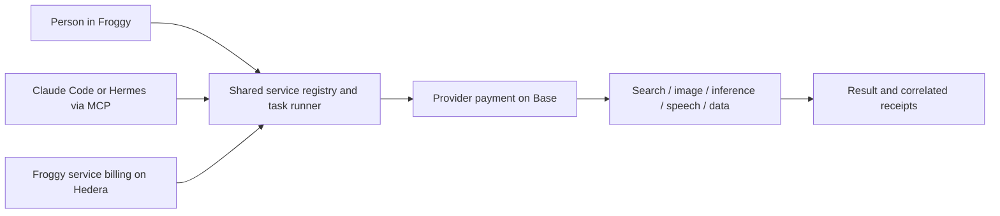

# Froggy: x402 marketplace showcase shortlist

> Historical first pass. The [reviewed deep research](deep-research.md) adds three Grok lanes, further endpoint checks, and corrections for the evening's accepted plan and implementation. Remote MCP is deferred, CLI/task delegation has landed, and the old testnet quote below is not the new dollar-denominated brief price.

Checked 6 September 2026. The owner clarified two entry points into one marketplace: a person asks Froggy to complete a task, or Claude Code/Hermes invokes Froggy through MCP. Both discover and consume the same paid capabilities. This is a service shortlist and implementation assessment, not an instruction to implement or spend funds.

## Recommended initial catalog

Prices below are upstream quotes for the sampled inputs, not Froggy retail prices or fixed prices for every request. Read the actual challenge for each call. [Probe evidence](probes.json) records networks and amounts; no paid execution occurred during this research.

| Capability and provider | User-visible example | Price / network | Evidence and work needed |
| --- | --- | --- | --- |
| **Image generation — BlockRun** | “Make a campaign image and show it here.” Claude can request an image asset for a page it is building. | Sample Nano Banana 1024×1024: **0.053501 USDC, Base**. | Live 402. POST body, typed output/artifact handling, and async job support where needed. [Provider docs](https://blockrun.ai/docs/api-reference/image-generation). |
| **Web search and content — Exa** | “Research three alternatives and give me a sourced comparison.” | Sample search: **0.007 USDC**, Base or Solana advertised; use Base for current Froggy. | Live 402 for search. POST schema; return cited results. Contents is separately priced. [Provider docs](https://exa.ai/docs/reference/x402-guide). |
| **Paid model inference — BlockRun** | “Get a second model to review this plan” or “classify these records into JSON.” | Short GPT-4o-mini request with 16 maximum output tokens quoted **0.002 USDC, Base**. | Live 402; completed inference not verified. POST body, explicit model/output budget and bounded response. [Provider docs](https://blockrun.ai/docs/api-reference/chat-completions). |
| **Speech — BlockRun / ElevenLabs** | “Read this summary aloud” or “make a voiceover for this page.” | ElevenLabs Flash, “Hello world.” quoted **0.002 USDC, Base**. Longer text reprices. | Live 402. Audio output handling/playback or downloadable asset; avoid dumping binary/base64 into chat. [Provider docs](https://blockrun.ai/docs/api-reference/text-to-speech). |
| **Crypto/token data — CoinGecko** | Paste a token address; Froggy resolves it and checks price, liquidity and trading context. | **0.01 USDC**, Base or Solana advertised. | Live 402 for simple prices; token/pool endpoints documented but not individually probed. GET is closest to the current general purchase tool. Correct host is `pro-api.coingecko.com`; the ordinary `api.coingecko.com` host returned 404. [Provider guide](https://www.coingecko.com/learn/x402-pay-per-use-crypto-api). |
| **Graph-backed market answer — Froggy's existing oracle** | “Compare USDC markets and explain what the differences mean.” | **0.05 HBAR, Hedera testnet**. | Live 402 today; earlier real settlement recorded in [Hedera evidence](../../evidence/HEDERA.md). Already implemented GET resource, currently organized around cheapest borrowing. Improve the useful answer rather than assuming a savings deposit exists. [Endpoint](https://app-production-58dd.up.railway.app/oracle/snapshot?symbol=USDC). |
| **Code execution — BlockRun / Modal** | “Analyze this public CSV in a temporary sandbox and return the results.” | Provider docs: create from **$0.011**, exec **$0.002**, plus other lifecycle calls; Base USDC. | Documentation verified only. Automatic approval review blocked a sandbox-creation POST because it could provision a resource, so it was not sent. Session ownership, lifecycle cost, execution result and cleanup make this a later addition. [Provider docs](https://blockrun.ai/docs/api-reference/modal-sandbox). |

BlockRun is the x402 gateway in these examples; this does not imply a direct Hedera integration with the underlying image, voice or compute providers. Its public [discovery document](https://blockrun.ai/.well-known/x402) returned 200 and lists the relevant endpoints. [Endpoint documentation](https://blockrun.ai/docs/x402/endpoints) describes the wider catalog, including video and music. Prefer image and short speech for the first demonstration; video adds latency and job/settlement complexity.

## Two demonstrations using the same machinery

**Human entry:** “Research this topic and make an illustrated, spoken summary, within my budget.” Froggy selects search, image and speech capabilities, obtains quotes, applies the mandate, then returns sources, an image, audio and itemized receipts. The browser is used only where it helps the task or presents the resulting work.

**MCP entry:** Claude Code is building a page and asks Froggy for an image, a sourced fact or a second-model review. Hermes can request the same capabilities for a personal task. A proposed tool set is `search_services`, `quote_service`, `invoke_service`, `get_job` and `get_receipt`. These are design suggestions, not implemented interfaces. Invocation uses an approved budget/quote and provider-specific schema; it is not an unrestricted arbitrary-URL spending tool.

Both should share service records, request validation, user identity, budgets, payer selection, execution, artifacts and receipts. Do not build separate provider integrations for the web and MCP clients. An external agent can ask for work but cannot approve itself or increase its spending authority.

## What works with the current app

Code inspected in `apps/server/src/{directory,paid-request,tools,tools-assets}.ts`, `packages/payments/src/{types,evm}.ts`, and `apps/web/src/lib/webmcp.ts`:

- Current discovery uses GET. The public `x402_fetch` tool accepts only a URL; it makes a GET purchase. The internal `paidRequest` path already accepts request initialization, used by Graph's POST transport. General POST service input is integration work, not a new payment stack from scratch.
- Payers cover Hedera testnet and, with the live Privy signer, Base mainnet/Base Sepolia. Matching a provider's network and exact scheme is necessary but does not prove signing policy, funding, response handling or delivery works end to end.
- The existing directory requires a human to admit a payable service. For POST providers, a GET-only probe can misclassify a real service. Store and validate method/input schema, supported network/asset, output type and job behavior in the service record.
- The existing browser WebMCP tools are not a remote MCP server for Claude Code or Hermes. Implement an authenticated external entry point over the same execution and policy path.
- Image/audio providers require artifact handling; some jobs settle only when results complete. Current immediate-response receipt handling needs service-specific lifecycle support. Never record “fully paid and delivered” merely because a POST returned 202.
- A 402 challenge is evidence of advertised terms, not proof that a paid call produces useful output. Each selected provider still needs a permitted funded trial before being labeled working in the app.

## Keeping Hedera meaningful

The independently probed external candidates offer Base USDC, not native Hedera payment. Froggy's own oracle offers Hedera testnet HBAR. There are two distinct financial legs in the proposed broader platform:

The ownership decision remains important: the user can fund a delegated Base wallet, or Froggy can fund upstream calls from a platform treasury and sell a priced service on Hedera. Hedera fees and upstream costs need separate attribution. Neither model automatically provides bridging or turns prepaid service credit into user-owned tokens.

**Recommendation:** initially reuse the server's funded/provider-access paths for a small curated catalog, within the team's chosen ownership model. Demonstrate a real Hedera-paid useful result and show the actual upstream mechanism. Do not label a Base payment as Hedera settlement. Do not force an onchain bridge for each tiny API request merely to make every call appear cross-chain.

## Scope and differentiation

Start with image generation, Exa search and the existing Graph-backed service. Add inference and speech once those contracts work; compute/video can follow. CoinGecko is useful for the pasted-address flow and offers a relatively direct GET integration. Multiple useful services do not require selecting their vendors as hackathon prize sponsors; retain the owner's three-sponsor constraint separately.

BlockRun already offers [MCP access to paid services](https://github.com/BlockRunAI/blockrun-mcp). Froggy's value needs to be more than another list of endpoints: shared human/agent browser work, a clear connected funding experience, enforceable per-user budgets, useful Hedera-paid execution, and a consistent result/receipt contract. These are differentiating hypotheses to demonstrate, not established customer preference.

Treat third-party catalogs such as [x402.new](https://x402.new/) and [x402.direct](https://x402.direct/docs) as discovery leads, not automatic authority to spend. Start with reviewed providers and schemas. A marketplace-wide trust score or listing does not prove integration compatibility or service delivery.
