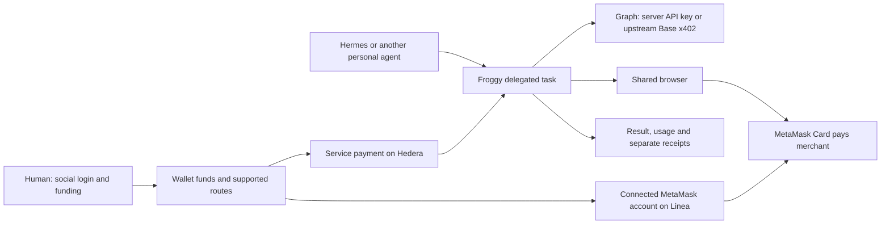

# Froggy iteration 2: context for the team grilling session

Prepared 6 September 2026, after the team sync and Kristjan's follow-up about unified funding, Hermes, and MetaMask Card. Code spot-check: `b7a8e60`. This is planning input, not an approved implementation plan or a claim that the proposed integrations already work.

## Latest clarification from Kristjan

Browser Use + Link is an example of the desired experience, not a requested integration. Froggy should offer similar agent-driven purchasing using crypto. **Link/Link CLI is out of scope; its regional availability and MetaMask compatibility are not prerequisites.** Kristjan already owns an active MetaMask Card on Linea and offers his own purchase flow for the demonstration. Treat that card as available and plan the Froggy integration around it. This is a concrete example of the broader product, not a decision to make Froggy card-specific.

## The thread connecting the product

**Proposed product sentence:** Froggy gives your personal agent a shared browser and controlled access to paid services and purchases, with Froggy's service usage paid through Hedera x402.

The first customer already uses a personal agent such as Hermes or OpenClaw, but need not understand crypto. They delegate a task; Froggy operates the browser, obtains approvals when necessary, performs permitted payments, and returns a useful result with costs and receipts. The human can also use Froggy's interface and take over the browser.

The earlier consumer savings/financial-analyst direction is background research. The sync deliberately moved toward infrastructure for existing personal agents. Savings, shopping, and research can be tasks this infrastructure performs; they do not all need to become separate products now.

## Source authority

1. Kristjan's latest instructions, captured below; subsequent answers in the grilling session supersede this brief.
2. [Full transcript](transcript.md), especially later agreements where the conversation changes direction.
3. [Full notes](full-notes.md) and [short notes](notes.md), which are machine-generated summaries.
4. Current implementation and recent commits for facts about what works.
5. [Earlier research synthesis](../research/agentic-wallets-2026-09-06/synthesis.md), [Grok/X findings](../research/agentic-wallets-2026-09-06/grok-findings.md), and [web findings](../research/agentic-wallets-2026-09-06/web-findings.md) as evidence and challenges, not current product decisions.

The three original sync documents remain unchanged. “Hideera,” “X42,” and “export to payments” are interpreted here as Hedera and x402. The summary's “implemented” onboarding is a desired flow, not implementation evidence. Its claim of no Telegram integration conflicts with code already in the repository. Mona/Monathon, fitness bets, and an AI referee belong to a separate discussion; do not import their scope or deadline into Froggy.

## Direction already supplied

| Direction | Source and implication |
| --- | --- |
| Infrastructure for existing personal agents | Transcript around 14:40–23:33 and 42:37–47:21. Froggy accepts delegated intent and runs its own agent/browser. |
| Hedera x402 is central | Around 06:06–09:00 and 28:17–30:41; reaffirmed afterward. Charge for useful service work. |
| Social login creates a Privy wallet | Around 50:12–53:14. Apple Pay funding and a copyable receive address are the intended experience. |
| Unified funding across chains | Around 11:40–13:23 and the follow-up. Users should not manually plan every chain transfer. Ownership, routes, assets and availability remain unresolved. |
| Personal-agent entry point | Around 14:40–18:03 and 53:14. Copy a prompt/skill into Hermes, connect through a human onboarding link, then delegate work. |
| Graph access behind Froggy | Around 32:37–42:37 and the follow-up. Callers pay on Hedera; Froggy uses its own Graph API key or pays Graph upstream on Base. |
| Interpret pasted addresses | Around 54:55 and the follow-up. Resolve a token/contract/service and suggest actions without requiring a perfectly formed prompt. |
| Existing MetaMask Card on Linea | Latest follow-up. For a card-only merchant, check the connected card's funding account and spendable balance, route funds if needed, then complete an authorized purchase. |
| Three sponsors; Start from Scratch | Earlier explicit constraint still applies. Hedera and Privy anchor the direction; the third selection remains a decision. |

Social onboarding does not rule out attaching an existing wallet/card afterward. A new Privy wallet and the MetaMask account funding an existing card are different accounts unless a supported connection proves otherwise.

## Four money movements to keep distinct

This depicts responsibilities, not a settled custody architecture. Decide who signs and funds each edge.

| Movement | What must be explicit |
| --- | --- |
| User funds Froggy or their wallet | Destination chain/token/account, ownership, provider fees, pending vs confirmed deposits, withdrawal/recovery. Apple Pay is a funding method, not a chain. |
| Caller pays Froggy | Hedera payer/payee, billing unit, price or maximum budget, authorization, settlement, purchased entitlement, result delivery, retries and unused credit. |
| Froggy buys an upstream resource | Graph API-key billing or Base x402, whose balance pays, server-only credentials, attribution, margin, upstream failure after the caller paid. |
| Froggy buys something for the user | Merchant amount plus service/routing costs, selected instrument, funding account, permissions, purchase confirmation and refunds. |

**A unified balance needs a defined meaning.** Total wallet value, funds available for a particular purchase, and prepaid service credit are different quantities. One headline number can coexist with a useful breakdown. It cannot make bridged funds instantly available or turn a treasury credit into a user-owned onchain asset. Avoid double-counting deposits, bridges in flight, reservations and destination balances.

A narrow, verified route can demonstrate the intended experience. “Any chain” remains an ambition until assets, signer support, routes, quotes, arrival checks and failure handling are demonstrated. Mainnet is now an explicit planning direction; no deployment or real-fund movement is requested in this planning session.

## Existing foundation and gaps

| Area | Current code and consequence |
| --- | --- |
| Conversation and handoff | Phase 2 is recorded as landed in [STATUS](../plan/STATUS.md), through `e753bc3`; `b7a8e60` records it. Queueing, approvals, wallet rows and per-turn costs exist. Recheck HEAD before assigning implementation. |
| Hedera-paid seller | [oracle-route.ts](../../apps/server/src/oracle-route.ts) sells a lending snapshot for 0.05 HBAR. [oracle.ts](../../packages/payments/src/oracle.ts) fixes the challenge to Hedera testnet. Task billing is not already implemented merely because this endpoint exists. |
| Seller failure boundary | The snapshot route settles before fetching Graph data. It lacks a durable purchased-task/result-retrieval lifecycle and recovery for a later Graph failure. Decide what the buyer receives after a paid failure. |
| Outbound purchases | [paid-request.ts](../../apps/server/src/paid-request.ts) probes 402s, checks policy, reserves, pays and records outcomes. It selects a supported payer; it does not bridge. Review uncertain settlement before automatic retries. |
| Hedera funding | [services.ts](../../apps/server/src/services.ts) supplies a host-account Hedera payer. Per-user pockets account for allowances. Current top-up sends Base Sepolia USDC to a treasury and credits the pocket; **nothing is bridged**. This is not the proposed unified wallet. |
| Graph access | The seller uses `services.graph`, a server API key or loud stub. Separately, `graphFor` in [tools.ts](../../apps/server/src/tools.ts) can pay queries using the workspace user's signer with `GRAPH_PAY_PER_QUERY`. That is not a platform-funded Base upstream behind a Hedera-paid task API. |
| Delegation | Server-owned runs, authenticated workspaces, Telegram and browser-side [WebMCP tools](../../apps/web/src/lib/webmcp.ts) exist. `navigator.modelContext` is not a remote MCP endpoint Hermes automatically consumes. Prove a minimal external integration with the installed Hermes version. |
| Discovery | [directory.ts](../../apps/server/src/directory.ts) and `/api/directory` support probing and human addition to payable hosts. Reuse them for the service catalog. |
| Funding and cards | Privy identity/wallet foundations exist. Apple Pay delivery, cross-chain routing, MetaMask Card linking and a checkout credential mechanism are not proven by the notes or these paths. |

Browser and wallet packages remain isolated. Pages, models and external agents can suggest actions; they cannot raise spending authority. Human approvals and mandates remain outside model tools. Delegation must reuse these controls.

## Provider checks and competitive inspiration

Checked 6 September 2026. These are documentation/capability checks, not funded integration tests.

### Separate Hedera billing from Graph access

[Blocky402's network docs](https://blocky402.com/docs/networks/) describe Hedera in both environments. Public read-only requests to [testnet capabilities](https://api.testnet.blocky402.com/supported) and [mainnet capabilities](https://api.blocky402.com/supported) returned HTTP 200 advertising `hedera:testnet` and `hedera:mainnet`. This confirms facilitator capability advertisements, not Froggy's mainnet readiness, an asset bridge or completed payment.

[Graph's x402 docs](https://thegraph.com/docs/en/subgraphs/tooling/x402-payments/) list USDC on Base mainnet and Base Sepolia with separate gateways; API-key access remains available. Kristjan's proposed separation is therefore architecturally plausible: sell a useful Graph-backed response on Hedera while acquiring data through a server API key or distinct Base payment. Credentials/funding, cost accounting and paid-failure recovery still need implementation. The data's indexed chain need not match its payment chain.

**Recommendation to grill:** use the working server API-key path first if it serves the selected task. Make Base x402 a separately justified milestone; it is not necessary merely to charge customers on Hedera.

### Browser Use already supports both payment roles

The [3 September Browser Use announcement](https://browser-use.com/posts/pay-with-link) describes human approval in Link followed by temporary purchase credentials. Its [6 August x402 announcement](https://browser-use.com/posts/x402-launch) describes Base USDC funding of browser-service credits. Both were fetched directly as Markdown because the web reader rejected that content type.

These illustrate separate contracts: paying for browser service and authorizing merchant purchases. They weaken a pitch based solely on “a browser agent that can pay.” A potential reason to choose Froggy is a personal-agent task combining useful paid data, controlled funding over a supported route, human browser intervention and understandable receipts. That is a differentiation hypothesis to test.

Use the Browser Use example to discuss the purchase experience and approval boundary. The owner has clarified that Froggy will use crypto; no Link integration is requested. Do not carry the earlier Link availability/compatibility investigation into the implementation prerequisites.

### MetaMask Card flow

[MetaMask's funding guide](https://support.metamask.io/manage-crypto/metamask-card/funding) explains that the card spends supported tokens from enabled self-custodial accounts subject to spending limits. Linea is supported; token/network options vary. [Card management](https://support.metamask.io/manage-crypto/metamask-card/managing/) allows account/token selection and custom caps. Wallet balance alone does not establish card spendability or permission.

Kristjan confirms that his existing card is active and available for the demonstration. Plan this concrete flow:

1. Start with Kristjan's existing MetaMask Card setup. Identify how Froggy will reference its funding account, chain, asset and permissions, using supported integration or human setup. Card acquisition and Link connection are unnecessary. Do not infer a card relationship from an arbitrary address.
2. Identify the merchant's methods and complete purchase amount, including shipping/tax and relevant conversion costs.
3. Check spendable funds and allowance on Linea. If insufficient, quote a supported transfer/bridge/swap to that **existing card account**, within the user's authorization and cost limits.
4. Confirm arrival and spendability. Funding and card-spending approval are separate; never raise allowance silently.
5. Use a verified credential/tokenization mechanism and necessary human checkout/3DS handoff. Keep card numbers, CVCs and wallet secrets out of model context, logs, screenshots, replay and receipts; design sensitive checkout handling if necessary.
6. Confirm the merchant order and correlate service, routing and purchase costs. If checkout fails after bridging, explain where funds remain. Reconcile an uncertain purchase before retrying.

The card is available; Froggy's funding checks, routing and checkout integration are the implementation work to plan. Specify which steps are automated and which require Kristjan's approval or interaction. Do not treat ownership of the card as an open feasibility question, or assume that it gives Froggy signing authority. Keep the broader crypto payment capability in view.

### Funding and sponsors

[Privy's onramp docs](https://docs.privy.io/wallets/funding/fiat-onramp) make Apple Pay/provider availability dependent on integration and region. The Stripe sandbox delivers no real funds and uses mainnet identifiers rather than funding testnets. Confirm geography, eligibility, delivered chain/token, minimum and fees before claiming completed onboarding.

The [Hedera track](https://ethglobal.com/events/ethonline2026/prizes/hedera) requires a live Blocky402-settled service and an actual consuming agent/platform payment. Discovery, meaningful metering and payment evidence support the direction. The [Graph From Scratch track](https://ethglobal.com/events/ethonline2026/prizes/the-graph) permits live API-key data; useful reasoning or reusable AI tooling matters. A bare proxy is a weak demonstration. Match [Privy's tracks](https://ethglobal.com/events/ethonline2026/prizes/privy) to the actual financial flow and agent controls.

**Provisional recommendation:** Privy + Hedera + Graph if the chosen task makes Graph useful. Replace the third sponsor only with a stronger feasible alternative and exact qualification evidence. [Chainlink's current fresh-build bounty](https://ethglobal.com/events/ethonline2026/prizes/chainlink) centers on CRE Confidential Workflows; generic CCIP bridging does not establish eligibility. Recheck individual awards, build-history eligibility, deadlines and permitted combinations; prize pools do not establish win probability.

## Open decisions

Four questions were sent to Kristjan during preparation. His subsequent clarification establishes that his MetaMask Card is available and Link is inspiration only. The choices below still concern scope and architecture; suggested options are not accepted decisions.

| Decision | Alternatives |
| --- | --- |
| Unified balance meaning | User-owned funds with routing; prepaid credit backed by treasury; or both with clear accounting. |
| Mainnet exposure in iteration 2 | Small team-funded demonstration; external users with real funds; or testnet proof and concrete mainnet migration. Planning preference is not transaction permission. |
| First delegated success | Browser task buying a useful result such as image generation; useful Hedera-paid Graph answer; or pasted-token interpretation leading to a prepared, approved action. |
| MetaMask Card priority | Add after core Hedera delegation; make checkout the main demo; or plan now and implement later. |

Following decisions include who signs Hedera payments, first route/token, billing unit, service vs purchase budgets, approval points, external-agent authentication/revocation, refunds and first merchant/service. Capacity, actual deadline and first-user region can be resolved independently.

**Suggested sequence, not an accepted backlog:** prove one useful paid service and external caller on Hedera; connect the agreed onboarding/funding model; add the selected browser/purchase task with controls and recovery; broaden routes and methods after the complete demonstration works. A card-led demonstration is possible as a team choice, with its additional dependencies made explicit.

## Output expected from Fable

Use the updated [Fable prompt](../research/agentic-wallets-2026-09-06/fable-5.1-grilling-prompt.md). Produce an agreed `docs/plan/NEXT_ITERATION.md`: one journey, exact money ownership/flows, integration evidence, tasks, owners, dependencies, acceptance criteria, exclusions and fallbacks. Unsupported provider access/routing is a named feasibility task, not a silently assumed feature.

Minimum proof connects a real caller, purchased entitlement/task, Hedera settlement, useful work and retrievable result. Address duplicate requests, uncertain settlement, upstream failure after payment, cancellation, exhausted budgets, revocation and reconnect. If card checkout is included, prove arrived funding, permitted spending, merchant confirmation and duplicate-purchase prevention. Local tests do not substitute for provider and settlement evidence.
